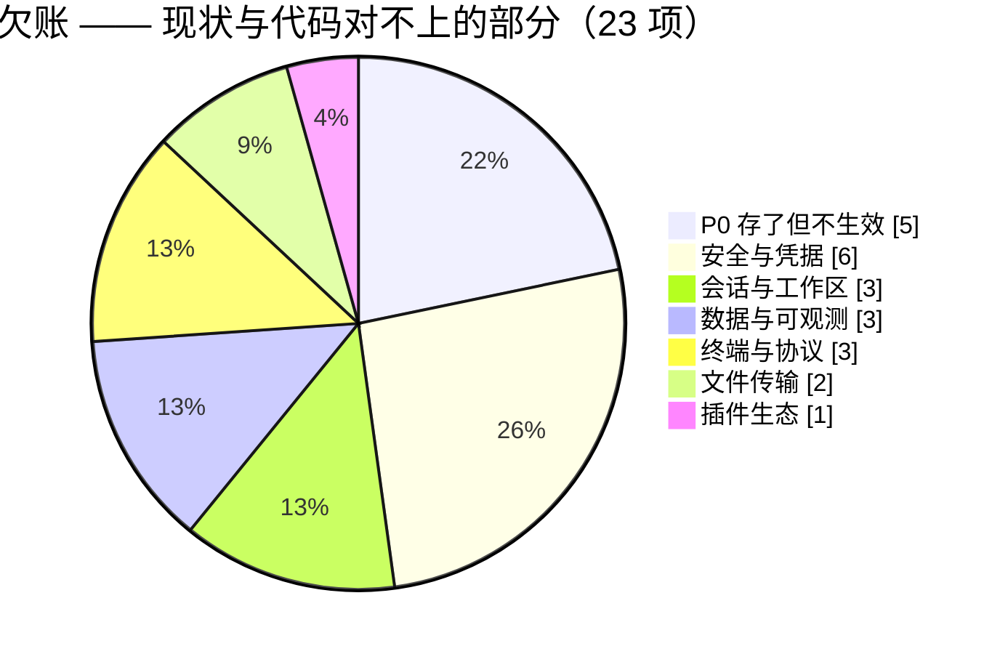
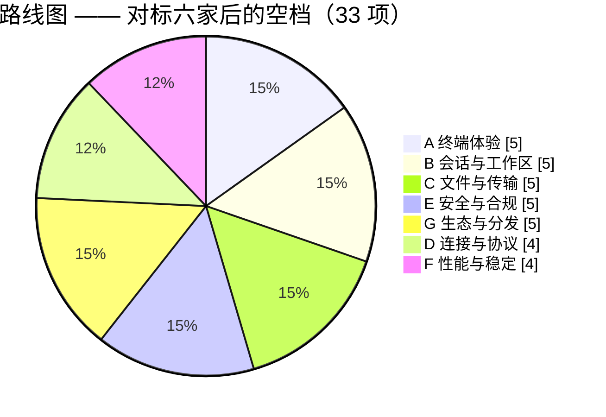

# VelaShell 特性计划

> **这份文件记录「还没发生的事」** —— 待办、候选特性，以及已经决策不做的清单。
>
> **已经发生的事在 [`plan.md`](plan.md)** —— 已完成的工作、当前架构、每一次改动的来龙去脉。
> 两份文件的分工是硬的：一件事做完了，就从这里划掉、去 `plan.md` 补一节；
> 一件事还没做，就不要在 `plan.md` 里留 TODO。
>
> 最近复核：**2026-09-08**（逐条对着 `src/` 现状核过，注明了具体文件与行号的即为已验证）
>
> **两部分读法不同**：
>
> | 部分 | 是什么 | 怎么用 |
> | --- | --- | --- |
> | [P0 表](#-p0--存了但不生效的开关) ~ [插件生态](#-插件生态) | **已经欠下的账** —— 现状与代码 / 文档对不上，或开关存了不生效 | 优先清，它们是「界面在骗人」 |
> | [🧭 对标与路线图](#-对标与路线图2026-09-08-新增) | **往前看** —— 对着六家竞品找空档，按「架构落点」估成本 | 排下一步做什么 |

## 🏷️ 状态与优先级

| 标识 | 含义 |
| :---: | --- |
| ⏳ | **待办** —— 已确认要做，未开工 |
| 🚧 | **进行中** —— 有部分实现，未闭合 |
| 💡 | **候选** —— 想法已记录，是否要做待评估 |
| ❌ | **确认不做** —— 与架构或产品决策冲突，附理由，别再提 |
| 📄 | **文档待同步** —— 代码已改，velashell-docs 还没跟上 |

| 优先级 | 含义 |
| :---: | --- |
| 🔴 P0 | 影响正确性、安全或诚信（含「设置项存了但不生效」这类骗人的开关） |
| 🟠 P1 | 日常使用高频，缺了明显别扭 |
| 🟡 P2 | 进阶能力，有它更好 |
| 🟢 P3 | 锦上添花 / 大工程，等需求 |

## 📊 待办分布

**欠账**（⏳ + 🚧 + 💡，共 23 项）与**路线图**（共 33 项）分开计：

> 「文件传输」算 2 项 —— 那一节的「传输失败重试」是指回 P0 表的交叉引用、不重复计数，「远程编辑的三个入口已统一」是 📄 文档待同步、不计入欠账。
> 「会话与工作区」从 4 降到 3：会话标签颜色已在 `b9ae31f` 落地（见该节）。

---

## 🔴 P0 —— 存了但不生效的开关

> 这一组的共同点：**字段已持久化、设置页可能还展示着，但运行时零消费者**。
> 用户拨了开关以为生效了，其实什么都没发生 —— 这是文档与界面在骗人，优先级高于任何新特性。
>
> 处置有两条路，二选一即可闭合：**接上运行时**，或**从界面撤下并在 `AppSettings` 注释里写明原因**。
> 现状统计口径见 [`velashell-docs zh/host/settings-audit.md`](https://github.com/VelaShellLabs/velashell-docs/blob/main/zh/host/settings-audit.md)。

| 状态 | 项 | 字段 | 现状 | 闭合要做什么 |
| :---: | --- | --- | --- | --- |
| ⏳ | **主密码保护** | `AppSettings.MasterPasswordProtection`（`AppSettings.cs:342`） | 字段存在，运行时零消费者；UI 已撤下并留注释 R-04 | 主密码派生密钥替换 `AesSecretProtector` 的本机密钥文件 + 启动解锁弹窗 + 存量密文迁移。**安全敏感，需单独设计后再动手** |
| ⏳ | **自动加载密钥到 Agent** | `AppSettings.AutoLoadToAgent`（`AppSettings.cs:1058`，默认 `true`） | 字段存在且默认开，零消费者（R-06） | 集成 Windows OpenSSH ssh-agent（命名管道协议）或 Pageant。⚠️ 实现时**必须**同步调整 `plan.md` §17-A：凭据装配曾**刻意整体替换**默认凭据列表以排除 `SshAgentCredentials`（Windows 上 `SSH_AUTH_SOCK` 非命名管道会刷异常） |
| ⏳ | **自动下载更新** | `AppSettings.AutoDownloadUpdates`（`AppSettings.cs:231`） | 字段存在，零消费者、零 UI | 下载调度 + SHA-256 完整性校验 + 静默换版流程。注：**启动时自动检查**（`CheckUpdatesOnStartup`）已实现并接进消息中心，别和这条混淆 |
| ⏳ | **传输失败重试** | `AppSettings.TransferMaxRetries` | 字段存在，零消费者 | 需要传输队列持久化才有意义（重试要知道「重试什么」）。同组的 `AutoResume` 已降级为遗留兼容字段，实际开关是 `ResumeEnabled`，**不要**再给它接线 |
| ⏳ | **标签栏位置（顶部/底部）** | `AppearanceOptions.TabBarPosition` + `SettingsViewModel.TabBarPositionIndex:1219` | 字段与索引映射都在，Docking 层零消费；VelaDock 替换后 UI 已从外观页撤下 | 自研 `DockGroupControl` 之后技术上已可做（改标签条停靠边）。**低成本**，按需排期 |

---

## 🔒 安全与凭据

| 状态 | 优先级 | 项 | 现状 | 要做什么 |
| :---: | :---: | --- | --- | --- |
| ⏳ | 🟠 P1 | **审计日志查看界面** | `audit_log` 一直在写（connect / connect-failed），但 `SonnetDbAuditLogService.QueryAsync` 在 UI 层**零调用** —— 写了没人看得见 | 安全审计页加一个可筛选的列表（时间 / 会话 / 结果）。数据侧现成，纯 UI 工作 |
| ⏳ | 🟠 P1 | **`audit_log` / `conn_history` 保留策略** | 无 retention，长期运行只增不减 | 复用会话录制那套「保留天数 + drop 回写压缩」的兜底路径（`plan.md` §13-F） |
| ⏳ | 🟡 P2 | **ed25519 / ecdsa 密钥生成** | `ISshKeyService` 只有 `GenerateRsaKeyAsync`；ed25519 / ecdsa **仅用于识别已有密钥类型** | .NET 无内置 OpenSSH ed25519 私钥导出 —— 要么自行实现 OpenSSH 私钥封装格式，要么引入 BouncyCastle（注意许可证与体积） |
| ⏳ | 🟡 P2 | **密钥管理的三处小缺口** | 导入不校验私钥有效性；删除无二次确认；导出未做（已信任主机同样只能删不能导） | 各自独立、都是小改动，可一批做掉 |
| ⏳ | 🟡 P2 | **SSH 证书（certificate）认证** | 代码零踪迹（`src/` 下 Certificate 命中全部是 FTPS/TLS 证书）；连接对话框第 2 步「证书」项仍禁用 | 先评估 Tmds.Ssh 对 OpenSSH user certificate 的支持程度，不支持就要么等上游要么放弃 |
| 🚧 | 🟠 P1 | **配置导出的选择性与脱敏** | 导出 / 导入是**全量 `AppSettings` 序列化 + 整体覆盖**。⚠️ **全量导出含 Security / Proxy 等敏感块，代理密码是明文** | 分类勾选导出 + 敏感块默认排除（或强制加密）。注：Gist 云同步（`plan.md` §13-C）已覆盖跨设备迁移场景，本条的价值主要在**别把明文代理密码写进一个用户随手分享的文件** |

---

## 📊 数据与可观测

| 状态 | 优先级 | 项 | 现状 | 要做什么 |
| :---: | :---: | --- | --- | --- |
| ⏳ | 🟢 P3 | **运维编排中心** | 设计帧 `bR5c4` 已出，代码零实现 | 设计稿里最后一个未落地的面板。范围需要重新界定 —— 现在有了 AI Agent 与协作接入，「编排」这件事的形态可能和当初画的不一样了 |
| 💡 | 🟢 P3 | **Sixel 图形** | 挂起中，多日工作量 | VT 引擎已有 DCS 通道，缺的是图像解码与渲染层的位图合成。依赖需求评估 —— 至今没有用户提过 |
| 💡 | 🟡 P2 | **终端输出的用户自定义高亮规则** | 语义高亮已内置，但是**编译期硬编码的 7 条**（`SemanticMatcher` 的 `[GeneratedRegex]`：Url / Ip / Error / Warning / Success / Option / Number） | 规则集改运行时可配 + 设置 UI（WindTerm 的卖点之一）。改动面：`SemanticMatcher` 从静态正则改成可注入规则表，注意别把逐格渲染的热路径拖慢 |

---

## 🗂️ 会话与工作区

| 状态 | 优先级 | 项 | 现状 | 要做什么 |
| :---: | :---: | --- | --- | --- |
| ⏳ | 🟠 P1 | **SSH config 导入** | 导入框架已就绪：`ISessionImportService` 多来源自动扫描 + Xshell / WinSCP 两个导入器已落地（`plan.md` §18-H） | 解析 `~/.ssh/config`（Host / HostName / Port / User / IdentityFile / ProxyJump），**在 DI 追加一行**即可。全清单里成本最低的一条 |
| ✅ | — | ~~会话标签自定义颜色~~ | **已完成**（`b9ae31f`，2026-09-06）：`TerminalOverrides.TabColor` → `ConnectionAccent.cs:66` 优先读它，连接对话框有输入框（`ConnectionProfileView.axaml:610`）。留空才回退到按 `profileId` 哈希取色。「生产红 / 测试绿」已经能做 | ⏳ **图标**仍未做（见[路线图 B 组](#b-会话与工作区)） |
| ⏳ | 🟡 P2 | **Dock 布局持久化** | 缓做中。单独恢复布局无意义 —— 文档即活动会话 | 需与「恢复会话」联动：布局节点 ↔ profileId 映射 + 自定义 document 还原器 |
| 💡 | 🟢 P3 | **触发器 / 自动应答** | 全仓无「输出匹配 → 自动发送」机制 | expect 式：输出命中正则时自动发送响应（自动 yes、密码带外输入）。与上面的自定义高亮规则**共用同一套用户规则表**，适合一起做 |

---

## 📁 文件传输

| 状态 | 优先级 | 项 | 现状 | 要做什么 |
| :---: | :---: | --- | --- | --- |
| 🚧 | 🟡 P2 | **SFTP 双栏与 WinSCP 的剩余差距** | 逐项清单在 [`velashell-docs zh/host/SFTP双栏与WinSCP差距分析.md`](https://github.com/VelaShellLabs/velashell-docs/blob/main/zh/host/SFTP双栏与WinSCP差距分析.md) | ⚠️ 那份文档把差距分成「**接线债 / 能力缺失 / 架构级缺失**」三类，**不要混在一起排期** —— 接线债是几小时，架构级缺失是几周 |
| ⏳ | 🟡 P2 | 传输失败重试 | 见 [P0 表](#-p0--存了但不生效的开关) | — |
| 📄 | 🟠 P1 | **远程编辑的三个入口已统一** | 双击 / 右键「打开」/ 右键「使用默认编辑器打开」现在都会侦听保存自动回传，新增「正在编辑」浮窗分组与两个设置项（见 [`plan.md` §51](plan.md)）。代码已落地，**velashell-docs 还没跟上** | 在 `zh/host/` 与 `en/` 镜像里补：三个入口的语义差别、自动回传规则、`双击文件时` / `编辑后自动上传` 两个设置项、`~/.velashell/logs/remote-edit.log` 诊断日志 |
| ⏳ | 🟢 P3 | **内置编辑器的临时副本没有兜底清理** | `RemoteFileEditorView.OnClosed` 会删掉自己那个 `builtin-edit\<8hex>\` 子目录，但**进程崩溃时留下的那些没人管** —— 应用退出时的 `TryDeleteEmptyTree` 只删空目录，而残留目录里正好有文件 | 要做就得按时间兜底（如启动时清 7 天前的），⚠️ 注意别把「上传失败刻意保留的草稿」一起删了 —— 那是用户改动唯一的存身之处 |

---

## 🖥️ 终端与协议

| 状态 | 优先级 | 项 | 现状 | 要做什么 |
| :---: | :---: | --- | --- | --- |
| ⏳ | 🟡 P2 | **防空闲断开（Anti-idle）** | SSH keepalive 已接（`KeepAliveSeconds` → `SshClientSettings.KeepAliveInterval`），但那是**协议层**防 NAT 超时 | anti-idle 防的是**服务端 shell 超时踢出**，需要按间隔向 PTY 输入流发字节（如 `\0` 或空格）。两者互补，不能互相替代 |
| 💡 | 🟢 P3 | **终端内搜索的增强** | 基础搜索已实现（`MainWindowViewModel.TerminalSearchRequested:1616`） | 正则、大小写、全部高亮、上一个/下一个的循环计数 —— 按用户反馈再定 |
| 📄 | 🟠 P1 | **设计稿的两处残留** | Logo 有一个 `enabled:false` 残留图标；文件列表「修改时间」列无固定宽度 | 小到可以顺手做掉，记在这里免得忘 |

---

## 🧩 插件生态

| 状态 | 优先级 | 项 | 现状 | 要做什么 |
| :---: | :---: | --- | --- | --- |
| ✅ | — | ~~容器管理插件（DockerPanel）~~ | **已完成**（2026-09-03，`0.3.1`）。独立仓库 [VelaShell.Plugin.DockerPanel](https://github.com/VelaShellLabs/VelaShell.Plugin.DockerPanel)，从插件商店按需安装 | — |
| ⏳ | 🟡 P2 | **AI 插件的 MCP 服务端能力面对齐** | 对外 MCP 走 `AgentToolbox` 产出工具，但那条路上**没有审批界面** | 现状是「询问」模式等于一律拒绝写操作 —— 这是刻意的（`plan.md` §33-四）。可选的增强：带外审批（推到 IM 渠道或桌面通知）后再放行 |

---

## 🧭 对标与路线图（2026-09-08 新增）

> 上面几节是**已经欠下的账**（现状与代码对不上、或开关不生效）。
> 这一节是**往前看**：对着 Xshell / MobaXterm / Tabby / WindTerm / Termius / SecureCRT /
> WezTerm / Warp 这几家看还差什么，再结合本仓库的架构判断**哪些对我们特别便宜**。
>
> **「架构落点」那一列是这份路线图的重点。** 同一个功能，在别家要新起一套子系统，
> 在我们这儿可能只是复用一个已有的接缝 —— 排期该按这一列来，而不是按功能听起来多大。
>
> ⚠️ 对标矩阵是**粗粒度**的：只记各家公认的能力有无，不逐版本核对。
> 用它决定「值不值得做」，不要拿它当竞品功能说明书。

### 对标矩阵

| 能力 | VelaShell | Xshell | MobaXterm | Tabby | WindTerm | Termius |
| --- | :---: | :---: | :---: | :---: | :---: | :---: |
| 自研 VT 引擎 / 自绘渲染 | ✅ | — | — | (xterm.js) | ✅ | (xterm.js) |
| SSH / SFTP / 跳板机 | ✅ | ✅ | ✅ | ✅ | ✅ | ✅ |
| FTP / FTPS | ✅ | ✅ | ✅ | — | ✅ | — |
| Telnet / 串口 | ✅ 插件 | ✅ | ✅ | ✅ | ✅ | ✅ |
| X/Y/ZMODEM | ✅ 全自研 | ✅ | ✅ | — | ✅ | — |
| 拖拽分屏 | ✅ VelaDock | 有限 | ✅ | ✅ | ✅ | ✅ |
| 多会话同步输入 | ✅ | ✅ | ✅ | ✅ | ✅ | ✅ |
| 端口转发 + 流量计量 | ✅ **自研计量** | ✅ 无计量 | ✅ | ✅ | ✅ | ✅ |
| 会话录制 / 回放 | ✅ + asciicast | — | — | — | ✅ | — |
| 资源监视 / 进程 / 路由追踪 | ✅ | — | ✅ | — | ✅ | — |
| 插件系统 | ✅ **双模 + 商店** | — | — | ✅ | — | — |
| AI 助手 / Agent | ✅ **含 IM 桥接 + MCP** | — | — | 插件 | — | ✅ 有限 |
| 云同步 | ✅ 自己的 Gist | — | ✅ | ✅ | ✅ | ✅ 自营 |
| **SSH Agent 转发** | ❌ | ✅ | ✅ | ✅ | ✅ | ✅ |
| **X11 转发** | ❌ | ✅ | ✅ 自带 X 服务端 | — | ✅ | — |
| **OSC 8 超链接** | ✅ | — | — | ✅ | — | — |
| **命令块 / 提示符语义（OSC 133）** | ✅ | — | — | — | — | — |
| **键盘复制模式** | ❌ | — | — | — | ✅ | — |
| **凭据管理器集成** | ❌ | — | — | — | — | ✅ 自营保险库 |
| **目录比较 / 同步** | ❌ | ✅ 有限 | ✅ | — | ✅ | — |
| **团队共享配置** | ❌ | 企业版 | — | — | — | ✅ |

**结论**：连接与运维这条主线已经追平甚至反超（计量隧道、录制回放、双模插件、AI 协作接入都是别家没有的）。
真正的空档集中在三处：**① 终端本身的现代化**（键盘复制模式；OSC 8 与 OSC 133 命令块均已于 09-08 落地，见 `plan.md` §10-D / §10-E）、
**② 凭据与团队**（agent 转发、密钥库集成、共享配置）、**③ 文件侧的深水区**（目录同步、符号链接）。

---

### A. 终端体验

| 状态 | 优先级 | 项 | 对标 | 架构落点（为什么对我们便宜 / 贵） |
| :---: | :---: | --- | --- | --- |
| ⏳ | 🟡 P2 | **命令块的「重跑」与「复制这条命令」** | Warp | OSC 133 的其余部分已于 09-08 落地（见 `plan.md` §10-E）：标记、侧栏、跳转、选中输出、按块折叠都有了。**只差 `B`（提示符结束的那个列）** —— 有了它才能把命令文本本身切出来。当时有意没做：`B` 标的是**列**，而列在改列宽重排后会挪位，要正确搬运得像 `ReflowResize` 搬光标那样换算成逻辑行内偏移再跟着重新换行走一遍。做这项时连这份代价一起付 |
| ⏳ | 🟡 P2 | **键盘复制模式（vi-like）** | WindTerm / tmux | 与产品定位「**键盘优先**」直接相关，现在选区只能靠鼠标（外加 `Shift+左键`）。落点：`TerminalKeyRouter` 加一个模式态，选区模型（行/块/多段）已经全在，不用新写 |
| ⏳ | 🟢 P3 | **scrollback 行数可配** | 各家都有 | 现在硬编码 10 000 行（`TerminalEmulator` 构造参数 / `TerminalScreen.MaxScrollback`），已有裁剪逻辑，只差一个设置项 + 接线。**注意**这是「存了但不生效」的反面教材预防区：接不上就别加开关 |
| 💡 | 🟢 P3 | **Sixel / Kitty 图形协议** | MobaXterm / WezTerm | 已在候选（见[数据与可观测](#-数据与可观测)）。VT 引擎有 DCS 通道，缺的是图像解码 + 位图合成进自绘渲染。工作量按天算，**等真实需求** |

### B. 会话与工作区

| 状态 | 优先级 | 项 | 对标 | 架构落点 |
| :---: | :---: | --- | --- | --- |
| ⏳ | 🟠 P1 | **命名布局模板（工作区）** | Royal TS / mRemoteNG / Tabby | 「打开这一组机器并按这个分屏排好」。现有的 [Dock 布局持久化](#-会话与工作区)只想着「恢复上次」，其实**同一套序列化能力做成命名模板价值大得多**：VelaDock 的模型层是纯 INPC、本来就可单测可序列化，缺的只是 `布局节点 ↔ profileId` 的映射与一个模板列表 |
| ⏳ | 🟡 P2 | **标签（Tags）检索与过滤** | Termius / Royal TS | ⚠️ **`SessionProfile.Tags` 已经存在也能编辑**（`ConnectionProfileViewModel.cs:147`），但**全仓没有任何地方消费它** —— 这是一个已经存在的「存了但不生效」。补法很便宜：会话树加过滤框、命令面板按 tag 匹配（`PaletteScorer` 现成） |
| ⏳ | 🟡 P2 | **会话标签页图标** | Xshell / Termius | 颜色已经做完（见上），图标是同一处扩展：`TerminalOverrides` 加一个图标 id，`LucideIcon` 的图标集现成。⚠️ 记得 `SessionProfile` 是**逐字段手写拷贝**，新增字段要同步五处（`plan.md` §37 列了名单） |
| ⏳ | 🟡 P2 | **整组批量操作** | MobaXterm | 对一个分组批量连接 / 批量下发命令。同步输入的频道模型（`SyncInputCoordinator`）已经是对等广播，按分组建频道是自然延伸 |
| 💡 | 🟢 P3 | **会话健康巡检面板** | — | 对已保存配置定期探活（复用 `ConnectionDiagnosticsService` 的四步诊断），出一张「哪几台连不上」的表。**别做成定时外呼** —— 得像资讯源那样由用户显式开启，理由见 `PRIVACY.md` |

### C. 文件与传输

| 状态 | 优先级 | 项 | 对标 | 架构落点 |
| :---: | :---: | --- | --- | --- |
| ⏳ | 🟠 P1 | **目录比较与同步** | WinSCP / MobaXterm | SFTP 侧最大的能力缺口。差距清单里归在「架构级缺失」那一类（见[文件传输](#-文件传输)），**别和接线债混在一起排期**。落点：`ISftpService` 已有 `ListDirectoryAsync` / `GetFileInfoAsync`，比较是纯逻辑（可在 Core 单测）；难的是冲突策略 UI 与大目录的增量列举 |
| ⏳ | 🟡 P2 | **符号链接支持** | WinSCP / FileZilla | `ISftpService` 现在**没有任何 symlink 面**（读取、创建、跟随都没有），远端一个软链目录当场就走不进去。落点：接口加 `ReadLink` / `CreateSymlink`，`RemoteFileInfo` 加类型位 |
| ⏳ | 🟡 P2 | **远端搜索（find / grep）** | MobaXterm / WindTerm | 复用 `RemoteExec` 通道跑 `find` / `grep`，结果进一个可点击的列表 —— **不必自己遍历目录**，一条 exec 就够。注意 `RemoteShellProbe` 的 POSIX 判定（Windows 远端要老实说「不支持」而不是发命令，§18-B/E 的教训） |
| ⏳ | 🟡 P2 | **传输队列持久化** | — | 是[失败重试](#-p0--存了但不生效的开关)的前提：重试得知道「重试什么」。落点：SonnetDB 文档集合加一份队列快照，和 `recordings` 同样的形状 |
| 💡 | 🟢 P3 | **远端文件 chown / 属主编辑** | WinSCP | `SetPermissionsAsync`（chmod）已有，chown 是同一处扩展。需求频次低，等人提 |

### D. 连接与协议

| 状态 | 优先级 | 项 | 对标 | 架构落点 |
| :---: | :---: | --- | --- | --- |
| ⏳ | 🟠 P1 | **SSH Agent 转发** | Xshell / MobaXterm / Tabby / WindTerm / Termius | 六家全有，我们没有 —— **对标矩阵里最扎眼的一格**。跳板场景下没有它，用户只能把私钥拷到跳板机上，那是实打实的安全倒退。⚠️ **动手前先确认 Tmds.Ssh 是否支持 `auth-agent-req@openssh.com`**；不支持就要么等上游、要么按 [`AGENTS.md`](AGENTS.md) 的纪律给它提 issue，**不要自己在 `Infrastructure/Ssh/` 外面绕**。与 [Agent 自动加载](#-p0--存了但不生效的开关)是同一条线上的两件事 |
| ⏳ | 🟡 P2 | **算法协商可配（cipher / kex / hostkey / MAC）** | Xshell / SecureCRT / PuTTY | 连老设备（网络设备、老 RHEL）时是刚需。**一半已经有了**：`Infrastructure/Ssh/SshAlgorithmDiagnostics.cs` 已经会在协商失败时算出「两边交集为空」并说清缺哪类算法 —— 从「诊断得出来」到「让用户配得上」，只差把清单落到 `SessionProfile` 并接进 `SshClientSettings` |
| ⏳ | 🟢 P3 | **SSH 压缩开关** | 各家都有 | 弱网 / 高延迟链路上有意义。⚠️ **「落点同上」已核实为错（2026-09-08，Tmds.Ssh 0.24.0）**：kex / cipher / mac / hostkey 四类算法在 `SshClientSettings` 上都是 `public` 可配的，**唯独 `CompressionAlgorithmsClientToServer` / `ServerToClient` 是 `internal`**；且 `SupportedCompressionAlgorithms`、`EnableCompressionAlgorithms` 两份内部名单里都只有一个 `none` —— 库里**没有 zlib 实现**（整个程序集搜不到 `zlib`），`SshConfigOption` 枚举里也没有 `Compression`。0.24.0 已是 nuget 上的最新版。所以这条**不是「接一根线」**，而是要么等上游、要么按 [`AGENTS.md`](AGENTS.md) 的纪律给 Tmds.Ssh 提 issue / PR（与 SSH Agent 转发同一条纪律，不要自己在 `Infrastructure/Ssh/` 外面绕）。**上游支持之前不要加这个开关** —— 加了就是 [P0 那张表](#-p0--存了但不生效的开关)里的新一条 |
| 💡 | 🟢 P3 | **更多协议插件** | — | RDP / VNC / Kubernetes exec / 数据库客户端。**这正是 `Protocols` + `Workspaces` 能力面存在的意义** —— 宿主一行不用改，Telnet / 串口 / Redis / S3 / Docker 面板已经把这条路走通了五遍。优先级交给插件市场的真实下载量决定，不要在宿主里拍脑袋排 |
| ❌ | — | **X11 转发** | MobaXterm（自带 X 服务端） | 见下面的[确认不做](#-确认不做)一栏 |

### E. 安全与合规

| 状态 | 优先级 | 项 | 对标 | 架构落点 |
| :---: | :---: | --- | --- | --- |
| ⏳ | 🔴 P0 | **插件发布者签名验证** | VS Code / JetBrains | **当前生态最大的安全缺口。** 商店已经上线（market.easilynet.top + `velashell-markets` + `velashell-identity` 三件套都在跑），但 `STATUS.md` 里签名验证仍标着「未做」—— 也就是**装的是什么，现在只能靠商店的审核**。`PluginPackageExtractor` 那三道闸挡的是畸形包，不是坏作者。信任根（`velashell-identity`）已经有了，缺的是「发布时签、安装时验」这一段 |
| ⏳ | 🟠 P1 | **录制与日志的输出脱敏** | — | ⚠️ **这是一个现实风险，不是洁癖。**「输入脱敏不做」的结论是对的（只录输出、密码无回显），但**输出里照样会出现密钥**：`cat .env`、`kubectl get secret -o yaml`、`env | grep TOKEN`。会话日志与录制存的是**原始字节**，等于把 token 落了盘。落点：`SshTerminalBridge.DataReceived` 这条旁路本来就是记录专用的（见它的注释），在那里过一遍可配的脱敏规则最合适，**不影响显示路径**。规则表可与[自定义高亮规则](#-数据与可观测)共用 |
| ⏳ | 🟡 P2 | **凭据管理器集成** | Termius（自营保险库） | 1Password / Bitwarden / KeePassXC 的 CLI，或系统密钥链。**接缝已经现成**：`ISecretProtector` 就是那层抽象，加一个 `ICredentialProvider` 让它可插拔即可。与[系统密钥链调研](https://github.com/VelaShellLabs/velashell-docs/blob/main/zh/host/系统密钥链与sudo凭据填充可行性调研.md)是同一件事的两个入口 |
| ⏳ | 🟡 P2 | **known_hosts 与 OpenSSH 互通** | 各家都有 | 现在只能在设置里看和删。导入 / 导出 `~/.ssh/known_hosts` 之后，与命令行 ssh 共用一份信任基线 —— 对同时用两者的人是实打实的省事 |
| 💡 | 🟡 P2 | **团队共享配置（只读策略分发）** | Termius / Xshell 企业版 | 「运维组长发一份机器清单，组员只读订阅」。云同步（Gist）的载荷格式与版本回溯已经现成，差的是**方向**：现在是「我的多设备漫游」，团队要的是「一处发布、多处只读」。⚠️ 这条会把产品推向企业形态，**先想清楚商业授权边界再动手** |

### F. 性能与稳定

| 状态 | 优先级 | 项 | 架构落点 |
| :---: | :---: | --- | --- |
| ⏳ | 🟠 P1 | **一键导出诊断包** | 支持成本最低的一项投资。崩溃已经落地在 `DiagnosticLog.WriteCrash`（`Program.cs:111/318/324`），但用户报障时仍要被教着去翻目录。做成「关于页一个按钮 → 收集日志 + 版本 + 平台 + 已装插件清单 → 打成一个包」。⚠️ **必须先脱敏再打包**（主机名、用户名、路径），并且**只在本地落盘、不自动上传** —— `PRIVACY.md` 的承诺不能被一个「方便」的按钮破掉 |
| ⏳ | 🟡 P2 | **启动时间与内存的回归门禁** | `VelaShell.Benchmarks` 已经在了，但**刻意不进 CI**（BDN 的抖动当门禁只会天天误报，这个判断是对的）。可行的折中：不比毫秒数，而是钉**结构性指标** —— 启动路径上的分配次数、冷启动跨过的模块数。`StartupTrace` / `StartupWarmup` 已经在采点 |
| ⏳ | 🟡 P2 | **长时会话的内存与句柄基线** | 隧道有计量、终端积压有高水位、scrollback 有 10 000 行上限 —— 三条边界各自都在，**但没有一条端到端的「挂 24 小时会怎样」的证据**。做一个长跑冒烟（可放在 nightly，不进 PR 门禁） |
| 💡 | 🟢 P3 | **无障碍（屏幕阅读器）** | 全仓只有 16 处 `AutomationProperties`。对一个「键盘优先」的产品，这块的落差比看上去大；但补齐是**跨全部视图**的工作量，先评估真实诉求 |

### G. 生态与分发

| 状态 | 优先级 | 项 | 架构落点 |
| :---: | :---: | --- | --- |
| ⏳ | 🟠 P1 | **协议插件 / 工作台插件模板** | `dotnet new velaplugin` 现在给的是通用模板。Telnet / 串口 / Redis / S3 / DockerPanel **五个插件已经把 `Protocols` 与 `Workspaces` 这条路走通了**，把其中的公共骨架沉淀成模板，第三方接一个新协议的成本会掉一个数量级 —— 这是生态能不能长起来的关键杠杆 |
| ⏳ | 🟡 P2 | **插件日志查看** | `STATUS.md` 已列为未做。管理页能启停、能撤授权，唯独看不了某个插件的日志尾部 —— 而这正是用户报「插件不工作」时第一件要问的东西 |
| ⏳ | 🟡 P2 | **能力域补口：`localFs` / `net`** | `STATUS.md` 列为未开口。有了它，插件才能做「本地文件 ↔ 远端」的事（比如 DockerPanel 想把容器里的文件拖到桌面）。⚠️ 一旦开口就是**权限面变大**，必须同步进 `PluginPermissionGate` 的逐项授权，且 apiLevel 只增不改 |
| 💡 | 🟡 P2 | **插件互调 / 插件间事件** | 现在插件各管各的。AI 插件如果能调 DockerPanel 的能力，「让 agent 帮我看看那个容器为什么起不来」就通了。**先想清楚权限模型再设计接口** —— 插件 A 借插件 B 的手绕过自己没拿到的授权，是这类设计最容易出的洞 |

---

### 🎯 如果只做三件

按「杠杆 ÷ 成本」排，这三件最值得先动：

1. ~~**OSC 133 命令块**（A 组）~~ —— **已于 2026-09-08 落地**（`plan.md` §10-E）。
   事后看，「料都在手上」只说对一半：引擎侧确实便宜（标记搭 `Timestamp` 的顺风车穿过 reflow），
   但**注入那半边是坑**——完整的 OSC 133 要动 `PS0`/`PS1`，与 starship / p10k 抢地盘，
   最后改成「设置页摆出可复制片段」而不是自动注入。下一个人排「料都在手上」类结论时，
   记得把**注入侧的爆炸半径**单独算一笔。
2. **插件签名验证**（E 组）—— 商店已经在跑了，这个洞开着的每一天都在放大。
   信任根现成，属于「补最后一段」而不是「从零建」。
3. **SSH Agent 转发**（D 组）—— 对标矩阵里唯一六家全有、我们全无的格子，
   而且缺它会逼用户做出**降低安全性**的替代（把私钥拷上跳板机）。
   ⚠️ 先确认 Tmds.Ssh 的支持情况再排期。

### 📌 排这份路线图时的几条纪律

- **先证伪再排期。** 这一节写的时候就撞到一次：`会话标签自定义颜色` 在 `plan.md` §12-13
  里挂着「用户不可选」，而 `TabColor` 其实在**次日**（`b9ae31f`）就落地了。
  **复核结论也会过期** —— 所以本节每一条都尽量给了文件行号，下一个人接手时请一样地核。
- **别在宿主里做插件能做的事。** `Protocols` / `Workspaces` 已经验证过五遍。
  凡是「加一种连接类型」的需求，默认答案是插件。
- **新增设置项必须当场接线**，否则就进 [P0 表](#-p0--存了但不生效的开关)那一栏，
  变成下一个「界面在骗人」。
- **凡是要外呼的功能**（健康巡检、诊断包、团队订阅）**默认关**，并同步改 `PRIVACY.md` ——
  资讯源那次（`plan.md` §22）已经立过规矩：默认行为变更就是文档变更。

## 📄 文档待同步（velashell-docs）

> 按 [`AGENTS.md`](AGENTS.md) 第二条：**改了行为就要同步改文档，两个 PR 互相引用、一起合。**
> 下面是已经欠下的账。

| 状态 | 出处 | 要改什么 |
| :---: | --- | --- |
| ✅ | `plan.md` §41 | ~~对外 MCP 的「允许操作的服务器」描述改成勾选式~~ —— **2026-09-07 已同步**，中英两棵树各新增「2.4 允许操作的服务器怎么配」 |
| ✅ | `plan.md` §33 | ~~新增 `{zh,en}/plugins/协作接入.md` 并在 STATUS 登记~~ —— **已完成** |
| ⏳ | `en/` 树 | `zh/` 有 **7 篇** `en/` 里没有的文档：Redis 调研、S3 两篇、系统密钥链调研，以及三份 `release-process.md`。缺口已在 [`en/host/README.md`](https://github.com/VelaShellLabs/velashell-docs/blob/main/en/host/README.md) 与根 README 逐篇列出（不再是**静默**漂移），但翻译本身仍欠着 |

---

## ❌ 确认不做

> 每一条都附了理由。**再提之前先读理由** —— 这些不是「还没排上」，是「评估过，与当前架构或产品决策冲突」。

| 项 | 不做的理由 |
| --- | --- |
| **多窗口（新开独立主窗口）** | 与现架构三处硬冲突：①应用为**单实例**（`Program.cs` 命名 Mutex，自更新重启依赖锁交接）；②主窗口是唯一组合根（单个 `MainWindowViewModel` 持有会话 / 布局 / 状态栏全部状态，无多窗口状态分片）；③VelaDock **产品决策不做浮动窗口**，多主窗意味着跨窗口拖拽与布局持久化整套推翻重做。**多屏需求由五区拖放分屏承担** |
| **Mosh** | 全部远程通道抽象建立在 SSH 流式通道之上（`ISshClientWrapper` / `IShellStreamWrapper`）。Mosh 是独立的 UDP + 状态同步（SSP）协议栈，.NET 无可用实现，接入等于并行维护第二套传输与终端预测引擎，收益不成比例。**弱网由自动重连 + keepalive 缓解** |
| **X11 转发** | 转发本身只是一条 SSH 通道，不难；**难的是另一头** —— Windows 上要么捆一个 X 服务端（MobaXterm 就是这么做的，代价是安装包与维护面整个变一个量级），要么把用户推去装 VcXsrv 再教他配 `DISPLAY`，那种「装完还得再装一个」的体验与本项目「解压即跑」的分发模型直接冲突。**远程图形界面的需求由 RDP / VNC 插件承接更合适**（`Protocols` + `Workspaces` 能力面正是为此存在），宿主不背这个包 |
| **连字（Ligatures）** | 自绘渲染器按**单元格**排版，无法跨字符连字。这是自绘换来渲染控制权的固有代价 |
| **自适应标题栏颜色** | 系统原生标题栏由 OS 托管 —— 而主窗与全部对话框现在都是自绘无边框，这条本身已失去对象 |
| **系统通知 Toast** | 需要 AppUserModelID 与通知框架。替代方案已落地：常规页「声音提示」+ 安全审计页告警通道的「提示音」（`Security.AlertSound`），以及消息中心（`plan.md` §20） |
| **输入脱敏（会话录制）** | 只录**输出流**，密码本就无回显，没有要脱敏的对象 |
| **自定义键位** | 产品决策：快捷键页定位为「参考表」，唯一事实来源是 `ShortcutCatalog.cs` |
| **运行时热切终端类型** | TERM 在**连接时**向远端协商，活动会话热切只会造成本地仿真与远端 TERM 能力档不一致。「设置修改对新连接生效」即为正确语义 |
| **VelaDock 浮动窗口** | 产品决策。见上面「多窗口」条 |
| **按会话的独立代理** | 已落地为**应用级全局代理**（`plan.md` §12-10）。⚠️ 别与**动态 SOCKS 转发**（`-D`）混淆 —— 那是隧道功能，方向相反 |

---

## 🔧 维护约定

1. **一件事只能出现在一个文件里。** 做完了就从这里删掉、去 `plan.md` 补一节；`plan.md` 里不留 TODO。
2. **写现状要给证据，而且证据会过期。** 「零消费者」这种话要能落到具体文件行号 ——
   上一版 plan.md 里有两条「无任何消费者」后来被证伪，就是因为写的时候没核。
   ⚠️ **复核结论本身也会过期**：`会话标签自定义颜色` 在 `plan.md` §12-13 里有一条
   2026-09-05 的「复核订正」写着「用户不可选」，而 `TabColor` **次日**（`b9ae31f`）就落地了。
   接手时请一样地核一遍，不要照抄结论。
3. **❌ 那一栏只增不减，除非架构真的变了。** 它的价值在于**别人不用把同一个评估再做一遍**。
4. **改了行为就同步 velashell-docs**（[`AGENTS.md`](AGENTS.md) 第二条），并把欠账登记到上面的「文档待同步」表。
5. **欠账与路线图不要混。** 前者是「说了没做到」，后者是「还没说要做」——
   优先级不在一个量纲上，混进一张表就会让 P0 被新功能淹掉。
   路线图里的一条一旦决定开工，就把它移进上面对应的主题表并给出架构落点。
