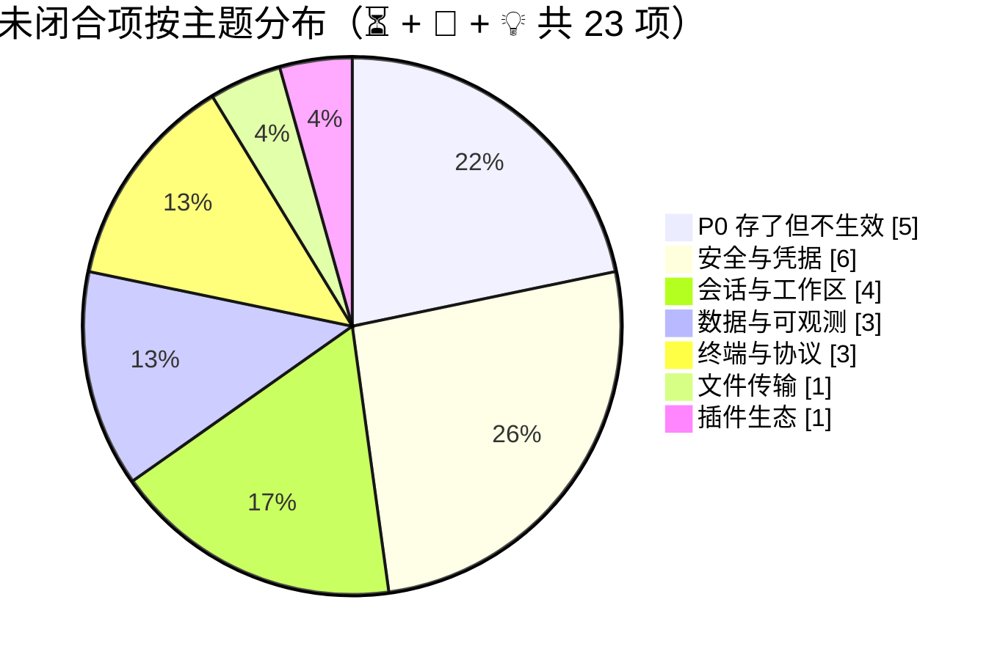

# VelaShell 特性计划

> **这份文件记录「还没发生的事」** —— 待办、候选特性，以及已经决策不做的清单。
>
> **已经发生的事在 [`plan.md`](plan.md)** —— 已完成的工作、当前架构、每一次改动的来龙去脉。
> 两份文件的分工是硬的：一件事做完了，就从这里划掉、去 `plan.md` 补一节；
> 一件事还没做，就不要在 `plan.md` 里留 TODO。
>
> 最近复核：**2026-09-07**（逐条对着 `src/` 现状核过，注明了具体文件与行号的即为已验证）

## 🏷️ 状态与优先级

| 标识 | 含义 |
| :---: | --- |
| ⏳ | **待办** —— 已确认要做，未开工 |
| 🚧 | **进行中** —— 有部分实现，未闭合 |
| 💡 | **候选** —— 想法已记录，是否要做待评估 |
| ❌ | **确认不做** —— 与架构或产品决策冲突，附理由，别再提 |
| 📄 | **文档待同步** —— 代码已改，velashell-docs 还没跟上 |

| 优先级 | 含义 |
| :---: | --- |
| 🔴 P0 | 影响正确性、安全或诚信（含「设置项存了但不生效」这类骗人的开关） |
| 🟠 P1 | 日常使用高频，缺了明显别扭 |
| 🟡 P2 | 进阶能力，有它更好 |
| 🟢 P3 | 锦上添花 / 大工程，等需求 |

## 📊 待办分布

> 「文件传输」只算 1 项 —— 那一节的第二行是指回 P0 表的交叉引用，不重复计数。

---

## 🔴 P0 —— 存了但不生效的开关

> 这一组的共同点：**字段已持久化、设置页可能还展示着，但运行时零消费者**。
> 用户拨了开关以为生效了，其实什么都没发生 —— 这是文档与界面在骗人，优先级高于任何新特性。
>
> 处置有两条路，二选一即可闭合：**接上运行时**，或**从界面撤下并在 `AppSettings` 注释里写明原因**。
> 现状统计口径见 [`velashell-docs zh/host/settings-audit.md`](https://github.com/VelaShellLabs/velashell-docs/blob/main/zh/host/settings-audit.md)。

| 状态 | 项 | 字段 | 现状 | 闭合要做什么 |
| :---: | --- | --- | --- | --- |
| ⏳ | **主密码保护** | `AppSettings.MasterPasswordProtection`（`AppSettings.cs:342`） | 字段存在，运行时零消费者；UI 已撤下并留注释 R-04 | 主密码派生密钥替换 `AesSecretProtector` 的本机密钥文件 + 启动解锁弹窗 + 存量密文迁移。**安全敏感，需单独设计后再动手** |
| ⏳ | **自动加载密钥到 Agent** | `AppSettings.AutoLoadToAgent`（`AppSettings.cs:1058`，默认 `true`） | 字段存在且默认开，零消费者（R-06） | 集成 Windows OpenSSH ssh-agent（命名管道协议）或 Pageant。⚠️ 实现时**必须**同步调整 `plan.md` §17-A：凭据装配曾**刻意整体替换**默认凭据列表以排除 `SshAgentCredentials`（Windows 上 `SSH_AUTH_SOCK` 非命名管道会刷异常） |
| ⏳ | **自动下载更新** | `AppSettings.AutoDownloadUpdates`（`AppSettings.cs:231`） | 字段存在，零消费者、零 UI | 下载调度 + SHA-256 完整性校验 + 静默换版流程。注：**启动时自动检查**（`CheckUpdatesOnStartup`）已实现并接进消息中心，别和这条混淆 |
| ⏳ | **传输失败重试** | `AppSettings.TransferMaxRetries` | 字段存在，零消费者 | 需要传输队列持久化才有意义（重试要知道「重试什么」）。同组的 `AutoResume` 已降级为遗留兼容字段，实际开关是 `ResumeEnabled`，**不要**再给它接线 |
| ⏳ | **标签栏位置（顶部/底部）** | `AppearanceOptions.TabBarPosition` + `SettingsViewModel.TabBarPositionIndex:1219` | 字段与索引映射都在，Docking 层零消费；VelaDock 替换后 UI 已从外观页撤下 | 自研 `DockGroupControl` 之后技术上已可做（改标签条停靠边）。**低成本**，按需排期 |

---

## 🔒 安全与凭据

| 状态 | 优先级 | 项 | 现状 | 要做什么 |
| :---: | :---: | --- | --- | --- |
| ⏳ | 🟠 P1 | **审计日志查看界面** | `audit_log` 一直在写（connect / connect-failed），但 `SonnetDbAuditLogService.QueryAsync` 在 UI 层**零调用** —— 写了没人看得见 | 安全审计页加一个可筛选的列表（时间 / 会话 / 结果）。数据侧现成，纯 UI 工作 |
| ⏳ | 🟠 P1 | **`audit_log` / `conn_history` 保留策略** | 无 retention，长期运行只增不减 | 复用会话录制那套「保留天数 + drop 回写压缩」的兜底路径（`plan.md` §13-F） |
| ⏳ | 🟡 P2 | **ed25519 / ecdsa 密钥生成** | `ISshKeyService` 只有 `GenerateRsaKeyAsync`；ed25519 / ecdsa **仅用于识别已有密钥类型** | .NET 无内置 OpenSSH ed25519 私钥导出 —— 要么自行实现 OpenSSH 私钥封装格式，要么引入 BouncyCastle（注意许可证与体积） |
| ⏳ | 🟡 P2 | **密钥管理的三处小缺口** | 导入不校验私钥有效性；删除无二次确认；导出未做（已信任主机同样只能删不能导） | 各自独立、都是小改动，可一批做掉 |
| ⏳ | 🟡 P2 | **SSH 证书（certificate）认证** | 代码零踪迹（`src/` 下 Certificate 命中全部是 FTPS/TLS 证书）；连接对话框第 2 步「证书」项仍禁用 | 先评估 Tmds.Ssh 对 OpenSSH user certificate 的支持程度，不支持就要么等上游要么放弃 |
| 🚧 | 🟠 P1 | **配置导出的选择性与脱敏** | 导出 / 导入是**全量 `AppSettings` 序列化 + 整体覆盖**。⚠️ **全量导出含 Security / Proxy 等敏感块，代理密码是明文** | 分类勾选导出 + 敏感块默认排除（或强制加密）。注：Gist 云同步（`plan.md` §13-C）已覆盖跨设备迁移场景，本条的价值主要在**别把明文代理密码写进一个用户随手分享的文件** |

---

## 📊 数据与可观测

| 状态 | 优先级 | 项 | 现状 | 要做什么 |
| :---: | :---: | --- | --- | --- |
| ⏳ | 🟢 P3 | **运维编排中心** | 设计帧 `bR5c4` 已出，代码零实现 | 设计稿里最后一个未落地的面板。范围需要重新界定 —— 现在有了 AI Agent 与协作接入，「编排」这件事的形态可能和当初画的不一样了 |
| 💡 | 🟢 P3 | **Sixel 图形** | 挂起中，多日工作量 | VT 引擎已有 DCS 通道，缺的是图像解码与渲染层的位图合成。依赖需求评估 —— 至今没有用户提过 |
| 💡 | 🟡 P2 | **终端输出的用户自定义高亮规则** | 语义高亮已内置，但是**编译期硬编码的 7 条**（`SemanticMatcher` 的 `[GeneratedRegex]`：Url / Ip / Error / Warning / Success / Option / Number） | 规则集改运行时可配 + 设置 UI（WindTerm 的卖点之一）。改动面：`SemanticMatcher` 从静态正则改成可注入规则表，注意别把逐格渲染的热路径拖慢 |

---

## 🗂️ 会话与工作区

| 状态 | 优先级 | 项 | 现状 | 要做什么 |
| :---: | :---: | --- | --- | --- |
| ⏳ | 🟠 P1 | **SSH config 导入** | 导入框架已就绪：`ISessionImportService` 多来源自动扫描 + Xshell / WinSCP 两个导入器已落地（`plan.md` §18-H） | 解析 `~/.ssh/config`（Host / HostName / Port / User / IdentityFile / ProxyJump），**在 DI 追加一行**即可。全清单里成本最低的一条 |
| ⏳ | 🟡 P2 | **会话标签自定义颜色 / 图标** | `Services/ConnectionAccent.cs:31` 按 `profileId` 哈希在固定 8 色里取一个，**用户不可选**；`SessionProfile` 无 color 字段 | 加 `SessionProfile.Terminal.TabColor` 并让 `ConnectionAccent` 优先读它。做不到「生产红 / 测试绿」是当前的实际痛点 |
| ⏳ | 🟡 P2 | **Dock 布局持久化** | 缓做中。单独恢复布局无意义 —— 文档即活动会话 | 需与「恢复会话」联动：布局节点 ↔ profileId 映射 + 自定义 document 还原器 |
| 💡 | 🟢 P3 | **触发器 / 自动应答** | 全仓无「输出匹配 → 自动发送」机制 | expect 式：输出命中正则时自动发送响应（自动 yes、密码带外输入）。与上面的自定义高亮规则**共用同一套用户规则表**，适合一起做 |

---

## 📁 文件传输

| 状态 | 优先级 | 项 | 现状 | 要做什么 |
| :---: | :---: | --- | --- | --- |
| 🚧 | 🟡 P2 | **SFTP 双栏与 WinSCP 的剩余差距** | 逐项清单在 [`velashell-docs zh/host/SFTP双栏与WinSCP差距分析.md`](https://github.com/VelaShellLabs/velashell-docs/blob/main/zh/host/SFTP双栏与WinSCP差距分析.md) | ⚠️ 那份文档把差距分成「**接线债 / 能力缺失 / 架构级缺失**」三类，**不要混在一起排期** —— 接线债是几小时，架构级缺失是几周 |
| ⏳ | 🟡 P2 | 传输失败重试 | 见 [P0 表](#-p0--存了但不生效的开关) | — |

---

## 🖥️ 终端与协议

| 状态 | 优先级 | 项 | 现状 | 要做什么 |
| :---: | :---: | --- | --- | --- |
| ⏳ | 🟡 P2 | **防空闲断开（Anti-idle）** | SSH keepalive 已接（`KeepAliveSeconds` → `SshClientSettings.KeepAliveInterval`），但那是**协议层**防 NAT 超时 | anti-idle 防的是**服务端 shell 超时踢出**，需要按间隔向 PTY 输入流发字节（如 `\0` 或空格）。两者互补，不能互相替代 |
| 💡 | 🟢 P3 | **终端内搜索的增强** | 基础搜索已实现（`MainWindowViewModel.TerminalSearchRequested:1616`） | 正则、大小写、全部高亮、上一个/下一个的循环计数 —— 按用户反馈再定 |
| 📄 | 🟠 P1 | **设计稿的两处残留** | Logo 有一个 `enabled:false` 残留图标；文件列表「修改时间」列无固定宽度 | 小到可以顺手做掉，记在这里免得忘 |

---

## 🧩 插件生态

| 状态 | 优先级 | 项 | 现状 | 要做什么 |
| :---: | :---: | --- | --- | --- |
| ✅ | — | ~~容器管理插件（DockerPanel）~~ | **已完成**（2026-09-03，`0.3.1`）。独立仓库 [VelaShell.Plugin.DockerPanel](https://github.com/VelaShellLabs/VelaShell.Plugin.DockerPanel)，从插件商店按需安装 | — |
| ⏳ | 🟡 P2 | **AI 插件的 MCP 服务端能力面对齐** | 对外 MCP 走 `AgentToolbox` 产出工具，但那条路上**没有审批界面** | 现状是「询问」模式等于一律拒绝写操作 —— 这是刻意的（`plan.md` §33-四）。可选的增强：带外审批（推到 IM 渠道或桌面通知）后再放行 |

---

## 📄 文档待同步（velashell-docs）

> 按 [`AGENTS.md`](AGENTS.md) 第二条：**改了行为就要同步改文档，两个 PR 互相引用、一起合。**
> 下面是已经欠下的账。

| 状态 | 出处 | 要改什么 |
| :---: | --- | --- |
| ✅ | `plan.md` §41 | ~~对外 MCP 的「允许操作的服务器」描述改成勾选式~~ —— **2026-09-07 已同步**，中英两棵树各新增「2.4 允许操作的服务器怎么配」 |
| ✅ | `plan.md` §33 | ~~新增 `{zh,en}/plugins/协作接入.md` 并在 STATUS 登记~~ —— **已完成** |
| ⏳ | `en/` 树 | `zh/` 有 **7 篇** `en/` 里没有的文档：Redis 调研、S3 两篇、系统密钥链调研，以及三份 `release-process.md`。缺口已在 [`en/host/README.md`](https://github.com/VelaShellLabs/velashell-docs/blob/main/en/host/README.md) 与根 README 逐篇列出（不再是**静默**漂移），但翻译本身仍欠着 |

---

## ❌ 确认不做

> 每一条都附了理由。**再提之前先读理由** —— 这些不是「还没排上」，是「评估过，与当前架构或产品决策冲突」。

| 项 | 不做的理由 |
| --- | --- |
| **多窗口（新开独立主窗口）** | 与现架构三处硬冲突：①应用为**单实例**（`Program.cs` 命名 Mutex，自更新重启依赖锁交接）；②主窗口是唯一组合根（单个 `MainWindowViewModel` 持有会话 / 布局 / 状态栏全部状态，无多窗口状态分片）；③VelaDock **产品决策不做浮动窗口**，多主窗意味着跨窗口拖拽与布局持久化整套推翻重做。**多屏需求由五区拖放分屏承担** |
| **Mosh** | 全部远程通道抽象建立在 SSH 流式通道之上（`ISshClientWrapper` / `IShellStreamWrapper`）。Mosh 是独立的 UDP + 状态同步（SSP）协议栈，.NET 无可用实现，接入等于并行维护第二套传输与终端预测引擎，收益不成比例。**弱网由自动重连 + keepalive 缓解** |
| **连字（Ligatures）** | 自绘渲染器按**单元格**排版，无法跨字符连字。这是自绘换来渲染控制权的固有代价 |
| **自适应标题栏颜色** | 系统原生标题栏由 OS 托管 —— 而主窗与全部对话框现在都是自绘无边框，这条本身已失去对象 |
| **系统通知 Toast** | 需要 AppUserModelID 与通知框架。替代方案已落地：常规页「声音提示」+ 安全审计页告警通道的「提示音」（`Security.AlertSound`），以及消息中心（`plan.md` §20） |
| **输入脱敏（会话录制）** | 只录**输出流**，密码本就无回显，没有要脱敏的对象 |
| **自定义键位** | 产品决策：快捷键页定位为「参考表」，唯一事实来源是 `ShortcutCatalog.cs` |
| **运行时热切终端类型** | TERM 在**连接时**向远端协商，活动会话热切只会造成本地仿真与远端 TERM 能力档不一致。「设置修改对新连接生效」即为正确语义 |
| **VelaDock 浮动窗口** | 产品决策。见上面「多窗口」条 |
| **按会话的独立代理** | 已落地为**应用级全局代理**（`plan.md` §12-10）。⚠️ 别与**动态 SOCKS 转发**（`-D`）混淆 —— 那是隧道功能，方向相反 |

---

## 🔧 维护约定

1. **一件事只能出现在一个文件里。** 做完了就从这里删掉、去 `plan.md` 补一节；`plan.md` 里不留 TODO。
2. **写现状要给证据。** 「零消费者」这种话要能落到具体文件行号 —— 上一版 plan.md 里有两条「无任何消费者」后来被证伪，就是因为写的时候没核。
3. **❌ 那一栏只增不减，除非架构真的变了。** 它的价值在于**别人不用把同一个评估再做一遍**。
4. **改了行为就同步 velashell-docs**（[`AGENTS.md`](AGENTS.md) 第二条），并把欠账登记到上面的「文档待同步」表。
