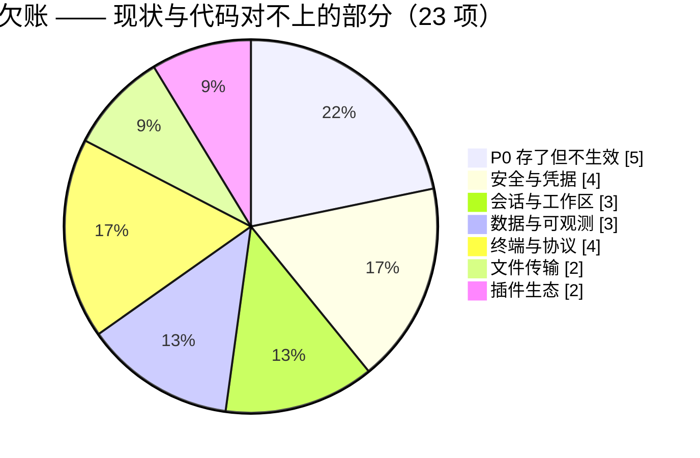
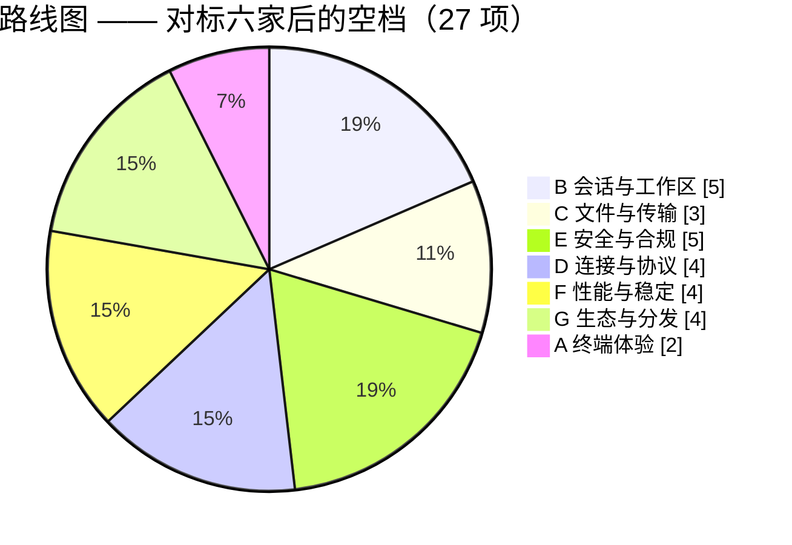

# VelaShell 特性计划

> **这份文件记录「还没发生的事」** —— 待办、候选特性，以及已经决策不做的清单。
>
> **已经发生的事在 [`plan.md`](plan.md)** —— 已完成的工作、当前架构、每一次改动的来龙去脉。
> 两份文件的分工是硬的：一件事做完了，就从这里划掉、去 `plan.md` 补一节；
> 一件事还没做，就不要在 `plan.md` 里留 TODO。
>
> 最近复核：**2026-09-08**（逐条对着 `src/` 现状核过，注明了具体文件与行号的即为已验证）
>
> **两部分读法不同**：
>
> | 部分 | 是什么 | 怎么用 |
> | --- | --- | --- |
> | [P0 表](#-p0--存了但不生效的开关) ~ [插件生态](#-插件生态) | **已经欠下的账** —— 现状与代码 / 文档对不上，或开关存了不生效 | 优先清，它们是「界面在骗人」 |
> | [🧭 对标与路线图](#-对标与路线图2026-09-08-新增) | **往前看** —— 对着六家竞品找空档，按「架构落点」估成本 | 排下一步做什么 |

## 🏷️ 状态与优先级

| 标识 | 含义 |
| :---: | --- |
| ⏳ | **待办** —— 已确认要做，未开工 |
| 🚧 | **进行中** —— 有部分实现，未闭合 |
| 💡 | **候选** —— 想法已记录，是否要做待评估 |
| ❌ | **确认不做** —— 与架构或产品决策冲突，附理由，别再提 |
| 📄 | **文档待同步** —— 代码已改，velashell-docs 还没跟上 |

| 优先级 | 含义 |
| :---: | --- |
| 🔴 P0 | 影响正确性、安全或诚信（含「设置项存了但不生效」这类骗人的开关） |
| 🟠 P1 | 日常使用高频，缺了明显别扭 |
| 🟡 P2 | 进阶能力，有它更好 |
| 🟢 P3 | 锦上添花 / 大工程，等需求 |

## 📊 待办分布

**欠账**（⏳ + 🚧 + 💡，共 23 项）与**路线图**（共 27 项）分开计：





> 「文件传输」算 2 项 —— 那一节的「传输失败重试」是指回 P0 表的交叉引用、不重复计数，「远程编辑的三个入口已统一」是 📄 文档待同步、不计入欠账。
> 「会话与工作区」从 4 降到 3：会话标签颜色已在 `b9ae31f` 落地（见该节）。
> 「安全与凭据」从 6 降到 4：SSH 证书认证已在 `bbfa1877` 落地，ed25519 密钥生成已在 `plan.md` §86 落地（均见该节）。
> 「插件生态」现为 2：插件自报图标当天闭合，但新增了一条 🔴 P0「11 条怎么改都绿的 UI 用例」（见该节）。
> 「终端与协议」从 3 加到 4：新增「SSH PTY 像素尺寸贯通」（2026-09-22 换成 SSH 库 VelaShell.Ssh 后**不再卡上游**，见该节）。
> 「终端与协议」仍为 4：VelaShell.XServer 的 M3（接入宿主）已落地（`plan.md` §105），拆出一条「内置 X 服务端：AltGr 层」（见该节）。

---

## 🔴 P0 —— 存了但不生效的开关

> 这一组的共同点：**字段已持久化、设置页可能还展示着，但运行时零消费者**。
> 用户拨了开关以为生效了，其实什么都没发生 —— 这是文档与界面在骗人，优先级高于任何新特性。
>
> 处置有两条路，二选一即可闭合：**接上运行时**，或**从界面撤下并在 `AppSettings` 注释里写明原因**。
> 现状统计口径见 [`velashell-docs zh/host/settings-audit.md`](https://github.com/VelaShellLabs/velashell-docs/blob/main/zh/host/settings-audit.md)。

| 状态 | 项 | 字段 | 现状 | 闭合要做什么 |
| :---: | --- | --- | --- | --- |
| ⏳ | **主密码保护** | `AppSettings.MasterPasswordProtection`（`AppSettings.cs:342`） | 字段存在，运行时零消费者；UI 已撤下并留注释 R-04 | 主密码派生密钥替换 `AesSecretProtector` 的本机密钥文件 + 启动解锁弹窗 + 存量密文迁移。**安全敏感，需单独设计后再动手** |
| ✅ | ~~**自动加载密钥到 Agent**~~ | `KeyOptions.AddKeysToAgent`（取代 `AutoLoadToAgent`，默认**关**） | **已完成**（2026-09-23，`plan.md` §98） | SSH 库补了 `SshAgentClient.AddIdentityAsync`（`SSH_AGENTC_ADD_IDENTITY` / 带约束的 `ADD_ID_CONSTRAINED`）；宿主在私钥文件认证成功后于后台加钥，agent 里已有就跳过，agent 不在 / 拒绝只记诊断日志、不连累连接；设置 → 密钥管理重新露出开关。旧字段默认 `true` 却从没消费者，存量配置里那个 `true` 不算用户同意，所以**换了字段名、默认关**。证书认证暂不加（库还不支持「证书 + 私钥」的加钥格式）。Pageant 仍未支持 |
| ⏳ | **自动下载更新** | `AppSettings.AutoDownloadUpdates`（`AppSettings.cs:231`） | 字段存在，零消费者、零 UI | 下载调度 + SHA-256 完整性校验 + 静默换版流程。注：**启动时自动检查**（`CheckUpdatesOnStartup`）已实现并接进消息中心，别和这条混淆 |
| ⏳ | **传输失败重试** | `AppSettings.TransferMaxRetries` | 字段存在，零消费者 | 需要传输队列持久化才有意义（重试要知道「重试什么」）。同组的 `AutoResume` 已降级为遗留兼容字段，实际开关是 `ResumeEnabled`，**不要**再给它接线 |
| ⏳ | **标签栏位置（顶部/底部）** | `AppearanceOptions.TabBarPosition` + `SettingsViewModel.TabBarPositionIndex:1219` | 字段与索引映射都在，Docking 层零消费；VelaDock 替换后 UI 已从外观页撤下 | 有了 VelaDock 的 `DockGroupControl` 之后技术上已可做（改标签条停靠边）。**低成本**，按需排期 |

---

## 🔒 安全与凭据

| 状态 | 优先级 | 项 | 现状 | 要做什么 |
| :---: | :---: | --- | --- | --- |
| ✅ | — | ~~SSH 证书（certificate）认证~~ | **已完成**（2026-09-10，`plan.md` §63，`bbfa1877` + `31922005`）：`AuthMethod.Certificate`（只能追加在枚举末尾，序号由 `AuthMethod_OrdinalValues_MustStayStable` 钉住）→ 凭据装配出「证书 + 匹配私钥」两件套（当时是 Tmds.Ssh 的 `CertificateCredential`；2026-09-22 换库后改由 `SshConnectionAssembler` 装 `VelaShell.Ssh` 的证书签名器，PEM→OpenSSH 那段兼容转换连同它一起删了——新库原生认三种格式）。连接配置页与登录弹窗的「证书」项都已启用，选完证书按 `<key>-cert.pub` 约定自动补上私钥（`Core/Ssh/OpenSshCertificate`）。`tests/cert-lab/` 一台**堵死全部回退路径**的靶机做端到端验证（阳性 + 阴性对照） | ⏳ 三处**当时刻意留在范围外**：①**主机证书**（CA 签的 host key 替代逐台指纹）是相反方向的另一件事，接得上现有的 `AddHostAuthentication`；②会话导入（PuTTY / Xshell / `ssh://`）与外部启动不产出证书字段，要支持得先扩解析器；③📄 velashell-docs 还没跟上（见下面的[文档待同步](#-文档待同步velashell-docs)） |
| ⏳ | 🟠 P1 | **审计日志查看界面** | `audit_log` 一直在写（connect / connect-failed），但 `SonnetDbAuditLogService.QueryAsync` 在 UI 层**零调用** —— 写了没人看得见 | 安全审计页加一个可筛选的列表（时间 / 会话 / 结果）。数据侧现成，纯 UI 工作 |
| ⏳ | 🟠 P1 | **`audit_log` / `conn_history` 保留策略** | 无 retention，长期运行只增不减 | 复用会话录制那套「保留天数 + drop 回写压缩」的兜底路径（`plan.md` §13-F） |
| ✅ | — | ~~**ed25519 / ecdsa 密钥生成**~~ | **已完成**（2026-09-20，`plan.md` §86 + §87）：`GenerateRsaKeyAsync` 换成 `GenerateKeyAsync(name, algorithm = Ed25519, bits)` + 新枚举 `SshKeyAlgorithm { Ed25519, Ecdsa, Rsa }`（`bits` 给 0 表示按算法取默认值：RSA 4096、ECDSA 256）。密钥管理页工具栏加了算法下拉：**Ed25519（默认）/ ECDSA 256·384·521 / RSA 4096**；位数不给选 —— 4096 能用的地方 2048 一定能用，反过来不成立，列出来只是个坑。当初记的两个顾虑都不成立：BouncyCastle **本就是 SSH 库的依赖**、早在输出目录里，抬成显式依赖体积增量为零；许可证是 MIT 改写版，不与双许可冲突。OpenSSH 的私钥封装格式本来就自己实现着（`OpenSshPrivateKey`），ed25519 只加了一个 `SerializeEd25519`，ecdsa 的 `SerializeEcdsa` 早就在（导入转换那条路上用着）；真正借外力的只有 ed25519「由种子导出公钥」那步曲线标量乘法 —— .NET 11 的 BCL 至今没有独立 Ed25519。五把（含 ECDSA 三条曲线）都用系统自带 `ssh-keygen -y` 反推公钥交叉验证过，与我们写出的 `.pub` 逐字节相同 | ⏳ 两处留在范围外：①**下拉档位表与 axaml 靠 `SelectedIndex` 对齐**，错位不会报错 —— 已由 `SshKeyChoiceCatalogTests` 读 axaml 逐项比对钉死，增删档位要先改 `SshKeyManagerViewModel.AlgorithmChoices`；②📄 velashell-docs 还没跟上（见下面的[文档待同步](#-文档待同步velashell-docs)） |
| ⏳ | 🟡 P2 | **密钥管理的三处小缺口** | 导入不校验私钥有效性；删除无二次确认；导出未做（已信任主机同样只能删不能导） | 各自独立、都是小改动，可一批做掉 |
| 🚧 | 🟠 P1 | **配置导出的选择性与脱敏** | 导出 / 导入是**全量 `AppSettings` 序列化 + 整体覆盖**。⚠️ **全量导出含 Security / Proxy 等敏感块，代理密码是明文** | 分类勾选导出 + 敏感块默认排除（或强制加密）。注：Gist 云同步（`plan.md` §13-C）已覆盖跨设备迁移场景，本条的价值主要在**别把明文代理密码写进一个用户随手分享的文件** |

---

## 📊 数据与可观测

| 状态 | 优先级 | 项 | 现状 | 要做什么 |
| :---: | :---: | --- | --- | --- |
| ⏳ | 🟢 P3 | **运维编排中心** | 设计帧 `bR5c4` 已出，代码零实现 | 设计稿里最后一个未落地的面板。范围需要重新界定 —— 现在有了 AI Agent 与协作接入，「编排」这件事的形态可能和当初画的不一样了 |
| 💡 | 🟢 P3 | **Sixel 图形** | 挂起中，多日工作量 | VT 引擎已有 DCS 通道，缺的是图像解码与渲染层的位图合成。依赖需求评估 —— 至今没有用户提过 |
| 💡 | 🟡 P2 | **终端输出的用户自定义高亮规则** | 语义高亮已内置，但是**编译期硬编码的 7 条**（`SemanticMatcher` 的 `[GeneratedRegex]`：Url / Ip / Error / Warning / Success / Option / Number） | 规则集改运行时可配 + 设置 UI（WindTerm 的卖点之一）。改动面：`SemanticMatcher` 从静态正则改成可注入规则表，注意别把逐格渲染的热路径拖慢 |

---

## 🗂️ 会话与工作区

| 状态 | 优先级 | 项 | 现状 | 要做什么 |
| :---: | :---: | --- | --- | --- |
| ✅ | — | ~~SSH config 导入~~ | **已完成**（2026-09-09，`plan.md` §58）：`SshConfigImportService` + `SshConfigParser` 作为第三个来源接进导入对话框，解析 Host / HostName / Port / User / IdentityFile / ProxyJump，含 `Include` 展开与 OpenSSH 的「先出现者胜」取值 | ⏳ 反向的**导出**到 `~/.ssh/config` 未做（与 known_hosts 互通是同一条线，见[终端与协议](#-终端与协议)） |
| ✅ | — | ~~会话标签自定义颜色~~ | **已完成**（`b9ae31f`，2026-09-06）：`TerminalOverrides.TabColor` → `ConnectionAccent.cs:66` 优先读它，连接对话框有输入框（`ConnectionProfileView.axaml:610`）。留空才回退到按 `profileId` 哈希取色。「生产红 / 测试绿」已经能做 | ⏳ **图标**仍未做（见[路线图 B 组](#b-会话与工作区)） |
| ⏳ | 🟡 P2 | **Dock 布局持久化** | 缓做中。单独恢复布局无意义 —— 文档即活动会话 | 需与「恢复会话」联动：布局节点 ↔ profileId 映射 + 自定义 document 还原器 |
| 💡 | 🟢 P3 | **触发器 / 自动应答** | 全仓无「输出匹配 → 自动发送」机制 | expect 式：输出命中正则时自动发送响应（自动 yes、密码带外输入）。与上面的自定义高亮规则**共用同一套用户规则表**，适合一起做 |

---

## 📁 文件传输

| 状态 | 优先级 | 项 | 现状 | 要做什么 |
| :---: | :---: | --- | --- | --- |
| ❌ | — | ~~**X / Y / ZMODEM**~~ | **已移除**（2026-09-14）：支持终端内 X / Y / ZMODEM 需要在终端链路上写大量专门处理，维护麻烦、收益很低，且如今几乎没人再用，决定不再修复并移除；协议引擎、终端路由、设置项与连接级覆盖整体删除。命令面板的「发送文件到远端…」「从远端接收文件…」一并移除（接收方向无法从终端下载），文件收发统一用 SFTP 面板 | — |
| 🚧 | 🟡 P2 | **SFTP 双栏与 WinSCP 的剩余差距** | 逐项清单在 [`velashell-docs zh/host/SFTP双栏与WinSCP差距分析.md`](https://github.com/VelaShellLabs/velashell-docs/blob/main/zh/host/SFTP双栏与WinSCP差距分析.md) | ⚠️ 那份文档把差距分成「**接线债 / 能力缺失 / 架构级缺失**」三类，**不要混在一起排期** —— 接线债是几小时，架构级缺失是几周 |
| ⏳ | 🟡 P2 | 传输失败重试 | 见 [P0 表](#-p0--存了但不生效的开关) | — |
| 📄 | 🟠 P1 | **远程编辑的三个入口已统一** | 双击 / 右键「打开」/ 右键「使用默认编辑器打开」现在都会侦听保存自动回传，新增「正在编辑」浮窗分组与两个设置项（见 [`plan.md` §51](plan.md)）。代码已落地，**velashell-docs 还没跟上** | 在 `zh/host/` 与 `en/` 镜像里补：三个入口的语义差别、自动回传规则、`双击文件时` / `编辑后自动上传` 两个设置项、`~/.velashell/logs/remote-edit.log` 诊断日志 |
| ⏳ | 🟢 P3 | **内置编辑器的临时副本没有兜底清理** | `RemoteFileEditorView.OnClosed` 会删掉自己那个 `builtin-edit\<8hex>\` 子目录，但**进程崩溃时留下的那些没人管** —— 应用退出时的 `TryDeleteEmptyTree` 只删空目录，而残留目录里正好有文件 | 要做就得按时间兜底（如启动时清 7 天前的），⚠️ 注意别把「上传失败刻意保留的草稿」一起删了 —— 那是用户改动唯一的存身之处 |

---

## 🖥️ 终端与协议

| 状态 | 优先级 | 项 | 现状 | 要做什么 |
| :---: | :---: | --- | --- | --- |
| ✅ | — | ~~防空闲断开（Anti-idle）~~ | **已完成**（2026-09-10，`plan.md` §65）：连接对话框的高级选项里新增「防空闲（秒）」，与保活并排；`TerminalOverrides.AntiIdleSeconds` → `AntiIdleKeeper` 按间隔往 PTY 送一个 `NUL`，只在真的空闲时发，ZMODEM 会话期间让路 | ⏳ **只按会话，没有全局开关**（刻意的：会踢人的只是特定那几台机器，注入的字节终究打进对端 tty）。📄 velashell-docs 还没跟上 |
| ⏳ | 🟡 P2 | **非 bash 的 shell 干脆别注入目录上报钩子** | 钩子由 `test -n "${BASH_VERSION:-}"` 守卫，在 zsh / dash 上是个**空操作** —— 却照样占掉一个提示符周期，还在用户历史里留下一整行（`plan.md` §66 的摘历史只对 bash 有效：zsh 没有 `history -d`） | `RemoteShellProbe` 目前只回答「是不是 POSIX」，让它顺带报出 shell 家族（探针命令加一段 `${BASH_VERSION:+-bash}` / `${ZSH_VERSION:+-zsh}`，标记向后兼容），**确认是 zsh 时跳过注入**。⚠️ 只在**正面认出**非 bash 时才跳 —— 认不出来照旧注入，免得误伤「登录 shell 是 /bin/sh、交互 shell 是 bash」那种机器 |
| ⏳ | 🟢 P3 | **SSH PTY 像素尺寸贯通** | `window-change` 的像素字段恒为 `0`：`IShellStreamWrapper.Resize(int, int)` 只有字符行列，终端控件的 `PtySizeChanged` 也只报列/行，`ShellStreamWrapper.ResizeCoreAsync` 于是只能 `new TerminalSize(columns, rows)` | ✅ **上游那道坎没有了**：2026-09-22 换成 VelaShell.Ssh（`plan.md` §91），`pty-req` 与 `window-change` 两条路都原生带像素 —— `TerminalSize(columns, rows, pixelWidth, pixelHeight)`，建流那一步（`CreateShellStreamAsync(…, width, height, …)`）**已经把像素传下去了**。剩下的全是宿主侧的活：让终端控件报出物理像素、让 `Resize` 带着它走。实施细节见下文「SSH PTY 像素尺寸贯通 —— 实施细节」 |
| 💡 | 🟢 P3 | **终端内搜索的增强** | 基础搜索已实现（`MainWindowViewModel.TerminalSearchRequested:1616`） | 正则、大小写、全部高亮、上一个/下一个的循环计数 —— 按用户反馈再定 |
| ✅ | — | ~~**VelaShell.XServer M2:现代工具包要的扩展**~~ | **已完成**(2026-09-23,`plan.md` §103):SHAPE、XFIXES、RANDR(只读)、RENDER、剪贴板与宿主互通、XSETTINGS 管理器;`zenity`、`gedit`、`qt5ct`、Xft 的 `xterm` 画得对、零协议错误 | 原计划里的**最小 XKB 与 XInput2 没做**,拆成下一行 —— 实测 GTK3 / Qt5 没有它们照样工作 |
| ✅ | — | ~~**VelaShell.XServer:XKB 与 XInput2**~~ | **已完成**(2026-09-23,`plan.md` §104):XKEYBOARD 由核心键位表推出完整描述(类型、动作、SymInterpret、指示灯、evdev 键名),xkbcommon-x11 建表成功、`xkbcomp` 导出自洽;XInputExtension 到 XI 2.2(设备事件、Enter / Leave / Focus、原始事件、主动与被动抓取)加 XI 1.x 查询。同一轮还补了 XTEST、XINERAMA、SYNC、DAMAGE、Composite、DOUBLE-BUFFER、Present、MIT-SCREEN-SAVER、DPMS、X-Resource、GE,以及窗口管理器角色(EWMH / ICCCM) | 没做的:XIChangeHierarchy(设备拓扑固定)、XI 1.x 的设备事件、XKB 的 SetMap / SetCompatMap 等改表请求(键位表跟着核心表与宿主的 `SetKeyboardMapping` 走) |
| ✅ | — | ~~**VelaShell.XServer M3:接入宿主**~~ | **已完成**(2026-09-24,`plan.md` §105):「X Server」按钮默认启动内置服务端,每个 X 顶层一个 Avalonia 原生窗口(override-redirect 画成无装饰弹层、`Decorated = false` 的自绘标题栏窗口不加系统边框、非矩形与 ARGB 窗口透明底),窗口管理器请求照办并写回 `_NET_WM_STATE` / `_NET_FRAME_EXTENTS`;光标、剪贴板双向、多显示器布局与 DPI、Windows 键盘布局(两层)都接上;SSH 的 x11 通道经 `X11ForwardOptions.LocalConnector` 直接接进服务端;VcXsrv 退成 Windows 上的可选引擎,设置页只在选了它时出现它的参数 | 输入法(XIM)不做 —— 中日韩输入走远端的输入法框架;AltGr 层拆成下一行 |
| ✅ | — | ~~**内置 X 服务端:AltGr 层**~~ | **已完成**(2026-09-24,`plan.md` §106):服务端 XKB 加 FOUR_LEVEL / FOUR_LEVEL_ALPHABETIC(核心第 5、6 列 = 组 1 第 3、4 级,Mod5 选级),宿主 API `SetModifierMapping`;Windows 上宿主用 `ToUnicodeEx`(Ctrl+Alt)取 AltGr 层,右 Alt 设成 `ISO_Level3_Shift` 进 Mod5,系统为 AltGr 补的假左 Ctrl 不转发。xterm 里 AltGr+q 打出 `@` 已实测 | 顺带修掉:更窄的 ChangeKeyboardMapping(`xmodmap -e "keycode 108 = …"`)会把整张键位表收成 1 列 |
| 💡 | 🟢 P3 | **内置 X 服务端:macOS / Linux 的键盘布局跟随** | 宿主只在 Windows 上按系统布局推键位表(`plan.md` §105、§106);macOS 与 Linux 上内置服务端按 US 键位表,非 US 布局的用户在 X 程序里打出的字符与键帽不符(Linux 桌面本来有自己的 X,影响主要在 macOS) | macOS 用 `UCKeyTranslate`(`TISCopyCurrentKeyboardLayoutInputSource`)按四种修饰状态取字符,与 `WindowsKeymap` 同一个出口;Linux 上若确有需要,可从 xkbcommon 取当前布局 |
| 📄 | 🟠 P1 | **设计稿的两处残留** | Logo 有一个 `enabled:false` 残留图标；文件列表「修改时间」列无固定宽度 | 小到可以顺手做掉，记在这里免得忘 |

### SSH PTY 像素尺寸贯通 —— 实施细节

> 状态：⏳ 待办。**上游那道坎在 2026-09-22 随换库一并消失**（`plan.md` §91）—— 底层换成 VelaShell.Ssh，不必再等谁发版。余下的宿主侧改动**一次性落地**（不分阶段）。
> 依据：`VelaShell.Ssh` 的 `TerminalSize(columns, rows, pixelWidth, pixelHeight)`，经 `SshChannel.RequestPtyAsync` 与 `SshShell.ResizeAsync(TerminalSize)` 两条路发出。

**前置条件**

- ~~Tmds.Ssh 发版含 #519 的 API~~ —— **已不适用**：VelaShell.Ssh 原生支持，`CreateShellStreamAsync` 那一路已经在传像素了。
- **不触发 PluginSdk 发版**：插件终端协议（Telnet NAWS / 串口）本无像素概念，`IProtocolTerminalSession.ResizeAsync` 保持不变。

**设计决策**

1. 拓宽共享接口 `IShellStreamWrapper.Resize` 承载像素（而非 SSH 专用窄路径）。
2. 一次性落地（原计划是"等上游发版"，现在没有这个前提了）。
3. 新增共享结构体 `PtySize`，`PtySizeChanged` 事件改携带该结构体；插件视图 API 用适配 lambda 保持对外 `Action<int,int>` 不变。`ITerminalEmulator` 另暴露 `CurrentPtySize` 属性，供挂载传输时手动重推完整尺寸（见步骤 3a / 4）。
4. 单位换算：DIP → 物理像素乘 `RenderScaling`。

**新增共享类型** `src/VelaShell.Core/Pty/PtySize.cs`：

```csharp
public readonly record struct PtySize(int Columns, int Rows, int WidthPixels, int HeightPixels);
```

`IShellStreamWrapper.cs` 与 `ITerminalEmulator.cs` 各加 `using VelaShell.Core.Pty;`。

**实施步骤**（按依赖顺序，每步给出改前 → 改后代码示例）

**~~1. 抬 Tmds.Ssh 版本~~** —— **这一步没有了**。底层已在 2026-09-22 换成 VelaShell.Ssh
（工程引用，不是 NuGet 包，`plan.md` §91），`TerminalSize` 本就带 `pixelWidth` / `pixelHeight`。
下面从第 2 步开始，步骤编号保持原样，免得与已写好的代码示例对不上。

**2. 接口层** —— `IShellStreamWrapper.cs:57-61`：

```csharp
// 改前
/// <summary>
/// 发送 SSH 窗口变更请求,使远端 PTY 匹配本地终端尺寸。
/// 像素尺寸报告为 0(仅使用字符单元尺寸)。
/// </summary>
void Resize(int columns, int rows);

// 改后(文件顶部补 using VelaShell.Core.Pty;)
/// <summary>发送 SSH 窗口变更请求,使远端 PTY 匹配本地终端尺寸。</summary>
void Resize(PtySize size);
```

**3. 终端模拟器（像素源）**

3a. `ITerminalEmulator.cs:76-80` —— 事件改携带 `PtySize`，并新增 `CurrentPtySize` 供 VM 手动重推：

```csharp
// 改前
/// <summary>
/// 终端的字符单元格网格尺寸变化时触发(例如控件以新尺寸完成布局),
/// 以便宿主 PTY 调整大小与之匹配。参数:(columns, rows)。
/// </summary>
event Action<int, int>? PtySizeChanged;

// 改后(文件顶部补 using VelaShell.Core.Pty;)
/// <summary>
/// 终端的字符单元格网格尺寸变化时触发(例如控件以新尺寸完成布局),
/// 以便宿主 PTY 调整大小与之匹配。参数:列、行与物理像素宽高。
/// </summary>
event Action<PtySize>? PtySizeChanged;

/// <summary>当前网格对应的完整 PTY 尺寸(含物理像素),供挂载传输时手动重推。</summary>
PtySize CurrentPtySize { get; }
```

3b. `VelaTerminalControl.cs` —— 事件声明、缩放读取、像素换算与 `CurrentPtySize`：

```csharp
// 改前(:608)
public event Action<int, int>? PtySizeChanged;

// 改后
public event Action<PtySize>? PtySizeChanged;

// 新增(参照 RefreshPixelGrid :1913-1914 的 RenderScalingOverrideForTest 分支)
private double RenderScaling =>
    RenderScalingOverrideForTest > 0
        ? RenderScalingOverrideForTest
        : TopLevel.GetTopLevel(this)?.RenderScaling ?? 1;

private int WidthPixels(int columns) =>
    (int)Math.Round(columns * CellWidthForTest * RenderScaling);

private int HeightPixels(int rows) =>
    (int)Math.Round(rows * CellHeightForTest * RenderScaling);

public PtySize CurrentPtySize =>
    new(Emulator.Columns, Emulator.Rows,
        WidthPixels(Emulator.Columns), HeightPixels(Emulator.Rows));
```

3c. 两处触发点 `:1861` 与 `:1898`：

```csharp
// 改前
PtySizeChanged?.Invoke(cols, rows);

// 改后(两处一致)
PtySizeChanged?.Invoke(new PtySize(cols, rows, WidthPixels(cols), HeightPixels(rows)));
```

> 注意:`PtySizeChanged` 在布局路径触发,早于 `Render` 里的 `RefreshPixelGrid`;故 `RenderScaling` 用 `TopLevel.GetTopLevel` 直接取,布局阶段可独立取值。

**4. 转发层（VM）** —— `TerminalTabViewModel.cs`：

```csharp
// 改前(:27)
private (int Columns, int Rows)? _pendingPtySize;

// 改后
private PtySize? _pendingPtySize;

// 改前(:939)
private void OnPtySizeChanged(int columns, int rows)
{
    if (_disposed || ShellStream is null || !ShellStream.CanWrite) return;
    lock (_ptyResizeGate)
    {
        _pendingPtySize = (columns, rows);
        if (_ptyResizeSending) return;
        _ptyResizeSending = true;
    }
    _ = Task.Run(DrainPtyResizeQueue);
}

// 改后
private void OnPtySizeChanged(PtySize size)
{
    if (_disposed || ShellStream is null || !ShellStream.CanWrite) return;
    lock (_ptyResizeGate)
    {
        _pendingPtySize = size;
        if (_ptyResizeSending) return;
        _ptyResizeSending = true;
    }
    _ = Task.Run(DrainPtyResizeQueue);
}

// 改前(:961-984,DrainPtyResizeQueue 摘取与转发)
(int Columns, int Rows) size;
lock (_ptyResizeGate)
{
    if (_pendingPtySize is null) { _ptyResizeSending = false; return; }
    size = _pendingPtySize.Value;
    _pendingPtySize = null;
}
// ...
stream.Resize(size.Columns, size.Rows);

// 改后
PtySize size;
lock (_ptyResizeGate)
{
    if (_pendingPtySize is null) { _ptyResizeSending = false; return; }
    size = _pendingPtySize.Value;
    _pendingPtySize = null;
}
// ...
stream.Resize(size);

// 改前(:811-817,SyncPtySize)
private void SyncPtySize()
{
    if (TerminalEmulator is { Columns: > 0, Rows: > 0 })
    {
        OnPtySizeChanged(TerminalEmulator.Columns, TerminalEmulator.Rows);
    }
}

// 改后(直接取完整尺寸,列/行 + 像素一起重推)
private void SyncPtySize()
{
    if (TerminalEmulator is { Columns: > 0, Rows: > 0 })
    {
        OnPtySizeChanged(TerminalEmulator.CurrentPtySize);
    }
}
```

**5. 三个 Shell 流实现**

SSH `ShellStreamWrapper.cs:125-144`：

```csharp
// 改前
public void Resize(int columns, int rows)
{
    if (_disposed || _channelClosed || columns <= 0 || rows <= 0) return;
    try
    {
        _process.SetTerminalSize(columns, rows);
    }
    catch (Exception ex) when (ex is SshChannelClosedException
                                  or SshConnectionClosedException
                                  or ObjectDisposedException)
    {
        _channelClosed = true;
    }
    catch
    {
        // 调整尺寸失败不影响会话本身。
    }
}

// 改后(依赖步骤 1 的四参重载;文件顶部补 using VelaShell.Core.Pty;)
public void Resize(PtySize size)
{
    if (_disposed || _channelClosed || size.Columns <= 0 || size.Rows <= 0) return;
    try
    {
        _process.SetTerminalSize(size.Columns, size.Rows, size.WidthPixels, size.HeightPixels);
    }
    catch (Exception ex) when (ex is SshChannelClosedException
                                  or SshConnectionClosedException
                                  or ObjectDisposedException)
    {
        _channelClosed = true;
    }
    catch
    {
        // 调整尺寸失败不影响会话本身。
    }
}
```

本地 ConPTY `ConPtyShellStream.cs:113-124`：

```csharp
// 改前
public void Resize(int columns, int rows)
{
    if (_closed || _disposed) return;
    _ = NativeMethods.ResizePseudoConsole(_console, new()
    {
        X = (short)Math.Clamp(columns, 2, 500),
        Y = (short)Math.Clamp(rows, 2, 500)
    });
}

// 改后(COORD 无像素字段,像素忽略;文件顶部补 using VelaShell.Core.Pty;)
public void Resize(PtySize size)
{
    if (_closed || _disposed) return;
    _ = NativeMethods.ResizePseudoConsole(_console, new()
    {
        X = (short)Math.Clamp(size.Columns, 2, 500),
        Y = (short)Math.Clamp(size.Rows, 2, 500)
    });
}
```

插件 `PluginTerminalShellStream.cs:112-130`：

```csharp
// 改前
public void Resize(int columns, int rows)
{
    if (_disposed) return;
    _ = Task.Run(async () =>
    {
        try
        {
            await session.ResizeAsync(columns, rows, _lifetime.Token).ConfigureAwait(false);
        }
        catch (Exception ex) when (ex is not OperationCanceledException)
        {
            Trace.WriteLine($"[PluginTerminal] Resize on '{protocolId}' failed: {ex.Message}");
        }
    });
}

// 改后(插件协议无像素概念,丢弃;文件顶部补 using VelaShell.Core.Pty;)
public void Resize(PtySize size)
{
    if (_disposed) return;
    _ = Task.Run(async () =>
    {
        try
        {
            await session.ResizeAsync(size.Columns, size.Rows, _lifetime.Token).ConfigureAwait(false);
        }
        catch (Exception ex) when (ex is not OperationCanceledException)
        {
            Trace.WriteLine($"[PluginTerminal] Resize on '{protocolId}' failed: {ex.Message}");
        }
    });
}
```

**6. 插件视图 API** —— `PluginTerminalViewApi.cs:167-171`：

```csharp
// 改前
public event Action<int, int>? Resized
{
    add => control.PtySizeChanged += value;
    remove => control.PtySizeChanged -= value;
}

// 改后(对外仍是 Action<int,int>;事件已改为 Action<PtySize>,用命名方法适配以支持正确退订)
public event Action<int, int>? Resized
{
    add => control.PtySizeChanged += ControlOnPtySizeChanged;
    remove => control.PtySizeChanged -= ControlOnPtySizeChanged;
}

private void ControlOnPtySizeChanged(PtySize size) =>
    Resized?.Invoke(size.Columns, size.Rows);
```

**7. 初始 pty-req（通路 A）** —— `VelaSshClientWrapper.CreateShellStreamAsync`（换库后这一步**已经在传像素**，留着示例只为说明通路 A 与 B 的区别）：

```csharp
// 改前
var options = new ExecuteOptions
{
    AllocateTerminal = true,
    TerminalType = terminalName,
    TerminalWidth = (int)columns,
    TerminalHeight = (int)rows,
};

// 改后(兑现接口已有的 width/height 参数)
var options = new ExecuteOptions
{
    AllocateTerminal = true,
    TerminalType = terminalName,
    TerminalWidth = (int)columns,
    TerminalHeight = (int)rows,
    TerminalWidthPixels = (int)width,
    TerminalHeightPixels = (int)height,
};
```

调用点 `MainWindowViewModel.cs:2307` / `:2420` **维持 `0, 0` 不改**（布局前像素不可知，首个 window-change 会覆盖）。

**测试改动**

| 文件 | 改动 |
| --- | --- |
| `tests/VelaShell.Terminal.Tests/HostGridReconcileUiTests.cs:73` | `PtySizeChanged` 订阅签名改新结构体 |
| `tests/VelaShell.Infrastructure.Tests/Plugins/PluginTerminalProtocolTests.cs:175` | `stream.Resize(132, 43)` → `stream.Resize(new PtySize(132, 43, 0, 0))` |
| `tests/VelaShell.Infrastructure.Tests/Plugins/PluginTerminalProtocolEndToEndTests.cs:167` | 同上 |
| `tests/VelaShell.Tests/FakeTerminal.cs` | 无需改（NSubstitute 自动适配新事件签名与新属性） |
| `CreateShellStreamAsync` 相关 mock | 签名未变，无需改 |

**验证**：`dotnet build VelaShell.slnx` && `dotnet test VelaShell.slnx`；手动拖拽缩放确认 `window-change` 载荷像素非零。

**非目标**：不改插件 SDK 契约、不动 `CreateShellStreamAsync` 接口签名、不为通路 A 传真实像素。

---

## 🧩 插件生态

| 状态 | 优先级 | 项 | 现状 | 要做什么 |
| :---: | :---: | --- | --- | --- |
| ✅ | — | ~~容器管理插件（DockerPanel）~~ | **已完成**（2026-09-03，`0.3.1`）。独立仓库 [VelaShell.Plugin.DockerPanel](https://github.com/VelaShellLabs/VelaShell.Plugin.DockerPanel)，从插件商店按需安装 | — |
| ✅ | — | ~~插件自报标签页图标~~ | **宿主侧已完成**（2026-09-11，`plan.md` §69，SDK 2.0.4）：`PluginIcon` 一个入口三处共用（`ProtocolDescriptor.Icon` / `WorkspaceDescriptor.Icon` / `PanelOptions.Icon`），宿主 `ConnectionIcon` 按「插件自报优先、通用插头兜底」解析，`LucideIcon` 的 `Fill` / `ViewBoxSize` 支持实心品牌 logo。AI 插件已用上（机器人字形）| ⏳ 只差 **`velashell-plugins` 那三个插件填图标**：抬包版到 2.0.4，串口用 lucide `usb-c-port`（`M6 12h12 M6 8h12a4 4 0 0 1 0 8H6a4 4 0 0 1 0-8Z`）、Redis 用品牌 logo（`PluginIcon.Filled(path, 1030)`）、S3 用云或桶的描边字形。**宿主一行都不用再动** —— 那三个插件今天画的仍是通用插头 |
| ⏳ | 🔴 P0 | **11 条「怎么改都绿」的 UI 用例** | `_session.Dispatch(async () => { … })` 这种**无返回值**的 async lambda 绑到 `Dispatch<TResult>(Func<TResult>)` 而不是会 await 的 `Dispatch<T>(Func<Task<T>>)` —— 那个 Task 没人 await,断言抛的异常被整个吞掉。**实测:往第一行插 `Assert.Fail` 照样通过**。分布:`PluginPanelUiTests` 5、`StandaloneSftpDocumentBehaviorTests` 3、`LocalFilePaneViewUiTests` 2、`PluginThemeTokensTests` 1（`plan.md` §70） | ⚠️ **机械修法不成立**：补 `return true;` 改绑之后 7 条当场超时（各 1 分钟）—— 它们 await 的东西在无头环境里根本不会完成。要一条一条重做异步流程。同文件里正确的写法是**同步 body + 返回值**，可作模板 |
| ⏳ | 🟡 P2 | **AI 插件的 MCP 服务端能力面对齐** | 对外 MCP 走 `AgentToolbox` 产出工具，但那条路上**没有审批界面** | 现状是「询问」模式等于一律拒绝写操作 —— 这是刻意的（`plan.md` §33-四）。可选的增强：带外审批（推到 IM 渠道或桌面通知）后再放行 |
| ⏳ | 🟡 P2 | **`交互与界面规格.md` 里没有插件管理页** | 那份规格写到了主界面、设置面板、隧道/资源监控等浮层，**插件管理窗口从头到尾没有一节** —— 不只是缺「检查更新 / 全部更新 / 更新到 x.y.z」与「宿主太旧」提示，是连列表行的基本形态、状态色点、发布者指纹那一行都没写过 | 在 `{zh,en}` 两棵树里给它补一节，按现有 §10/§11 那种浮层规格的写法：窗口尺寸、工具条、列表行结构、行内操作的显隐条件。⚠️ 这是新写一节，不是补两句，别塞进别的 PR 里顺手做 |
| ⏳ | 🟡 P2 | **四套版本比较口径** | `PluginManager.IsOlder`（整段丢掉预发布后缀）、`UpdateVersion`（完整 SemVer 子集）、CLI 的 `VersionOrder`、市场的 `SemVerComparer`（后两者按序数比预发布）——`1.0.0-beta.10` 与 `1.0.0-beta.2` 谁新，四边能给出不同答案。更新路径已显式选用 `UpdateVersion` 绕开，**但那是绕不是修** | 把 `UpdateVersion` 抬进 `VelaShell.PluginSdk`，宿主 / CLI / 市场三边共用一套。⚠️ 要发 SDK，按 `AGENTS.md` 第三节的版本纪律走，别自己定版本号 |
| 💡 | 🟢 P3 | **插件更新检查的响应缓存** | 市场没装 OutputCache 中间件，`/api/plugins/latest` 每次都真查库。目前每台机器只在打开插件管理页时问一次，量还很小 | 装上 OutputCache + `ETag`，按 ids 组合缓存几分钟。等真有量了再做，别为一个还不存在的负载先加一层缓存 |
| 📄 | 🟠 P1 | **发布者连续性已落地** | 同一个 id 的后续版本必须仍由钉住的那把私钥签名，换钥/去签名要用户看过两个指纹再点头；管理页每行显示钉住的指纹；旁装（`vela-plugin install`）不受影响（`plan.md` §57）。代码已落地，**velashell-docs 还没跟上** | 在 `{zh,en}` 两棵树里补：~~`plugins/STATUS.md` 签名验证那一格~~（2026-09-11 已随插件更新一并改准，并把整行从「未开始」挪进「部分完成」）；`cli/cli.md` 与 `templates/dev-guide.md` 补一句「旁装的代价现在多一条：钉不住发布者，宿主也就无从拦截冒名的覆盖安装」；`host/交互与界面规格.md` 补管理页那行指纹与换发布者的确认框 |

---

## 🧭 对标与路线图（2026-09-08 新增）

> 上面几节是**已经欠下的账**（现状与代码对不上、或开关不生效）。
> 这一节是**往前看**：对着 Xshell / MobaXterm / Tabby / WindTerm / Termius / SecureCRT /
> WezTerm / Warp 这几家看还差什么，再结合本仓库的架构判断**哪些对我们特别便宜**。
>
> **「架构落点」那一列是这份路线图的重点。** 同一个功能，在别家要新起一套子系统，
> 在我们这儿可能只是复用一个已有的接缝 —— 排期该按这一列来，而不是按功能听起来多大。
>
> ⚠️ 对标矩阵是**粗粒度**的：只记各家公认的能力有无，不逐版本核对。
> 用它决定「值不值得做」，不要拿它当竞品功能说明书。

### 对标矩阵

| 能力 | VelaShell | Xshell | MobaXterm | Tabby | WindTerm | Termius |
| --- | :---: | :---: | :---: | :---: | :---: | :---: |
| 不依赖第三方的 VT 引擎 / 自绘渲染 | ✅ | — | — | (xterm.js) | ✅ | (xterm.js) |
| SSH / SFTP / 跳板机 | ✅ | ✅ | ✅ | ✅ | ✅ | ✅ |
| FTP / FTPS | ✅ | ✅ | ✅ | — | ✅ | — |
| Telnet / 串口 | ✅ 插件 | ✅ | ✅ | ✅ | ✅ | ✅ |
| X/Y/ZMODEM | ❌ 不支持 | ✅ | ✅ | — | ✅ | — |
| 拖拽分屏 | ✅ VelaDock | 有限 | ✅ | ✅ | ✅ | ✅ |
| 多会话同步输入 | ✅ | ✅ | ✅ | ✅ | ✅ | ✅ |
| 端口转发 + 流量计量 | ✅ **带计量** | ✅ 无计量 | ✅ | ✅ | ✅ | ✅ |
| 会话录制 / 回放 | ✅ + asciicast | — | — | — | ✅ | — |
| 资源监视 / 进程 / 路由追踪 | ✅ | — | ✅ | — | ✅ | — |
| 插件系统 | ✅ **双模 + 商店** | — | — | ✅ | — | — |
| AI 助手 / Agent | ✅ **含 IM 桥接 + MCP** | — | — | 插件 | — | ✅ 有限 |
| 云同步 | ✅ 自己的 Gist | — | ✅ | ✅ | ✅ | ✅ 自营 |
| **SSH Agent 转发** | ✅ 含 Agent 认证 | ✅ | ✅ | ✅ | ✅ | ✅ |
| **X11 转发** | ✅ 可拉起已装的 VcXsrv(不捆绑) | ✅ | ✅ 自带 X 服务端 | — | ✅ | — |
| **OSC 8 超链接** | ✅ | — | — | ✅ | — | — |
| **命令块 / 提示符语义（OSC 133）** | ✅ | — | — | — | — | — |
| **键盘复制模式** | ❌ 不做 | — | — | — | ✅ | — |
| **凭据管理器集成** | ❌ | — | — | — | — | ✅ 自营保险库 |
| **目录比较 / 同步** | ✅ 含保持最新 | ✅ 有限 | ✅ | — | ✅ | — |
| **团队共享配置** | ❌ | 企业版 | — | — | — | ✅ |

**结论**：连接与运维这条主线已经追平甚至反超（计量隧道、录制回放、双模插件、AI 协作接入都是别家没有的）。
终端本身的现代化这一格已经补完：OSC 8 与 OSC 133 命令块均已于 09-08 落地（`plan.md` §10-D / §10-E），
键盘复制模式经评估**确认不做**（理由见[确认不做](#-确认不做)）。剩下的空档集中在两处：
**① 凭据与团队**（密钥库集成、共享配置；agent 转发与 X11 转发已于 09-22 落地，见 `plan.md` §92）、**② 文件侧的深水区**（远端搜索、传输队列持久化；符号链接与目录比较同步均已于 09-12 落地，见 `plan.md` §72 / §74）。

---

### A. 终端体验

| 状态 | 优先级 | 项 | 对标 | 架构落点（为什么对我们便宜 / 贵） |
| :---: | :---: | --- | --- | --- |
| ⏳ | 🟡 P2 | **命令块的「重跑」与「复制这条命令」** | Warp | OSC 133 的其余部分已于 09-08 落地（见 `plan.md` §10-E）：标记、侧栏、跳转、选中输出、按块折叠都有了。**只差 `B`（提示符结束的那个列）** —— 有了它才能把命令文本本身切出来。当时有意没做：`B` 标的是**列**，而列在改列宽重排后会挪位，要正确搬运得像 `ReflowResize` 搬光标那样换算成逻辑行内偏移再跟着重新换行走一遍。做这项时连这份代价一起付 |
| 💡 | 🟢 P3 | **Sixel / Kitty 图形协议** | MobaXterm / WezTerm | 已在候选（见[数据与可观测](#-数据与可观测)）。VT 引擎有 DCS 通道，缺的是图像解码 + 位图合成进自绘渲染。工作量按天算，**等真实需求** |

### B. 会话与工作区

| 状态 | 优先级 | 项 | 对标 | 架构落点 |
| :---: | :---: | --- | --- | --- |
| ⏳ | 🟠 P1 | **命名布局模板（工作区）** | Royal TS / mRemoteNG / Tabby | 「打开这一组机器并按这个分屏排好」。现有的 [Dock 布局持久化](#-会话与工作区)只想着「恢复上次」，其实**同一套序列化能力做成命名模板价值大得多**：VelaDock 的模型层是纯 INPC、本来就可单测可序列化，缺的只是 `布局节点 ↔ profileId` 的映射与一个模板列表 |
| ⏳ | 🟡 P2 | **标签（Tags）检索与过滤** | Termius / Royal TS | ⚠️ **`SessionProfile.Tags` 已经存在也能编辑**（`ConnectionProfileViewModel.cs:147`），但**全仓没有任何地方消费它** —— 这是一个已经存在的「存了但不生效」。补法很便宜：会话树加过滤框、命令面板按 tag 匹配（`PaletteScorer` 现成） |
| 🚧 | 🟡 P2 | **会话标签页图标** | Xshell / Termius | **按协议的默认图标已完成**（2026-09-10，`plan.md` §68）：SSH → `square-terminal`、SFTP / FTP → `hard-drive`、插件协议 → 通用插头，由 `Services/ConnectionIcon` 统一决定。⏳ 还差**按会话自定义**那一半：`TerminalOverrides` 加一个图标 id，让用户像挑颜色一样挑图标。⚠️ 记得 `SessionProfile` 是**逐字段手写拷贝**，新增字段要同步五处（`plan.md` §37 列了名单） |
| ⏳ | 🟡 P2 | **整组批量操作** | MobaXterm | 对一个分组批量连接 / 批量下发命令。同步输入的频道模型（`SyncInputCoordinator`）已经是对等广播，按分组建频道是自然延伸 |
| ⏳ | 🟢 P3 | **标签条上的「+」新建按钮** | Windows Terminal / Chrome | 分屏后「在**这一格**里新开一个会话」目前只能靠 `Ctrl+T`（`plan.md` §64 之后它已经落到活动窗格，够用但不直观）。⚠️ 卡点不在按钮而在**分层**：`Docking/` 不认识"会话"这个概念，要么 `DockWorkspaceControl` 抛一个 `NewTabRequested(group)` 由宿主接，要么把新建入口做成注入的回调 —— **别让停靠层直接去 new 一个终端** |
| ⏳ | 🟢 P3 | **纵排标签条的溢出控件** | — | 标签条停到左/右侧时，溢出三连钮由 `WidthOverflowConverter` 按**宽度**判定，因而永不出现；滚动按钮的 `ScrollLeft/Right_Click` 也只动 `Offset.X`。`plan.md` §64 补的滚轮两轴都认，功能上不再是死路，但按钮这一路仍是横排专用。做的时候连那个转换器一起改成按轴取值 |
| 💡 | 🟢 P3 | **会话健康巡检面板** | — | 对已保存配置定期探活（复用 `ConnectionDiagnosticsService` 的四步诊断），出一张「哪几台连不上」的表。**别做成定时外呼** —— 得像资讯源那样由用户显式开启，理由见 `PRIVACY.md` |

### C. 文件与传输

| 状态 | 优先级 | 项 | 对标 | 架构落点 |
| :---: | :---: | --- | --- | --- |
| ✅ | — | ~~**目录比较与同步**~~ | WinSCP / MobaXterm | **已完成**（2026-09-12，`plan.md` §74）：双栏文档工具条「比较目录」（当前一层，在两栏选中不同项）+「同步…」窗口（本地→远端 / 远端→本地 / 双向 × 同步 / 镜像 / 仅时间戳；按修改时间与大小比较；删除多余文件、仅已存在的文件、WinSCP 写法的文件掩码；预览逐项可取消；执行后自动复查）+「保持远端目录最新」。纯逻辑在 `Core/DirectorySync`（掩码、比较器、计划器、扫描器）；`ISftpService` 新增 `SetLastWriteTimeAsync`（SFTP setstat / FTP `MFMT`），同步传完总是回写修改时间。SFTP / FTP / FTPS 共用一套，插件协议的文件文档也能用。2026-09-13 补上 **SHA-256 优先比较**（`plan.md` §75）：大小相同的文件先比服务器端摘要（SFTP `sha256sum` / FTP `HASH`·`XSHA256`），不支持或出错回退到大小与修改时间。⏳ 刻意留在范围外：①FTP 服务器与本机不同时区时的「时区偏移」（WinSCP 在会话设置里有）；②同步选项不持久化（只在文档标签内记住，不进设置，免得多出一组设置项）；③插件协议与不支持 `MFMT` 的 FTP 服务器设不了远端时间，双向同步会把刚上传的文件判成远端较新（窗口有提示）；插件协议同样算不了服务器端摘要，要支持得先扩 SDK 契约；④📄 velashell-docs#35 待合入（见[文档待同步](#-文档待同步velashell-docs)） |
| ✅ | — | ~~**符号链接支持**~~ | WinSCP / FileZilla | **已完成**（2026-09-12，`plan.md` §72）：`RemoteFileInfo` / `SftpEntry` 加 `IsSymbolicLink` + `LinkTarget`（`IsDirectory` 描述链接**指向的**对象，软链目录双击即进）；`ISftpService.CreateSymbolicLinkAsync`，右键「新建符号链接」。顺手堵掉一个数据事故：**删指向目录的链接曾会把目标目录删光**。⏳ 刻意留在范围外：①插件协议（SDK 的 `RemoteFileEntry` 没有链接字段，要先发 SDK 契约，现状如实抛不支持）；②FTP 只有 ProFTPD 类服务器的非标 `SITE SYMLINK` 能建链接；③上传方向的本地链接仍按既有规则拒绝；④📄 velashell-docs 未跟上（见[文档待同步](#-文档待同步velashell-docs)） |
| ⏳ | 🟡 P2 | **远端搜索（find / grep）** | MobaXterm / WindTerm | 复用 `RemoteExec` 通道跑 `find` / `grep`，结果进一个可点击的列表 —— **不必自己遍历目录**，一条 exec 就够。注意 `RemoteShellProbe` 的 POSIX 判定（Windows 远端要老实说「不支持」而不是发命令，§18-B/E 的教训） |
| ⏳ | 🟡 P2 | **传输队列持久化** | — | 是[失败重试](#-p0--存了但不生效的开关)的前提：重试得知道「重试什么」。落点：SonnetDB 文档集合加一份队列快照，和 `recordings` 同样的形状 |
| 💡 | 🟢 P3 | **远端文件 chown / 属主编辑** | WinSCP | `SetPermissionsAsync`（chmod）已有，chown 是同一处扩展。需求频次低，等人提 |

### D. 连接与协议

| 状态 | 优先级 | 项 | 对标 | 架构落点 |
| :---: | :---: | --- | --- | --- |
| ✅ | — | ~~**SSH Agent 转发**~~ | Xshell / MobaXterm / Tabby / WindTerm / Termius | **已完成**：宿主接线 2026-09-23 落地（`plan.md` §92：连接配置「高级选项」里的「转发 ssh-agent(-A)」，连同「SSH Agent」认证方式）；同一条线上的 [Agent 自动加载](#-p0--存了但不生效的开关)也已于同日补齐（`plan.md` §98）—— 私钥文件登录的会话现在也能在跳板机上用本机的钥 |
| ✅ | — | ~~**agent 转发的「只转发指定密钥 / 逐次确认」界面**~~ | ssh-add -c / Termius | **已完成**(2026-09-23,`plan.md` §102):连接配置里 agent 转发下多出「只转发选中的密钥」(候选 = agent + ~/.ssh + 已存,按指纹去重)与「每次签名前询问」;确认框三选项(拒绝 / 本次会话内允许 / 允许一次),「拒绝」是默认键与取消键。原来那个问题的答案:**没人看着时拒** —— 60 秒无人应答按拒绝,多条会话的请求排队逐个弹。限定的钥一把都解析不出来时不转发,绝不退回「整个 agent」 |
| ⏳ | 🟡 P2 | **算法协商可配（cipher / kex / hostkey / MAC）** | Xshell / SecureCRT / PuTTY | 连老设备（网络设备、老 RHEL）时是刚需。**一半已经有了**：协商失败时底层直接抛 `SshNegotiationException`（**带着两边各自的算法清单**，不必再像换库前那样靠探测重连去倒推），`Infrastructure/Ssh/SshInterop` 把它翻成一条说清「缺哪类算法、两边各有什么」的消息 —— 从「诊断得出来」到「让用户配得上」，只差把清单落到 `SessionProfile` 并接进 `SshConnectionOptions.Algorithms`（`SshAlgorithmSet`） |
| 🚧 | 🟢 P3 | **SSH 压缩开关** | 各家都有 | 弱网 / 高延迟链路上有意义。~~「上游没有 zlib 实现，要么等要么提 PR」（2026-09-08）~~ → ~~「已提 PR [tmds/Tmds.Ssh#513](https://github.com/tmds/Tmds.Ssh/pull/513)，卡上游合并 + 发版」（2026-09-10）~~ —— **两条都作废了**：2026-09-22 换成 VelaShell.Ssh（`plan.md` §91），`Crypto/SshCompressor` 已实现 `zlib` 与 `zlib@openssh.com`（后者认证后才开始压缩，每次 kex 重置压缩上下文），用的是 BCL 自带的原生 zlib。默认仍不开启（与 OpenSSH 一致）。我们这边只剩接线：`SessionProfile` 加压缩字段 → `SshConnectionAssembler` 里 `Algorithms = SshAlgorithmSet.Default.WithCompression()` —— 与上一行「算法协商可配」是同一处落点，**该一并做**。⚠️ 纪律不变：**没接线之前不要先加这个开关**，否则就是 [P0 那张表](#-p0--存了但不生效的开关)里的新一条 |
| 💡 | 🟢 P3 | **SecureCRT 风格的斜杠命令行** | SecureCRT | 外部拉起目前只认 Xshell 的调用约定（`-url` / `-newtab` / `-f` / `-l` / `-p` / `-pw` / `-i`，见 `plan.md` §84–85）。SecureCRT 那套 `/SSH2 /L root /PASSWORD pw host` 现在一个都不认，被整条忽略。**要接之前先确认有没有真实调用方** —— 这条兼容层的存在理由是「堡垒机客户端已经在发」，不是「补齐一张对标表格」；没有人发的写法接进来只是多一条攻击面。⚠️ `/` 开头的 token 与 Unix 路径、Avalonia 自己的参数会撞，得先想清楚怎么区分 |
| 💡 | 🟢 P3 | **更多协议插件** | — | RDP / VNC / Kubernetes exec / 数据库客户端。**这正是 `Protocols` + `Workspaces` 能力面存在的意义** —— 宿主一行不用改，Telnet / 串口 / Redis / S3 / Docker 面板已经把这条路走通了五遍。优先级交给插件市场的真实下载量决定，不要在宿主里拍脑袋排 |

### E. 安全与合规

| 状态 | 优先级 | 项 | 对标 | 架构落点 |
| :---: | :---: | --- | --- | --- |
| 🚧 | 🟠 P1 | **插件发布者的信任根** | VS Code / JetBrains | ✅ **验签 + 发布者连续性已落地**（`plan.md` §57，2026-09-08）：同一个 id 的后续版本必须仍由安装时钉住的那把私钥签名，换钥与「把签名去掉」都要用户看过两个指纹再点一次头；旁装（`vela-plugin install`）钉不住发布者，那一闸对它闭嘴。⚠️ **剩下的才是信任根**：`velashell-identity` 是 OIDC **账号**服务（它回答「你是 sub=xxx」），**不是发布者公钥注册表** —— 原先这一格写的「信任根已经有了」是记错了。市场那边知道每个插件已发布版本的公钥，但宿主没有市场 API 客户端，装包这条路上问不到它。所以现在是 TOFU（钉住 + 连续性），不是「这把钥匙属于市场认证过的某某作者」。**两块地基已经就位**（2026-09-11，`plan.md` §71）：市场的 `GET /api/plugins/latest` 会给出每个已发布版本的发布者指纹，宿主侧也有了只读客户端 `IPluginMarketClient`，更新那条路上已经在拿它与钉住的指纹比对。⚠️ **但这仍然不是信任根** —— 商店说的「这个 id 属于这把钥匙」本身也是 TOFU，只是换了一个更难被单点篡改的信道。真要闭合，缺的是一份**由发布者身份背书**的 id↔公钥映射（市场侧把上传者 `sub` 与公钥绑定并对外可验证），以及**装包路径也去查它** —— 今天只有更新路径在查。⚠️ 外呼仍然只发生在用户打开插件管理页时，别顺手改成开机外呼，理由见 `PRIVACY.md` |
| ⏳ | 🟠 P1 | **录制与日志的输出脱敏** | — | ⚠️ **这是一个现实风险，不是洁癖。**「输入脱敏不做」的结论是对的（只录输出、密码无回显），但**输出里照样会出现密钥**：`cat .env`、`kubectl get secret -o yaml`、`env | grep TOKEN`。会话日志与录制存的是**原始字节**，等于把 token 落了盘。落点：`SshTerminalBridge.DataReceived` 这条旁路本来就是记录专用的（见它的注释），在那里过一遍可配的脱敏规则最合适，**不影响显示路径**。规则表可与[自定义高亮规则](#-数据与可观测)共用 |
| ⏳ | 🟡 P2 | **凭据管理器集成** | Termius（自营保险库） | **设计已定稿**（2026-09-15，[velashell-docs `zh/host/凭据管理器集成设计.md`](https://github.com/VelaShellLabs/velashell-docs/blob/main/zh/host/凭据管理器集成设计.md)）：连接配置存**引用**，连接时由宿主内置的 `ICredentialProvider` 解析，1Password / Bitwarden / KeePassXC 三家 CLI 一起交付，解锁口令内存 TTL 缓存，解析失败退回登录弹窗 + 提示条，引用与已存密码不并存。⚠️ 原先「`ISecretProtector` 就是那层抽象」的判断**不成立**：它管加密不管来源，改造它会让每次加载配置都起 CLI 进程，解析失败时还会把引用串当密码发给服务器（设计文档 §1）。私钥走 SSH Agent（等上游 PR 合并）；系统密钥链 provider 等[系统密钥链调研](https://github.com/VelaShellLabs/velashell-docs/blob/main/zh/host/系统密钥链与sudo凭据填充可行性调研.md)里 `IMasterKeyStore` 的 P/Invoke 层，两者并行推进。⚠️ 设计文档 §3 记录了梳理中顺带发现的**四处既有缺陷**（其一：「记住密码」未勾时，登录弹窗手输的密码经「拖动分组 / 复制配置 / 证书信任」仍会落盘），建议作为阶段 0a 先修；§16 另有 11 项新增待确认决策 |
| ⏳ | 🟡 P2 | **known_hosts 与 OpenSSH 互通** | 各家都有 | 现在只能在设置里看和删。导入 / 导出 `~/.ssh/known_hosts` 之后，与命令行 ssh 共用一份信任基线 —— 对同时用两者的人是实打实的省事 |
| 💡 | 🟡 P2 | **团队共享配置（只读策略分发）** | Termius / Xshell 企业版 | 「运维组长发一份机器清单，组员只读订阅」。云同步（Gist）的载荷格式与版本回溯已经现成，差的是**方向**：现在是「我的多设备漫游」，团队要的是「一处发布、多处只读」。⚠️ 这条会把产品推向企业形态，**先想清楚商业授权边界再动手** |

### F. 性能与稳定

| 状态 | 优先级 | 项 | 架构落点 |
| :---: | :---: | --- | --- |
| ⏳ | 🟠 P1 | **一键导出诊断包** | 支持成本最低的一项投资。崩溃已经落地在 `DiagnosticLog.WriteCrash`（`Program.cs:111/318/324`），但用户报障时仍要被教着去翻目录。做成「关于页一个按钮 → 收集日志 + 版本 + 平台 + 已装插件清单 → 打成一个包」。⚠️ **必须先脱敏再打包**（主机名、用户名、路径），并且**只在本地落盘、不自动上传** —— `PRIVACY.md` 的承诺不能被一个「方便」的按钮破掉 |
| ⏳ | 🟡 P2 | **启动时间与内存的回归门禁** | `VelaShell.Benchmarks` 已经在了，但**刻意不进 CI**（BDN 的抖动当门禁只会天天误报，这个判断是对的）。可行的折中：不比毫秒数，而是钉**结构性指标** —— 启动路径上的分配次数、冷启动跨过的模块数。`StartupTrace` / `StartupWarmup` 已经在采点 |
| ⏳ | 🟡 P2 | **长时会话的内存与句柄基线** | 隧道有计量、终端积压有高水位、scrollback 有 10 000 行上限 —— 三条边界各自都在，**但没有一条端到端的「挂 24 小时会怎样」的证据**。做一个长跑冒烟（可放在 nightly，不进 PR 门禁） |
| 💡 | 🟢 P3 | **无障碍（屏幕阅读器）** | 全仓只有 16 处 `AutomationProperties`。对一个「键盘优先」的产品，这块的落差比看上去大；但补齐是**跨全部视图**的工作量，先评估真实诉求 |

### G. 生态与分发

| 状态 | 优先级 | 项 | 架构落点 |
| :---: | :---: | --- | --- |
| ⏳ | 🟠 P1 | **协议插件 / 工作台插件模板** | `dotnet new velaplugin` 现在给的是通用模板。Telnet / 串口 / Redis / S3 / DockerPanel **五个插件已经把 `Protocols` 与 `Workspaces` 这条路走通了**，把其中的公共骨架沉淀成模板，第三方接一个新协议的成本会掉一个数量级 —— 这是生态能不能长起来的关键杠杆 |
| ⏳ | 🟡 P2 | **插件日志查看** | `STATUS.md` 已列为未做。管理页能启停、能撤授权，唯独看不了某个插件的日志尾部 —— 而这正是用户报「插件不工作」时第一件要问的东西 |
| ⏳ | 🟡 P2 | **能力域补口：`localFs` / `net`** | `STATUS.md` 列为未开口。有了它，插件才能做「本地文件 ↔ 远端」的事（比如 DockerPanel 想把容器里的文件拖到桌面）。⚠️ 一旦开口就是**权限面变大**，必须同步进 `PluginPermissionGate` 的逐项授权，且 apiLevel 只增不改 |
| 💡 | 🟡 P2 | **插件互调 / 插件间事件** | 现在插件各管各的。AI 插件如果能调 DockerPanel 的能力，「让 agent 帮我看看那个容器为什么起不来」就通了。**先想清楚权限模型再设计接口** —— 插件 A 借插件 B 的手绕过自己没拿到的授权，是这类设计最容易出的洞 |

---

### 🎯 如果只做三件

按「杠杆 ÷ 成本」排，这三件最值得先动：

1. ~~**OSC 133 命令块**（A 组）~~ —— **已于 2026-09-08 落地**（`plan.md` §10-E）。
   事后看，「料都在手上」只说对一半：引擎侧确实便宜（标记搭 `Timestamp` 的顺风车穿过 reflow），
   但**注入那半边是坑**——完整的 OSC 133 要动 `PS0`/`PS1`，与 starship / p10k 抢地盘，
   最后改成「设置页摆出可复制片段」而不是自动注入。下一个人排「料都在手上」类结论时，
   记得把**注入侧的爆炸半径**单独算一笔。
2. **插件签名验证**（E 组）—— 商店已经在跑了，这个洞开着的每一天都在放大。
   信任根现成，属于「补最后一段」而不是「从零建」。
3. ~~**SSH Agent 转发**（D 组）~~ —— **已于 2026-09-22 落地**（`plan.md` §92），连同「SSH Agent」认证方式、X11 转发与压缩开关一起。

### 📌 排这份路线图时的几条纪律

- **先证伪再排期。** 这一节写的时候就撞到一次：`会话标签自定义颜色` 在 `plan.md` §12-13
  里挂着「用户不可选」，而 `TabColor` 其实在**次日**（`b9ae31f`）就落地了。
  **复核结论也会过期** —— 所以本节每一条都尽量给了文件行号，下一个人接手时请一样地核。
- **别在宿主里做插件能做的事。** `Protocols` / `Workspaces` 已经验证过五遍。
  凡是「加一种连接类型」的需求，默认答案是插件。
- **新增设置项必须当场接线**，否则就进 [P0 表](#-p0--存了但不生效的开关)那一栏，
  变成下一个「界面在骗人」。
- **凡是要外呼的功能**（健康巡检、诊断包、团队订阅）**默认关**，并同步改 `PRIVACY.md` ——
  资讯源那次（`plan.md` §22）已经立过规矩：默认行为变更就是文档变更。

## 📄 文档待同步（velashell-docs）

> 按 [`AGENTS.md`](AGENTS.md) 第二条：**改了行为就要同步改文档，两个 PR 互相引用、一起合。**
> 下面是已经欠下的账。

| 状态 | 出处 | 要改什么 |
| :---: | --- | --- |
| ✅ | `plan.md` §41 | ~~对外 MCP 的「允许操作的服务器」描述改成勾选式~~ —— **2026-09-07 已同步**，中英两棵树各新增「2.4 允许操作的服务器怎么配」 |
| ✅ | `plan.md` §33 | ~~新增 `{zh,en}/plugins/协作接入.md` 并在 STATUS 登记~~ —— **已完成** |
| ⏳ | `en/` 树 | `zh/` 有 **8 篇** `en/` 里没有的文档：Redis 调研、S3 两篇、系统密钥链调研、凭据管理器集成设计，以及三份 `release-process.md`。缺口已在 [`en/host/README.md`](https://github.com/VelaShellLabs/velashell-docs/blob/main/en/host/README.md) 与根 README 逐篇列出（不再是**静默**漂移），但翻译本身仍欠着 |
| ⏳ | `plan.md` §63 | **SSH 证书认证已落地，中英两棵树里各有两处口径还停在「密码 / 私钥」**：`zh/host/架构设计.md:37`（能力表那一行）、`zh/host/交互与界面规格.md:451` 的「认证方式（密码 / 密钥 / 跳板机）」，以及英文镜像 `en/host/architecture-design.md:37` 与 `en/host/interaction-and-ui-specs.md:463`。要补的语义：证书 + 私钥是**两件套**（签名始终由私钥出，证书只是 CA 的背书）、选完证书按 `-cert.pub` 自动补私钥、**证书路径留空是硬错**（私钥还能退回默认密钥，证书没有默认位置可退） |
| ⏳ | `plan.md` §68 | 标签页协议图标：`zh/host/交互与界面规格.md` 与英文镜像补一句标签条上图标的口径（SSH / 文件协议 / 插件协议三种字形，本地终端不画）。⚠️ SDK 那三个图标字段**等发版后再写进** `{zh,en}/sdk/sdk-reference.md` —— 现在写等于告诉插件作者一个还调不到的 API |
| ✅ | `plan.md` §72 | ~~**远端符号链接**~~ —— **2026-09-13 已同步**（[velashell-docs#33](https://github.com/VelaShellLabs/velashell-docs/pull/33) 已合入）。原登记内容：`zh/host/交互与界面规格.md` 文件浏览器一节与英文镜像补：链接行的两种图标与悬停「→ 目标」、类型列「符号链接」、属性弹窗「链接目标」行、右键「新建符号链接」（先问目标再问名称）。行为口径要写明四条：**删链接只删链接**、**复制链接得到链接**（cp -P）、**文件夹下载不跟进嵌套的目录链接**（rsync -r 口径，显式选中的那一个照常跟随）、FTP 只在支持 `SITE SYMLINK` 的服务器上能建链接，插件协议一律不支持。`SFTP双栏与WinSCP差距分析.md` 里符号链接那一格改为已完成 |
| ⏳ | `plan.md` §74 / §75 | **目录比较与同步**：已开 [velashell-docs#35](https://github.com/VelaShellLabs/velashell-docs/pull/35)，**待合入**。`{zh,en}/host/SFTP双栏与WinSCP差距分析.md`（C1 改为已实现、优先级第 10 条划掉、新增第七节：比较目录、同步窗口选项表与执行规则、保持远端最新、比较口径、未做与已知限制）；`{zh,en}/host/交互与界面规格.md` §6 补文档工具条、同步窗口布局与「保持远端最新」。§75 的 SHA-256 优先比较也已写进同两份文档（选项表、7.4 比较口径、7.5 代价与缓存限制）。合入后把这一行改成 ✅ |
| ⏳ | `plan.md` §82 | #474 的四条改动要同步文档：**已在 velashell-docs 的 `docs/474-explorer-sftp` 分支上改好（中英各 3 个文件），待开 PR 与宿主 PR 互相引用后一起合**。内容：`{zh,en}/host/交互与界面规格.md` 资源管理器一节补**置顶**（右键入口、提到整棵树最前、`GroupId` 不变、与折叠配套的理由、分组计数仍按成员数）与 SFTP 路径栏的**复制当前路径**按钮；`{zh,en}/host/设置项审计.md` 补两条新设置（`General.CollapseGroupsByDefault`、`Transfer.UseRecursiveDeleteCommand`）；`Transfer` 那条要写明**只对有 exec 通道的 SSH 会话生效、失败自动回退、没有逐条进度**三句口径 |
| ⏳ | `plan.md` §86 / §87 | **密钥生成默认给 Ed25519，并新增算法下拉**：`{zh,en}/host/交互与界面规格.md` 密钥管理页一节改口径 —— 工具栏在「导入」左边多了一个算法下拉（**Ed25519（默认）/ ECDSA 256·384·521 / RSA 4096**，位数刻意不给选），「生成密钥」按下拉选中的那一档产出，不再恒为 RSA 4096；自动命名随算法走（`velashell_ed25519` / `velashell_ecdsa256|384|521` / `velashell_rsa`，重名自动加 `_2`），老用户 `~/.ssh` 下那把 `velashell_rsa` 不受影响。`{zh,en}/host/架构设计.md` 若有「只能生成 RSA」一类的口径也要一并改 |
| ⏳ | `plan.md` §61 | 回滚行数（`设置 → 终端`）的行为补一句：**调小当场生效**，超出上限的历史立刻裁掉、不可恢复；以及它作用于主屏，全屏程序（vim / htop / less）的备用屏恒无回滚，与这个值无关 |
| ✅ | `plan.md` §98 | ~~**自动加载密钥到 Agent**~~ —— **2026-09-23 已同步**（[velashell-docs#53](https://github.com/VelaShellLabs/velashell-docs/pull/53) 已与宿主 #493 一起合入）。原登记内容：`{zh,en}/ssh/spec/07-forwarding.md` 新增 §7.3（加钥报文、私钥布局、约束、五条决策）；`{zh,en}/ssh/getting-started.md` 补示例；`{zh,en}/host/settings-audit.md` R-06 改为已实现；交互规格密钥管理一行、架构设计未实现清单同步。|
| ✅ | `plan.md` §102 | ~~**agent 转发的只转发选中密钥与逐次确认**~~ —— **2026-09-23 已同步**（[velashell-docs#56](https://github.com/VelaShellLabs/velashell-docs/pull/56) 已与宿主 #495 一起合入）。原登记内容：`{zh,en}/host/交互与界面规格.md` SSH 连接选项一节补两项与 agent 签名确认框（三按钮、拒绝为默认键与取消键、60 秒无人应答拒绝、多会话排队）。|

---

## ❌ 确认不做

> 每一条都附了理由。**再提之前先读理由** —— 这些不是「还没排上」，是「评估过，与当前架构或产品决策冲突」。

| 项 | 不做的理由 |
| --- | --- |
| **多窗口（新开独立主窗口）** | 与现架构三处硬冲突：①应用为**单实例**（`Program.cs` 命名 Mutex，自更新重启依赖锁交接）；②主窗口是唯一组合根（单个 `MainWindowViewModel` 持有会话 / 布局 / 状态栏全部状态，无多窗口状态分片）；③VelaDock **产品决策不做浮动窗口**，多主窗意味着跨窗口拖拽与布局持久化整套推翻重做。**多屏需求由五区拖放分屏承担** |
| **Mosh** | 全部远程通道抽象建立在 SSH 流式通道之上（`ISshClientWrapper` / `IShellStreamWrapper`）。Mosh 是独立的 UDP + 状态同步（SSP）协议栈，.NET 无可用实现，接入等于并行维护第二套传输与终端预测引擎，收益不成比例。**弱网由自动重连 + keepalive 缓解** |
| **捆绑 X 服务端** | X11 **转发**已于 2026-09-22 落地(`plan.md` §92);2026-09-24 起标题栏 X Server 按钮默认启动**内置的 X 服务端**(纯托管库 `VelaShell.XServer`,随程序本身分发,不增加外部二进制,各平台可用;`plan.md` §101、§105),「零安装」已经做到;Windows 上仍可在设置页改成拉起用户装好的 VcXsrv(`plan.md` §100),Xming / X410 照旧自备。**不做**的是把第三方 X 服务端的二进制打进安装包 —— 像 MobaXterm 那样捆一个:安装包与维护面整个变一个量级,与本项目「解压即跑」的分发模型直接冲突。远程图形界面的重度需求由 RDP / VNC 插件承接(`Protocols` + `Workspaces` 能力面正是为此存在) |
| **键盘复制模式（vi-like）** | 产品决策（2026-09-09）：**没见过这种用法**，为它付的代价却不小。技术上不难（选区模型三种形态 `TerminalSelectionMath` 已经全在），但它要新起一个**模式态**，而模式态要同时穿过两层输入路径：`TerminalKeyRouter` 与抢在它前面的 `TerminalTabView.OnPreviewKeyDown`（`Ctrl+F` 搜索栏、`Esc`、补全弹层的 `↑↓/Tab/Esc` 都在那一层被截走）。此外还要处理三件事：进模式必须关 IME（否则中文输入法下 `j` 到手是 `ImeProcessed`，原始键拿不回来，模式看着像死了）、`Ctrl+C` 的三重身份要重新定义、以及一个不可省的模式指示器。而**它的主场景已被别的功能吃掉**：选中整条命令输出走 OSC 133 的命令块，找文本走 `Ctrl+F`，抢鼠标的程序里走 `Shift+拖拽` —— 剩下的净增量只有「选任意一段」。⚠️ 与「自定义键位」那条决策也冲突：键位定死了就改不了，Dvorak / Colemak 上 `hjkl` 的位置是错的 |
| **SFTP 面板内拖拽移动文件** | 维护者既有决策（#474 回复）：**做过，因为太容易误触发而关掉了** —— 文件列表上一次不经意的拖动就把文件挪走，用户事后往往不知道东西去了哪，「文件乱飞」。现有的 `DragDrop` 装配（`FileBrowserView.axaml.cs`）只认**本地路径落入**与**跨面板传输**，`DragEffects` 只给 `Copy`；远端内部的移动请用右键「重命名」或双栏。再提之前先想清楚怎么防误触发，光把开关打开等于把老问题原样搬回来 |
| **连字（Ligatures）** | 自绘渲染器按**单元格**排版，无法跨字符连字。这是自绘换来渲染控制权的固有代价 |
| **自适应标题栏颜色** | 系统原生标题栏由 OS 托管 —— 而主窗与全部对话框现在都是自绘无边框，这条本身已失去对象 |
| **系统通知 Toast** | 需要 AppUserModelID 与通知框架。替代方案已落地：常规页「声音提示」+ 安全审计页告警通道的「提示音」（`Security.AlertSound`），以及消息中心（`plan.md` §20） |
| **输入脱敏（会话录制）** | 只录**输出流**，密码本就无回显，没有要脱敏的对象 |
| **自定义键位** | 产品决策：快捷键页定位为「参考表」，唯一事实来源是 `ShortcutCatalog.cs` |
| **运行时热切终端类型** | TERM 在**连接时**向远端协商，活动会话热切只会造成本地仿真与远端 TERM 能力档不一致。「设置修改对新连接生效」即为正确语义 |
| **VelaDock 浮动窗口** | 产品决策。见上面「多窗口」条 |
| **按会话的独立代理** | 已落地为**应用级全局代理**（`plan.md` §12-10、§79）。⚠️ 别与**动态 SOCKS 转发**（`-D`）混淆 —— 那是**入站**隧道，方向相反；四种**出站**模式（none / system / http / socks5）只决定「第一跳 TCP 怎么走」，覆盖 SSH / SFTP / FTP 控制与数据 / HTTP |
| **终端渲染的脏行检测 / 子可视化分带** | 2026-09-19 实测后否决：纯字母满屏一帧只记录 **54 个绘制操作**（51 个字形 run，约一行一个），逐格工作已被画刷 / 画笔 / 字形 / 语义 / 侧栏文本五套跨帧缓存与跨帧复用的 GlyphRun 缓冲压掉，不存在可被脏行检测救回的「每帧全量重算」。要真省下绘制，必须走 Avalonia 的**子可视化元素**分带（`CursorOverlay` 为光标闪烁就单拆一层，原因见 `VelaTerminalControl` 注释），那要同时穿过滚动、选区、搜索高亮、光标层、侧栏、折叠六个子系统，且滚动本身就让全部带失效。代价与实测收益不成比例。数字与过程见 `plan.md` §81 |
| **终端解码 / 填充的手写 SIMD** | 2026-09-19 逐条实测后否决，两个方向都不成立：①手写 `Vector128` 广播填充 16 字节结构体，与手写循环**完全持平**（45.9 ns）；②手写 `Vector.Widen` 加宽 ASCII 只比 BCL `Decoder.GetChars` 快 24%，且处理不了非 ASCII，加一趟「是否全 ASCII」校验就把这点吃干净。反方向同样不成立：`Span<T>.LastIndexOfAnyExcept<T>` 这类泛型 `IEquatable` API 在 16 字节结构体上比标量循环**慢约 4 倍**。**「手写一定更快」与「换 BCL 一定更保险」都是错的，先量。** 唯一成立的是「把手写算法换成 BCL 已向量化的重载」（`EchoSuppressor.IndexOf` 16.9x、`Fill` −26%）。见 `plan.md` §81 |

---

## 🔧 维护约定

1. **一件事只能出现在一个文件里。** 做完了就从这里删掉、去 `plan.md` 补一节；`plan.md` 里不留 TODO。
2. **写现状要给证据，而且证据会过期。** 「零消费者」这种话要能落到具体文件行号 ——
   上一版 plan.md 里有两条「无任何消费者」后来被证伪，就是因为写的时候没核。
   ⚠️ **复核结论本身也会过期**：`会话标签自定义颜色` 在 `plan.md` §12-13 里有一条
   2026-09-05 的「复核订正」写着「用户不可选」，而 `TabColor` **次日**（`b9ae31f`）就落地了。
   接手时请一样地核一遍，不要照抄结论。
3. **❌ 那一栏只增不减，除非架构真的变了。** 它的价值在于**别人不用把同一个评估再做一遍**。
4. **改了行为就同步 velashell-docs**（[`AGENTS.md`](AGENTS.md) 第二条），并把欠账登记到上面的「文档待同步」表。
5. **欠账与路线图不要混。** 前者是「说了没做到」，后者是「还没说要做」——
   优先级不在一个量纲上，混进一张表就会让 P0 被新功能淹掉。
   路线图里的一条一旦决定开工，就把它移进上面对应的主题表并给出架构落点。
