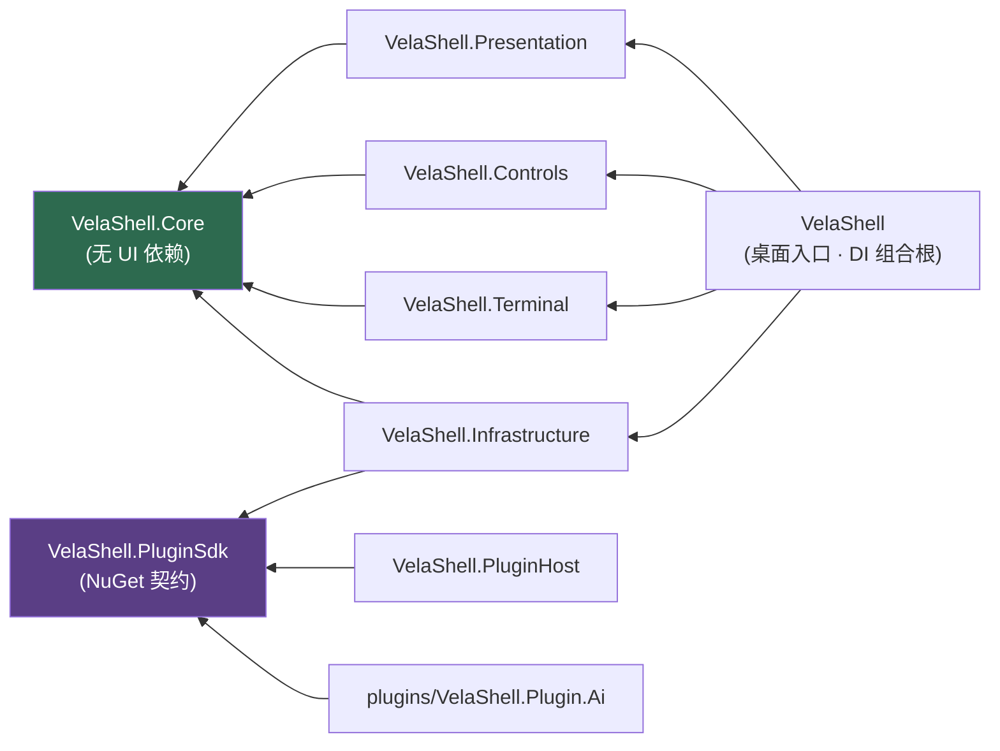

# VelaShell 项目进展与参考文档

> **这份文件记录「已经发生的事」** —— 已完成的工作、当前架构、关键文件索引，以及每一次
> 「为什么这么改」的来龙去脉。它是开发跟进的事实来源。
>
> **还没发生的事在 [`feature-plan.md`](feature-plan.md)** —— 待办、候选特性、已决策不做的清单。
> 两份文件的分工是硬的：一件事做完了，就从 `feature-plan.md` 划掉、在这里补一节；
> 一件事还没做，就不要在这里留 TODO。

## 🏷️ 状态标识

| 标识 | 含义 |
| :---: | --- |
| ✅ | **已完成** —— 已落地、有测试、可验收 |
| 🚧 | **部分完成** —— 主线可用，仍有明确缺口（缺口逐条在 `feature-plan.md`） |
| 📖 | **参考资料** —— 描述当前状态或约定，不是「一件要做的事」 |
| ⏳ | **待办** —— 已确认要做，未开工或进行中 |
| 💡 | **候选** —— 想法已记录，是否要做待评估 |
| ❌ | **确认不做** —— 与架构或产品决策冲突，附理由，别再提 |
| ⚠️ | **已知问题 / 坑** —— 会绊到人的地方 |
| 📄 | **文档待同步** —— 代码已改，velashell-docs 还没跟上 |

## 🗺️ 全文索引

### 一、当前状态与约定（长期有效，随代码更新）

| § | 状态 | 内容 |
| :---: | :---: | --- |
| [1](#-1-技术栈现状) | 📖 | 技术栈现状 —— 运行时、UI 框架、SSH 栈、持久化、打包、测试框架的当前版本 |
| [2](#-2-解决方案分层) | 📖 | 解决方案分层 —— 六个 src 项目 + 插件 + 测试的职责与依赖方向 |
| [3](#-3-自研终端引擎核心替换了坏掉的-avaloniaterminal) | ✅ | 自研 VT 终端引擎 —— 解析器、屏幕模型、仿真器、十种 profile、自绘渲染 |
| [4](#-4-ssh--pty) | ✅ | SSH / PTY —— 桥接循环、实时改窗、失败不崩、连接持久化 |
| [5](#-5-停靠--分屏自研-veladock已替换-dockavalonia) | ✅ | 自研 VelaDock —— 模型层 / 控件层 / 拖拽分屏 |
| [6](#-6-ui--视图与设置) | ✅ | UI / 视图与设置 —— 自绘窗口壳、命令面板、十二页设置中心 |
| [7](#-7-测试已全量迁移到-mstest) | 📖 | 测试 —— 项目构成、规模、MSTest 迁移约定与断言风格 |
| [8](#-8-关键约定--已知坑) | 📖 | ⚠️ 关键约定 / 已知坑 —— SonnetDB、Avalonia 12、构建的几处必读 |

### 二、进展记录（按时间倒推读，最新在最下）

| § | 状态 | 日期 | 内容 |
| :---: | :---: | --- | --- |
| [9](#-9-2026-07-08-完成情况6-次提交514-测试全绿) | ✅ | 2026-07-08 | SonnetDB 存储层、侧边栏快速连接、新建连接弹窗、两步验证、设置窗口九页 |
| [10](#-10-历史待办清单已迁出) | 🚧 | 2026-07-09 | 设置项接线状态复盘（**待办部分已迁往 `feature-plan.md`**） |
| [11](#-11-设计稿分析已记录的问题供实现时对照) | 🚧 | 2026-07-09 | 设计稿与实现的出入清单 |
| [12](#-12-与主流终端工具的功能缺口已迁出) | 🚧 | 2026-07-09 | 对照 Xshell / MobaXterm / Tabby / WindTerm 的缺口（**未完成项已迁往 `feature-plan.md`**） |
| [13](#-13-2026-07-11--07-12-批次设置审计整改--四个新特性) | ✅ | 07-11~12 | 设置审计整改、主机指纹三选项、Gist 云同步、会话录制回放、双许可 |
| [14](#-14-多语言2026-07-12-全量补齐c-09-一并完成) | ✅ | 07-12 | 五语言全量补齐 + 实时切换的两处根因修复 |
| [15](#-15-版本与发布2026-07-12) | ✅ | 07-12 | 版本号单一来源、一键发布脚本、CI/CD |
| [16](#-16-2026-07-13--07-14-批次veladock-合并原生窗口壳终端侧栏安装包工程化) | ✅ | 07-13~14 | VelaDock 落地、自绘标题栏 + Snap Layouts、终端侧栏、集中式包管理 |
| [17](#-17-2026-07-批次ssh-传输层迁移zmodemsftp-双栏) | ✅ | 2026-07 | SSH.NET → Tmds.Ssh、自研 ZMODEM、SFTP 双栏、net10 → net11 |
| [18](#-18-2026-07-24--08-14-批次盘点2026-08-14-补记此前均已落地但未入本文件) | ✅ | 07-24~08-14 | 插件系统 v1 + AI 插件、资源监视、路由追踪、连接诊断、会话导入、FTP、全局代理 |
| [19](#-19-2026-08-30-隧道功能完善计量转发--流量统计--断线自动恢复--端口冲突预检) | ✅ | 08-30 | 隧道：自研计量数据面、流量统计、断线自愈、端口冲突预检 |
| [20](#-20-2026-08-30-消息中心侧边栏铃铛) | ✅ | 08-30 | 消息中心 —— 边界、资讯源契约、快捷跳转、一个死开关 |
| [21](#-21-2026-08-31-补全弹层关不掉315) | ✅ | 08-31 | 命令补全弹层关不掉（#315） |
| [22](#-22-2026-08-31-资讯源默认订阅官方源) | ✅ | 08-31 | 资讯源默认订阅官方源（含 PRIVACY 的如实修订） |
| [23](#-23-2026-08-31-消息中心可拖动加大字号动作靠右用户反馈) | ✅ | 08-31 | 消息中心的可拖动 / 字号 / 动作位置 |
| [24](#-24-2026-08-31-会话树状态卡在连接中321) | ✅ | 08-31 | 会话树状态卡在「连接中」（#321） |
| [25](#-25-2026-08-31-具名主题九套配色--终端配色配对) | ✅ | 08-31 | 具名主题：种子色 + 派生令牌，九套配色与终端配色配对 |
| [26](#-26-2026-08-31-主题命名收敛--跟随主题不再是隐式状态用户反馈) | ✅ | 08-31 | 主题命名收敛，「跟随主题」显式化 |
| [27](#-27-2026-08-31-再补三套主题one-dark--one-light--sakura用户反馈) | ✅ | 08-31 | 再补 One Dark / One Light / Sakura（主题 9 → 12） |
| [28](#-28-2026-08-31-切主题发卡用户反馈感觉有点卡是错觉吗) | ✅ | 08-31 | 切主题发卡：全树重解析 → 一次整格替换 |
| [29](#-29-2026-09-01-命令行装的插件被判收据缺失用户反馈) | ✅ | 09-01 | 命令行装的插件被判「收据缺失」 |
| [30](#-30-2026-09-02-ai-插件自定义供应商也能自动拉模型清单用户反馈) | ✅ | 09-02 | AI：自定义供应商也能自动拉模型清单 |
| [31](#-31-2026-09-02-ai-插件左栏模型列表可折叠用户反馈) | ✅ | 09-02 | AI：左栏模型列表可折叠 |
| [32](#-32-2026-09-02-资源管理器会话树改成摊平的平列表用户反馈) | ✅ | 09-02 | 会话树改成摊平的平列表 |
| [33](#-33-2026-09-02-协作接入im-桥接飞书钉钉telegram企微-对外-mcp-服务端) | ✅ | 09-02 | **协作接入**：IM 桥接（飞书/钉钉/Telegram/企微）+ 对外 MCP 服务端 |
| [34](#-34-2026-09-02-协作接入的配置流程返工用户反馈要填一堆文本框) | ✅ | 09-02 | 协作接入配置流程返工：配对码 / 一键放行 / 当场验 |
| [35](#-35-2026-09-03-插件能按已保存配置自己连一台机器sdk-202-的宿主侧落地) | ✅ | 09-03 | 插件可按已保存配置开会话（SDK 2.0.2 宿主侧） |
| [36](#-36-2026-09-03-agenttoolbox-接上开会话机器人不必再回你先去连一台) | ✅ | 09-03 | AgentToolbox 接上开会话 |
| [37](#-37-2026-09-04-每条连接各配一条认证后执行命令用户反馈) | ✅ | 09-04 | 每条连接各配一条「认证后执行命令」 |
| [38](#-38-2026-09-04-ftp--ftps-可配默认打开路径用户反馈) | ✅ | 09-04 | FTP / FTPS 可配「默认打开路径」 |
| [39](#-39-2026-09-04-文档型连接的树状态关掉一个别把还活着的另一个也熄了用户反馈) | ✅ | 09-04 | 文档型连接的树状态 |
| [40](#-40-2026-09-04-数字输入框删空后别再甩一句转换异常用户反馈) | ✅ | 09-04 | 数字输入框删空后的转换异常 |
| [41](#-41-2026-09-05-对外-mcp-的允许操作的服务器改成勾选与连接列表同一套用户反馈) | ✅ | 09-05 | 对外 MCP 的「允许操作的服务器」改成勾选 |
| [42](#-42-2026-09-06-开一下-sftp-面板别把设置里的开关也给拨了377) | ✅ | 09-06 | 开 SFTP 面板别拨设置开关（#377） |
| [43](#-43-2026-09-06-滚动条悬停别等半秒新建连接别一进来就是粗条378) | ✅ | 09-06 | 滚动条悬停延迟与初始粗条（#378） |
| [44](#-44-2026-09-06-exit-之后不该被自动连回来sftp-通道跟着-ssh-一起收383) | ✅ | 09-06 | `exit` 之后不该自动重连（#383） |
| [45](#-45-2026-09-07-新开标签页时上一个会话的-sftp-面板要立刻收起385) | ✅ | 09-07 | 新开标签立刻收起旧 SFTP 面板（#385） |
| [46](#-46-2026-09-07-连接慢的时候屏幕上必须有东西在动385-反馈) | ✅ | 09-07 | 连接慢时的加载回执（#385 反馈） |
| [47](#-47-2026-09-07-后台任务浮层是块黑砖跟哪套主题都不搭用户反馈) | ✅ | 09-07 | 后台任务浮层吃上主题 |
| [48](#-48-2026-09-07-关掉连接中的标签连接就该停下用户反馈) | ✅ | 09-07 | 关掉「连接中」的标签就该取消握手 |
| [49](#-49-2026-09-07-ci-的-ubuntu-作业偶发失败隔离插件连不上被报成激活超时) | ✅ | 09-07 | CI ubuntu 偶发失败：管道先连、Avalonia 后建 |
| [50](#-50-2026-09-08-ci-的-macos-作业偶发失败背压用例拿固定-sleep-赌线程池已经起来了) | ✅ | 09-08 | CI macOS 偶发失败：背压用例改等条件，不再赌固定 sleep |

## 📈 阶段脉络


## 🧭 当前基线（2026-09-07）

| 项 | 值 |
| --- | --- |
| 最新发布 | `1.5.2`（仓库内 `Directory.Build.props` 的 `0.0.1-dev` 是开发期占位，发版由 Release 标签经 `-p:Version` 覆盖） |
| 测试 | 排除 `DockerIntegration` / `CrossPlatform` 后 **3194 通过**，`dotnet build` 零警告 |
| 测试项目 | 8 个 MSTest 项目 + 1 个 BenchmarkDotNet 项目 |
| CI | `ci.yml` 三平台矩阵（windows / ubuntu / macos），push `main` 与全部 PR 触发 |
| 待办总数 | 见 [`feature-plan.md`](feature-plan.md) |

## 📖 1. 技术栈现状

> 版本号以 `src/Directory.Packages.props`、`tests/Directory.Packages.props`、
> `Directory.Build.props` 与 `global.json` 为准;下表是**当前值的快照**(2026-09-07 复核)。

| 项       | 版本/说明                                                                                                                                            |
| -------- | ---------------------------------------------------------------------------------------------------------------------------------------------------- |
| .NET     | **net11.0**(2026-07 由 net10.0 切入;`global.json` 锁 `11.0.100-preview.7.26381.103` + `rollForward: latestFeature` + `allowPrerelease`。`Directory.Build.props` 对 net11 开启 `EnablePreviewFeatures` + `Features=runtime-async=on`,并 `NoWarn` 掉 CA2252/SYSLIB5007;`LangVersion=preview`) |
| UI 框架  | **Avalonia 12.1.2**(11.x → 12.0.5 → 12.1.0 → 12.1.2)                                                                                                 |
| MVVM     | ReactiveUI 24.2.0 / ReactiveUI.Avalonia 12.1.1                                                                                                       |
| 停靠框架 | **自研 VelaDock**(`src/VelaShell/Docking/`,零第三方依赖;已替换 Dock.Avalonia,见 `velashell-docs zh/host/dock-replacement-plan.md`)                                     |
| SSH/SFTP | **Tmds.Ssh 0.24.0**(全托管 async-first;2026-07 由 SSH.NET 迁入,库类型只在 `Infrastructure/Ssh/` 出现,异常经 `TmdsSshInterop` 翻译为 `VelaSsh*Exception`) |
| FTP      | **FluentFTP 54.2.0**(MIT、零依赖;⚠️ **不要**引 FluentFTP.GnuTLS —— LGPL-2.1-only,与商业授权冲突) |
| 持久化   | **SonnetDB.Core 3.1.0 嵌入式多模型数据库**(`~/.velashell/sonnetdb`;文档集合 + 时序 measurement;旧 JSON 首次运行一次性导入;LiteDB 已移除) |
| IP 归属地 | MaxMind.Db 5.1.0(**只是 mmdb 格式读取库**,数据用的是 DB-IP Lite City / CC BY 4.0) |
| 插件契约 | **VelaShell.PluginSdk 2.0.2**(nuget.org 正式包,**不做工程引用**;版本 pin 在 `src/` 与 `tests/` 两份 `Directory.Packages.props`) |
| 打包     | 便携压缩包(zip / tar.gz,6 RID)+ `.AppImage` / `.deb` / `.rpm` / `.dmg` / MSIX;自研应用内自更新(GitHub Releases `latest.json`;Velopack 已移除 2026-07-17,WiX MSI 已于 `241c2a2` 移除)            |
| 依赖管理 | **集中式**:`src/Directory.Packages.props` 统一 NuGet 版本(`ManagePackageVersionsCentrally`);SourceLink.GitHub 构建期启用。⚠️ `plugins/` 下的自建插件**不走**中央包管理,版本写在各自 csproj |
| 测试     | **MSTest 4.4.0**(已从 xUnit 全量迁移;FluentAssertions 已移除)+ BenchmarkDotNet 0.16.0-preview.1                                                     |
| AI 栈    | Microsoft.Extensions.AI 10.9.0 · ModelContextProtocol.Core 2.2.0 · LiveMarkdown.Avalonia 2.4.0(含 Mermaid / Math / Svg 扩展)—— 均只在 AI 插件里 |

## 📖 2. 解决方案分层

```
src/
├── VelaShell/                桌面入口、DI 组合根、视图(axaml)、App 层 ViewModel、停靠、行为
├── VelaShell.Presentation/   跨层 ViewModel、连接/隧道工作流服务
├── VelaShell.Controls/       自定义控件(LucideIcon)、设计 token、内置 Cascadia Mono 字体
├── VelaShell.Terminal/       ★ 自研 VT 终端引擎 + 自绘渲染控件 + X/Y/ZMODEM 路由
├── VelaShell.Core/           领域模型、抽象契约、数据存储、SSH/SFTP/FTP 封装接口、协议引擎、本地化
├── VelaShell.Infrastructure/ Tmds.Ssh/SFTP/FTP/隧道实现、SonnetDB 持久化、插件管理与能力实现、DI 扩展
└── VelaShell.PluginHost/     隔离插件的宿主进程(命名管道 RPC,只依赖 SDK 契约)
plugins/VelaShell.Plugin.Ai/  第一方 AI 助手插件(同仓构建、同版发布;例外理由见 plugins/README.md)
tests/  8 个 MSTest 项目 + 1 个 BenchmarkDotNet 项目(见 §7)
解决方案文件:仓库根目录 VelaShell.slnx(注意:曾在 src/ 下,VS 打开后移到了根目录)
```

**依赖方向**(Core 不依赖任何 UI 框架,是这条链的底座):



> 箭头指向被依赖方。`PluginHost` 与 `Plugin.Ai` **只**认 SDK 契约,不依赖宿主任何内部程序集 ——
> 这正是插件能跨进程、跨 ALC 而类型仍然同一的前提。

## ✅ 3. 自研终端引擎(核心,替换了坏掉的 AvaloniaTerminal)

彻底移除第三方 `AvaloniaTerminal 1.0.0-alpha.7`,改为手写 VT 引擎。位于 `src/VelaShell.Terminal/Emulation/` 与 `Rendering/`:

- `VtParser.cs` — Paul Williams DEC ANSI 状态机(Ground/Escape/CSI/OSC/DCS…)+ 独立 VT52 语法路径;消费 Unicode 标量,派发到 `IVtActions`。
- `TerminalScreen.cs` + `TerminalRow/TerminalCell/CellFlags/TerminalColor` — 网格、主/备屏、滚动区域(DECSTBM)、scrollback、光标、tab stops。
- `TerminalEmulator.cs` — 仿真器大脑(实现 `IVtActions`):SGR(16/256/truecolor)、光标/擦除/插删行列、模式(DECAWM/DECOM/应用键盘/插入/括号粘贴/鼠标跟踪…)、DEC 线绘字符集、DA/DSR 应答、备用屏。
- `TerminalType.cs` — **vt52/100/102/220/320/340/420/520/xterm/xterm-256color** 十种 profile,各自 TERM 名 + Device Attributes 应答;`FromTermName`/`ToTermName`;**xterm-256color 为默认**。
- `Utf8Sink.cs` — 增量解码,**可配置任意编码**(UTF-8 默认,GBK/Big5 等);`CharWidth.cs` — wcwidth(CJK 双宽);`TerminalPalette.cs` — 256 色 + 设计稿 term-\* 配色;`Charsets.cs` — DEC 线绘映射;`InputEncoder.cs` — 按键→字节(应用光标键、xterm 修饰键、VT52)。
- `Rendering/VelaTerminalControl.cs` — 纯自绘 Avalonia `Control`:glyph 渲染、光标、选区、滚轮回溯、剪贴板(含括号粘贴);**同时实现旧 `ITerminalEmulator` 接口**以无缝接回 `SshTerminalBridge` 与视图。默认网格 120×32;`ApplyLayoutSize` 拒绝 <2 列/行的早期布局(修过"横幅每字一行"bug)。

## ✅ 4. SSH / PTY

- `SshTerminalBridge` 只读循环,**不再向 shell 预写 `\n`**(修过"末行提示符重复"bug)。
- **PTY 实时改窗**:`IShellStreamWrapper.Resize` → Tmds.Ssh `RemoteProcess` 的终端窗口尺寸变更(实现见 `Infrastructure/Ssh/ShellStreamWrapper.cs`);`ITerminalEmulator.PtySizeChanged(cols,rows)` 由控件布局时抛出,`TerminalTabViewModel` 后台线程转发给 PTY。
- **连接失败不崩溃**:`MainWindowViewModel.TryConnectProfileAsync` 捕获认证/网络/超时异常,映射中文提示写入状态栏 + `LastConnectionError`;交互式连接失败弹错误对话框。`Program.cs` 装了 `TaskScheduler.UnobservedTaskException`/`AppDomain.UnhandledException` 兜底。
- **连接持久化**:`ConnectionWorkflowService.SaveProfileAsync`→`SonnetDbSessionRepository`(SonnetDB `session_profiles` 集合,密码 AES-256 加密);`MainWindowViewModel.InitializeAsync` 启动时加载侧栏"最近连接"(SonnetDB `conn_history` 时序)与会话树;侧栏最近项**双击重连**;命令面板也可连。
- **新建连接密码框仅限 ASCII**:`Behaviors/AsciiOnlyInput.cs` 拦截 IME/中文 TextInput + VM setter 剥离粘贴的非 ASCII。

## ✅ 5. 停靠 / 分屏(自研 VelaDock,已替换 Dock.Avalonia)

- **模型层** `Docking/Model/`(纯 INPC,可单测):`DockWorkspace`(结构操作 + `DocumentClosed`/`ActiveDocumentChanged` 事件)、`DockGroup`(标签组,主组不折叠)、`DockSplit`(分栏树)、`DockDocument`;空的次级组自动折叠、单子分栏自动提升。方案与集成面分析见 `velashell-docs zh/host/dock-replacement-plan.md`。
- **控件层** `Docking/Controls/`:`DockWorkspaceControl`(按树渲染 Grid+GridSplitter,star ↔ Proportion 回写;**按文档缓存视图**,切标签复用同一 `TerminalTabView`,取代原 ControlRecycling)、`DockGroupControl`(标签条 + 溢出三连钮 + 标签列表下拉)、`DockTabItem`(标签视觉 + 右键菜单:关闭系列/水平垂直拆分/标签位置)、`DockDragController` + `DockDropOverlay`(拖拽重排插入线、跨组并入、五区拖放分屏,Esc 取消;浮动窗口按产品决策不存在)。
- `Docking/TerminalDocument.cs` 包装 `TerminalTabViewModel`,实现 `IDockViewProvider` 自建视图。
- `MainWindow.axaml` 用 `<dockc:DockWorkspaceControl Workspace="{Binding Layout}" />` 承载;`TabBar`(Ctrl+Tab/W 逻辑集合)与工作区激活态**双向同步**(原 Dock 集成缺 TabBar→文档区半边)。
- `Controls/ReparentingHost.cs` — 沿用:内容宿主挂缓存视图前先从旧父级摘除,保证共享终端控件任一时刻只有一个父级。
- `Themes/DockStyles.axaml` 保留全局通用样式(ToolTip/ContextMenu/MenuFlyout/tab-nav 等);标签视觉内联在 `DockTabItem.axaml`。

## ✅ 6. UI / 视图与设置

- **状态栏跟随激活 Tab**:每个 `TerminalTabViewModel` 携带 `ConnectionSummary/TerminalTypeName/EncodingName`;`UpdateStatusBarForActiveTab` 投影连接串/状态/类型/编码/尺寸/延迟;订阅 `ActiveTerminalTab` 变化 + Dock `ActiveDockableChanged`/`FocusedDockableChanged` → 切换标签/窗格实时更新左下角。
- **窗口壳:自绘无边框标题栏(2026-07-13 定稿)**:主窗 `WindowDecorations="None"`(与全部对话框同款全自绘模式);`Views/TitleBarView` 自绘 36px 标题栏 —— 左 logo+产品名,右 全局功能图标组(搜索/SFTP 文件管理/路由追踪/进程管理器/隧道/命令面板,经命令注册表,**已全部启用**;分屏走命令注册表 `split.horizontal`/`split.vertical`;多会话同步输入已以标签右键 A/B/C/D 频道菜单落地,见 §12-7 —— 2026-08-14 勘误,此前"组同步/广播未实现、禁用半透明"的描述已过时)+ 最小化/最大化/关闭三枚窗口控制按钮(46×35,关闭 hover #E81123)。**并非回退原生 chrome** —— Avalonia 12.x 的 `ExtendClientArea`/`WindowDecorationsElementRole` 托管装饰在 Win32 上会拦截标题栏输入(按钮点不动、窗口拖不动),整套机制不可用故弃用;改以**自绘 + 原生行为补齐**:空白区 `BeginMoveDrag`(原生移动循环,Win11 边缘贴靠有效)、双击切最大化;**Win11 Snap Layouts 经 `MainWindow` 的 WndProc 钩子处理 `HTMAXBUTTON`**(提交 `ce71b32`,`nc-hover` 类由 NC 消息挂/摘);窗口四周 5px + 四角 10px 自绘缩放抓取区(`BeginResizeDrag`,最大化时关闭)。**文字菜单(会话/编辑/…)已整体移除**——与命令面板功能重复(用户决策);随之移除设置里的"显示菜单栏"开关(`ShowMenuBar` 存储字段保留兼容)。
  - **踩坑备忘(自绘壳为何不走 extend/原生 chrome,Avalonia 12.0.5 观察)**:①`VisualRoot as Window` 恒为 null(视觉根是 TopLevelHost),取窗口必须走逻辑树 `FindLogicalAncestorOfType<Window>()`——曾令标题栏按钮/拖动看似"无输入"数小时;②`ExtendClientAreaToDecorationsHint`/`BorderOnly` 的托管装饰(`WindowDrawnDecorations`)会绘制重复标题与含"全屏"的按钮,且 `WindowDecorationsElementRole` 的输入重定向未落地(HT\*BUTTON 点击无动作、User 角色不可点),BorderOnly 还丢 WS_CAPTION(HTCAPTION 拖动与最小/最大化动画失效,issue #21160/#21212)——整套 extend 机制在 12.0.5 不可用,故弃用。
- **命令面板(Ctrl+P / Ctrl+K)**:`ViewModels/CommandPaletteItem.cs`(+Group)、`CommandPaletteViewModel.cs`(模糊子序列搜索、分类分组、上下循环导航、执行/关闭)、`Views/CommandPaletteView.axaml(.cs)`;`MainWindow` 半透明遮罩浮层,条目=最近会话(Enter 连接)+ 全局命令。
- **终端类型/编码设置项**:`AppSettings.TerminalType`(默认 xterm-256color)/`TerminalEncoding`(默认 UTF-8);`SettingsViewModel`/`SettingsView` 两个下拉;`Program.cs` 注册 `CodePagesEncodingProvider`(GBK/Big5);连接时 `MainWindowViewModel.ConfigureTerminal` 应用到 PTY 的 TERM 与控件。`ISettingsService`/`JsonDataStore` 已入 DI。
- 快捷命令面板、隧道管理面板此前已有完整 View+VM。
- **设置窗口现为 12 页**(2026-08-14,840×740):常规 / 外观 / 终端 / 密钥管理 / 快捷键参考(纯展示) / 文件传输 / 安全审计(含会话录制与已信任主机) / **网络代理(2026-08-14 新增,见 §12-10)** / 代码片段 / 云同步 / 关于(含贡献者) / 支持与捐赠;整改详情见 §13 与 `velashell-docs zh/host/settings-audit.md`。
- **终端配色跟随主题**:未自定义时 暗=Dracula / 亮=Solarized Light 实时切换;配色方案下拉的“(默认)”后缀与选中项随主题动态联动,选默认方案 = 恢复出厂跟随态。

## 📖 7. 测试(已全量迁移到 MSTest)

**当前基线(2026-09-07)**:排除 `DockerIntegration` / `CrossPlatform` 分类后 **3194 通过 / 0 失败**,`dotnet build` 零警告。历史刻度:2026-07-12 ≈606 → 2026-08-14 1657 → 2026-09-07 3194。

| 测试项目 | 覆盖 |
| --- | --- |
| `VelaShell.Core.Tests` | 领域模型、SFTP 与传输队列、隧道与计量转发、云同步加密、ZMODEM / XMODEM / YMODEM 协议(期望值按 lrzsz 与 ymodem.txt 手工构造的互操作回归) |
| `VelaShell.Terminal.Tests` | VT 解析、终端仿真、编码、字符宽度、侧栏折叠,以及 ZMODEM 自动接管与 X / YMODEM 手动接管的路由 |
| `VelaShell.Terminal.RenderTests` | 字形绘制的**像素级**回归(挂 Skia 软件后端做真实光栅化) |
| `VelaShell.Presentation.Tests` | ViewModel 工作流与命令 |
| `VelaShell.Infrastructure.Tests` | SonnetDB 持久化、凭据加密、ConPTY、SSH 密钥管理、插件管理与跨进程 RPC |
| `VelaShell.Controls.Tests` | 自定义控件行为、主题令牌与样式守门 |
| `VelaShell.Plugin.Ai.Tests` | AI 插件:审批闸门、能力桥接、设置与机密存取、会话历史、`@` 引用语法、协作接入与面板 headless 交互 |
| `VelaShell.Tests` | 窗口级视图模型、身份验证流程、插件面板与主题令牌、集成与冒烟测试 |
| `VelaShell.Benchmarks` | BenchmarkDotNet 吞吐与分配基准。**不进 CI 门禁** —— BDN 结果受机器负载影响太大,当门禁只会天天误报;用途是在**同一台机器上**比较改动前后 |

- 已移除 `xunit`/`xunit.v3`/`FluentAssertions`/`Avalonia.Headless.XUnit`;改用 `MSTest.TestFramework`+`MSTest.TestAdapter` 4.4.0,全局 `using Microsoft.VisualStudio.TestTools.UnitTesting`。
- **CI 门禁**(`.github/workflows/ci.yml`,2026-09 落地):push `main` 与全部 PR 触发,windows / ubuntu / macos 三平台矩阵,Debug 构建 + 全量测试 + `-warnaserror`。几处刻意的选择:用 Debug(强名签名只在 Release 打开,fork 与 Dependabot 的 PR 拿不到仓库 secret);排除 `DockerIntegration` / `CrossPlatform`;**本仓检出到 `VelaShell/` 子目录**并把 `velashell-docs` 并排检出 —— 快捷键总表与《快捷键参考》的比对用例才找得到对方。
- 转换约定(供新增测试参考):`[Fact]`→`[TestMethod]`;`[Theory]`+`[InlineData]`→`[DataTestMethod]`+`[DataRow]`;`[Trait("Category","X")]`→`[TestCategory("X")]`;每类 `[TestClass]`;`ITestOutputHelper`→`public TestContext TestContext {get;set;}`;`IAsyncLifetime`→`[TestInitialize]`/`[TestCleanup]`。
- 断言:MSTest `Assert.AreEqual(EXPECTED, ACTUAL)`(期望在前);异常用 `Assert.ThrowsExactly`/`Assert.ThrowsExactlyAsync`;字符串用 `StringAssert`;序列用 `CollectionAssert`。
- 注意点:`long`/`uint` 期望值要带后缀(`AreEqual(object,object)` 类型严格);`bool?` 用 `x == true`;非记录类型对象等价用 JSON 序列化比较。
- 早期约定「测试不渲染 Avalonia」**已放宽**:`Terminal.Tests` 与 `VelaShell.Tests` 现引 `Avalonia.Headless`,`VelaShell.Tests/Views/` 下有一批 headless 视图与像素回归用例(`VelaHeadlessApp` 为其宿主)。纯逻辑用例仍只 `new` 控件、不起 UI。`VelaShell.Tests/ModuleInit.cs` 用 `[ModuleInitializer]` 初始化 ReactiveUI 调度器,保留。
- 集成测试(`SshIntegrationTests` 需 Docker+SSH 服务器、`CrossPlatformPublishTests` 需 `VELASHELL_PUBLISH_TESTS=1`)按环境早退跳过。

## 📖 8. 关键约定 / 已知坑

- 构建/测试用根目录 `VelaShell.slnx`。运行 App 后 DLL 被占用会导致构建报"文件被锁定"——先停掉运行实例。
- Bash 工具用 Git Bash;不要用 `Read`/`Grep` 直接读 `.pen`(加密,只能走 pencil MCP)。
- 记忆索引见 `C:\Users\Joe\.claude\projects\G--VelaShell\memory\`(terminal-engine、docking、sonnetdb-storage、connect-flow)。
- SonnetDB 要点:`Tsdb.Open(new TsdbOptions{RootDirectory})`;文档 `db.Documents.Open(name)` 的 Upsert/Get/Scan/Delete;时序 `db.Write(Point.Create(...))` + `SqlExecutor.Execute` SELECT;`FieldType` 在 `SonnetDB.Storage.Format`(是 `Int64` 不是 `Long`,写值用 `FieldValue.FromLong`);**时序 tag 值不允许空串**(临时连接不写 profile_id);**SQL 方言:`ORDER BY time` 要求 SELECT 列表包含 time 列**;`DELETE FROM measurement` 可能不受支持(录制存储以 drop+回写压缩兜底回收);仓储加密必须写副本、不可原地改传入的 profile(内存明文用于活动连接)。
- Avalonia 12 坑:`Run.Text` 绑定会在卸载等时机回写(展示转换器 `ConvertBack` 返回 `BindingOperations.DoNothing`、绑定标 `Mode=OneWay`);ComboBox 的 `SelectedItem` 在 ItemsSource 为空/Clear 时会把 null 写回数据源(载入顺序先填列表再回填选中,见默认密钥修复);XML 属性值中的换行被规范化为空格(多行文案拆多个 TextBlock)。

## ✅ 9. 2026-07-08 完成情况(6 次提交,514 测试全绿)

按"每部分一次提交"推进,提交顺序即依赖顺序:

1. **`2a270e5` feat(storage) SonnetDB 存储层** —— 持久化全面切换嵌入式 SonnetDB。
   - `SonnetDbEngine`(单例,退出 Dispose 刷 WAL):文档集合 `session_groups` / `session_profiles`($.groupId 索引)/ `app_config`(settings/state 单文档)/ `known_hosts` / `ui_config` / `quick_commands`;时序 measurement `conn_history`(最近连接)/ `audit_log`(审计)。
   - 新接口:`IRecentConnectionService`、`IAuditLogService`、`IAppDataStore`(通用 JSON 文档存取)、`ISecretProtector`。
   - `AesSecretProtector`:AES-256-GCM + 本地密钥文件 `secret.key`,密文前缀 `enc1:`,历史明文读取兼容。
   - 旧 JSON(sessions/settings/state/known_hosts/quick-commands)首次运行导入后改名 `.migrated.bak`;LiteDB 包移除。
2. **`10e9e70` fix(ui) 侧边栏快速连接区** —— history 图标修正并接刷新;移除输入框;最近连接改"名称-分组 + 相对时间"两行(user@host:port 移入悬停提示);数据源 = SonnetDB 连接历史(去重、倒序、上限 10),重启不丢;双击按 ProfileId 解析档案重连。
3. **`1e1fa6b` feat(ui) 新建连接弹窗** —— 按设计 oAHna 重构(自绘标题栏/协议标签页/记住密码/会话分组/高级选项/测试/保存/连接)。保存只落库、连接落库+建会话;`SessionProfile.RememberPassword=false` 时凭据不持久化。**修复仓储加密副作用 bug**(原地加密会把内存明文密码改成密文导致重连认证失败,改为写副本)。会话树按 GroupId 接线(含"未分组"节点、双击/右键连接、右键编辑、保存后刷新);Ctrl+N 打开弹窗。
4. **`f5405f5` feat(auth) 两步登录验证** —— `AuthenticationDialogView` 按设计 oNZIM/twD13(第 1 步用户名+指纹,第 2 步密码/证书/密钥分段);凭据缺失时 `TryConnectProfileAsync` 经 `InteractiveAuthenticator` 弹窗,认证失败自动重试(≤3 次);SSH 握手接主机密钥 **TOFU**(首次记录指纹到 known_hosts,指纹变化拒绝连接);连接成败写 `audit_log`。
5. **`3ef6bed` docs** —— architecture.md / 架构设计.md / 隧道功能规划.md 持久化方案全部改为 SonnetDB 并补数据结构说明。
6. **`2812048` feat(settings) 设置窗口九页** —— 自绘对话框 + 图标导航(常规/外观/终端/密钥管理/快捷键/文件传输/安全审计/代码片段/关于),Ctrl+, / 侧边栏齿轮 / 命令面板均可打开;`AppSettings` 扩展分组选项(General/Appearance/TerminalBehavior/Transfer/Security/Keys)嵌套持久化;密钥管理页为真实功能(`SshKeyService`:枚举 ~/.ssh、类型+SHA256 指纹解析、生成 RSA、导入/删除/复制公钥);代码片段页复用 `quick_commands`;常规页清除历史/配置导入导出可用。

此前 §9 的"设置子页补全"与"安全(密码明文)"两大项**已完成**;会话树已接线。

## 🚧 10. 历史待办清单（已迁出）

> **2026-09-07 重整**：本节原本是 2026-07-09 复盘留下的待办台账，混着「已完成」「待办」
> 「确认不做」三类东西，越滚越长也越来越难读。现在**待办部分整体迁往
> [`feature-plan.md`](feature-plan.md)**；这里只留两样东西 —— 当年**做完了什么**，
> 以及**确认不做的那几条及其理由**。

### ✅ A. 设置项接线（2026-07-09 那一轮全量排查后完成）

一轮把下面这些从「存了但不生效」变成真的生效：

- **终端行为全套** —— 光标样式 / 闪烁、行高、选中即复制、右键粘贴、复制去尾空格、双击选词、
  多行粘贴确认、Ctrl+C 复制、滚动行为、Bell 三模式 + 标签闪烁、IME 开关
- **外观** —— 终端四色 + ANSI16 稀疏覆盖、窗口透明度、菜单栏显隐、侧边栏位置、启动窗口状态、UI 字体 / 字号
- **常规** —— 默认端口、连接超时 / 心跳、自动重连 + 间隔 + 重试、关闭前确认、断开提醒 + 声音、
  开机自启、托盘、恢复会话、会话日志 + 保留清理、全局记住密码
- **文件传输** —— 远程初始目录、下载目录、显示隐藏文件、最大并发、双向冲突策略、保留时间戳、
  完成通知、带宽限速、传输日志 + 保留清理
- **安全** —— 首次指纹人工确认、指纹变更阻断 / 人工裁决、告警通道（应用内 + Webhook + 审计）
- **密钥** —— 默认认证密钥

关键接线点：`MainWindowViewModel.ApplyLiveTerminalSettings` / `MainWindow.ApplyWindowAppearance+OnClosing` /
`InfrastructureServiceCollectionExtensions`（超时 / 心跳 / 指纹策略）/ `SftpService`（带宽 / 时间戳）/
`FileBrowserViewModel.TransferOptions`。

同批调整的默认值：LineHeight 1.2 → 1.0、ScrollOnOutput true → false、CopyOnSelect false → true、
RemoteInitialPath `"/home/user"` → `""`（空 = 家目录）。

✅ **上传方向冲突策略**（2026-07-10）：上传前 `ISftpService.ExistsAsync` stat 远端同名文件，
按策略询问（覆盖 / 跳过）/ 覆盖 / 跳过 / 重命名（`file (1).txt` 取首个可用名）；
「覆盖」策略下不额外 stat，沿用 SFTP 覆盖语义；编辑器保存回传属**有意覆盖**，不走冲突检查。

✅ **断点续传**（2026-07）：`SftpService` 双向按偏移续写 + 尾部 64KB 核实起点。
✅ **临时文件清理**：`FileBrowserViewModel.CleanupPartialTargetAsync`，仅 `ResumeEnabled` 关闭时生效。
✅ **会话录制**（2026-07-12，见 §13）。
✅ **启动时自动检查更新**：`CheckUpdatesOnStartup` 既有运行时消费者
（`MainWindowViewModel.RefreshNotificationSourcesAsync:1591`，经消息中心投递「有可用更新」），
也有设置页开关（`Settings/GeneralSettingsPage.axaml:42-45`）。

> ⏳ **仍未闭合的设置项**（主密码、Agent 自动加载、自动下载更新、传输失败重试、标签栏位置）
> 见 [`feature-plan.md` 的 P0 表](feature-plan.md#-p0--存了但不生效的开关)。

### ❌ B. 确认不做（2026-07-10 定，已从设置界面与 `AppSettings` 移除）

连字 Ligatures、自适应标题栏颜色、系统通知 Toast、输入脱敏、自定义键位、运行时热切终端类型。
**逐条理由见 [`feature-plan.md` 的「确认不做」表](feature-plan.md#-确认不做)**，
以及 `velashell-docs` 的 `zh/host/架构设计.md` §11。

### ✅ C. 那一轮顺手清掉的技术债

- ✅ QuickConnect 组件已删除（View / VM / SidebarViewModel 引用与测试同步清理）。
- ✅ **SonnetDB 锁粒度：决定保留全局信号量** —— 文档集合与时序共享同一 Tsdb 实例（同一 WAL /
  存储引擎），SonnetDB 未承诺内部线程安全，按集合分锁有并发损坏风险。真正的瓶颈是**设置读热点**
  （每次连接、每个传输文件都读一次），已在 `SonnetDbSettingsService` 加 settings JSON 缓存
  （缓存序列化文本、按次反序列化，调用方语义不变），读路径不再进锁 / 碰盘。
- ✅ 硬编码 `#0A0E14` 前景抽成 `PulseAccentForeground` 令牌；用户自定义强调色时
  `App.ApplyAccent` 按亮度自动配对前景。
- ✅ `Ctrl+T` 改为打开新建连接（与 Ctrl+N 一致；旧绑定往已不显示的 TabBar 塞空标签）。
- ✅ **OSC 52**（远端写剪贴板，tmux/vim yank；**只支持写方向**，查询 `?` 一律不应答防剪贴板泄露，
  1MB 上限）与 **DECRQSS**（应答 SGR `m` 与 DECSTBM `r`，其余回 `DCS 0 $ r`）已实现，含单测。
  **顺带修掉一个预存在的解析器 bug**：全局「ESC 重启序列」会把以 ST（`ESC \`）结尾的 OSC/DCS
  整段丢弃（只有 BEL 结尾才能用），现已在 ESC 分支先分发在途载荷，补了回归测试。
- ✅ **CJK 回退视为已解决**：字体链（Cascadia Mono → JetBrains Mono → Consolas → Microsoft YaHei →
  monospace）+ 渲染器逐格 FormattedText 回退路径已覆盖双宽字形。

## 🚧 11. 设计稿分析已记录的问题（供实现时对照）

| 状态 | 项 | 说明 |
| :---: | --- | --- |
| ✅ | 设置-终端 缺终端类型 / 编码选择器 | 已在代码补上 |
| ✅ | `term-*` 只定义 8 个 ANSI 色，无 bright/256 | 引擎侧已补全；2026-08-31 起并入具名主题的 16 套终端配色（§25 ~ §27） |
| ✅ | 未指定 CJK / 双宽回退字体 | 字体链 + 逐格回退路径已覆盖（§10-C） |
| ✅ | 终端交互（光标样式、选区色、终端内搜索、分屏）设计未建模 | 四项均已实现；搜索见 `MainWindowViewModel.TerminalSearchRequested:1616` |
| ✅ | 亮色主题 `bg-terminal=#1E1E2E` 仍为深色（疑似有意） | 具名主题落地后不再成立 —— 每套亮色主题各自带配套终端配色（§25） |
| ⏳ | Logo 有一个 `enabled:false` 残留图标 | 小项，见 [`feature-plan.md`](feature-plan.md#-终端与协议) |
| ⏳ | 文件列表「修改时间」列无固定宽度 | 同上 |

## 🚧 12. 与主流终端工具的功能缺口（已迁出）

> 2026-07-09 对照 Xshell / MobaXterm / Tabby / WindTerm 做的缺口分析，共 20 条。
> **2026-09-07 重整**：15 条已完成、3 条确认不做的**结论留在这里**（下表），
> **未完成的 5 条迁往 [`feature-plan.md`](feature-plan.md)**。

### P1 —— 日常使用高频

| # | 状态 | 项 | 落点 |
| :---: | :---: | --- | --- |
| 1 | ✅ | **本地终端标签** | `Infrastructure/Pty/ConPtyShellStream.cs`（CreatePseudoConsole + 双匿名管道）实现 `IShellStreamWrapper`，复用既有 桥 → VT 引擎 → 自绘控件 管线；`Services/LocalShellCatalog.cs` 探测 pwsh / Windows PowerShell / CMD / WSL / Git Bash。本地标签强制 UTF-8、**不自动重连**（exit 是用户意图）。⚠️ **仅 Windows**（`DetectShells` 在非 Windows 直接返回空） |
| 2 | ✅ | **SSH 跳板机（ProxyJump）** | `SessionProfile.JumpHostProfileId` 引用另一条已保存配置作跳板，链式即多段跳（≤5 跳、带环检测，`ConnectionWorkflowService.BuildChainAsync`）；**指纹按各跳逻辑主机校验**，绝不按 127.0.0.1 记录。Tmds.Ssh 迁移后改用库原生 `SshProxy` 链（`BuildProxyChain`），手工建链的 `JumpChainSshClientWrapper` 已删除 |
| 3 | ✅ | **保存的会话全部进命令面板** | 「最近连接」快速通道 + 「会话」全量类目（分组徽章、按名排序），两组按 ProfileId 去重 |
| 4 | ✅ | **导出终端缓冲区** | 命令面板 `terminal.export`：有选区导出选区、否则全量（scrollback + 屏幕，逐行去尾空格、截掉尾部空行） |
| 5 | ✅ | **配色方案预设** | 内置 16 套（`Core/Models/TerminalColorScheme.cs`），与 12 套具名界面主题成对联动（§25 ~ §27） |
| 6 | ✅ | **克隆会话** | `session.clone`（Ctrl+Shift+N / 命令面板） |

### P2 —— 进阶运维能力

| # | 状态 | 项 | 落点 |
| :---: | :---: | --- | --- |
| 7 | ✅ | **多会话同步输入** | `Services/SyncInputCoordinator.cs` 对等频道模型（标签右键 A/B/C/D 频道菜单）。挂钩 `TypedInput`（**仅用户产生的输入**，不含协议自动应答），直写同频道其他标签的 PTY —— 走桥的 `SendRaw`，不经接收端输入事件，因此既不回环也不驱动接收端的补全弹层 |
| 8 | ✅ | **ZMODEM（rz/sz）** | **自研协议引擎**（未走 trzsz）：`Core/ZModem/` 传输无关引擎 + `Terminal/ZModem/` 自动接管路由。后续补齐 XMODEM / YMODEM（`Core/XYModem/`）。⚠️ **测试教训**：互操作期望值必须按 lrzsz `zm.c`/`zmodem.h` **手工构造**（见 `LrzszInteropTests`）—— 用自家编码器生成期望值时，编解码同时错也照样全绿，CRC 双重增广的 bug 当初正是这么溜进来的 |
| 9 | ⏳ | SSH config 导入 | 见 [`feature-plan.md`](feature-plan.md#-会话与工作区) —— 导入框架已就绪，追加一行 DI 即可 |
| 10 | ✅ | **连接代理** | 2026-08-14 落地为**应用级全局代理**（非按会话）。统一抽象 `Core/Net/IProxyResolver`（唯一代理出口，新功能接网络一律消费它）+ `Infrastructure/Net/`（自研 HTTP CONNECT / SOCKS5 握手、环回中继、进程级 `HttpClient.DefaultProxy`）。三条通道：SSH 走环回中继、FTP 走 FluentFTP 代理子类（代理下强制被动模式）、全部 HttpClient 由 `VelaWebProxy.Install` 接管。**代理配置不完整时抛错拒连，绝不静默直连**。ICMP 与连接诊断的裸 TCP **有意不走代理** |
| 11 | ⏳ | 防空闲断开（Anti-idle） | 见 [`feature-plan.md`](feature-plan.md#-终端与协议) |
| 12 | ✅ | **known_hosts 管理界面** | 设置 → 安全审计 → 已信任主机（列出 / 删除 / 截图防泄露地址脱敏）。⏳ 导出未做 |
| 13 | ✅ | **会话标签自定义颜色** | `b9ae31f`(2026-09-06)落地:`TerminalOverrides.TabColor` → `ConnectionAccent.cs:66` 优先读它,连接对话框可填;留空才回退到按 `profileId` 哈希取色。⚠️ 本节 2026-09-05 那次「复核订正」写的是「用户不可选」,**次日就被这次提交推翻了** —— 复核结论也会过期,写现状要给证据(文件行号),再新的证据出现就得改。⏳ 图标仍未做 |

### P3 —— 锦上添花

| # | 状态 | 项 | 落点 |
| :---: | :---: | --- | --- |
| 14 | ✅ | **SFTP 本地 / 远程双栏** | 独立 SFTP 标签（`ConnectionType.SFTP` + `Docking/SftpDocument`），左 `LocalFilePaneView` / 右 `FileBrowserView`，双栏互拖与 OS → 远端拖放。🚧 与 WinSCP 的剩余差距见 [`feature-plan.md`](feature-plan.md#-文件传输) |
| 15 | ⏳ | 用户自定义关键字高亮规则 | 见 [`feature-plan.md`](feature-plan.md#-数据与可观测)。当前 7 条为编译期硬编码 |
| 16 | ✅ | **命令自动补全 / 历史建议** | `CommandSuggestionProvider` 合并本地命令历史与快捷命令。⚠️ `InteractivePromptDetector` 在「程序在提问」的行上让它**闭嘴** —— sudo 密码提示、apt 的 `[Y/n]`、编号选单、REPL 提示符，把一整条 shell 历史塞进程序的输入里有害无益 |
| 17 | ✅ | **OSC 52 剪贴板** | 见 §10-C（只支持写方向，1MB 上限） |
| 18 | ⏳ | 触发器 / 自动应答 | 见 [`feature-plan.md`](feature-plan.md#-会话与工作区) |
| 19 | ❌ | **多窗口** | 与单实例 / 唯一组合根 / 无浮动窗口三处硬冲突，理由见 [`feature-plan.md`](feature-plan.md#-确认不做)。多屏需求由分屏承担 |
| 20 | ❌ / ⏳ | **Mosh ❌ / SSH 证书认证 ⏳** | Mosh 确认不做（需并行维护第二套 UDP 传输与终端预测引擎）；证书认证待评估 Tmds.Ssh 支持度。均见 [`feature-plan.md`](feature-plan.md#-确认不做) |

### ✅ 同期落地、不在原清单里的

Telnet（2026-08-17，**以插件形式**：宿主为此新增「终端协议」能力 `IProtocolTerminal`，
插件会话经 `PluginTerminalShellStream` 适配成 `IShellStreamWrapper`，复用既有的桥 / VT 引擎 /
ZModem / 重连 —— 调研文档里那套「协议泛化」改造整套免掉）、**串口**（同一能力做成 `velashell.serial`
插件）、**Redis / S3**（同样走插件），四者源码均在
[velashell-plugins](https://github.com/VelaShellLabs/velashell-plugins)。
**FTP / FTPS**（2026-08-13）走宿主内置，见 §18-N。

## ✅ 13. 2026-07-11 ~ 07-12 批次(设置审计整改 + 四个新特性)

**A. 设置审计整改**(台账与逐项状态见 `velashell-docs zh/host/settings-audit.md`,共三批):
BellMode/VisualBell 合并(旧配置经 `AppSettings.Normalize()` 迁移)、自动重连次数统一、默认值来源统一、显示隐藏文件写回持久化、恢复默认/清除历史加确认、误导性文案与九组相似命名修正、12+ 个未实现禁用控件隐藏或删除、选项类统一 `ObservableOptions`(INPC,从属设置条件显隐真正生效)、快捷键页与真实绑定核对重建(自定义键位确认不做)。

**B. 主机指纹三选项确认 + 已信任主机管理**:
`IHostKeyPrompt.DecideAsync` 三态(永久信任=写 known_hosts / 仅本次信任=进程内 `HostTrustOnceCache` 不落盘 / 取消=fail-closed);SFTP 独立通道补主机指纹校验(修复默认信任任意指纹的 MITM 缺口);安全审计页新增"已信任主机"列表(删除即可重触发首次确认;地址默认脱敏防截图泄露)。

**C. GitHub Gist 云同步**(`Core/Sync` + `Infrastructure/Sync` + 设置"云同步"页):
同步范围 = 应用设置(剔除设备本地字段)+ 连接配置(含分组与隧道,upsert 合并不删本地)+ 代码片段;单文件 secret Gist,版本管理复用 Gist 原生 revision(列表含来源设备,可恢复任意版本);可选 PBKDF2-SHA256(200k)+AES-256-GCM 端到端加密(未启用时凭据绝不上传);智能方向判定(本地改动标记 × 远端 revision,双端都改按较新者胜);自动同步 = 启动拉取 + 设置保存防抖推送;PAT/口令经 `ISecretProtector` 机器绑定加密,永不进载荷。

**D. 会话录制与回放**(设计 `NceE6`;`Core/Recording` + `SonnetDbSessionRecordingStore` + `RecordingPlayerView`):
录制 = 桥输出 600ms/64KB 缓冲成块写 SonnetDB 时序 measurement `session_recording_chunks`(元数据在文档集合 `recordings`);开关 `Security.RecordProductionSessions`(安全审计页,对新连接生效),保留天数随会话日志;回放中心 = 列表 + 只读终端按时间轴重放 + seek(重置瞬时重放)+ 1x/2x/4x + 跳过空闲 + 删除 + 导出 asciicast v2。输入脱敏确认不做(仅录输出流)。

**E. 支持与捐赠页**(设置导航末位):支付宝/微信/Wise(链接可点击+复制),收款码已裁剪入 `Assets/`;文案强调 PR/Issue 是最好的支持。

**F. 后续增量(同批小项)**:

- 回放中心:窗口 1200×820 + 无边框缩放(右下手柄/最大化/双击标题栏)、列表选中态改主题令牌、播完点播放自动从头、倍速扩至 1x~16x;录制保留随日志天数清理 + DELETE 不可用时 drop+回写压缩兜底(防孤儿数据块磁盘只增不减)。
- **双许可落地**:MIT → AGPL-3.0(`LICENSE` 官方全文)+ 商业授权(`LICENSE-COMMERCIAL.md`,联系 dygood@outlook.com,含轻量 CLA 条款);README/关于页同步正版声明(名称与 Logo 不在开源授权范围);商标注册与历史贡献者重许可确认为线下待办。
- 关于页**贡献者区**(设计 kGwqX,仅头像+名称):真实提交者(joesdu/tsaiggo),GitHub 头像异步加载(失败回退首字母),点击跳转主页。
- **终端配色随主题联动**:亮色默认调色板由 Alucard 换为 Solarized Light;配色方案下拉“(默认)”标注与跟随态选中项随主题动态切换(选默认方案 = 恢复出厂跟随态;显式选其它方案 = 钉住)。已知边界:覆盖模型以 Dracula 色值为出厂基准,亮色下无法“钉住 Dracula”(选它即回跟随态)。

**已知遗留**:QuickCommands 相关 12 个测试在用户某次提交后失败(测试期望 11 个内置命令含 htop,`QuickCommandCatalog` 只有 8 个,测试与目录不同步,与上述改动无关)。

## ✅ 14. 多语言(2026-07-12 全量补齐,C-09 一并完成)

- **五语言**:简体中文 / English / 繁體中文 / 日本語 / 한국어。资源按 .NET 标准命名:`Strings.resx` 为英文默认(`NeutralLanguage=en`),卫星 `zh-Hans/zh-Hant/ja/ko`(脚本中性文化,zh-CN/zh-SG→Hans、zh-TW/zh-HK→Hant 沿标准回退链自动命中);2026-07-12 首次补齐时为 867 键,随后续特性增长,**现为 938 键**五语齐平(键集平价有测试守护)。
- **全仓提取**:~900 处硬编码文案迁入 resx —— axaml 用 `{loc:Localize Key}`(实时切换),C# 动态文案用 `Strings.Get/Format`(占位符 {0}/{1})。不翻译:协议/提示符匹配串(密码提示关键词、"$ " 等)、TERM/编码名、shell 命令文本、日志。
- **实时切换的两处根因修复**:①`LocalizationService` 自持目标文化 —— 线程文化随 ExecutionContext 回卷、且 UI 线程显式设置过文化后 DefaultThreadCurrentUICulture 失效,均不可靠;②`LocalizeExtension` 改绑按键缓存的 `LocalizedText` 条目**普通属性**(Avalonia 12 绑定引擎不响应 `Item[]` 索引器变更通知),换语言逐条目发标准属性通知。语言选择:设置 → 常规 → 语言(5 项,存储值 zh-CN/en/zh-TW/ja/ko)。
- **测试守护**:键集平价(五文件同键、双向)+ 具体文化回退链(zh-SG/zh-HK/ja-JP)用例,见 `LocalizationTests`。已知边界:VM 构造时求值的标签(设置导航、快捷键参考页、状态栏初值、内置快捷命令描述)换语言后需重开窗口/重启刷新。

## ✅ 15. 版本与发布(2026-07-12)

- **版本号单一来源**:`Directory.Build.props` 的 `<Version>`(当前 `0.0.1-dev`;`AssemblyVersion`/`FileVersion` 另给不带后缀的 `0.0.1`,并关掉 `IncludeSourceRevisionInInformationalVersion` 以免 `+sha` 后缀);关于页版本运行时读程序集 InformationalVersion,不再硬编码;发版由 Release 标签经 `-p:Version` 覆盖。
- **本地发布**:`pwsh scripts/publish-all.ps1` → `publish/` 产出 6 个包(2026-07-17 起,`-noruntime` 变体已裁撤):Windows x64/arm64 便携 zip,macOS 与 Linux x64/arm64 tar.gz(全部含运行时;2026-08-12 起摊开发布,不再单文件 —— 隔离插件的 `VelaShell.PluginHost` 需要磁盘上的真实可执行体,换版随之从"移动"改为"复制"),外加自更新清单 `latest.json` 与 `SHA256SUMS.txt`。
- **CI/CD**:`.github/workflows/release.yml` —— GitHub 页面发布 Release(publish)即触发:windows/macos/ubuntu 三原生 runner 并行构建同一套 6 产物(版本号取 Release 标签,`-p:Version` 覆盖,发版无需改代码),汇总生成 `SHA256SUMS.txt` 与 `latest.json`(应用内自更新清单:版本/标签/各 RID 产物名+sha256+大小),经 `gh release upload` 全部附加到该 Release。macOS 产物未签名/未公证(需 Apple 证书后续补);Linux 为便携 tar.gz(.deb/AppImage 为后续扩展点)。
- **Windows 安装包(2026-07-13;2026-07-17 调整)**:Velopack `Setup.exe` 链路已整体移除——其默认安装目录曾与当时的 `%LocalAppData%\VelaShell` 应用数据根冲突,卸载会清空用户数据,且自打的便携 zip 无法经 Velopack 更新。现行数据根已改为 `~/.velashell`;分发方案为便携 zip + 自研应用内自更新(任意目录原地换版)。WiX v4 MSI 定义(`installer/VelaShell.wxs`,x64/arm64,`WixUI_InstallDir` 中文向导支持自定义安装目录,静默安装 `msiexec /i VelaShell.msi /qn INSTALLFOLDER="D:\Tools\VelaShell"`;`ProductVersion` 须为纯数字 x.y.z,`UpgradeCode` 固定走 MajorUpgrade)保留可手动构建,不再随 CI 发布;MSI 装进 Program Files 后应用内更新按"目录不可写"如实提示手动下载。

## ✅ 16. 2026-07-13 ~ 07-14 批次(VelaDock 合并、原生窗口壳、终端侧栏、安装包、工程化)

> 本批以数个独立 PR 合入 `dev`/`main`(#3 replacedock、#5、#6)。多为架构/工程化收尾与使用体验修正。

**A. 自研 VelaDock 正式落地(PR #3)**:详见 §5 与 `velashell-docs zh/host/dock-replacement-plan.md`(已补「已完成」横幅)。模型/控件/拖拽全套自研替换 `Dock.Avalonia`,零第三方停靠依赖;拆分对所有标签组一致生效(单标签次级组也可水平/垂直拆分);点击窗格内容区即激活该组文档(SFTP 面板与状态栏随焦点窗格切换)。关于页开源许可列表已删 Dock.Avalonia 条目。

**B. 主窗自绘无边框标题栏 + 原生行为补齐(体验优化)**:详见 §6。主窗保持 `WindowDecorations="None"` 全自绘(`TitleBarView` 含 logo/名称 + 功能图标组 + 自绘 min/max/close),**未走原生 chrome**(extend/角色重定向在 Win32 不可用);改以 `BeginMoveDrag` 原生移动循环 + **WndProc 钩子处理 `HTMAXBUTTON` 实现 Win11 Snap Layouts**(`ce71b32`);并修 `c12a8ff`(Avalonia 12 `VisualRoot` 非 `Window`,取窗口须走逻辑树 `FindLogicalAncestorOfType<Window>`)。中途 `7580052` 试过原生 chrome 集成,因保真问题走回自绘+WndProc 方案。对话框同为自绘无边框。

**C. 终端行号 / 时间侧栏(gutter)**:`Terminal/Rendering/GutterLayout.cs` + `GutterFoldModel.cs` 为终端左侧新增**行号**与**时间戳**两列侧栏,各自独立开关、支持快捷键切换;含折叠标记与空白间隔,折叠模型重构以增强可测性(`GutterFoldTests`/`GutterLayoutTests`/`GutterFoldUiTests`/`LineTimestampTests`)。

**D. 本地终端进程树秒杀**:`ConPtyShellStream` 引入 **Windows Job Object**,关闭标签/退出时连带杀掉子进程树(如 WSL、pwsh 派生进程),优化关闭体验,避免孤儿进程。

**E. 交互式提示下的补全判定**:密码类提示行(sudo/密码提示关键词命中)**不再弹出命令补全**弹层(sudo 密码提示下按键误弹智能提示);新增交互式判定单元测试。

**F. 工程化收尾**:①**集中式包管理** `src/Directory.Packages.props`(`ManagePackageVersionsCentrally`,各 csproj 只写包名不写版本)+ 构建系统重构;②**Avalonia 12.0.5 → 12.1.0** 升级;③**全项目补充详细 XML 注释**(`GenerateDocumentationFile`);④为**每个 src / tests 项目新增独立 `README.md`**(架构、目录职责、依赖关系),根 `README.md` 与 `velashell-docs zh/host/architecture.md`/`架构设计.md` 同步刷新至当前状态(版本、VelaDock、原生标题栏、五语言、发布/安装包、命名 `Pulse*`→`Vela*`)。

**已知遗留(延续)**:§13 末 QuickCommands 相关 12 个测试仍待与 `QuickCommandCatalog` 对齐(测试期望 11 个内置命令含 htop,目录只有 8 个);ConPTY 无头握手用例环境相关失败,均与本批改动无关。

## ✅ 17. 2026-07 批次(SSH 传输层迁移、ZMODEM、SFTP 双栏)

**A. SSH.NET → Tmds.Ssh 迁移**(`tmds-ssh` 分支):换成全托管、async-first 的 [Tmds.Ssh](https://github.com/tmds/Tmds.Ssh) 0.23.0。
Core 的中立抽象证明有效——**迁移一行 Core 代码都没改**,改动全部落在 `Infrastructure/Ssh/`:

- `SshClientWrapper`/`SftpClientWrapper` → `TmdsSshClientWrapper`/`TmdsSftpClientWrapper`;`ShellStreamWrapper` 现包装 `RemoteProcess`。
- `SshNetInterop` → `TmdsSshInterop`:库异常翻译为 Core 的 `VelaSsh*Exception` 族。Tmds.Ssh 的 `ConnectFailedException` 是 `internal`,只能按消息前缀 `"The connection could not be established - {reason} - "` 提取原因再分派,这是当前实现的已知脆弱点。
- **ProxyJump 简化**:删除手工建链的 `JumpChainSshClientWrapper`,改用库原生 `SshProxy` 链(`BuildProxyChain`,见 §12-2)。
- **回归**:`连接代理(SOCKS5/HTTP 经由连接)` 随 SSH.NET 一起失去(§12-10 已改回 ❌)。
- ✅ **已修(2026-07-22)**:`MainWindowViewModel` 曾按旧类型名字符串匹配异常(`"SshAuthenticationException"` 等),而实际类型已是 `VelaSshAuthenticationException`,导致**认证失败重试与全部分类错误提示静默失效**(都落进兜底文案)。现改为直接匹配 `VelaSsh*Exception` 类型,并去掉已无对应实现的 `ProxyException` 分支(`Msg_ProxyError` 资源键保留)。
  **为什么没被测出来(重要)**:`InteractiveAuthFlowTests` 与 `MainWindowSshFeatureTests` 各自定义了一个**私有的假异常 `SshAuthenticationException`**,注释明写"Named to match SSH.NET's ... so the VM's type-name mapping applies" —— 测试专门迎合了实现的怪癖,于是生产路径从未被覆盖、测试长期全绿。根子在 `VelaSshClientException.cs` 的注释:它声称这些类型的简单名与 SSH.NET 一致(实际带 `Vela` 前缀,从来对不上),代码照着错注释写。两个假异常已删除、改抛真类型,该注释也已改写。
  **约定**:跨层识别异常一律 `ex is VelaSshXxxException` 类型匹配,**绝不用 `GetType().Name` 字符串** —— 换库或改名时字符串匹配不会产生任何编译错误。

**B. 自研 ZMODEM(rz/sz)**:见 §12-8。

**C. 独立 SFTP 标签 + 本地/远程双栏 + 断点续传**:见 §12-14 与 §10.A;差距清单见 `velashell-docs zh/host/SFTP双栏与WinSCP差距分析.md`。

**D. 远程文件编辑器语法高亮**:`App/Services/Syntax/`(`FileTypeDetector` + `SyntaxHighlightingService`)接 AvaloniaEdit,按扩展名对常见文件类型着色;保存即经 SFTP 回传(有意覆盖,不走冲突检查)。

**E. net10 → net11**:`Directory.Build.props` 统一切到 `net11.0`(全仓一处),`global.json` 锁 `11.0.0` + `rollForward: latestFeature`;对 net11 开启 `EnablePreviewFeatures` 与 `Features=runtime-async=on`。**代价**:构建依赖 .NET 11 预览版 SDK,全平台发布需实机冒烟;回退 net10(LTS)仍是一行改动。

**F. 拖入文件夹的异常风暴修复(2026-07-22)**:把一个文件夹拖进文件浏览器时,调试输出会被 `ConnectFailedException` / `VelaSshConnectionException` 刷屏。三处根因:

1. **`AutoConnect` 默认为 true**。`BuildSshClientSettings` 从未设置它,于是会话掉线后**每一次** SFTP 操作都会各自静默重连一次,失败抛一发 `ConnectFailedException`——这与同文件里"主连接不在时不得偷偷另建连接"的注释意图直接矛盾。现显式 `AutoConnect = false`,连接只由 `TmdsSshClientWrapper.ConnectAsync` 发起。
2. **续传探测逐文件打远端**。`TryResumeAsync` 走裸 `ExistsAsync`,绕开了本批已经预列举好的目录名单(`RemoteExistsAsync`,零往返)。拖入 N 个文件 = N 次额外往返,叠加第 1 点就是 N 次隐式重连。现已改走名单。
3. **“覆盖”策略下不列举目录**,导致开启断点续传时第 2 点退化回逐文件探测。现改为「覆盖 **且** 不续传」才跳过列举。

**G. 文档**:新增 `velashell-docs zh/host/SFTP双栏与WinSCP差距分析.md` 与 `velashell-docs zh/host/Telnet与串口可行性调研.md`(均为 2026-07-22 的决策清单,标注了每项的实现代价与"未核实"项)。

## ✅ 18. 2026-07-24 ~ 08-14 批次盘点(2026-08-14 补记;此前均已落地但未入本文件)

**A. 插件系统 v1 + AI 助手插件(08-10 ~ 08-13,本批最大特性)**
- **双宿主模式**:manifest `hostMode` 选进程内(可收集 ALC + dock 标签页)或**隔离进程**(`src/VelaShell.PluginHost/`,命名管道自研轻量 RPC、令牌握手、心跳自愈、空闲回收、独立卡片窗口);插件源码两模式零改动。关键路径 `Infrastructure/Plugins/`(`PluginManager`/`PluginContext`/`Capabilities/`/`Isolated/`/`PluginPermissionGate`)。
- **SDK**:`plugin-sdk/VelaShell.PluginSdk`(能力域 sessions/remoteFs/remoteExec/commands/events/storage/secrets/clipboard/terminal/timeSeries)+ `PluginSdk.Testing` 测试替身;管理页 `PluginManagerWindow` + 权限对话框。
- **分发**:目录即插件 + `.vpx` 包(zip,含 zip-slip 防护)一键装卸;**无商店/签名 —— 用户决策不做/推迟**(见 `velashell-docs zh/plugins/STATUS.md`,权威进度页);发布形态因此改**摊开发布**(隔离插件需磁盘上真实 PluginHost 可执行,§15 已记)。
- **AI 助手插件**(`plugins/VelaShell.Plugin.Ai`):多提供商流式对话(OpenAI Responses / Chat Completions 兼容 / Anthropic Messages,自填 Base URL+Key 走 Secrets 加密);**Agent 模式**(M.E.AI 工具循环,桥接 sessions/terminal/remoteExec/remoteFs,危险操作面板内逐条审批);**自定义 MCP 服务器**(`McpManager` 把用户自配 MCP 工具并入工具箱,非只读工具走同一审批闸);会话持久化到插件私有时序库(历史列表/切换/删除、↑↓ 调取、`@` 远端文件引用)。示例插件 HelloWorld。
- 文档:`velashell-docs zh/plugins/` 16 篇蓝图 + `STATUS.md` + `dev-guide.md`;英文镜像 `docs-en/`(08-14,31 个文件)。

**B. 系统资源监控窗口(08-01,08-29 修正)**:`ResourceMonitorWindow`(+状态栏内嵌弹层 `ResourceMonitorView`),六页 总览/CPU/GPU/内存/磁盘/网络;CPU 页热力图/迷你折线/列表三态,GPU 无卡自动隐藏;自研图表控件 `TimeSeriesChart`/`UsageHeatGrid`/`MeterBar`(`VelaShell.Controls`)。采集为**单条复合 shell 探针**分段解析(`Core/Services/SessionMetrics.cs`,`MetricsScope` 按页按需取 Basic/Detail/Gpu/Processes):CPU 含 user/sys/iowait/steal 与逐核、内存 htop 口径、磁盘逐分区 df + diskstats IO 速率、网络逐网卡 + `ss -ti` 逐连接速率、GPU nvidia-smi、进程 Top。入口:状态栏按钮。状态栏每秒轮询一次(`SessionMetricsService`),但只对 POSIX 远端发命令:`RemoteShellProbe` 判否即返回"无数据"。此前不拦,Windows 远端上每秒起一个 cmd.exe,而 cmd 把 `echo __P__; nproc; …` 整行原样回显,`Parse`(只在输出为空时返回 null)据此解出一份全 0 的假指标,状态栏一本正经地显示 CPU 0.00%。

**C. 连接诊断中心(07-25 前后)**:`Presentation/Services/ConnectionDiagnosticsService` 四步诊断 **DNS 解析 → TCP 建链 → SSH 握手(读 banner)→ 用户认证**,输出问题标题/描述/修复建议(`DiagnosticReport`);跳板会话前三步针对第一跳、认证走完整链。UI `ConnectionDiagnosticsView` 独立窗口,入口:会话树右键"诊断"。(诊断的裸 TCP/DNS **有意不走全局代理** —— 诊断语义即测直连链路,§12-10。)

**D. 路由/链路追踪 + 离线 IP 归属地(07-25)**:`PingTraceRouteService`(ICMP TTL 递增,免管理员;Linux TTL 不可用时抛可读异常而非假表)+ `MmdbIpGeolocationService`(本地 MMDB 离线库,默认 `~/.velashell/geoip/`,缺库静默降级、面板内引导下载);`TraceRouteWindow` 左侧 `TraceWorldMap` 世界地图落点 + 右侧 mtr 式跃点表(Loss/Sent/Last/Avg/Best/Worst、ECMP 额外地址)。入口:标题栏图标。设计文档 `velashell-docs zh/host/路由追踪设计.md`。

**E. 远端任务管理器(07-25,08-29 修正)**:SSH 进程管理(`IRemoteProcessService`/`RemoteProcessService`),入口:标题栏"进程管理器"图标。采集前按 `RemoteShellProbe` 判定对端是否 POSIX shell,不是就直接报"不可用"而不发命令 —— cmd.exe 会把整行探测命令原样 echo 回来,`Parse` 只在输出为空时返回 null,于是面板显示的是一张 CPU 0.0%、0 进程的**假空表**而非那句"需要一个已连接的 Linux 会话"。

**F. 文件浏览器跟随终端目录(07-24,08-20、08-29 修复)**:SFTP 上传按钮右侧 map-pin 开关(`FileBrowserViewModel.FollowTerminal`);终端 cwd 由对端 shell 的提示符发 OSC 7,`TerminalEmulator` 解析(`ParseOsc7Path`)→去重→浏览器同步。SSH bash 会话会静默安装一个仅负责 OSC 7 上报的 `PROMPT_COMMAND` 钩子(不再包含已撤除的提示符补行/光标查询逻辑);其他 shell 可在远端 rc 中按各自机制上报 OSC 7。注入前先由 `RemoteShellProbe` 走一条独立 exec 通道确认对端认 sh 语法(考验 `printf` 与 `$((...))` 算术展开,结果按主机缓存),Windows OpenSSH(默认 shell 为 cmd.exe/PowerShell)一律不注入 —— 否则整行会被当命令执行,屏幕上留下 `'test' 不是内部或外部命令`(#305)。

**G. SFTP 传输面板增强(07-27 ~ 07-29)**:框选、批量操作、文件+文件夹混选上传、冲突与历史交互优化;文件传输 toast 面板(`FileTransferView`,浮动活动/历史项,不跨重启持久化)。

**H. Xshell / WinSCP 会话一键迁移(07-30;08-13 改默认全自动)**:`ISessionImportService` 多来源自动扫描架构(`Infrastructure/Import/`:Xshell(Rc4/XshellCrypto)+ WinSCP(WinScpCrypto)),`SessionImportView` 对话框 —— 打开即遍历全部来源扫描、**默认全自动导入 + 高级手选**、按源目录建分组、跳过已存在、密码恢复三态提示 + 主密码告警(主密码库密码不可恢复,仅导会话)。新增来源只需 DI 追加一行(SSH config 导入的现成落点,§12-9)。

**I. UI 字体/字号令牌体系(07-30)**:设置 → 外观 → 界面字体/字号,经 `VelaUiFont`/`VelaUiMonoFont`/`VelaFontSize*` 令牌全局下发(派生字号按比例缩放、钳 9–24);曾清理 ~500 处 axaml 写死字体/字号(写死即令该处失效,见记忆索引)。同批:对话框按钮主题统一。

**J. 终端交互增强(08-05 ~ 08-07)**:Ctrl+Backspace 删词、Alt+左键矩形块选、右侧留白带。

**K. 外观增强**:应用背景图(`BackgroundImagePath` + 图层/内容双不透明度,gated on 有图,无图零回归)、Win11 圆角/投影/滚动条主题统一(08-14)、AvaloniaEdit 输入框(08-14)。

**L. 打包**:MSIX 商店版打包 + 自更新三段式重构 + 隐私政策(07-26)。

**M. 小项(08-14)**:会话树拖动分组(`VSESS|` 拖放载荷、空白处放下=移出分组、拖拽幽灵标签)、侧栏最近连接清除按钮(带确认)、关于页显示进程+系统架构(不一致时并列显示,自更新按进程架构选产物)。

**N. FTP / FTPS(08-13,第三方 PR;08-29 补并发自适应)**:见 §10.B —— `ConnectionType.FTP` + FluentFTP 后端 + 连接池 + `RoutingRemoteFileService` 按会话分派,上层文件浏览器/传输/限速零改动。连接池上限(`FtpSettings.MaxConnections`,默认 4)现在**会自己往下调**:①池里已有活连接却开不出新连接(`421 Too many users` 这类)→ 收到当前连接数并排队复用;②传输被 `450 Transfer busy` / "too many" 之类顶回来 → 收到 1 并重试该传输。两条合起来对付"服务端只支持单线程上传,批量上传只成功第一个"(闸门见 `AdjustableConcurrencyGate`:`SemaphoreSlim` 的许可只增不减,且超发期间只收不发)。回归测试用 `LoopbackFtpServer` 的 `MaxConcurrentSessions` / `MaxConcurrentTransfers` 复刻这两类服务器。

**O. 全局网络代理(08-14)**:见 §12-10。

## ✅ 19. 2026-08-30 隧道功能完善(计量转发 / 流量统计 / 断线自动恢复 / 端口冲突预检)

隧道规划文档 [`velashell-docs zh/host/隧道功能规划.md`](https://github.com/VelaShellLabs/velashell-docs/blob/main/zh/host/隧道功能规划.md)
里挂了很久的三条迭代项一次做完。逐项的实现细节以那份文档为准,这里只记会绊到人的几点。

**A. 转发的数据面从库换成自研(`Infrastructure/Ssh/MeteredPortForwardHandle`)**:
Tmds.Ssh 把 LocalForward / SocksForward 的搬运整个做在内部,**不暴露任何连接数或字节计数**
——`TunnelInfo.BytesTransferred` 一直恒为 0 就是这个原因。要出统计只能自己接管:本地转发 =
自建 `TcpListener` + `SshClient.OpenTcpConnectionAsync`(direct-tcpip,与库内部同构,无额外跳数);
动态转发 = 自建监听 + 自研 SOCKS5 服务端握手(`Socks5Negotiation`,RFC 1928,仅 CONNECT + 无认证);
远程转发的监听端只有库能开,于是让它转发到本机一个临时计量监听,再由宿主接力到真实目标
(多一次环回拷贝换来同样的统计)。搬运保留**半关闭语义**(SSH 侧 `SshDataStream.WriteEof`,
套接字侧 `Shutdown(Send)`)—— 做成整条拆链的话,"发完请求就 shutdown 再等响应"的协议全部读不到东西,
这条已有回归测试(`MeteredPortForwardTests.Relay_ForwardsHalfClose`)钉住。
**SOCKS5 服务端的用例喂的是客户端侧 `ProxyStreamConnector.BuildSocks5ConnectRequest` 生成的字节**
——那份实现另有对着 RFC 逐字节的断言(`ProxySupportTests`),拿它当地面真值,
免得服务端与客户端一起跑偏还全绿(ZMODEM 那次的教训,§12-8)。

**B. 流量统计**:行内显示 `3 连接 · 1.4 MB`(有在传的连接时并发数一并点出)。读数由
`ITunnelService.RefreshStatistics()` 从句柄同步到 `TunnelInfo`,面板 5 秒时钟调用;
**停止隧道时先取下最后一次读数再释放句柄**,否则这条隧道跑过多少字节就再也问不到了。

**C. 断线自动恢复**:`TunnelConfig.AutoReconnect`(默认 false,旧配置缺字段即 false),
表单勾选、行内带「自动」徽标。掉线检测覆盖面板持有的**每一台**服务器而非只有选中那台
(隧道跑在后台,用户不会为了让它被照看到而一直停在那个页面上);失败按
10s → 30s → 1min → 2min → 5min 退避。**用户按停过的隧道不自动拉起** ——
`TunnelItemViewModel.StoppedByUser` 记下这一点,"自动重连"扛的是网络抖动,
不是把用户刚按下的停止键撤销掉。

**D. 端口冲突预检**:创建本地/动态转发前比对系统 TCP 监听表,命中抛 `TunnelPortInUseException`。
判定按"端口相同 且(任一方绑 0.0.0.0 或 两者地址相同)"。**探测委托做成可注入**
(`TunnelService` 的 `isLocalPortInUse` 参数)—— 不然 `TunnelServiceTests` 里那些 5432 / 3306
就要看运行机器上恰好有没有数据库在监听,测试时灵时不灵。

**E. 界面文案**:新增 9 个键(`TunnelSvc_LocalPortInUse`、`Tunnel_Stats*`、`Tunnel_Auto*`、
`Msg_TunnelAutoReconnect*`),五份 resx 已齐。

**F. 面板字号上调一档(用户反馈"字太小")**:隧道面板里压在 8/9 两档的次要文字整体上移一档
——徽标 8 → 9(`DESIGN.md` 的阶梯里 9 才是"状态标签"档,8 本就在阶梯之外)、
端点摘要/状态行/统计行/错误行/表单标签/服务器状态行 9 → 10;隧道名(11 Medium)与路由行(10)不动,
层级关系原样保留。同时给路由行补 `TextWrapping="Wrap"` —— 中文文案在 340px 面板里已经铺满一行,
而界面字号是用户可调的,不给换行的话基准字号一调大这行就被硬裁。
`TunnelPanelUiTests` 的视觉 QA 样本补上了统计行与「自动」徽标(设 `VELASHELL_VISUAL_QA_DIR` 出图),
否则截图回归看不到这两处新元素。

## ✅ 20. 2026-08-30 消息中心(侧边栏铃铛)

侧边栏底部那枚铃铛此前是**空占位**(`NotificationsCommand = ReactiveCommand.Create(() => { })`,
点了什么都不发生)。现在把它做成消息中心。设计与资讯源契约见
[`velashell-docs zh/host/消息中心与资讯源.md`](https://github.com/VelaShellLabs/velashell-docs/blob/main/zh/host/消息中心与资讯源.md),
这里只记会绊到人的几点。

**A. 边界:装什么、不装什么**。消息中心收的是**要留存、可回看**的东西 —— 有新版本了、
订阅源发来的公告与安全资讯、将来后台推的运营消息。**不收运行时告警**:主机指纹变了会当场弹窗、
会话断了会亮标签写状态栏,那些要的是立即打断,已各有归宿;混进列表只会把真正要读的东西淹掉。
这条边界写在 `Core/Notifications/INotificationCenter` 的类型注释里,加内容源前先读一遍。

**B. 资讯源契约(`Core/Notifications/AnnouncementFeedDocument`)**:这是**后台系统要照着发布的格式**,
字段发出去就不能改名,加能力只能加可选字段。支持按 语言 / 平台 RID / 版本区间 定向投放,
带 `expiresAt` 自动消失。几条硬约束:单次最多 100 条、响应体上限 512 KB、
**外链只放行 https**(内容来自远端,放行 http 等于让投递方把用户导去一条可被中间人改写的链路)、
**一条坏数据不让整个源哑掉**(缺字段的条目单独跳过)。
`AnnouncementFeedDocumentTests` 逐条钉住,那份用例同时也是契约的可执行说明。
**默认不订阅**:`Notifications.FeedUrl` 为空时一个网络请求都不发 ——
终端客户端默默定期外呼在企业环境里是要被问责的事,得由用户或部署方明确开启。
(**08-31 改为默认订阅官方源**,见 §22。)

**C. 快捷跳转走 `ICommandRegistry`**:通知带 `commandId` 就执行注册表里的命令,
带 `url` 就用系统浏览器开(仅 https);**站内优先**,命令没注册(返回 false)时退回外链。
「有可用更新」用的是 `app.settings.about` —— 新增命令,打开设置并**直接落到「关于」页**,
用户就地更新而不是被丢在设置首页自己找。分区定位用新增的 `SettingsSectionKey` 枚举而非下标:
往分区列表中间插一页而忘了同步枚举,跳转会静默跑到隔壁页 —— 不报错、不崩,只是用户点了
"去更新"却看到别的东西。`SettingsSectionKeyTests` 就是为了让那种改动**当场失败**。

**D. 顺手修好一个死开关**:`General.CheckUpdatesOnStartup` 默认 true,却**全仓没有任何消费者**
(设置审计 R-01 判为"更新服务尚未接入"而隐藏)。现在它真正决定启动时查不查新版本,
因而在常规页恢复展示。同批新增的 `Notifications.FeedIntervalHours` 一开始也差点成为死开关 ——
补了周期拉取:计时器按固定半小时跳,真正拉不拉由该设置决定,用户改完下一跳就生效。

**E. 持久化与上限**:SonnetDB 文档集合 `notifications` 单份文档,**跨重启留存**
(与文件传输面板相反 —— 一次传输的进度隔天没有意义,一条公告第二天仍然成立);200 条上限,
超出丢最旧的。**同 id 重投会被跳过且保住已读状态** —— 每次启动都重投同一条"有新版本",
覆盖会把读过的又变回未读,铃铛红点就永远消不掉。

**F. 界面**:360px 非模态浮层,**锚在左下贴着铃铛**(浮层从哪个按钮开出来就该长在哪个按钮旁边)。
未读左侧 2px 强调竖条 + 主文本色标题,已读退成次要色。整行可点 = 跳转并标记已读,
做成透明按钮而非给 Border 挂手势 —— 键盘 Tab 走得到,焦点框与 hover 跟着按钮语义走。
**外链条目把主机名摆在动作旁边**:地址是远端源给的,得让用户在点之前就看见自己会被带去哪。

**G. 界面文案**:新增 24 个键(`Notify_*`、`Cmd_OpenAbout`、`SetGeneral_*` 消息中心分节),五份 resx 已齐。

**未做**:插件发通知(SDK 的 `IUiApi` 只有 `ShowPanelAsync`;宿主侧接口形状已按这个用途定好,
但要开放给插件需改 velashell-plugin-sdk 仓库 + 扩展隔离进程 IPC + 走 SDK 发版流程,是独立一批)、
系统级通知。

**H. 悬停高亮切成两半(用户反馈,同日修复)**:消息行的悬停高亮原先挂在 `Button.row` 上,
而那个按钮只占三列布局里的内容列 —— 删除键那一列不跟着变色,整行被切成深浅两块,
中间那道边界看着就像凭空多了一条竖分割线。改为挂在整行的外层 `Border.msg-row` 上。
**两个 Background 都必须由样式设**:直接在元素上写 `Background="Transparent"` 是 local value,
优先级高于样式,`:pointerover` 再也盖不过去(Avalonia 的属性优先级,不是选择器不够具体)。
回归测试 `NotificationPanelUiTests.Row_HoverHighlight_CoversWholeRow` 把指针停在**删除键那一列**
再断言整行 `IsPointerOver` —— 问题正出在那半边,指在内容区是测不出来的。

## ✅ 21. 2026-08-31 补全弹层关不掉(#315)

空行按 `Alt+Enter` 召出「快捷指令 + 最近历史」全量面板后,**Ctrl+C 关不掉、点终端也关不掉**。
两个触发条件是两处独立的缺口,凑在一起正好把这个面板最常见的召出方式变成了单向门:

**A. Ctrl+C —— 事件在跟踪器里被吞掉**:`TerminalInputTracker` 只在「行的字面内容变了」时发
`InputChanged`,而 `ResetToKnownEmpty()` 对一个**本来就是确定空行**的行返回 `false`。
弹层的收口完全挂在 `InputChanged` 上(`TerminalTabView.OnTrackedInputChanged`),于是:
`Alt+Enter` 的主场景恰恰是空行 → Ctrl+C 发出的 `0x03` 走到跟踪器 → 空行清空空行 → 不算变化 →
一拍都不发 → 面板留在屏幕上。行里有字时 Ctrl+C 是好的(内容真的变了),所以这个洞只在空行上露出来。
修法:`0x03`/`0x15` 一律记为变化 —— **「取消当前行」本身就是消费方要感知的事件**,
不是内容差分的副产品。另加视图侧的 `Key.C when Ctrl` 分支直接收口(不置 `Handled`,按键照常下发):
开了「有选区时 Ctrl+C 复制」的用户根本没有字节发往 PTY,跟踪器那条路等不到。

**B. 点击终端 —— 没有任何路径能收口**:弹层刻意不开 light-dismiss(那会吞掉关闭它的那一次点击),
而唯一的指针侧收口是终端的 `LostFocus` —— 点一个**已经聚焦**的终端不产生 `LostFocus`。
补 `TerminalHost` 上的 `PointerPressed`(Tunnel、不置 `Handled`,选区/光标行为不变)。

登记进 `ShortcutCatalog` 的补全分组并同步 `velashell-docs` 的中英快捷键参考(收起建议弹层:
`Esc` / `Ctrl+C` / 左键)。回归测试 `TerminalInputTrackerTests.CtrlC_OnAlreadyEmptyLine_StillRaisesInputChanged`
钉住 A;B 是视图层指针接线,本仓暂无宿主视图的 headless 会话,未加用例。

## ✅ 22. 2026-08-31 资讯源默认订阅官方源

`velashell-feeds` 上线后,`Notifications.FeedUrl` 的默认值从空串改为
`NotificationOptions.OfficialFeedUrl`(`https://feeds.easilynet.top/feed.json`)。
理由是安全资讯的价值在于「用户没去找的时候它自己到」:默认关闭的源几乎没人会去打开,
CISA KEV 那几条「现在就有人在打这个洞」就等于谁也收不到。

**这是一次「默认行为」变更,不是一个配置项调整**,因此三处必须跟着改,否则文档开始骗人:

- `PRIVACY.md`(中英两份正文):概述里「开发者不运营任何服务器」不再成立 —— 改成如实说明
  开发者运营**一台**服务器、默认每几小时下载一次公开 JSON、请求里不带任何标识,
  服务端能拿到的只有 IP 与时间,以及「清空地址即彻底不发」。同时在「网络连接」清单里
  新增资讯源一条。**顺手修正了上一批留下的失真**:该清单第 3 条仍写着「检查更新 —— 仅手动
  触发……从不在后台自动检查」,而 08-30 起 `CheckUpdatesOnStartup`(默认开)会在启动时查一次。
- `velashell-docs` 的消息中心文档(中英):默认值表与「留空即不订阅」段落。
- 本文件 §20-B 的「默认不订阅」结论。

**存量用户不受影响**:设置整份 JSON 持久化在 `app_config/settings`,老文档里已经存着
`FeedUrl: ""`,反序列化会把空串照原样带回来 —— 新默认只对全新安装(以及消息中心发布前
从未存过该字段的配置)生效。消息中心尚未随版本发布,因此实际上没有需要迁移的存量。

## ✅ 23. 2026-08-31 消息中心:可拖动、加大字号、动作靠右(用户反馈)

**A. 拖拽逻辑抽成一份共用实现**:消息中心成为第二个可拖动浮层,而拖拽那套东西细到
「按在标题栏的按钮上不许起拖」「`Bounds` 不含渲染变换所以它就是锚定位置」这一层 ——
复制第二份必然漂。于是从 `FileTransferView` 原样抽出 `Behaviors/PanelDragHandler`
(捕获/位移/越界夹紧/松手落盘)与 `ViewModels/IDraggablePanel`(两个偏移量 + 落盘),
两个视图各一行 `PanelDragHandler.Attach(this, DragHandle)`。持久化载体
`TransferPanelPosition` 随之更名 `PanelPosition` 并独立成文件:同一个 `ui-layout` 集合里,
文件传输是 `transfer-panel`、消息中心是 `notification-panel`,类型名不该再绑着其中一个。

**B. 拖拽空间是父容器,所以外层 Panel 必须铺满**:`MainWindow.axaml` 里消息中心原先包在一个
`HorizontalAlignment=Left/VerticalAlignment=Bottom` 的 `Panel` 里 —— 那个 Panel 紧紧贴着面板本身,
而 `PanelDragHandler` 的参考坐标系正是父容器,于是可拖范围会是零。改为**外层 Panel 铺满整行、
对齐与边距落到里面的视图上**(与 `FileTransferView` 的摆法一致)。Panel 不设 `Background`
即不参与命中测试,铺满也不会挡住底下的操作 —— 这与标题栏手柄必须显式写
`Background="Transparent"` 是同一条规则的两面。

**C. 字号加大一档**:正文 10→12、标题 11→13、徽标/时间/主机名 9→10、标题栏 11→12,
全部走 `VelaFontSize*` 令牌(仍跟随「设置 → 外观 → 界面字号」缩放)。行高随之增加,
列表 `MaxHeight` 380→440,可见条数与改字号前基本持平;每行的删除键 20→22px、图标 10→12px。

**D. 「去处」一行改为两端对齐**(用户反馈两轮):动作原先贴左边缘,而指针本来就多停在右侧
(每行删除键、滚动条都在那边),一次跳转要横穿整张卡片。第一版直接把整条靠右,用户当场
反馈「参差不齐」—— 确实:主机名长短不一(站内跳转那行根本没有),整条靠右时动作的左沿
一行一个位置。最终做成**两端对齐**:主机名钉左、`动作 + ›` 钉右,两条竖直边都是齐的。

**D-1. 但真正让它参差的是另一件事**:`Button` 的默认 `HorizontalAlignment` 是
**`Left` 而非 `Stretch`**。整行那个透明按钮因此按自己的内容缩成一团(实测三行分别
295 / 284 / 309px,而它那一列是 318px),里面再怎么"靠右"也只是靠在那团东西的右边。
只设 `HorizontalContentAlignment="Stretch"` 不够 —— 那管的是内容在按钮里怎么摆,
管不到按钮自己有多宽。补上 `HorizontalAlignment="Stretch"` 后三行按钮齐齐 318px,
右沿才真的共线。顺带:这也让内容列的空白处变成可点区域,与「整行可点 = 跳转」的原意一致。
(同时给列表显式关掉横向滚动:开着的话每行按"不换行的理想宽度"各量各的,行宽本身就不一样。)

**E. 右留白 16,给悬浮滚动条让位**(用户反馈):列表的悬浮滚动条展开后约 12px,
压在贴着右边缘的每行删除键上。标题栏右内边距与每行删除键的右外边距统一改成 16
(左仍是 12),滚动条出现时既不遮挡,两处的 x 也仍然对齐。

回归测试:`NotificationPanelViewModelTests` 补三条(落盘到 `ui-layout/notification-panel`、
构造时恢复、无存储时不炸);`NotificationPanelUiTests.DestinationLine_ActionsShareOneRightEdge`
在真实 Avalonia 布局里钉住 D/D-1/E —— 用「无主机名 / 短主机名 / 超长主机名」三行,
断言各行等宽、整行按钮铺满内容列、动作右沿共线、删除键与标题栏关闭键共线。
这条用例在写下时**是红的**(实测 314 / 303 / 328),D-1 那行 `Stretch` 才让它变绿,
不是先有结论再补的用例。拖拽手柄本身是指针接线,未加用例 —— 但那份逻辑现在只有一处,
`FileTransferViewModelTests` 的位置用例仍覆盖着它的另一半。

**F. 左下圆角被未读竖条顶方**(用户反馈):列表滚到底时,最后一行的未读竖条(通高实心色块)
一路画到卡片下沿,把 6px 圆角盖成方角。**圆角不会自己裁剪内容** —— 加一层
`CornerRadius=5 + ClipToBounds=True` 的 Border 包住内容:半径 5 = 外层 6 − 1px 描边
(子元素被布局在描边内侧,照抄 6 会盖掉描边的圆弧段,见 `CardCornerRadiusTests` 的既有约定);
而 `ClipToBounds` **不能**写在卡片自己身上 —— 那会把它自己的 `BoxShadow` 一起裁掉。
顺带订正一处过时的注释:`CardCornerRadiusTests` 的说明写着「Avalonia 的 ClipToBounds
只裁矩形边界、不按圆角裁剪子元素」,在 Avalonia 12.1 上**已经不成立**了 ——
本批的像素用例实测它确实按圆角裁。那条注释描述的是当时的版本行为,不是永恒定律。

**G. 投影调软**(用户反馈「优化窗口的阴影效果」):`VelaShadowWindow` 远处那层原来是
**65% 纯黑 + blur 10** —— 又浓又紧,压在暗色终端底上不像投影,像卡片下面糊了一道黑边。
改为 **40% + blur 12 + y4**(亮色同比降档),延展仍是 16(4+12),外边距不用动。
这是全应用共用的唯一投影令牌,自绘窗体、命令面板、隧道面板、传输浮层一起变 ——
浮层的投影语言只有一套,单独给消息中心配一份等于让同屏两个浮层互相打架。
`DESIGN.md` §4.5 与 velashell-docs 的中英设计规格同步改写:此前它们写的是
「小浮层 blur16 #00000060 / 大弹窗 blur32 #00000080」两套规格,而代码里从来只有一个令牌,
值也对不上 —— 现在文档记的是实际令牌值 + 延展 ≤ 16 的约束 + 圆角不自裁的那条坑。

回归测试:`NotificationPanelUiTests.CardBottomCorner_IsNotSquaredByUnreadBar` 直接量渲染帧的
像素 —— 把列表填到卡片下沿,断言左下角圆弧之外那一小块三角区里没有强调色。
两个坑都踩过才写对:①视图若纵向铺满窗口,卡片下沿会落在列表下方的空白处,测了个寂寞,
必须按 MainWindow 的摆法让它按内容收缩;②headless 帧是 **RGBA** 排布,
按 BGRA 读会把强调色的 R/B 读反,断言永远为真(那正是它第一版"通过"的原因)。

## ✅ 24. 2026-08-31 会话树状态卡在「连接中」(#321)

在一条**已经连上**的 SSH 会话上再开一个标签(同一条配置),趁它还在握手时立刻关掉 ——
左侧资源管理器里那条会话就永远停在「连接中」,再也不会回到「活跃」。

根因是**树上一个节点、底下多个标签,而状态按「最后一次变更」写**:
`CreateConnectingTab` 给每个标签挂一条 `ConnectionStatus → SetSessionStatus(profile.Id, …)`
的订阅,后开的标签一进来就把节点写成 `Connecting`,盖掉前一个标签的 `Connected`。
关闭那半边同样是错的:`OnDocumentClosed` 判断「同配置还有别的已连接标签吗」,
有就**跳过、不回写** —— 而此刻节点上留着的正是被关掉的那个标签写下的 `Connecting`,
于是这个状态再也走不出去。同一个洞还有第二条更短的路径:连接失败或取消走
`RemoveTerminalTab` 静默摘标签,**根本不经过 `OnDocumentClosed`**,单个标签也能卡住。

改法是把「谁来报状态」从单个标签上收走,改成按配置**合并**:

- `RefreshSessionStatus(profileId)` 扫标签栏里属于该配置的全部终端标签,取优先级最高的一个
  (`Connected > Connecting > Error > Disconnected`,`SessionStatusRank`);一个标签都不剩时归零为
  `Disconnected`。一条连着的会话不该因为旁边多了个正在握手/握手失败的标签而变成「连接中」/「离线」。
- 订阅挪进 `OnTabsCollectionChanged`(`_sessionStatusSubscriptions`,与快捷命令目标订阅同生命周期):
  标签进标签栏时挂上、离开时退订并立刻重算。这样**所有**移除路径(关闭文档、连接失败/取消的静默摘除)
  自动共用一条收口,不必各自记得回写。本地终端标签没有 `Profile`,不参与。
- `OnDocumentClosed` 里那段「还有别的连着就跳过」换成同一个重算调用(幂等兜底:文档关闭时
  标签可能已不在标签栏里)。

回归测试 `SessionTreeStatusFromTabsTests` 四条:第二个标签握手期间节点保持「活跃」→ 关掉它仍是「活跃」
(#321 本体)、唯一标签在握手中被摘掉要回到未连接、一个标签失败不把还连着的配置写成离线、
别的配置的标签不串台。前三条在未修复的代码上是红的。

**留了一处没动**:SFTP / FTP / 插件协议 / 工作台文档也往同一个节点写状态(`SetTreeSessionStatus`),
它们与终端标签之间仍是「后写的赢」。本次只把终端标签这一侧收成合并语义 —— 与既有行为等价,不是新洞,
但要彻底,得把这些来源一起纳入同一个合并器。

## ✅ 25. 2026-08-31 具名主题:九套配色 + 终端配色配对

此前"主题"只有三个值:`dark` / `light` / `system`,颜色写死在两份 axaml 的 ThemeDictionaries 里;
终端那边同样只认明暗两套(暗 Dracula / 亮 Solarized Light,硬编码在 `VelaTerminalControl`)。
本批把它改成**具名主题目录**:六套暗色 + 三套亮色,各自带一套配套的终端配色。

**改名**:原亮色 → **VelaLight**,原暗色 → **VelaDark**。持久化的 Id 仍是 `light` / `dark`
—— 老配置一行不用迁,`ThemeServiceSwitchTests` / `HeadlessUiTests` 也不用改。

**新增七套**(名字取自"Vela=船帆座"的星空与自然一系,各有明确的使用场景,不是换个色相凑数):

| 主题 | 基底 | 血统 | 配套终端方案 |
| --- | --- | --- | --- |
| Tokyo Night | 暗 | Tokyo Night | Tokyo Night |
| Nord | 暗 | Nord | Nord |
| Everforest | 暗 | Everforest | Everforest Dark |
| Obsidian | 暗 | 中性近黑(OLED) | Obsidian |
| Gruvbox | 暗 | Gruvbox | Gruvbox Bright |
| Rosé Pine Dawn | 亮 | Rosé Pine Dawn | Rosé Pine Dawn |
| GitHub Light | 亮 | GitHub Light | GitHub Light |

### 一、六十多个令牌,只写二十几个种子色

`UiThemePalette`(Core)是一套主题需要人来定的全部内容 —— 底色阶梯、四档文字、两档描边、
强调色与语义色,二十五个。其余令牌(`*Dim`、`VelaHeat1-5`、`VelaGauge*`、`VelaTrace*`、
`VelaShell*` 等)由 `ThemeTokenApplier`(宿主侧)按固定规则派生。

理由是**手抄会错,而且错了看不出来**:`#644AC922` 这种把透明度写在末尾的错拼,编译期无感、
运行期是一片绿(issue #246 的原始症状)。派生出来的令牌天生自洽,加一套主题只需要填种子色。

**运行时怎么生效**:Avalonia 的资源查找先看字典自身的条目,再看 ThemeDictionaries 与合并字典 ——
所以写进 `Application.Resources` 顶层的键会**遮蔽** axaml 里同名的主题条目,全部
`DynamicResource` 立刻跟着变(强调色覆盖 #3 一直就是这么做的,这次把它推广到整套令牌)。
axaml 那两套保留为 VelaDark / VelaLight 的编译期缺省,`ThemeTokenApplierTests` 钉住两边逐值一致。
这条遮蔽假设本身也有用例:`ThemeTokenShadowingUiTests` 在真 Avalonia 资源栈上验证"贴上去盖得住、
摘下来落得回"。

**踩到的一个坑**:清空自定义强调色的老实现是把 `VelaAccent` 三件套从资源里**删掉**,让它落回
axaml 缺省。在只有明暗两套时这是对的;有了具名主题就成了错的 —— Tokyo Night 的蓝会变成VelaDark 的紫。改为 `ThemeTokenApplier.ResetAccent` 写回**当前主题自己**的强调色。

### 二、终端配色跟着主题走

`VelaTerminalControl` 原来只听 `ActualThemeVariant`。具名主题里有六套暗色,VelaDark 换到
Tokyo Night 时变体压根没变 —— 光听变体,终端画面会原地不动,和换过颜色的界面拼在一起。

改为三层叠加:**控件自带的明暗缺省 → 宿主下发的整套主题配色(新增的 `ThemePalette`)→
用户改过的单色(原有的稀疏 `PaletteOverrides`)**。宿主在 `ApplyLiveTerminalSettings` 里按当前
主题下发,并订阅 `IThemeService.ThemeChanged` 与 `Application.ActualThemeVariantChanged`
(后者是"跟随系统"下系统明暗翻转的那条路)。

配对的硬约束:**方案背景色必须等于该主题的 `VelaBgTerminal`**。亮色主题此前配 Solarized Light
(终端底 #FDF6E3)而界面底是 #FFFBEB,终端边缘一直挂着一道看得见的拼缝 —— 这次 VelaLight 改配
**Alucard**(Dracula 官方亮色),缝消失了。`UiThemeCatalogTests` 逐主题钉住这一条。

新增五套终端方案:Alucard、Everforest Dark、Obsidian、Rosé Pine Dawn、GitHub Light,外加 Gruvbox Bright
—— 最后这套是因为原版 Gruvbox 的 normal 红(#CC241D)压在 #282828 上只有 2.7:1,报错信息比正文
还难读;Gruvbox Bright 的常规八色取官方 bright 一档,原汁原味的 "Gruvbox Dark" 仍留在列表里。

### 三、配色不是"看着顺眼"就算数

`UiThemeCatalogTests` 对**每一套**主题跑:正文两档压在七种底色(含半透明选中底压在浮层上的
观感色)上 ≥ 4.5:1;按钮文字压在强调色上 ≥ 4.5:1;状态点与语义色 ≥ 3:1;强调色淡底的 RGB 必须
等于强调色本身;配套终端方案的前景 ≥ 4.5:1、ANSI 1–6 ≥ 3:1。

这把尺子真的拦下了东西:Nord 原色红压在面板上只有 2.5:1(提亮到 #D4757F)、Rosé Pine 的
iris 压白底只有 3.7:1(压深到 #7C5F9F)、Tokyo Night 的选中底让次要文字掉到 4.3:1(压暗一档)、
Everforest 的选中底同样偏亮。Rosé Pine 原版**没有绿**,补了一支同调森林绿 —— 没有绿,
`ls` 的目录与可执行位就分不开。

### 四、顺手修掉的一个静默 bug

`TerminalPaletteOverrides.IsEmpty` 写的是 `Ansi.Length == 0`,而数组恒为 16 个槽位 ——
于是它**恒为 false**,"一色未改"也被当成有覆盖。叠加一份全 null 的覆盖不改变画面,所以从没露头;
但它让"跟随主题"与"钉死配色"这两种状态在外部无从区分。改为逐槽位判空。

### 五、界面与插件侧

设置 → 外观 → 主题模式的下拉从写死的三个 `ComboBoxItem` 改为绑定 `AvailableThemeNames`
(主题目录 + 末项"跟随系统"),`SetAppear_ThemeDark` / `SetAppear_ThemeLight` 两个 resx 键随之
从五份资源里删除,说明文案改写。终端配色方案下拉的"(默认)"后缀现在跟着**当前主题的配套方案**走。

插件契约里的 `IHostInfo.Theme` 与 `HostEvents.ThemeChanged` 仍然只给 `dark` / `light` / `system`
—— 具名主题不外泄(`UiThemeCatalog.VariantName`)。插件拿到一个没见过的字符串,多半会落到自己的
兜底分支上;而插件真正需要的信息只有明暗。隔离插件的令牌快照走 `PluginThemeTokens`,读的就是
应用资源,自动拿到新主题的颜色,无需改动。

启动读配置时先验 Id 再 `SetTheme`:用新版选过 Tokyo Night 再退回旧版,老版本不认识这个 Id,
`SetTheme` 会抛 —— 验一下就退回默认主题,启动照常。

## ✅ 26. 2026-08-31 主题命名收敛 + 「跟随主题」不再是隐式状态(用户反馈)

两处,都是上一节留下的账。

### 一、主题名改回各自调色板本来的名字

上一批给每套主题都套了 `Vela` 前缀(VelaMidnight / VelaGlacier / …),用户反馈**没必要**:
一套源自 Tokyo Night 的配色就叫 Tokyo Night,认得出的名字比统一的品牌前缀有用。现在只有两套
自家配色保留品牌名 —— **VelaDark**(Dracula)与 **VelaLight**(Alucard),其余一律用血统名:

| 主题(Id) | 基底 | 配套终端方案 |
| --- | --- | --- |
| VelaDark(`dark`,出厂默认) | 暗 | Dracula |
| Tokyo Night(`tokyo-night`) | 暗 | Tokyo Night |
| Nord(`nord`) | 暗 | Nord |
| Everforest(`everforest`) | 暗 | Everforest Dark |
| Obsidian(`obsidian`) | 暗 | Obsidian |
| Gruvbox(`gruvbox`) | 暗 | Gruvbox Bright |
| VelaLight(`light`) | 亮 | Alucard |
| Rosé Pine Dawn(`rose-pine-dawn`) | 亮 | Rosé Pine Dawn |
| GitHub Light(`github-light`) | 亮 | GitHub Light |

Id 一并对齐到名字(`midnight` → `tokyo-night` 等);`dark` / `light` 仍是历史值不动。
调过的那套 Gruvbox 终端方案改名 **Gruvbox Bright** —— 它与原版的差别就是常规八色取了官方的
bright 一档,名字直接把这件事说出来,原版 "Gruvbox Dark" 仍在列表里。

### 二、选 Dracula 没反应:「跟随主题」不能再是隐式状态

用户报的:在配套方案不是 Dracula 的主题(Nord、VelaLight…)下,配色方案下拉里选 **Dracula
毫无反应**,终端仍是主题自带的那套,选中项还会自己跳回去。

根因是一处**语义重载**。老实现把「跟随主题」隐式编码成「设置里的颜色 == 出厂默认」,
而出厂默认的色值就是 Dracula:

- `ColorSchemeIndex` 的 setter 里,选中当前主题的配套方案 = 写回出厂值(= Dracula 色值);
- `BuildPaletteOverrides` 与出厂值逐色做差,全同 ⇒ 无覆盖 ⇒ 跟随主题;
- 于是**「用户明确选了 Dracula」与「跟随主题」写出来的设置一模一样**,分不开。

在 VelaDark 上这个洞看不见(它的配套方案本来就是 Dracula,两种解释同色);具名主题一上来,
除 VelaDark 之外的每一套都会踩到。

改法是把跟随与否变成**显式**的一项:

- `AppearanceOptions.TerminalColorsFollowTheme`(`bool?`)。**不给初值**:`null` 表示配置里
  没有这一项(1.4.x 及更早),由 `TerminalColorScheme.FollowsTheme` 按老口径推断
  (颜色 == 出厂 Dracula ⇒ 跟随)。给了初值 `true`,老用户自定义过的配色会被当成跟随态丢掉。
- `BuildPaletteOverrides`:跟随 → 返回 null(一个槽位都不覆盖);不跟随 → **整套**下发,
  不再与出厂值做差。用户在设置页上看到的那套颜色,就是终端要用的那套。
- 下拉首项独立为 **「跟随主题(配套方案名)」**(`SetVm_FollowThemeScheme`,五份 resx 齐),
  其后是全部内置方案,配套的那个仍带「(默认)」后缀标明出处。选首项 = 跟随,
  并把配套方案的色值写进去 —— 下面那几个色块显示的就是屏幕上真正在用的颜色。
- 跟随态下手改前景/背景/光标/选区任一色 = 用户要自己定配色,就此脱离跟随。
  **判定不能反过来问 `FollowsTheme`**:PropertyChanged 到达时新色值已经写进去了,
  而老配置的跟随与否恰恰是按色值推断的 —— 一改就自己翻成「不跟随」,永远看不到
  「改之前在跟随」这个事实。直接置标志,幂等。(这一版第一次写就踩了,用例是红的。)
- 换主题时若处于跟随态,顺带把色块重灌成新主题配套方案的颜色(载入阶段 `_suppressPreview`
  为真,不会改动刚读进来的设置)。

回归用例 `TerminalColorSchemeSelectionTests` 五条:非 Dracula 主题下选 Dracula 真的生效且不跳回、
配套方案本身也能被钉住、选回「跟随主题」清空覆盖并显示配套色、跟随态下改单色即脱离跟随、
老配置(无标志)按老口径判定 —— 最后一条同时钉住「没改过的老用户仍跟随」与
「改过配色的老用户覆盖不丢」。

## ✅ 27. 2026-08-31 再补三套主题:One Dark / One Light / Sakura(用户反馈)

用户要「一套主流暗色 + 一套主流亮色 + 一套类似 VS 粉色主题的亮色」。主题数 9 → 12(七暗五亮),
终端方案 14 → 16。

- **One Dark**(`one-dark`)—— 编辑器暗色主题里装机量最大的那一脉(Atom / One Dark Pro),
  蓝强调、灰蓝底,谁都认得出。底色阶梯照它自己那套(`#21252B` 侧栏 / `#282C34` 编辑区),
  配套终端方案 **One Dark** 本来就在内置表里,背景恰好对得上,一行色值都不用新编。
- **One Light**(`one-light`)—— One Dark 的亮色孪生:同一套语法色搬到白底上,
  两套换着用不换性格。新增配套终端方案 **One Light**。
- **Sakura**(`sakura`)—— 粉樱亮色,带粉调的近白底 + 深玫瑰强调(`#C2185B`)。
  新增同名终端方案。

### 两处调过原版的地方,都是被对比度尺子逼出来的

- **One Light 的绿与黄**:原版 `#50A14F` / `#C18401` 压在它自家侧栏底(`#F0F0F1`)上只有
  **2.81:1**,状态点(已连接 / 连接中)在侧栏上认不出来 —— 而侧栏正是状态点唯一出现的地方。
  压深一档到 `#3F8B3E` / `#A87300`,其余照抄。
- **Sakura 的错误色**:粉色主题最容易翻车的地方是把语义色也调得又粉又淡 ——
  一屏字糊在一起,而且「错误」与「强调」两种红分不开。这里错误取偏橙的深红 `#D84315`,
  与玫瑰强调拉开色相;ANSI 十六色也全部压到白底上读得出的深度(1–6 号最低 4.2:1)。

三套都是先过 `UiThemeCatalogTests` 那把尺子才落地的,新增主题的流程也就这一步:
填一组种子色 → 跑用例 → 红了就调。

### 顺带记一笔:出厂强调色会盖掉每套主题自己的强调色

`AppSettings.AccentColor` 的**出厂默认是 `#E91E63`(粉)**,而强调色覆盖的优先级高于主题令牌
(`App.ApplyAccent` 遮蔽 `VelaAccent` 三件套)。也就是说全新安装下,十二套主题的强调色都会被
这一个粉色盖住 —— One Dark 的蓝、Nord 的冰青、Gruvbox 的琥珀都看不见,除非用户手动清空
「设置 → 外观 → 主题色」。

这是本批之前就有的行为(那时只有两套主题,盖掉的只是 Dracula 紫),不在本次改动范围内,
**未动**。要让每套主题的强调色如实生效,把这个默认值改成空串即可(空 = 跟随主题);
存量用户的配置里已经写着 `#E91E63`,不受影响,只影响新装。

## ✅ 28. 2026-08-31 切主题发卡(用户反馈:「感觉有点卡,是错觉吗?」)

不是错觉。切一次主题原来要惊动可视树六十多遍,外加把每个终端标签的字体白重设一遍。
用一个临时的 headless 用例量了一下(合成树:400 个带 `DynamicResource` 绑定的控件 + 一个真终端):

| 环节 | 改前 | 改后 |
| --- | --- | --- |
| 贴一套主题令牌 | **40~57 ms** | **1.65 ms** |
| 同样的写入但不挂在可视树上 | 0.04 ms | — |
| 单个令牌写入 | 0.29 ms(×64 ≈ 全部代价) | — |
| 重设同名终端字体 | 12.7 ms(对照:仅重绘 10.4) | 与仅重绘持平 |

### 一、六十多次全树重解析 → 一次整格替换

`ThemeTokenApplier` 原来把六十多个令牌**逐个**写进 `Application.Resources`。资源字典每被写一次
就沿树发一遍变更通知,树上**每一处** `DynamicResource` 都要重新解析 —— 代价与写入次数成正比
(实测单次 0.29 ms × 64)。

改为:令牌先写进一个**游离**字典(0.04 ms,不通知任何人),再整格换进
`Application.Resources.ThemeDictionaries` 当前明暗那一格。查找优先级不变(主题字典高于合并字典,
应用级自有条目仍高于主题字典,所以强调色覆盖照旧生效),但通知从 64 次降到 3 次
(摘旧的、挂新的、认领 Owner)。

`Apply` 因此分成两个:`Fill(字典, 主题)` 只负责把令牌填进给定字典(用例与内部复用),
`Apply(Application, 主题)` 负责建字典 + 换格。

**顺序也调了**:具名主题现在**先贴令牌再换 `RequestedThemeVariant`**。反过来的话,切到那一格时
它还装着上一套主题的调色板,整棵树要先按旧色重解析一遍、下一句再重解析一遍 —— 白多一次全树解析,
还会闪一下旧色。「跟随系统」仍是先定变体(不然不知道该往哪一格贴)。

### 二、字体白重设

`VelaTerminalControl.FontFamily` / `FontSize` 的 setter 无条件 `RecomputeMetrics()` +
`RelayoutFromBounds()` + 重绘 —— 而 `RecomputeMetrics` 会把**字形缓存整个丢掉**,下一帧整屏重新塑形。
宿主的「把当前设置刷到所有终端」是一条通用路径(保存设置、换主题、插件面板都会走),字体多半根本没变。
两个 setter 各加一句相等判断即可,每个标签省下 2~7 ms。

### 三、跨明暗切主题时,终端设置刷了两遍

`MainWindowViewModel` 既订阅 `IThemeService.ThemeChanged`,又订阅
`Application.ActualThemeVariantChanged`(为了「跟随系统」下系统明暗翻转)。选具名主题跨明暗时
两条都会响,于是所有终端标签的设置被刷两遍。后者加一个判断:只在当前是「跟随系统」时才处理。

### 四、留了一条回归保险

`ThemeTokenShadowingUiTests.ApplyingATheme_NotifiesTheTreeAConstantNumberOfTimes` 数的是**通知次数**
(≤ 4)而不是耗时 —— 耗时断言在 CI 上必然抖,而次数一旦回到逐个写就会线性涨到六十多,一测就红。

## ✅ 29. 2026-09-01 命令行装的插件被判「收据缺失」(用户反馈)

`vela-plugin install velashell.redis` 一路正常(下载、摘要、验签、兼容性都过,末尾打印
`signature Valid`),重启后插件管理页却把它标成**无效**:

> Protected installation receipt is missing. Reinstall this plugin through the plugin manager.

### 一、错在宿主,不在命令行

安装收据落在宿主进程的信任库里(SonnetDB + `ISecretProtector` 认证加密),命令行够不着 ——
这一点 CLI 手册、dev-guide、publishing 三处都写明了,而且都写的是「代价仅仅是没有事后防篡改」。
但 `PluginManager` 把「没有收据」实现成了**拒绝装载**,收养只在升级后第一次启动做一轮
(`LegacyInstallMigrationCompleted`)。于是那一轮之后新出现的目录永远拿不到基线:
命令行装的、以及 dev-guide 里「方式三:直接放目录」,全部卡在这条错误上。

### 二、收养改成随用随做

`PluginManager.ValidateInstallReceipt` → `VerifyOrAdoptInstallReceiptAsync`,两种收据给出的保证
第一次被明确区分:

| 收据来源 | 内容变了怎么办 |
| --- | --- |
| 管理页安装(`LegacyAdopted == false`) | 宿主在解包后亲手落的,确实等于「目录出自那个包」;变了一律拒装载 |
| 旁装(命令行 / 直接放目录) | 第一次见到时记的 TOFU 基线;变了(多半是 `vela-plugin update`)重记一遍 + 一条日志 |

基线写不进信任库时**不放行** —— 否则每次启动都要重新收养一遍,这份保护等于不存在。

### 三、顺手清掉孤儿收据

`vela-plugin uninstall` 只删目录,够不着信任库。留着那份收据,同一个 id 下次装回来时内容必然
与旧收据对不上,插件会以「文件被改过」被拒,而用户什么都没改过。启动加载信任状态时,
把目录已经不存在的收据清掉(`PruneReceiptsWithoutDirectory`)。

### 四、代价说清楚

安全上没有让步:值钱的是第一种收据,一个字没动。旁装目录先于宿主存在,没有任何东西能证明它
出自哪个包,拒绝它挡不住「能往插件目录写文件的进程」(那种进程本就以用户身份在跑),
却会把文档写明支持的两条安装路径全堵死。**但同一个插件别把两条路混着用**:用命令行覆盖一个
经管理页装的插件,宿主只会看到内容变了,仍会标 Invalid —— 先在管理页卸载再装即可。

测试:`PluginInstallUninstallTests` 新增/改写三条(直接放进去的目录被收养并激活、旁装内容变了
重记基线不标红、目录被外部删掉后收据清掉且同 id 能重装),原有两条防篡改用例保持通过;
`TestCategory=Plugins` 127 条全绿。文档已在 velashell-docs 同步(`{zh,en}/cli/cli.md`、
`{zh,en}/templates/dev-guide.md`、`{zh,en}/plugins/STATUS.md`)。

## ✅ 30. 2026-09-02 AI 插件:自定义供应商也能自动拉模型清单(用户反馈)

> 「帮我给我的 AI 插件添加自动获取可用模型列表的功能,比如自定义的模型提供商……
> 是否可以使用 xxx/v1/models 的接口来获取。」

### 一、原来为什么拉不到

「拉取模型」这件事此前只有一个数据源 —— models.dev,而目录里没收录的那几家
(Ollama、`custom-openai`、`custom-anthropic`、`custom-oauth`)`ModelsDevId` 是空的,
于是按钮直接不显示:`SettingsView` 判 `ModelsDevId.Length > 0`,`ProviderSetupView`
在 `PullModelsAsync` 开头 `return`。手工新建的供应商 `CatalogId` 为 null,同样落在这一侧。

顺带查出第二层:`PullModelsButton` 摆在 `ProviderAuthPanel` 里面,而那一块只在
**订阅登录**时可见 —— 也就是说填 Key 的供应商即使被 models.dev 收录,那个按钮也从没露过面。
按钮已移到鉴权两块之外,两种鉴权方式都摆得出来。

### 二、端点优先,models.dev 补规格

两个数据源各知道一半,谁也替代不了谁:

| 数据源 | 知道 | 不知道 |
| --- | --- | --- |
| 端点自己的 `/models`(`EndpointModelCatalog`) | 这个地址**实际供应哪些型号** | 窗口、单价 |
| models.dev(`ModelsDevCatalog`) | 窗口、三档单价、能力位 | 这家中转站转发了哪几个 |

所以顺序是先问端点、再按 id 配规格(`ModelPull.RunAsync`,两处界面共用);端点没有这条接口
(订阅型私有后端就没有)或请求失败时,整条退回 models.dev 的清单 —— 也就是这次改动之前的行为。

协议差异照搬发对话请求时那一套:OpenAI 系 `{BaseUrl}/models` + `Authorization: Bearer`;
Anthropic `{BaseUrl}/v1/models` + `x-api-key`(登录换回来的令牌才是 Bearer)+ `anthropic-version`;
Ollama 走它的 OpenAI 兼容层。回应认三种形状:`{"data":[…]}`、裸数组、`{"models":[…]}`。

### 三、两处降级是刻意的

**向量/语音/画图/审核模型按名字滤掉,宁可漏筛也不误筛。** `/models` 把一家的全部模型都报上来,
它们不像 models.dev 那样带能力字段可判,只能按名字认 —— 漏一个只是列表里多一条用不上的,
误筛一个则是用户在下拉里**永远找不到**自己要的模型,且没有任何提示。长词按子串认,
短词(`tts`/`embed`)按整段认。

**中转站的单价一律留空。** 自定义端点没有 models.dev 的供应商 id,只能跨供应商按 id 找规格
(顺带剥掉 `anthropic/` 这类前缀)。窗口是模型自身的属性,谁家跑都一样,照补;
**价目却是各家自己定的**,中转站普遍加价,照抄原厂单价会让花费估算**静默地**偏低 ——
那正是最难被发现的一类错。空着至少还写在脸上。

测试:新增 `EndpointModelCatalogTests` 19 条(地址拼接、三种协议的鉴权头、三种回应形状、
去重排序、滤除与不误筛、坏报文降级、无地址不出网),`ModelsDevCatalogTests` 增 5 条
(`Describe` 的四种配法与顺序);插件测试 364 条全绿,`VelaShell.slnx` 零警告。

## ✅ 31. 2026-09-02 AI 插件:左栏模型列表可折叠(用户反馈)

> 「为我优化我的模型提供商,让其可以折叠其中的模型列表,现在一个提供商几百个模型要滚动半天。」

第 30 条的直接代价:端点报上来多少就落成多少个模型条目,设置页左栏是一棵摊平的两层树
(`SettingsView.ReloadList`),几百行一路滚到底。

### 一、折叠状态存在哪、默认是什么

`AiProvider.ModelsExpanded` 是 `bool?` 而不是 `bool` —— 要把「用户折过/展过」与「还没碰过」分开:
一律默认展开,几百个的那家一进去就是长龙;一律默认折叠,只配了两三个模型的人每次都得先点开
才看得见自己的东西。**只有「还没表过态」这一档才轮得到自动判断**(`AutoCollapseFrom = 12`,
一屏左栏大约摆得下二十来行);用户一旦手动折过或展过,那就是他的选择,不该被数量规则改回去。

拉取模型之后 `ModelsExpanded` 复位成 null:上次表态时面对的是另一份清单(往往是出厂那一条),
拿旧决定套新长度没有意义。

### 二、两条不能少的规矩

**选中项落在某一家的模型里时强制展开**(`IsVisiblyExpanded`)。否则右边的表单停在一个左栏
看不见的模型上,用户没有任何办法看出自己在编辑谁。

**折起来时若正选着这一家的模型,选中项上移到供应商行**(`Toggle`)。同理:那一行会随整批模型
从列表里消失。

### 三、交互

**供应商行整行都是折叠热区**(用户追问:「我希望他能点击名字也能正确的折叠,而不是只能点击
签名的三角」)—— 文件树里点文件夹名就该折叠,只让一枚 10px 的三角管这件事是把功能藏起来。
`PointerPressed` 里 `e.Handled = true`,选中项由折叠逻辑自己落到这一家的供应商行上,
不放给 `ListBox`:折叠会整个重建列表,被点中的那个容器当场失效,让它在一个已经拆掉的容器上
算选中项,选出来的是哪一行没人说得准。模型行与没挂模型的供应商行不在此列,照常只是被选中。

键盘按树形控件的约定:→ 展开、← 折起;模型行上的 ← 是「回到我这一家」,不顺手折起来
(一次按键做两件事,想再展开时会发现自己已经不在原来那一行了)。**必须走隧道阶段挂**:
`ListBox` 自己的类处理器把左右键当成条目导航吃掉了,冒泡阶段再挂时 `Handled` 已经是 true。

供应商行名字后面跟一个模型个数(`.count` 样式,排在 `:selected` 之后 —— 元数据不该跟名字
抢强调色):折起来之后仍看得出这一家有多少个,那正是决定「要不要展开」的依据。

测试:`SettingsViewUiTests` 新增 7 条(折起后模型行整批离开列表且状态落盘、点名字与点箭头
折叠效果一致、点模型名不触发折叠、点击时选中项上移到供应商行、长清单默认折叠而短清单不折、
选中项在里面时自动折叠让路、模型行上的 ← 只回父行);插件测试 371 条全绿,`VelaShell.slnx` 零警告。

## ✅ 32. 2026-09-02 资源管理器:会话树改成摊平的平列表(用户反馈)

> 「资源管理器中的列表折叠和显示的效果我觉得不太好。展开后他的子选项前面会有个空白区域。
> 按照 AI 插件这个模型列表的实现效果就挺好。」

### 一、那条空白是 TreeView 的层级缩进区

设计 FrJPu 的会话树:箭头自绘、紧挨文件夹图标,缩进由行 Border 的 padding 给。而 `TreeView`
给每一层预留一块缩进区与一枚内置箭头,于是原实现只能拿一串<b>按模板部件名去关灯</b>的样式把
内置那套压掉(`PART_ExpandCollapseChevronContainer` 归零、`PART_LayoutRoot` 背景压透明……)。
压不干净,展开后的子行整行被往右推 —— 前面那一块既<b>点不着</b>、也<b>不跟着行高亮</b>,
就是用户看到的空白。而且它是「换个 Avalonia 版本部件改名了就悄悄回来」的那一类问题。

### 二、摊平

`SessionTreeViewModel` 新增 `Rows`:每个根级节点一行,展开的分组后面紧跟它的会话行;
界面从 `TreeView` 换成绑 `Rows` 的 `ListBox`(与 AI 插件设置页左栏同一个做法)。
摊平之后每一行都是同一层的普通行,行背景从最左画到最右,那条空白从根上不成立 ——
上面那一整段压制内置模板的样式也随之删掉了。

`Rows` <b>就地对齐</b>而不是清空重建:清空会让 `SelectedNode` 被列表控件顺手清成 null
(它跟 `SelectedItem` 双向绑),折一下分组就把用户的选择弄丢了。对齐分三步 ——
移走不该在的、把错位的 `Move` 到位、补上缺的,顺带天然支持了「会话在分组之间搬家」的重排。

折叠把选中的会话收进去时,选中<b>上移到它那一组</b>(与 AI 插件那边同一条规矩):
不然选中项从列表里消失,而右键菜单里的命令仍然对着一个看不见的会话执行。

`Nodes` 保持不变,仍是数据形状(两层),`Rows` 由它派生 —— 拖放落点解析、状态回放、
分组增删那些逻辑一个字没动。

### 三、顺带修掉的一处

`BringSelectedSessionIntoView` 原来是遍历可视树找那一行再 `BringIntoView`。行是虚拟化出来的,
选中项在视口外时压根没有对应的控件可找 —— 而「选中了却没滚过去」恰恰只在列表长的时候发生。
改成 `ListBox.ScrollIntoView`。

测试:新增 `SessionTreeRowLayoutUiTests` 2 条(展开后的会话行左边缘与分组行同为 0、
两行都铺满整行宽;折起来后会话行整批离开列表),把那条空白钉死在测试里;
`SessionTreeViewModelTests` 新增 5 条覆盖 `Rows` 的摊平、折叠/展开、选中上移、
隔壁组折叠不动我的选择、跨分组搬家后的行序。`SidebarQuickCommandsUiTests` 里取控件的
`TreeView` 改成 `ListBox`。`TestCategory=SessionTree` 46 条全绿。

> **一处与本条无关的既有失败**:`ShortcutCatalogTests.Doc_ListsEveryCatalogEntry` 读
> `docs/快捷键参考.md`,而该文件在 `f0f492a`(文档搬去 velashell-docs)时已从本仓库删除,
> 测试没跟着改 —— 现在必然抛 `FileNotFoundException`。不在本次改动范围内,单独处理。
>
> **2026-09-03 已处理**:改为按 `VELASHELL_DOCS_DIR` 或"与本仓库并排检出的 velashell-docs"
> 去找 `zh/host/快捷键参考.md`,找不到报 Inconclusive 跳过。没有直接删掉这条用例 ——
> 那份文档的「维护约定」一节明写着由它把关,删了等于让文档那句话变成空头承诺。
> 顺带记一笔教训:**这条用例红了几个月没人管**。常年红着的用例和没有用例是一回事,
> 而它红的那几个月里,快捷键与文档是否漂过没人知道(这次接上之后逐条比对是过的)。
## ✅ 33. 2026-09-02 协作接入:IM 桥接(飞书/钉钉/Telegram/企微)+ 对外 MCP 服务端

两件事一起做,因为它们是同一个能力的两个方向,而且共用同一套安全观念:

- **往外**:团队在飞书/钉钉/Telegram/企微里 @ 机器人,VelaShell 的 agent 在**已连上的**
  SSH 会话上干活,结果回帖到群里 —— 对齐 Hermes Agent 的消息网关那一层;
- **往内**:Claude Code / Codex 这类外部 agent 把 VelaShell 当 MCP 服务端调,
  用的就是 `AgentToolbox` 里那套工具。

全部落在 `plugins/VelaShell.Plugin.Ai/`(`Bridge/` 与 `Interop/`)。**AI 插件因此改为
`onStartup` 激活** —— 桥接必须常驻,不能等用户点开面板才建连;换来的代价是启动多一次
程序集装载与一次配置读取(两条服务都关着时立刻返回)。

### 一、四个渠道,四种入站传输

抽象是 `IMessageChannel`:只管收发,"跑到断为止";重连退避统一在 `ChannelHub`。
四家刻意各选一种传输,把抽象压到位:

| 渠道 | 入站 | 能改已发消息 | 备注 |
| --- | --- | --- | --- |
| 飞书 / Lark | 官方长连接(WebSocket + pbbp2 帧) | 能 | 帧格式官方未公开,照 `larksuite/oapi-sdk-go` 的 `ws/pbbp2.pb.go` **手写**编解码,不引 protobuf 运行时 |
| 钉钉 | Stream 模式(WebSocket + JSON 帧) | 不能 | 协议官方有公开文档;发消息走带令牌的接口,**不用 sessionWebhook**(只能发 5 条、1.5 小时过期) |
| Telegram | Bot API 长轮询 | 能 | 走宿主全局代理 |
| 企业微信 | 公网回调(本机 HTTP 监听) | 不能 | 唯一需要公网入口的一家;只绑 127.0.0.1,前面自己接隧道 / 反代 |

飞书那条长连接有两个坑写在代码注释里:一个应用最多 50 条连接,而且多客户端时平台按
**集群**投递(随机挑一个)—— 同一套凭证别在两台机器上同时跑。

### 二、安全默认:能少给就少给

- **白名单为空 = 谁都不理**。群 id 在飞书/钉钉界面上看不到,所以第一次被 @ 时回一句
  (且只回一句)带 id 的提示,否则用户根本没法完成配置;
- 桥接默认**计划档(只读)**,比面板保守一档 —— 面板前面坐着人,IM 那头的人可能在地铁上;
- `/mode` **默认只能往低了调**。白名单里任何人都能 `/mode agent` 的话,设置页那个"只读"
  就形同虚设;要放开得去设置页勾 `AllowModeEscalation`;
- 审批走**文本回复**(`y`/`n`/`a`)而不是交互卡片:四家的卡片回传各有各的坑
  (飞书 `card.action.trigger` 在长连接上并不总能收到,上游项目挂着同样的 issue),
  文本是唯一四家都稳的通道。审批人可与"能说话的人"分开配;
- 绑定存 `user@host:port` 而**不是 SessionId** —— 后者断线重连就换一个,存它的话群里的绑定
  过夜就失效。

### 三、无头 agent 回合另起一条,不动聊天面板

`Bridge/BridgeAgentRunner`。`ChatPanelView.SendAsync` 把装配、流式渲染、审批卡片、插话与压缩
缝在一起、每一步都直接写 UI 控件;把它抽成界面无关要动那个 2500 行文件的骨架,风险远大于
并排写一条只做桥接需要的路。真正值钱的零件(`AgentToolbox` / `ContextBuilder` /
`AiSettingsStore` / `McpManager` / `ChatHistoryStore`)本来就界面无关,直接复用,重复的只有编排。

### 四、对外 MCP 服务端

`Interop/McpEndpoint`:Streamable HTTP(不是 stdio —— stdio 的前提是客户端能把服务端拉起来,
而 VelaShell 是一个已经开着的桌面程序)。只绑 127.0.0.1,**每个请求必须带令牌**:本机端口
同机任何进程(包括浏览器里的页面)都能敲,令牌是唯一的门。工具直接由 `AgentToolbox` 产出,
外加一个 `use_session` 让外部 agent 挑机器(工具箱靠 `SessionIdProvider` 拿会话,签名里没有这个参数)。

**审批在这条路上没有界面**,所以 `ApprovalMode.Ask` 等于一律拒绝写操作(工具箱在
`ApprovalHandler` 为 null 时就是这个行为)。要让外部 agent 能改东西,用户得显式选只读放行
或绕过审批 —— 这是一个明摆着的选择,而不是一个悄悄的默认。

### 五、已知限制(需要 SDK 新契约才能解)

`ISessionsApi` 只有 `ListAsync` / `GetAsync`,**开不了新会话**。所以两条路上的 agent 都只能
操作"用户已经连上的机器";没有连上的,只能回一句让人去 VelaShell 里连。要让它自己按保存的
配置连一台,得给 SDK 加契约(按 AGENTS.md 走 velashell-plugin-sdk 的发版流程)。

> **已解(宿主侧,2026-09-03)**:SDK 2.0.2 补上了 `ListSavedAsync` / `OpenAsync` / `CloseAsync`,
> 宿主实现见第 35 节。AI 插件的 `AgentToolbox` 尚未接上,所以本节描述的现象暂时还在。

### 六、踩到的坑

**`TextWrapping="Wrap"` 的多行 TextBox + 竖滚动条 Auto = 布局死循环。**外层 ScrollViewer 的
滚动条一旦出现就压窄可用宽度 → 文本重排变高 → 还是要滚动条 → 收回…… measure/arrange 无限
震荡,窗口整个卡死;headless 测试里表现为一分钟超时,**连异常都没有**。内容为空时不发作,
填上内容才挂 —— 所以它很容易溜过第一版用例。协作页那个"接入方式"框因此固定 NoWrap
(内容本来就是整段复制走的,横向滚动够用),注释已留在 `CollaborationView.axaml`。

测试:`Pbbp2Tests`(帧编解码,含未知字段跳过与截断报错)、`WeComCryptoTests`(验签与报文布局)、
`McpEndpointTests`(真起 HTTP:initialize / tools/list / tools/call / 鉴权拒绝)、
`BridgeRouterTests`(白名单、群里没 @ 不理、斜杠命令、`/mode` 不许提权)、`SessionTargetsTests`、
`CollaborationViewUiTests`(headless 真装载)、`LocTableTests`(插件那张多语言表必须齐五语 ——
少一项是运行时 `IndexOutOfRangeException`,而且只有切到日/韩才撞得到)。
`VelaShell.Plugin.Ai.Tests` 256 条全绿,全仓 `dotnet build` 无警告。

✅ **文档已同步**(2026-09-07 复核):`zh/plugins/协作接入.md` 与 `en/plugins/collaboration.md`
均已落地(渠道配置步骤、安全模型、MCP 接入方式),`{zh,en}/plugins/STATUS.md` 也已登记。

## ✅ 34. 2026-09-02 协作接入的配置流程返工(用户反馈:"要填一堆文本框")

第一版把开发者后台的东西原样誊了一遍。真正费事的其实不是那两个凭证(各复制一次而已),
而是后面那趟:**加机器人进群 → 发一句 → 看它回的群 id → 复制 → 回电脑粘进白名单 → 保存 → 重连**。
人在手机跟前,电脑在工位上,这一趟纯属受罪。

### 一、先说清楚 Hermes 的"扫码"是什么

用户提到 Hermes 可以扫码接入。它其实是两件不同的事:

- **WhatsApp / Signal**:设备链接 —— agent 挂成你账号的一台已链接设备,压根没有"应用"要注册,
  所以确实一扫就完;
- **飞书/钉钉/企微**:bot 的 `app_secret` 只能从开发者后台拿,**没有任何扫码能变出它来**。

(中文教程里流传的"扫码自动创建飞书应用"未经官方文档证实,没有照它实现。)

所以这一版不去做"扫码替代填凭证",而是把真正冗长的那一段砍掉。

### 二、配对码:授权一个群不用再回电脑

`Bridge/PairingService.cs`。设置页点一下生成六位码,在要授权的聊天里发 `/pair 428913` 即可。

- 一次性、十分钟过期、**猜错五次直接作废**,随机数走 `RandomNumberGenerator`(它在有效期内
  是一个能把陌生聊天放进白名单的凭据,用 `Random` 等于给知道规律的人留门);
- **只能加白名单**,动不了挡位与审批 —— 能不能在服务器上干活仍旧归那两项管;
- `/pair` 刻意**不要求群里先 @ 机器人**:此刻它还不在白名单里,再叠一条"先 @ 我"
  等于把配对本身也挡在门外;
- 放行同时写内存与库:只写库要等重载才认,只写内存重启就没。库里还没有这个渠道
  (设置页加了没保存)时给一条 warn,不让它静默地只活到下次重启。

### 三、一键放行:敲过门的聊天直接列出来

被白名单挡掉的聊天会被记下(`PendingChat`),设置页一行一个卡片:哪个渠道、群还是单聊、
谁在说话、聊天 id,右侧 [允许] / [忽略]。点允许即时生效并落盘,同时把 id 填进上面那个
白名单框 —— 否则用户接着点保存,反而把刚放行的又抹掉了。

清单挂在 `BridgeService` 而不是路由器上:设置页一保存就整体重建路由器,
"刚才有个群敲过门"这条线索不该被那一下抹掉。

### 四、[测试] 按钮:填完当场验,不用保存再翻日志

`Bridge/ChannelProbe.cs`,用界面上**当前**填的值去试(不保存)。飞书那条特意多走一步:
换到令牌之后再问一次长连接接入点 —— 接飞书最常见的两种翻车不是密钥填错,而是
**事件订阅没改成长连接**与**改完没发布版本**,这两种情况下密钥完全正确却一条消息都收不到。
探测全程只读:换令牌、查自身信息、问接入点,不发消息不改配置。

### 五、二维码用在真正省事的地方

测试通过后,如果拿得到"把机器人加进群"的链接就渲染成二维码(飞书 `applink.feishu.cn`、
Telegram `t.me/<bot>?startgroup=true`),手机扫一下直接跳过去,省掉在手机上按名字搜应用。
新引 `QRCoder`(MIT、netstandard2.0、无传递依赖),走 `PngByteQRCode` 出字节流交给
Avalonia 的 `Bitmap` —— 不碰 `System.Drawing`,Linux/macOS 上不需要 libgdiplus。

自己写 QR 编码器要 Reed-Solomon 与掩码评分,几百行且没有额外价值:与自研 VT/ZMODEM 不同,
这里没有需要拿捏的协议细节。

> **1.4.8 后记:上面这段判断是错的,已改为自研(`Ui/QrCode.cs`)。**
> "无传递依赖"没核实:QRCoder 1.8.0 的 netstandard2.0 目标依赖 `System.Drawing.Common 6.0.0`
> (再带 `Microsoft.Win32.SystemEvents`)—— 正是那个 6.0 之后只支持 Windows 的库,
> 绕开 `PngByteQRCode` 也没能真的绕开它。而且它带进来的 `runtimes/{win,unix}/lib/net6.0/`
> 目录名里有点号,被 macOS 的 `codesign --deep` 当成嵌套 bundle,把 1.4.8 的 dmg 打包整个炸掉。
> 代价也比预想的小:只做字节模式(编的全是带小写的 URL,数字/字母数字模式一次也用不上),
> 连注释三百多行,正确性由与独立实现逐格比对出来的黄金用例把关。
> **教训是"新引一个包之前先看清它的传递依赖",不是"能自研就自研"。**

### 六、顺手修的一处 UX

设置页原来要等三秒(定时器)才刷出待放行清单,现在加载完就先刷一次;定时器只负责
"页面开着时后来又有人敲门"。

于是整条链路变成:**填两个框 → 点测试 → 扫码把机器人拉进群 → 群里发一句 `/pair` → 完事**,
全程不用抄任何 id。

测试:`PairingServiceTests` 8 条(六位数字、一次性、猜错五次作废、重发作废旧码、待放行去重与排序)、
`BridgeRouterTests` 新增 6 条(有效码放行且落盘、错码不放行、没发过码不放行、缺参数给用法、
陌生聊天被记下、放行后从清单消失)、`CollaborationViewUiTests` 新增 4 条
(配对码显示、没开桥接时说明原因、待放行卡片带「允许」、**二维码真的画得出 Bitmap** ——
新依赖里这条最可能"编译得过、运行才炸")。
`VelaShell.Plugin.Ai.Tests` 275 条全绿,全仓 `dotnet build` 无警告。

### 七、真机联调抓到的第一个 bug:`PostAsJsonAsync` 把字段名 camelCase 掉了

用户拿真凭证一测,报 `credentials OK, but the long-connection endpoint was refused:
Feishu endpoint request failed: Bad Request (code 9499)`。

拿真凭证对同一个接口打两次,把两种写法并排比:

```
camelCase   → HTTP 400  {"code":9499,"msg":"Bad Request"}
PascalCase  → HTTP 200  {"code":0,...,"URL":"wss://msg-frontier.feishu.cn/..."}
```

`HttpClient.PostAsJsonAsync` 用的是 `JsonSerializerDefaults.Web`,它会把属性名转成
camelCase —— 匿名对象里写 `AppID` 发出去是 `appID`,而飞书这个接口要的是逐字的
`AppID` / `AppSecret`。

**阴险的是同一个类里换令牌那条用的是 `app_id`(本来就小写开头),camelCase 动不了它。**
于是症状是"凭证明明是对的,只有接入点这一步被拒" —— 最不容易往序列化上想的那种组合。

修法不是"调用时记得传对 options",而是把字段名用 `[JsonPropertyName]` 钉在类型上
(`FeishuApi.EndpointRequest`):选项跟着每一个调用点走,特性跟着类型走,下次谁再加一个
调用点也不会中。回归用例 `FeishuApiTests` 刻意**按 Web 默认值**序列化一次 ——
用 `JsonSerializerOptions.Default` 是测不出这个 bug 的,那正是当初漏掉它的原因。

其余三家不受影响:钉钉本来就是 camelCase(平台也要 camelCase),Telegram 与飞书发消息用
snake_case,企微用全小写,camelCase 策略对这些名字都是恒等变换。

### 八、协作接入页没吃上主题(用户反馈:"逐个检查处理")

不是"按钮没居中"一处,是我建这一页时**整体没照 `DESIGN.md` 走**。逐个控件对完之后:

| 问题 | 后果 |
| --- | --- |
| 六个按钮都没挂宿主的按钮主题 | `VelaOutlineButtonTheme` 里带着 `HorizontalContentAlignment="Center"` —— 不挂就是文字不居中(用户先看出来的那一条),配色也不是同一套 |
| 保存栏写了 `VelaBorderSubtle` | **这个令牌根本不存在**(只有 `VelaBorderPrimary` / `VelaBorderSecondary`)。那条分隔线从落地起就没画出来过 |
| 代码建的两个勾选框只挂了 `AiCheckBoxTheme` | 那个主题只管方块的画法,旁边那行字仍旧用控件自己的 `FontSize` / `Foreground` —— 于是比 XAML 里的大一号、颜色也不跟主题走 |
| 待放行卡片里的标题 `TextBlock` 没有 class | 拿到的是 Fluent 默认前景色,换主题不跟着变 |
| 卡片自己另写了 `Padding`、标签自己另写了 `Margin` | 把 `Border.card` / `TextBlock.label` 里定好的那一档盖掉了 |
| 二维码是张裸的黑白图 | 直接糊在深色卡片上;现在套一层 `Border.card`(码本身不跟着主题反色 —— 反色的 QR 很多扫码器读不出来) |

顺带:平台名补上拉丁写法(`钉钉 / DingTalk`)—— 界面能切日/韩,"钉钉"两个字对那边的用户不是可读的品牌名。
`DialogStyles.axaml` 新增一档 `TextBlock.body`(12 / Primary):在这之前"卡片里的正文一行"只能靠不写 class 蒙混过去。

### 九、加两道守门用例,免得再漂回去

**`{DynamicResource Xxx}` 拼错不会报错,只是什么都不做。** 而 headless 用例挡不住这一类:
测试进程里压根没装载宿主的令牌字典,所有键都解析不到,拼对拼错看起来一模一样。
所以 `ThemeTokenUsageTests` 按**文本**比对:

- `EveryResourceKeyUsedByThePluginIsDefinedSomewhere` —— 扫插件全部 `Ui/*.axaml` 引用的资源键,
  必须能在 `src` / `plugins` 的 axaml(`x:Key`)或 C#(`Resources["…"] =`,本地化提示就是这么给的)里
  找到定义。剥掉 XML 注释,否则注释里举例用的键会被算成引用。
- `EveryButtonOnTheCollaborationPageWearsAHostTheme` —— 这一页 XAML 里的每个 `<Button>` 都必须挂
  `Vela*ButtonTheme`。

两条都**先把 bug 放回去验过会红**:一条点名 `VelaBorderSubtle`,一条把没挂主题的那个按钮整行打印出来。
守门用例不验证它抓得住,和没有是一回事。

找不到仓库根时这两条**失败**而不是跳过 —— MSTest 把跳过记成通过,一条永远绿的守门用例比没有更糟。

**顺带发现但没动**:宿主自己的 axaml 里 `VelaBgPrimary` 与 `VelaStatusError` 两个键也找不到定义
(`StringScrollBar*` 是 Avalonia 内置的,不算)。不在本次范围内,单独记一笔。

`VelaShell.Plugin.Ai.Tests` 279 条全绿,全仓 `dotnet build` 无警告。

### 十、按钮居中:前两次都没修对(用户第三次反馈)

前两次都是"看着像对的"就交了,实际没解决。真原因有两条,单看代码都看不出来:

1. **`VelaAccentPillButtonTheme` 没有 `HorizontalContentAlignment` 这个 setter**
   (`VelaOutlineButtonTheme` 第 85 行有)。它只在模板里 `TemplateBinding`,而 `ContentControl`
   的默认值是 `Stretch` —— 纯文字内容被拉开,看起来就是没居中。保存按钮用的正是这个主题。
   宿主自己那几个 pill 按钮都塞了带 `VerticalAlignment` 的 `StackPanel` 当内容,恰好盖住了这一点。
2. **代码里 `new` 出来的按钮不能用 `TryFindResource` 取主题**:资源查找沿逻辑树往上走,
   而那时控件还没进树,一律落空,**而且是静默落空**。`测试` / `移除` / `允许` / `忽略`
   四个按钮从来没挂上过主题。

改法:不再在每个按钮上写 `Theme=`,改成样式表里的 `Button.host` / `Button.primary` / `CheckBox.host`
三档 class。样式是在控件**进树时**套上去的,`DynamicResource` 那时才解析 —— 时序问题自然消失;
两档里都显式补了 `HorizontalContentAlignment="Center"`,不指望宿主哪天会给 pill 补上。

### 十一、这次是渲染出来看过的

前两次的教训是:**headless 用例证明不了主题真的挂上了** —— 测试进程里宿主的资源字典根本没装载,
`VelaAccentPillButtonTheme` 解析不到,于是按钮退回 Fluent 默认主题(它自带居中),
"修了"和"没修"在 headless 里长得一模一样。文本级用例更弱,只能看出 XAML 里写没写。

所以在 scratchpad 起了一个 Skia 控制台工程,merge 宿主真实的令牌与 `ButtonThemes.axaml`,
把整页渲染成 PNG 看。做法记进了记忆(`previewing-plugin-ui-headlessly`),其中最坑的一步:
**必须挂到真正的 `Window` 上再 `CaptureRenderedFrame()`** —— 对脱离 TopLevel 的控件手工
`Measure/Arrange` 再 `RenderTargetBitmap.Render`,出来的是纯白图。

图上确认:添加 / 测试 / 移除 / 生成 / 允许 / 忽略 / 保存,七个按钮的文字全部居中,描边与配色一致。

### 十二、渲染顺手抓出另一个 bug:`Loc` 表里两个同名键

图上"单轮超时(秒)"旁边那个标签显示成了一整句 **"没人应答,按拒绝处理。"**。

`Loc.Table` 是用索引器 `["key"] = […]` 初始化的,**重复键是静默覆盖**(换成集合初始化器的 `Add`
才会抛)。设置页的「审批超时(秒)」标签与 IM 里那句超时提示都叫 `BridgeApprovalTimeout`,
后写的把前面盖掉。编译、测试、启动全都正常 —— 只有把界面画出来才看得见。
IM 那条改名 `BridgeApprovalTimedOut`。

### 十三、这一轮加的守门用例

- `EveryButtonCentresItsLabel`(headless)—— 遍历页面上每个 `Button`(排掉 `ToggleButton`,
  勾选框的文字本来就该左对齐),断言 `HorizontalContentAlignment == Center`。
  这条在 headless 里**成立**,因为样式表里那个 setter 的值是字面量,不依赖宿主资源。
  验证过:抽掉 `Button.primary` 的那一行,它精确报出 `SaveButton:Save`。
- `EveryButtonAndCheckBoxOnTheCollaborationPageCarriesItsClass`(文本级)—— 挡住"退回去每个按钮
  自己写 `Theme=`"那种改法。
- `NoKeyIsDefinedTwice`(源码级)—— 只能按源码查,运行时的字典里看不出曾经有过两条。

`VelaShell.Plugin.Ai.Tests` 281 条全绿。

**过程教训**:中间还有一次"注入 bug 验证守门用例"的 perl 替换没匹配上,于是"用例仍然通过"被我
当成了证据 —— 注入之后要先确认文件真的变了,再看用例的结果。

### 十四、过程问题:整轮功能是在落后 18 个提交的基线上做的(用户反馈)

这一整轮从头到尾没有 `git fetch` 过。做完才发现落后 `origin/main` **18 个提交**,
而且其中好几个正好动 AI 插件:订阅登录(`Auth/`)、思考档位下拉、供应商目录、
自定义供应商拉模型清单 —— 与本次改动的文件高度重叠。

补救:`git stash --include-untracked` → `git merge --ff-only origin/main` → `git stash pop`。
新增文件都是未跟踪的,不参与合并;四个被同时改过的文件里只有 `plan.md` 真冲突
(两边都往文件尾追加小节),上游占 30/31/32,本次的两节顺延为 33/34。
`DialogStyles.axaml` / `Loc.cs` / `plugin.json` 自动合上 —— 但"文本能合"不等于"语义没坏",
所以在新基线上重跑了一遍:全仓 `dotnet build` 无警告,`VelaShell.Plugin.Ai.Tests`
**466 条全绿**(本次 281 + 上游新增),协作页也重新渲染确认过外观没被上游的
`DialogStyles` 改动(新增了一条 `ListBox.nav ListBoxItem TextBlock.count`)影响。

**教训**:动手之前先 `git fetch` 看一眼落后多少。这次运气好只撞了一个文件;
如果上游重构了 `AiSettingsStore` 或 `AgentToolbox`(这两个都在本次依赖里),
返工量会大得多。

### 十五、飞书里 401,而面板同一刻好好的:桥接吃的是启动时那份 AI 设置快照

现象:群里报
`OpenAI Codex / gpt-5.6-sol: Service request failed. Status: 401 — {"detail":"Could not parse your authentication token."}`,
而 VelaShell 里的 AI 助手用同一个模型完全正常。

(顺带说明上一轮"把模型名带进错误里"那个改动是值得的 —— 没有那句 `OpenAI Codex / gpt-5.6-sol`,
这条线索根本立不起来:光看 401 会以为是飞书的凭证问题。)

面板与桥接走的是**同一个** `AiSettingsStore.CreateClientAsync`,里面刷新令牌、附加头、
账户级 BaseUrl 一应俱全。差别在传进去的那个 `AiProvider` 对象:

- 面板在设置窗口登录之后会刷新自己的 `AiSettings`;
- **桥接的那份是启动时读的,之后再没更新过**(只在设置页保存触发 `ReloadAsync` 时才换)。

于是用户登录订阅制供应商之后,桥接手里那份 provider 还是登录之前的形态(`Auth` 仍是 `ApiKey`、
没有 `OAuth` 配置),`ResolveCredentialAsync` 走了"取 API Key"那条岔路,把一个空 Key 发了出去 ——
服务端回的正是"解析不了你的认证令牌"。

改法:`BridgeAgentRunner` **每轮现读** `AiSettings`,`ConversationRouter` 不再缓存它
(`Apply` 只收桥接设置与语言)。代价是每轮多读一次 JSON,与一次模型调用比可以忽略;
换来的是"面板里改了什么,桥接下一句就跟上" —— 换模型、重新登录、改 MCP 配置都不必重启桥接。

回归用例 `BridgeAgentRunnerTests.RunAsync_RereadsTheAiSettingsEveryTurn`:**先**造 runner、
**之后**才往库里写供应商,第一轮必须说"没配模型",第二轮的报错里必须带上刚写进去的模型名。
快照式实现连编译都过不去(`ai` 是参数),所以这条用例是结构性的。
另有一条钉住"报错必须点名哪个模型"。

`VelaShell.Plugin.Ai.Tests` 469 条全绿。

## ✅ 35. 2026-09-03 插件能按已保存配置自己连一台机器(SDK 2.0.2 的宿主侧落地)

第 33 节 §5 记的那条"已知限制"到期了:SDK 2.0.2 给 `ISessionsApi` 补上了
`ListSavedAsync` / `OpenAsync` / `CloseAsync`,宿主这边三个 `ISessionsApi` 实现
(`SessionsCapability`、`PluginManager.EmptySessionsApi`、PluginHost 的 `RpcSessions`)
一起 `CS0535` —— 这不是要绕过的障碍,是该动手实现的信号。

### 一、闸门全部焊在宿主这一侧

"插件能自己连机器"是一次实打实的权限扩张,所以契约里的每一条约束都在
`SessionsCapability` 里有对应的代码,而不是留给实现自觉:

- **只能开已保存的配置**。参数是配置 id,不是主机名端口 —— 连哪些机器由用户先在
  会话树里定下来。列表还刻意只报 `ConnectionType.SSH` 的那些:SFTP / FTP / 插件协议
  开不出 `SessionInfo` 来,列出去只是发一个注定失败的 id。
- **凭据一个字节不经过插件**。`IPluginSessionOpener` 传的是宿主自己查出来的
  `SessionProfile`,插件那边自始至终只有一个不透明 id。
- **宿主可以拒绝**,且拒绝与失败是两种结局:`PluginPermissionDeniedException`
  (用户说了不,重试没有意义)vs `PluginSessionOpenException`(放行了但没连上,
  换个时间可能就好了)。合成一个异常,插件就只能靠读消息文本去猜。
- **`Reason` 原样进确认框**,空理由直接判成插件的编码错误 —— 一个没有理由的确认框
  只是一个让人盲点的按钮。
- **只关得掉自己开的**。归属账本按插件计;**复用**拿到的那条(用户自己开的标签页)
  不进账本,`CloseAsync` 对它一律拒绝。一个能挂断别人正在用的终端的接口,不该存在。

### 二、为什么走 `TryConnectProfileAsync` 而不是直接 `ConnectAsync`

直接调连接服务也能连上,但连出来的是一条**用户在界面上看不见**的会话:没有标签页,
关不掉,断了也没人知道。用户点"同意"时期待的是屏幕上多出一台机器,而不是后台多了一条
自己无从察觉的 SSH。顺带,凭据弹窗、跳板链、主机指纹确认、连接历史与审计全都在那条路上,
复用它等于这些一件都没漏。代价是这件事只能在 UI 层做,于是 Infrastructure 侧只留一个
`IPluginSessionOpener`(与 `IPluginPermissionPrompt` / `ITerminalResolver` 同一体例),
`HostSessionOpener` 在 `VelaShell` 工程里实现;headless 宿主不挂它,于是开会话一律拒绝 ——
**没人可问不等于可以自己放行**。

### 三、授权闸拆成两本账

`PluginPermissionGate` 原本只管终端回写。开会话另起一本(落库另一个文档,内存另一套):
合成一本就意味着"允许它替我敲一行命令"顺带把"允许它自己连生产机"也批了 ——
这两件事的分量差得远,用户在确认框上点的也不是同一个"是"。管理页的"撤销"仍是一刀切,
两本一起清。确认框复用 `PluginPermissionDialog`(换标题/图标,预览框里放理由),
四选一不变。

### 四、超时按"人要看一眼再点"给

`RpcSessions.OpenAsync` 用 5 分钟而不是普通能力调用的 30 秒。按 30 秒给的话,
用户还没抬头看见确认框,插件那边就已经把请求判死了 —— 而宿主这边的连接照开不误,
于是留下一条谁都不认领的会话。

### 五、验收

`SessionsCapabilityTests`(闸门语义:未知 id / 无 opener 即拒 / 拒绝与失败分型 /
空理由前置拒 / 理由原样透传 / 复用不再问 / 只关得掉自己开的 / 幂等 / 跨插件不许关)、
`SessionRoutingTests`(隔离模式真管道往返:listSaved → open → close,以及**拒绝要以
`PluginPermissionDeniedException` 的身份到达插件那一侧** —— 跨进程只剩一个错误码,
码丢了"用户说了不"就退化成一个笼统的调用失败,插件于是换个姿势再试一次)、
`PluginPermissionGateTests` 新增两本账互不串门与撤销一刀切。
`dotnet build VelaShell.slnx` 无警告;Infrastructure 147 条、Core 416 条、
Presentation 55 条、VelaShell.Tests 963 条通过。

**已知遗留**:`ShortcutCatalogTests.Doc_ListsEveryCatalogEntry` 读的是
`docs/快捷键参考.md`,而文档已在 `f0f492a` 搬去 velashell-docs —— 与本次改动无关的既存失败。

**插件侧**:见第 36 节 —— `AgentToolbox` 的三个工具已经接上,这条限制到此闭合。

## ✅ 36. 2026-09-03 AgentToolbox 接上开会话:机器人不必再回"你先去连一台"

第 35 节把宿主那一层备好了,但工具箱不给模型这几个工具,整条路就还是走不通。
这一节补上 `list_saved_sessions` / `open_session` / `close_session` 三个工具,
第 33 节 §5 那条限制到此真正闭合。

### 一、`open_session` 是工具箱里唯一要过两道人的工具

一道是工具箱自己的审批闸(面板的审批卡 / 群里的 `y`/`n`),一道是宿主的确认框。
看着重复,问的其实不是同一件事:

- 审批闸问的是"**这轮对话**里要不要让 agent 这么干";
- 宿主的确认框问的是"要不要让**这个插件**替我连机器",答案由用户一次性给定
  (可以选"始终允许")。

无人值守那条路正是靠后者才走得通:用户在桌面上批一次"始终允许",此后群里的机器人
自己就能连。少了任何一道,要么每次连机器都得有人在电脑前点一下(不可用),
要么 agent 可以悄悄替人连生产机(不可接受)。

`reason` 空着直接退回给模型重写,不拿占位符糊弄 —— 那句话是原样显示给用户的,
没有理由的确认框只是一个让人盲点的按钮。审批卡上同时显示机器与理由,
和宿主确认框上的那句对得上,不然用户会觉得可疑。

### 二、`close_session` 刻意不走审批

关的对象已经被宿主限死在"本插件开的那些"里,用户自己的标签页一根汗毛都动不了。
而收拾自己开的东西还要再点一次头,只会让 agent 干脆不收拾 —— 尤其在没有审批界面的
MCP 那条路上(`Ask` 等于一律拒绝),那样必然攒下一堆没人认领的标签页。

### 三、默认目标的优先级:选中项 > 自己开的那条

`ResolveAsync` 加了一档兜底:显式 `session_id` > 面板/`use_session` 选中的 > 本轮
`open_session` 开出来的。兜底排在选中项**之后**是关键 ——

- 排在后面,"聊天没绑机器"(桥接)与"还没 `use_session`"(MCP)这两条路自动走通:
  provider 返回 null,自己开的那条就是默认目标,不必逼模型在后续每次调用里都记得带 id;
- 若排到前面,用户在面板上选着 A、模型为了一个子任务开了 B,后面不带 id 的调用就会
  悄悄打到 B 上 —— 用户此刻正看着 A。

`open_session` 的回执因此分两种措辞:没有选中项时说"后续工具默认就用它",
有选中项时说"要打到这台就得显式带 session_id"。关掉之后兜底立即撤销,
每次取用前还核实一遍会话是否还在(用户可能手动关了)。

### 四、顺手改掉三处"你先去连一台"

- 工具箱的"没有会话可用"提示:能开会话时把 `list_saved_sessions` + `open_session`
  这条路指出来。**计划模式与用户取消勾选时不提** —— 提一个没注册的工具,
  模型会去调,然后把这次失败当成自己的问题;
- 桥接的系统提示词:Agent 模式下改成"这台机器保存过的话就自己连,但要说清是哪台、为什么";
  计划模式没有 `open_session`,照旧指路 `/use`;
- MCP 的 `initialize` 说明:只在**绕过审批**时才提这条路。那条路上没有审批界面,
  `Ask` 等于一律拒绝,而 `ReadOnlyAuto` 只放行确定无副作用的命令 —— 开连接不在其列。
  写了却让它每次都撞墙,比不写更糟。

### 五、验收

`AgentToolboxTests` 新增 15 条:已保存列表(含"这条已经连着了,直接用这个 id",
省掉一次没必要的确认框)、空理由前置退回、理由原样送到宿主、审批卡与确认框内容对得上、
拒绝与连不上读起来必须不一样、默认目标的两个方向、`close_session` 免审批但关不掉用户自己的、
关掉后兜底撤销,以及"没会话"提示在计划模式下不提 `open_session`。
`VelaShell.Plugin.Ai.Tests` 488 条全绿,`dotnet build VelaShell.slnx` 无警告。

## ✅ 37. 2026-09-04 每条连接各配一条「认证后执行命令」(用户反馈)

设置里那条「连接后执行命令」是**全局**的:配了就每个终端都跑。用户要的是另一件事 ——
不同机器登进去要做的事本来就不一样(堡垒机 `sudo su -`、开发机 `tmux attach`、
某台跳板要先 `source /etc/profile.d/xxx`),挤进同一个框里只能二选一。
所以这一条落在**连接配置**上,跟着配置走,而不是又加一个全局开关。

### 一、字段落在 `SessionProfile`,五处手写拷贝一处都不能漏

`SessionProfile` 全仓是逐字段手写拷贝(没有 `with`/克隆方法),新增字段必须同步:
`ConnectionProfileViewModel.BuildProfile`、`SonnetDbSessionRepository.Protect`、
`ConnectionWorkflowService`(不记密码时的副本)、`SessionTreeViewModel`(复制会话)。
漏抄的表现是"存的时候好好的,重开软件命令没了",而且不报任何错 ——
`SonnetDbPersistenceTests` 里那条 round-trip 用例就是钉这个的。

延迟(0~60 秒)的钳位放在**模型的 setter** 上而不是只靠界面:配置文件可以手改,
一个 `99999` 会让那条命令看起来永远不执行,而用户完全无从知道自己在等什么。

### 二、只对 SSH 出现,切走时连值一起清

命令是往 shell 通道里注入的;SFTP / FTP / 对象存储根本没有终端。换到这些协议时
该栏收起,`BuildProfile` 存下来的也一并归 null —— 留着它就是一条永远不执行的命令,
而且切回 SSH 时会诈尸执行一次。

### 三、为什么需要"延迟"这一档

PTY 输入由内核缓冲,shell 就绪后才读,本来不必等提示符 —— 全局那条正是这么发的。
但对端登录后还会自己往终端里写东西:motd 脚本、企业登录横幅、把 stdin 一起读掉的
banner。立刻注入会被这些输出盖住甚至吞掉,留一两秒才稳。`0` = 握手完立刻发。

延迟 > 0 时走 `DispatcherTimer.RunOnce` 而不是 `await Task.Delay`:握手方法不能因为
用户配了 5 秒就把整条连接流程(刷新最近连接、绑定 SFTP 面板、状态栏)一起挂起 5 秒。
定时器回调里以 **会话 id + 连接状态** 复核身份 —— 这几秒里标签可能已经断开、被关掉,
或者已经重连成了另一条会话,那时候再灌进去就是灌进了别人的 shell。

### 四、与全局那条的关系:两次注入,先全局后本条

不拼成一串发:那条是全局的、每个终端都跑,这条只跟着一条配置走,而且带自己的延迟。
拼在一起就没法各自延迟,也说不清谁先谁后。顺序固定「先全局、后本条」,
与用户在两个界面上看到的顺序一致。就地重连同样执行 —— 它描述的是
"每次登进这台机器要做什么",断线重连回来一样成立。

### 五、验收

`dotnet build VelaShell.slnx` 无警告;`dotnet test VelaShell.slnx` 全绿(2757 通过)。
新增 9 条:模型的延迟钳位(含反序列化,3 条 DataRow)、仓储 round-trip 且两条配置互不串味、
编辑对话框回显与保存、空白命令存成 null、延迟钳位、切到无终端协议时收起且不落盘,
以及一条走真实连接路径、断言那串字节确实落到 shell 流上的端到端用例。
文档已同步 velashell-docs `zh/host/交互与界面规格.md` §13.1 与 `en/` 镜像。

## ✅ 38. 2026-09-04 FTP / FTPS 可配「默认打开路径」(用户反馈)

与第 37 节同一类诉求:上传目标常年是同一个 `/var/www/html` 或 `/pub/incoming`,
而 FTP 服务器给的登录工作目录往往就是根,每连一次手点四五层是纯粹的重复劳动。
同样放进连接对话框的「高级选项」,只在 `FTP` 页签下出现。

### 一、落在 `FtpSettings` 而不是 `SessionProfile` 的平铺字段上

第 37 节那条命令是协议无关的,所以进了 `SessionProfile`,代价是四处手写拷贝同步。
这一条是 FTP 专属的,进 `FtpSettings` —— 那个类存在的理由正是这个,
配套只需改 `Clone()` 一处。SSH / SFTP 仍走登录家目录,插件协议(S3…)
自己在描述符里声明字段,谁都不必为别人的设置项让路。

### 二、它是候选路径的第一位,不是硬性要求

`FileBrowserViewModel.LoadInitialCoreAsync` 原本就是一张候选表
(登录工作目录 → `/`),依次尝试,谁先打开算谁的。这次只是把配置里的路径插到表头。
于是"路径配错了"(打错字、目录被删、账号被 chroot)自动退回登录目录再退回根目录 ——
与家目录进不去时回退根目录是同一条纪律。**配错一个路径不该把用户堵在报错的空白页上**,
这一点比"严格按配置走"重要。

### 三、归一化放在 setter 上

用户会照 Windows 的习惯敲 `\pub`,也会从别处粘一个带尾斜杠的路径进来,
而 FTP 的 `CWD` 对这些写法并不一律宽容。`FtpSettings.NormalizeRemotePath`
统一做:去首尾空白、反斜杠转正斜杠、补前导 `/`、去尾部 `/`,空串与纯 `/` 归 null
(根目录本来就是默认行为,当作没配)。放在 setter 上,界面、导入器
与手改的配置文件因此共用同一套规则。

### 四、验收

`dotnet build VelaShell.slnx` 无警告;`dotnet test VelaShell.slnx` 全绿(2770 通过)。
新增 13 条:归一化的 9 条 DataRow(连带验 `Clone()` 抄没抄)、FTP 配置的 JSON 往返、
对话框保存时归一化 + 重开回显 + 自动展开高级选项、换成非 FTP 协议时整块不落盘,
以及文件浏览器的两条 —— 配置路径优先于登录工作目录,以及路径打不开时回退且不留错误提示。
文档已同步 velashell-docs `zh/host/交互与界面规格.md` §13.1 与 `en/` 镜像。

## ✅ 39. 2026-09-04 文档型连接的树状态:关掉一个,别把还活着的另一个也熄了(用户反馈)

现象:点太快对同一条 FTP 配置开出两个标签,关掉其中一个,资源管理器里那条的状态圆点就灭了
—— 明明还有一个活着。

### 一、根因与 #321 同形,只是那次只修了终端那一半

树上一条配置只有**一个**节点,而名下可以同时开着好几条会话。#321 已经为终端标签定过纪律:
节点状态是名下**所有**标签的合并结果(`RefreshSessionStatus`,Connected > Connecting > Error >
Disconnected),不是最后一次变更的那个标签说了算。

文档型连接(独立 SFTP / FTP / S3 等插件文件系统 / Redis 等工作台)漏在了外面,一直是
"最后一次事件说了算":`CloseSftpDocumentCoreAsync` 按配置 Id **无条件写**「未连接」,
`CloseWorkspaceDocumentAsync` 同样,`OnFtpSessionStateChanged` / `OnPluginSessionStateChanged`
收到 `Closed` 也直接写「未连接」。四处都不看"这条配置名下还有没有别的活会话"。

### 二、修法:把文档也纳入同一次合并

新开一本 `_documentSessions`(会话 id → 配置 id + 当前状态),开文档时登记、关文档时摘掉;
`RefreshSessionStatus` 从"只枚举 TabBar 里的终端标签"改成"终端标签 ∪ 该配置名下在册的文档会话"。
于是四处关闭路径统一变成「摘掉这一条,然后重算」,谁也不再替别人做主。

**不能拿 `Layout.AllDocuments()` 当这本册子**:`DockWorkspace.CloseDocument` 是先
`RemoveDocument` 再触发 `DocumentClosed`,正在关的那个已经不在集合里了,而迟到的状态事件
仍会引用它 —— 于是"还没关完就已经不算数"和"关完了还在算"两头都不对。单开一本反而没有歧义。

顺带删掉 `_ftpSessionProfiles` / `_pluginSessionProfiles` / `_workspaceProfiles` 三本旧册子:
它们的唯一用途就是这件事,新册子接手后三者只剩写入、无人读取。留着两本能互相打架的账,
正是这类 bug 复发的温床。

`UpdateDocumentSessionStatus` 对**不在册**的会话直接忽略,不复活它:文档关掉之后仍可能收到
一条迟到的状态事件(FTP 的失效是在下一次操作时才暴露的),照单全收会把刚灭掉的圆点重新点亮。

### 三、回归用例差点写成一条假绿

第一版用例在"关掉一个之后断言节点仍为活跃",而状态更新是**异步**调度到主线程的 ——
断言跑在更新之前,于是把修复整个撤掉它照样通过。这种用例比没有更糟。

改成钉在两个确定的时点上:先 `await` 该文档的关闭任务(状态更新是在它的收尾里发起的,
为此加了一个 `GetStandaloneSftpCloseTask` 测试探针,手法同 `SshTerminalBridge.DrainWritesAsync`),
再往主线程调度器上压一道栅栏把排队的刷新冲掉。改完之后**验证过它会失败**:
把 `ForgetDocumentSession` 换回"直接写未连接"的老语义,用例立刻红。

### 四、验收

`dotnet build VelaShell.slnx` 无警告;`dotnet test VelaShell.slnx` 全绿(2771 通过)。
新增 1 条端到端用例(走环回 FTP 服务器,对同一条配置开两个文档、关一个、再关一个),
并已反向验证它对老语义确实报错。

## ✅ 40. 2026-09-04 数字输入框删空后别再甩一句转换异常(用户反馈)

现象:连接配置 → 高级选项 → 「认证后执行命令」右边那个「延迟(秒)」,把里面的数字删掉,
框旁边立刻冒出一整段红字 **`System.InvalidCastException: Could not convert '(null)' (null)
to System.Int32.`**,同时把同排的命令输入框挤成一条缝。

### 一、根因:空框直接撞在绑定的类型转换上

`NumericUpDown.Value` 是 `decimal?`,而目标属性(设置项、连接配置)是 `int` / `double`。
用户按退格删空的那一刻控件把 Value 置成 `null`,绑定引擎转换不了,把**异常对象本身**当作
校验错误交给 `DataValidationErrors` —— 界面于是原样显示异常的 `ToString()`。
全项目 20 处 `NumericUpDown` 无一例外(端口、超时、保活、日志留存、行高、内边距、回滚行数、
并发数、限速……),因为这是控件与绑定的默认组合行为,不是哪一处写错了。

布局被挤的那一半是同一件事的副作用:数字框统统长在 `"*,Auto"` 两栏的 Auto 一侧,
Fluent 默认把整段错误文字排进布局,一段几十字的异常把 Auto 列撑开,`*` 那一栏就被压没了。

### 二、修法:文案、状态、呈现三件事分开

**文案** —— `Behaviors/NumericInputGuard.cs` 用 `DataValidationErrors.ErrorConverter` 把任何
错误换成一句人话:「请输入 0 到 60 之间的数字」。区间直接读控件自己的 `Minimum` / `Maximum`
(延迟是 0–60、端口 1–65535、行高 0.8–2.0),按控件的 `FormatString` 渲染 —— 一位小数的
行高框才不会被写成「0.8 到 2」让人以为上界是整数。两端没有界时退回「请输入数字」。
五份 resx 各加 `Validation_NumberRange` / `Validation_NumberRequired` 两条。

**状态** —— 同一个行为在 `LostFocus` 上兜底:值还是空的就恢复成上一个有效值。清空只是编辑
过程中的中间态,人走开之后不该留一个红着的空框 —— 那时视图模型里其实一直是旧值,空框在说谎。
恢复走 `SetCurrentValue` 而不是直接赋值:直接赋值写的是本地值,优先级高过绑定,会把这个框与
视图模型的双向绑定就地掐断,此后改设置再也传不回去(已有回归用例钉住)。

**呈现** —— `Themes/DockStyles.axaml` 把 `DataValidationErrors.ErrorTemplate` 换成 14px 的红色
警告图标 + 悬停提示(文案经 `Converters/ValidationErrorTextConverter` 拼成一段)。占位恒定,
布局纹丝不动,文案一个字没少。

兜底挂在全局那条 `Style Selector="NumericUpDown"` 上,新加的数字框自动带上,不需要谁记得
在每个 axaml 里补一句 —— 有一条用例专门守这个。

### 三、顺手改掉两个用 TextBox 装端口的地方

隧道面板的「本地端口」「端口」绑的是 `int NewLocalPort` / `NewRemotePort`,却用的是 `TextBox`,
删空或输入字母同样会把 `Could not convert '' (System.String) to System.Int32` 摆进表单。
改成 `NumericUpDown`(1–65535,不显示微调钮),外观照抄本视图那条 TextBox 样式,与旁边的
主机框逐像素一致(已用 headless 截图核对)。全项目再无绑到数值属性的可编辑 `TextBox`。

顺带一提,输入字母这条路其实**到不了绑定**:控件解析不了的文本自己就拦下了,`Value` 不动,
失焦时文本回滚。真正会漏到绑定上的只有"清空"。有一条用例把这个前提钉住,免得日后有人以为
提示丢了。

### 四、设置窗口整卷扫一遍

设置窗口是数字框最密的地方,所以不靠"我改的是全局样式,应该都覆盖到了"这句话交差,
而是把它整个架起来逐页逐框走一遍(`Every_number_box_in_the_settings_window_is_covered`):
翻遍 12 个分页、把跟在开关后面的字段(自动重连的间隔与重试、限速上下行、日志留存与目录、
代理那一整组)全拨出来,**17 个数字框**逐个清空 → 核对提示是区间不是异常 → 挪走焦点 →
核对值回到原样、红标消失。17 = 常规 7 + 外观 1 + 终端 4 + 传输 4 + 代理 1,与静态清点一致。

同一扇窗里剩下的 **22 个纯文本框**另有一条用例:逐个清空,断言不许冒出异常原文 ——
真冒出来就说明又有人把数值属性绑到了 `TextBox` 上(隧道面板那两个端口原本就是这么写的)。
两条都带扫描数量下限,免得哪天页面结构一变,扫不到控件却一路绿。

### 五、验收

`dotnet build VelaShell.slnx` 无警告;`dotnet test VelaShell.slnx` 全绿(2781 通过)。
新增 10 条 headless UI 用例(`NumericInputGuardUiTests`):全局样式是否挂上、提示文案是否是
区间而不是异常、失焦是否恢复、恢复后绑定是否还活着、提示是不是定宽图标且文案在悬停里、
字母输入是否根本到不了绑定、无界与小数框的文案,以及上面那两条设置窗口整卷扫描。

## ✅ 41. 2026-09-05 对外 MCP 的「允许操作的服务器」改成勾选,与连接列表同一套(用户反馈)

用户反馈:连接列表早就改成显示名称了,协作接入页上那个 MCP 的「允许操作的服务器」还留着一个
要手打 `user@host:port` 的多行文本框,两处对不上。

### 一、为什么不是"按名称匹配",而是复用 IM 授权那套勾选

- **活会话身上没有名字**。SDK 的 `SessionInfo` 只有主机、端口、用户名;名字只挂在
  `SavedSessionInfo` 上。任何"按名称"判定最终都得先把活会话映射回一条已保存配置,再比主机、
  端口、用户名 —— 而这段逻辑已经存在,就是 `SavedSessionScope.Matches`,还有用例守着;
- **名字会改、会重名,已保存配置的 id 不会**。所以界面上勾的是名字,存下来的是
  `SavedSessionId` 与分组名 —— 与第 34 节那份「已授权的聊天」逐字同一套;
- 手打的老毛病:打错一个字的后果是外部 agent 一台机器也碰不到,而界面上看不出哪里错了。

`McpServerSettings.AllowedTargets`(多行字符串)→ `McpServerSettings.Scope`(`SessionScope`),
`McpToolHost` 改用 `settings.ResolveScope(context)`;`use_session` 里那段单独的字符串比对删掉 ——
范围外的会话在 `SessionTargets.ResolveAsync` 里就当作不存在,而"它不在名单上,名单是 A、B、C"
这种回答本身就是个探测接口。设置页那个多行框换成「不限范围 / 只有下面勾选的」下拉 + 与授权行
共用的 `BuildScopeChecklist`。

### 二、默认值的方向:两边刻意相反

MCP 默认 **`ScopeKind.All` = 允许全部**,与 IM 授权「空 = 一个都不放行」正好相反,理由没变:
这条路的边界是回环地址 + 令牌 + 只读挡位,顺手把用户自己机器上的 Claude Code / Codex 一起收紧,
挡不住任何攻击者,只挡得住用户自己。

### 三、迁移:唯一会改到别人行为的一处

`NormalizeScope` 在读写两头各跑一次(与 `NormalizeGrants` 同一套路数):

- 旧清单**空着** → 不限范围,与升级前逐字相同;
- 旧清单**非空** → 逐行去会话树里找对得上的配置,勾出它们;
- 旧清单非空却**一行都对不上** → 受限且一台都没勾,也就是一台都不给,**不是**回到"允许全部"。
  这种配置本来就只放行了几台不在会话树里的机器,把它读成"全都行"是凭空多给;界面上那句
  「一个都没勾:外部 agent 碰不到任何机器」会直接说出这件事。

`AllowedTargets` 留着,但降级成 `Scope` 的**派生镜像**,由 `NormalizeScope` 重算 ——
只为"用户万一换回旧版本,清单还在"这一件事。

**代价说清楚**:在终端里手敲 `ssh` 连出去、从没存进会话树的临时会话,受限模式下从此碰不到 ——
与 IM 授权那边是同一条失败关闭的规矩。不限范围时不受影响。

取会话树失败时 `NormalizeScope` 不跑,`ResolveScope` 退回旧的 `TargetListScope`,也就是升级前的
行为:既不多给也不少给。退回成"不限范围"是不行的 —— 一次读取失败不该把用户配好的名单悄悄拆掉。

### 四、验收

`VelaShell.Plugin.Ai.Tests` 全绿。新增 9 条:折算(勾出对得上的那几台)、空清单落在不限范围、
一行都对不上时失败关闭、迁移过就不再被旧清单改写、镜像重算(含不限范围写成空)、
迁移没跑过时退回旧清单、什么都没配过时压根没有闸,以及两条 headless UI —— 勾名字存 id、
默认那一项是不限范围且勾选框收着。

✅ **文档已同步**(2026-09-07):velashell-docs 的对外 MCP 一节新增
「2.4 『允许操作的服务器』怎么配」—— 下拉 + 勾选清单、三条不用手打的理由、
与 IM 授权刻意相反的默认值,以及 `NormalizeScope` 的三种迁移结果。
中英两棵树(`zh/plugins/协作接入.md` / `en/plugins/collaboration.md`)均已落地。

## ✅ 42. 2026-09-06 开一下 SFTP 面板,别把设置里的开关也给拨了(#377)

用户反馈:设置 → 终端里关掉了「连接后自动打开文件浏览器」,可只要点一下标题栏右上角的
「SFTP 文件浏览器」按钮,回头再看设置,那个开关自己变成开启了。

### 一、根因:把「这次想看一眼」当成了「以后都这样」

`MainWindowViewModel.RememberFileBrowserStateForTab` 在把面板的显示/隐藏记到标签上之后,
还顺手调了一次 `PersistAutoOpenFileBrowser`,把这一下开/关异步写回
`AppSettings.TerminalBehavior.AutoOpenFileBrowser`。于是开面板 = 打开设置项,关面板 = 关闭
设置项 —— 用户在设置页做的决定,被终端里一次随手操作覆盖掉了,而且没有任何提示。

这与这一项自己的说明是矛盾的。设置页上那行描述从来都写着「决定**新连接**的远程会话是否自动
打开;此后每个标签页各自记忆自己的显示/隐藏状态,互不影响」(五份 resx 一致),
`ToggleFileBrowser` 也一直是按标签记忆设计的。写回是后加的一条捷径,把「会话级的临时状态」
和「全局默认值」这两层混成了一层。

### 二、修法:删掉写回,两层各归各位

- `RememberFileBrowserStateForTab` 只写 `TerminalTabViewModel.FileBrowserOpen`(标签生命周期
  内的记忆,切回来照它恢复),不再碰设置。
- `PersistAutoOpenFileBrowser` / `PersistAutoOpenFileBrowserAsync` 连同那条序列化保存队列
  (`_fileBrowserPreferenceSaveSync` / `_fileBrowserPreferenceSaveTail`)一并移除 —— 没有了写回,
  也就没有了要串起来防乱序的东西。
- `AppSettings.AutoOpenFileBrowser` 的注释改回实情:本项只由用户在设置页改动。

行为分层现在是三段,与文案对得上:设置项 = 新标签首次连接时的初值;标签 = 该标签此后的开/关;
面板实例 = 当下这一屏。上面一层不被下面一层反向污染。

### 三、验收

`dotnet test VelaShell.slnx` 全绿。原来那三条钉「写回」的用例改成钉「不写回」:
关面板后设置不变且新标签仍自动打开、开面板后设置不变且新标签仍不自动打开(两条都额外断言
`SaveCount == 0`,顺手拦住别的路径偷偷存盘);连开带关的竞态用例随写回一起删掉,
测试替身 `MemorySettingsService` 的保存延时开关也没人用了,一并去掉。

## ✅ 43. 2026-09-06 滚动条:悬停别等半秒,新建连接别一进来就是粗条(#378)

两件事,同一根滚动条。

用户反馈其一(#378):鼠标压在滚动条上,它要等一会儿才变粗 —— Windows Terminal 是立刻的。
其二:新建连接(Redis 这类字段多的协议)一打开,右侧就顶着一条完全展开的粗滚动条,
不是别处那种收着的细线。

### 一、根因

**等一会儿**:Avalonia 的 `ScrollBar.OnPointerEntered` 并不直接展开,而是
`ExpandAfterDelay()` —— 挂一个 `DispatcherTimer`,延迟取 `ShowDelay`,默认 **0.5 秒**。
本主题的未激活态是一根贴边 2px 细线,于是用户的体感就是"指针都放上去了,滚动条不出来"。

**一进来就是粗的**:`ConnectionProfileView` 的表单区写了 `ScrollViewer.AllowAutoHide="False"`,
本意是"表单被窗口高度上限截断时,别让人以为字段没了"。但这个开关在 Avalonia 里的含义不是
"可见",而是**常驻展开**:`ScrollBar.UpdateIsExpandedState` 里 `if (!AllowAutoHide) IsExpanded = true`。
于是滑道、两端箭头、6px 居中滑块全程挂着,整个应用只有这一处长这样。

### 二、修法

- `Themes/ScrollBarThemes.axaml` 的 `{x:Type ScrollBar}` 加一条 `ShowDelay = 0:0:0.15`,
  全应用的横/纵滚动条(含终端回滚条那条独立 `ScrollBar`)一次生效。
  没有一路置 0:指针从正文横穿滑道那一下只有几十毫秒,零延迟会被这种擦碰一路误触,
  滚动条跟着鼠标一条条撑开。150ms 卡在两者之间 —— 一次有意的悬停等不出焦躁,擦碰则还没
  到点就已经离开。收起那侧的 `HideDelay` 保持默认 2s:移开就立刻缩回,同样会闪。
- `ConnectionProfileView` 去掉 `AllowAutoHide="False"`。原来的顾虑不成立:本主题的未激活态
  是一根**可见的** 2px 细条(不是 Fluent 那种整条隐形),截断照样看得见;悬停也不再等半秒,
  affordance 一点没少。

### 三、验收

`dotnet test VelaShell.slnx` 全绿(跳过的仍是那些按环境早退的集成用例)。
新增两条用例:`ScrollBarStyleTests.PointerEnteringTheBar_ExpandsItAfterAShortDelay_NotHalfASecond`
钉住 ShowDelay=150ms 且 HideDelay 仍是 2s;`ConnectionProfileViewUiTests.FormScrollBar_StartsCollapsed_EvenWhenTheFormIsTruncated`
在一块 320px 高的矮屏上确认表单确实需要滚动、而滚动条仍是收起的 —— 把
`AllowAutoHide="False"` 贴回去,这条会红。`DESIGN.md` 5.8 补了两条:展开时机,以及
"`AllowAutoHide=false` 等于常驻展开,不要拿它当'让人看见能滚'的手段"。

## ✅ 44. 2026-09-06 exit 之后不该被自动连回来;SFTP 通道跟着 SSH 一起收(#383)

用户反馈:建立连接后用 `exit` 正常退出,自动重连立刻把它连了回来 —— 换句话说,
**开着自动重连就退不掉**。

### 一、根因:「用户不想连了」只认了一个入口

`ReconnectPolicy.ShouldReconnect` 的四个条件里,代表用户意图的只有
`userRequestedDisconnect`,而它**只**由工具栏「断开」按钮置位。在远端敲 `exit`
说的是同一句话,却走的是另一条路:远端 shell 退出 → 通道关闭 → 桥 `Closed`
→ `MarkDisconnected`,全程没人把这层意思记下来,于是判定里它和掉线毫无区别。

更下面一层还丢了一次信息。SSH 协议本来把这两件事分得很清楚:

- 远端 shell 退出 → 对端发 `SSH_MSG_CHANNEL_CLOSE` → 读端拿到一次**干净的 EOF**;
- 连接中断(RST / 超时 / sshd 没了)→ 通道读**抛异常**(走 `ReadAsStream` 时是包着
  `Ssh*ClosedException` 的 `IOException`)。

但 `ShellStreamWrapper.ReadAsync` 把两者一律归一成"返回 0"(这个归一本身是对的 ——
掉线不是崩溃,抛出去只会让读循环带着异常收尾),原因就此蒸发。桥只看得到"读到 0",
宿主只看得到"断了"。

### 二、修法:结论仍是 EOF,原因单独留一份

- 新增 `ShellCloseReason`(`Unknown` / `RemoteExited` / `ConnectionLost` / `LocalTeardown`),
  `IShellStreamWrapper.CloseReason` 交代读端为什么走到头。`ShellStreamWrapper` 按上面那条
  协议事实填写:没抛而读到 0 = `RemoteExited`,抛了 = `ConnectionLost`,我们自己在拆 =
  `LocalTeardown`。`ConPtyShellStream` 只有一种收场(`RemoteExited`);
  `PluginTerminalShellStream` 报 `Unknown` —— 插件的传输层什么都可能抛,宿主分不出也不该猜,
  按连接中断处理即与改动前完全一致。
- `SshTerminalBridge.Closed` 由 `Action` 改成 `Action<ShellCloseReason>`,只负责转述,不做判断。
- `TerminalTabViewModel.RemoteShellExited` 记住这次是不是远端自己退的,在 `AttachTransport`
  里与 `UserRequestedDisconnect` 一起复位(否则一次 exit 会永久禁掉该标签的自动重连)。
- `ReconnectPolicy.ShouldReconnect` 加第五个条件 `remoteShellExited`,**不给默认值** ——
  这个类存在的理由就是"两处判定必须一致",能被忘掉的参数等于没加。三处消费点一并补齐:
  掉线后的排程、倒计时到点时的复查、睡眠唤醒后的批量重连。

### 三、顺带:SFTP 的生命周期挂到 SSH 上,而不是挂在调用方的记性上

SFTP **复用主 SSH 连接**(DI 注册处 `inner.OpenSftpClientAsync()`,刻意不在主连接之外另开
一条:那样的连接无人持有、无人释放,还绕过用户可见的连接生命周期)。既然是同一条连接上的
通道,SSH 一断,缓存里的 SFTP 客户端就只是个还占着句柄的死物。

原先靠 `MainWindowViewModel` 在断开/关标签时记得调一次 `CloseSftpForTab` —— 主路径是对的,
但断开的入口不止一个(标签断开、关标签、隧道面板直接 `DisconnectAsync`、退出应用),
靠约定维持不变量迟早漏一个。改为 `SftpService` 订阅
`ISshConnectionService.SessionDisconnected`,在服务层收口;`DisposeAsync` 里退订。
VM 里那次调用保留 —— 它还顺手驱逐文件面板(`EvictFileBrowser`),两者职责不同,
且 `CloseSessionAsync` 本就是幂等的。

### 四、验收

`dotnet test VelaShell.slnx` 全绿。新增用例:

- `ReconnectPolicyTests.ARemoteShellThatExitedIsNotDraggedBack` 钉住新条件;
- `TerminalTabViewModelTests` 三条走**真实链路**(替身流 → 桥 → 标签):exit 被记住、
  掉线不被误认成 exit、重连挂上新传输后标志复位。把 `OnBridgeClosed` 里那行改成
  `RemoteShellExited = false`,第一条与第三条会红;
- `TerminalBridgeTests` 两条钉住桥如实转述原因、抛异常那条路一律报 `ConnectionLost`;
- `SftpServiceTests.ASshDisconnect_TakesTheSftpChannelWithIt` 钉住服务层收口。

文档同步:velashell-docs `zh/host/交互与界面规格.md` 与 `en/host/interaction-and-ui-specs.md`
的「断开连接状态」补上自动重连的适用边界(只救没人要它结束的断开,四种例外)。

## ✅ 45. 2026-09-07 新开标签页时,上一个会话的 SFTP 面板要立刻收起(#385)

用户反馈:设置里的「连接后自动打开文件浏览器」是关闭的,手动在当前标签开了 SFTP 文件管理器,
再开一个新标签页时文件浏览器还挂在下面,要等新连接握手成功才消失。

### 一、根因:「还没有会话」这一态被当成了「什么都别动」

`MainWindowViewModel.RebindFileBrowser` 对没有 SFTP 会话的标签有两条分支,处理方式却不一样:

- 本地终端(ConPTY)与插件终端协议(Telnet…):**换成隐藏的空占位**,面板立刻收起;
- `tab.SessionId == Guid.Empty`:**直接 return**,什么都不换。

而新开的 SSH 标签正好落在第二条上 —— 会话 id 要到握手完成才由 `RunHandshakeAsync` 赋值
(`CreateConnectingTab` 建标签时它还是 `Guid.Empty`),`Layout.AddDocument` 的激活先到,
`SetActiveFromDocument` → `RebindFileBrowser` 撞上那句 return,于是 `FileBrowser` 仍然是上一个
会话那个可见的实例。等握手完成再走一次 `ShowFileBrowserForActiveSession`,这才换成新标签自己的
面板(设置关着 → 隐藏),表现就是「连上之后才消失」。

那句 return 原本大概是想说「会话还没就位,等等再绑」——「等等再绑」是对的,但期间不该继续
展示别人的面板。上一版加本地终端分支时留下的注释其实已经点出这一点(「不能靠下面那句
SessionId == Guid.Empty 兜底 —— 它是 return 而不是换占位」),只是没有把它一起改掉。

### 二、修法:三种「没有 SFTP 会话」的标签合成一条,一律换占位

三条并成一个判断,进去就把 `FileBrowser` 换成隐藏的空占位。上一个面板不 `Detach`
(仍按其会话留在 `_fileBrowserCache` 里),它的开关状态也仍记在缓存实例与所属标签上,
切回那个标签时照旧恢复展示 —— 收起的只是「当前这一屏」,不是那个标签的记忆。

### 三、验收

`dotnet test VelaShell.slnx` 全绿。新增
`MainWindowViewModelTests.FileBrowser_ConnectingTab_HidesPreviousSessionPanelImmediately`:
设置关着 → 手动开面板 → 开一个 `Connecting` 且 `SessionId` 为空的新标签 → 断言面板立刻隐藏
且不指向任何会话,再切回原标签断言面板恢复。把那条 return 加回去,这条用例会红。

## ✅ 46. 2026-09-07 连接慢的时候,屏幕上必须有东西在动(#385 反馈)

用户反馈:新建连接、打开插件的标签页,链路一慢就「点了没有任何反应」,右下角那个后台
状态圆环也不转。查下来现状比反馈还要糙一档:

| 路径 | 点击后立刻看到什么 |
| --- | --- |
| SSH 终端标签 | 标签**出现**了,页签上有黄色圆点;但**正文是一片空白终端** —— `ShowDisconnectedOverlay` 只覆盖 `Disconnected`/`Error`,`Connecting` 这一态从来没有覆盖层 |
| 独立 SFTP / FTP / 插件协议(S3…)/ 插件工作台(Redis…) | **什么都没有**。四处的 `Layout.AddDocument` 全写在 `OpenSessionAsync` / `OpenAsync` **返回之后**,连接期间没有标签、没有圆点 |
| 资源管理器树上的圆点 | 文档型连接的 `TrackDocumentSession(..., Connected)` 也只在成功后调用,连接期间不会变黄 |
| 右下角圆环 | 机制齐全(`IBackgroundActivityService` + `CircularProgressRing` + 悬停清单),但**只有插件装载与配置同步登记**,连接路径一条都没有 |

也就是说文档型连接是字面意义上的"点了没反应",SSH 只是"有个空壳"。

### 一、标签先建,再去握手

新增 `ConnectingDocument`(+ `ConnectingDocumentView` / `ConnectingDockTabItem`):点击那一刻
就进工作区,连上之后由新增的 `DockWorkspace.ReplaceDocument` **原位**换成真文档。

原位换而不是"先 Remove 再 Add":后者永远追加到主组末尾,用户眼看着标签从原地跳到最右边;
而且旧文档若不是当前激活的(等连接时切去了别的标签),Add 还会把焦点抢回来。事件按
"旧的走了、新的来了"如实播报 —— 视图层的内容控件缓存正是靠 `DocumentRemoved` 丢弃旧视图的。

四条路径的连接流程(缺凭据先弹框、认证失败原地重试三次、证书未信任提示后重连)本来一模一样,
于是把界面表示收进一个 `DocumentConnectUi`:占位标签 + 右下角那条活动 + 取消绳。同一套反馈
在四处各写一遍,漏一处就是一条新的"点了没反应"。

- **取消**:占位标签的「取消」、标签 ×、Ctrl+W、右键关闭全部收敛到 `Layout.DocumentClosed`
  一个点上 —— 关掉一个还在连的占位标签 = 不连了,取消一路传进插件的握手。
- **失败**:占位标签留在原地换成失败卡片(原因 + 重新连接 + 关闭标签页),**不再弹模态框**。
  终端标签早就把连接失败从全局对话框改成了标签页内的覆盖层(设计 yxjmg);文档型标签
  以前弹框是因为"连不上就没有标签,失败没有地方可画",而现在有了。
- 顺带修掉一处:收尾用的 `DisconnectAsync` 原先带着调用方的取消令牌,而那正是它已经取消的
  时刻 —— 清理动作自己取消掉,留下一条没人关的 SSH 连接。抽成 `DisconnectQuietlyAsync`。

### 二、终端标签补上「连接中」覆盖层

`ShowConnectingOverlay` + 与断开覆盖层同一张卡片(转圈 + 「正在连接 X」+ 关闭标签页)。
三种非正常态现在各有各的画面,且互不重叠。

### 三、右下角圆环接上连接

`MainWindowViewModel` 原先只把 `IBackgroundActivityService` 转接给状态栏,自己一条都不登记。
留一个字段,在 SSH 握手(`RunHandshakeAsync`)、SSH 重连、插件终端(`AttachPluginTerminalAsync`,
打开与重连共用)、以及四条文档型路径上各登记一条。

**等用户输入的时候不登记**(`EndAttempt`):凭据框与证书框是在等人,不是在等网络,圆环
继续转就是在撒谎。

插件面板(`PluginUiApi.ShowPanelAsync`)也登记一条,覆盖"排到 UI 线程 + 构造控件"这段。
边界说清楚:插件的惰性激活由 `PluginManager` 自己登记(`Msg_PluginLoading`),面板打开后
插件再去拉自己的数据,那段宿主看不见也管不着 —— 不给它编一个转圈。

### 四、验收

`dotnet test VelaShell.slnx` 全绿(3190 通过)。新增用例:

- `ConnectingDocumentTests` 五条:连接**期间**占位标签就在场且类型名已换成协议展示名、
  连上之后真文档接手原来那一格且激活状态一并交接、关掉占位标签会把取消传进插件的握手
  且不留空壳、这段时间后台活动账本里真有一条、`ReplaceDocument` 保位保焦点并如实播报两条事件;
- `ConnectingDocumentViewUiTests` 三条**渲染**用例:编译期的 AXAML 校验拦不住
  `{StaticResource Icon.*}` 写错或令牌改名,而这张界面恰好只在"连接慢"时才会被看到 ——
  最容易带着一个加载不出来的加载界面发版;
- `TerminalTabViewModelTests.ConnectingOverlay_CoversTheGapBetweenTabCreationAndHandshake`;
- `WorkspaceConnectionFailureTests` 两条改成钉新契约:失败落在它自己那个标签上,而不是一扇模态框。

五份 resx 补 `Msg_ConnectingToTitle` / `Msg_ConnectingDetail` / `Msg_PluginOpeningPanel`。
`DESIGN.md` 补 §5.2 的 ProgressRing 与 §5.2b「等待态」两节(唯一的加载指示、不编假进度、
标签先于会话、失败落在自己的标签里、等人的时候不转圈)。

## ✅ 47. 2026-09-07 后台任务浮层是块黑砖,跟哪套主题都不搭(用户反馈)

用户反馈:状态栏右下角那个后台任务浮层"纯黑色背景有点太丑,和整体主题不太搭",并且要能
跟着其他主题走。

### 一、根因:那层外壳从来就没进过令牌体系

浮层的外观有两种画法,本项目两种都在用:

- **内容自带 Border**(侧栏会话树、快捷命令目标选择器):浮层挂 `FlyoutPresenterClasses="bare"`
  把 presenter 剥成纯定位容器,底色/描边/圆角全由内容那层 Border 按令牌画;
- **内容是裸的**(状态栏后台任务浮层):外观就是 presenter 这一层。

第二种一直没人给它设过值,于是吃的是 Fluent 默认的 `FlyoutPresenterBackground` —— 一个**写死的
近黑色**,不在 `Vela*` 令牌里。`ThemeTokenApplier` 换主题时把令牌整片换掉,唯独换不到它:
九套主题换来换去这块砖岿然不动,亮色主题下尤其突兀。

`DockStyles.axaml` 里那段注释其实早就点破了这件事(「状态栏后台任务浮层的内容是裸 StackPanel,
靠的正是 presenter 这层底」),只是当时的结论是"所以别全局剥掉它",而不是"所以得给它上令牌"。

### 二、修法:给 `FlyoutPresenter` 一条走令牌的基础样式

与 `MenuFlyoutPresenter` 同一套值(`VelaBgSurface` / `VelaBorderSecondary` / 1px / 圆角 6),
浮层与右键菜单看起来才是同一个产品;顺带清掉 Fluent 的 `MinWidth` 下限(窄浮层会被平白撑宽)。
`.bare` 保持原样,但**必须排在它之后** —— 同优先级的样式按声明顺序后者胜出,写反了那两个
自带 Border 的浮层就会变回"两层边"。

这条是给**所有**裸内容浮层的,不只是眼下这一个:下次再加一个浮层,不写任何外观也已经是对的。

### 三、顺带把清单本身理一理

截图里标题与第一条活动糊成一块,而且一行字看不出它是在动还是卡住了:

- 标题降到 10px + 字距 + SemiBold,与侧栏那些分组标题同一档,底下加一条发丝线;
- **每条活动自己带一圈 12px 的进度环**:这张清单回答的正是"还有什么在跑"。有确定进度就画
  那个进度(`BackgroundActivityItem` 补一个 0~1 的 `Fraction`,原先只有百分比**文本**,
  环没法用),不可知就走不确定动画。

### 四、验收

`dotnet test VelaShell.slnx` 全绿(3192 通过)。新增 `FlyoutPresenterStyleTests` 两条:
普通浮层的底色/描边/圆角/MinWidth 取自令牌、`bare` 浮层仍被剥干净(后者钉的是两条样式的
先后)。把基础样式的选择器改瞎,第一条会红。

`DESIGN.md` §5.2 补 Flyout 外壳的两种画法与选择依据。

### 五、追加:浮层还压着状态栏(同一轮反馈)

`Placement="Top"` 是贴着锚点按钮的上沿摆的,而那颗按钮几乎占满 24px 的状态栏(20px 高、
上下各留 2px),于是浮层下沿正好压在状态栏上,两块面挨在一起分不出层次。加
`VerticalOffset="-8"` 抬起来,浮层与状态栏之间留出约 6px 的空。

方向不是猜的:写了个一次性探针在 headless 里真开一次浮层,量出 `0 → -8` 时弹出层在窗口内的
Y 从 158 变成 150(偏移走屏幕坐标,正 Y 朝下,故负值向上),确认之后把探针删掉。
这类纯观感的数值不写用例钉 —— 该由眼睛拍板(同 DialogButtonStyleTests 的立场)。

## ✅ 48. 2026-09-07 关掉「连接中」的标签,连接就该停下(用户反馈)

用户反馈:关闭标签页时后台仍在继续连接,右下角「后台任务」里那条「连接中 Debian13(测试服务器)」
赖着不走,过一会儿还要弹一句连不上的异常提示。

### 一、根因:终端标签这边一直没有那根"取消绳"

#385 之后,连接的四种文档型入口(独立 SFTP、FTP、插件协议、插件工作台)共用
`DocumentConnectUi`,它握着一个链接到调用方令牌的 `CancellationTokenSource`,
`ConnectingDocument` 一被关掉(六个关闭入口都汇到 `DockWorkspace.DocumentClosed`)就拉断它。

终端标签走的是另一条路:`CreateConnectingTab` 先建标签、`RunHandshakeAsync` 再握手,
中间只传了**调用方的**令牌 —— 而调用方(点一下会话树)早就返回了,那个令牌永远不会被取消。
于是关标签只做了三件事:移走文档、拆传输、Dispose 标签;握手照旧在后台跑到底:

- `RunHandshakeAsync` 里那条 `using IBackgroundActivityScope` 要等握手结束才释放,
  右下角的圆环就一直转着一条属于已关闭标签的「连接中」;
- 几十秒后 TCP 超时,`TryConnectProfileAsync` 的 `catch (Exception ex)` 照常
  `Toasts.Error(...)` —— 为一个用户十几秒前就亲手关掉的标签报一句"无法连接";
- 更隐蔽的一种:握手恰好在关标签之后成功。会话建起来了,标签却没了,那条连接
  (连同它的端口与隧道)再没有任何界面能关掉它。

### 二、修法:标签也挂一根绳,挂在同一个点上

`MainWindowViewModel` 加一张 `_tabConnectCancellations`(标签 → 取消源)与三个方法:

- `BeginTabConnect(tab, outer)` — 每次尝试(首连、认证重试、重连)登记一次,返回
  「调用方令牌 ∪ 关掉这个标签」的令牌;上一轮的源先收掉,免得关标签拉的是根断绳;
- `CancelTabConnect(tab)` — 只取消不释放。握手还在飞的时候释放取消源,底层库再往
  这个令牌上挂回调就会撞 `ObjectDisposedException` —— 那正是"取消"被翻译成一句
  莫名其妙的连接错误的来路;
- `EndTabConnect(tab)` — 流程结束(连上/失败/被取消)时在 `finally` 里注销并释放。

取消的触发点与文档型连接**同一个**:`OnDocumentClosed`(六个关闭入口都经过它),
`RemoveTerminalTab`(连接失败/取消时的静默移除)再幂等地补一次。

三条握手路径都改成用这根绳:`TryConnectProfileAsync` + `RunHandshakeAsync`(SSH 首连)、
`OpenPluginTerminalForProfileAsync`(Telnet 等插件终端)、`ReconnectTabAsync`(手动与自动重连)。

两处配套:

- **失败分支按令牌判定,而不是按异常类型**:`catch (Exception) when (token.IsCancellationRequested)`
  取代原先的 `catch (OperationCanceledException)`。取消在底层未必现成一个
  `OperationCanceledException`(连接被拆掉时也可能是一句 IO 错误),按异常类型判会漏到
  下面那条弹 Toast 的分支去 —— 用户看到的正是那句多余的"无法连接"。
- **握手赢了竞速也要收拾**:`RunHandshakeAsync` 里握手成功之后的部分拆成
  `CompleteHandshakeAsync`,外面包一层 `catch when (取消)` → `TeardownSshSession(session.SessionId)`。
  重连路径同理(`established` 变量记住已建起的会话)。
- 还有一段令牌管不到:弹凭据框的时候等的是用户不是网络,标签上还没有绳。那一段改成
  在框返回后按「标签还在不在」(`FindDocument`)判一次 —— 关掉标签和在框上点取消是同一句话。

### 三、验收

`dotnet test tests/VelaShell.Tests` 通过 1242 条;新增 `ConnectingTabCancellationTests` 两条:

- 握手途中关标签 → 令牌被拉断、标签撤走、`BackgroundActivityService.Activities` 清空、
  `LastConnectionError` 与 Toast 都是空的;
- 握手在标签关掉**之后**才回来 → 会话被 `DisconnectAsync` 拆掉,而不是留成一条孤儿连接。

把 `OnDocumentClosed` 里那行 `CancelTabConnect` 注释掉,两条都红 —— 第一条会一直挂到测试超时,
那正是这个 bug 在用户机器上的样子:握手没有人叫停。

(同一轮里 `ExternalEditSessionManagerTests` 有 6 条失败,与本次改动无关:它断言
`%TEMP%\VelaShell\remote-edit` 不存在,而本机上跑过的真实应用在那里留下了会话目录,
`CleanupAll` 只清自己登记过的那些。改前改后同样红。)

## ✅ 49. 2026-09-07 CI 的 ubuntu 作业偶发失败:隔离插件"连不上"被报成"激活超时"

用户反馈:Ubuntu 的构建验证偶尔失败,有时又能过。失败的永远是同一条 ——
`IsolatedPluginTests.IsolatedPlugin_ActivatesInChildProcess_AndDeactivatesCleanly`,
报 `Activation timed out after 30s`。

### 一、报出来的那句话是错的,它把人送错了方向

CI 日志里那条用例的耗时是 **10 秒**,而报错说的是 30 秒 —— 两个数对不上,说明超时的
根本不是激活。`PluginProcessClient.StartAsync` 分三段等:

| 阶段 | 原来的预算 |
| --- | --- |
| 拉起进程 → 管道连上 | 写死 10 秒 |
| 握手往返 | 写死 10 秒 |
| 插件 `ActivateAsync` | `options.ActivationTimeout`(用例里 30 秒) |

第一段用的是 `CancellationTokenSource.CancelAfter`,超时逸出的是一个裸
`OperationCanceledException`;而 `PluginManager.ActivateAsync` 的 catch 把**任何**
`OperationCanceledException` 都写成 `Activation timed out after {ActivationTimeout}s`。
于是一次 10 秒的连接超时,顶着"激活超时 30 秒"的名字出现在报告里:阶段是错的,秒数也是错的。

### 二、根因:子进程在连管道之前,先去建了一整套 Avalonia

`VelaShell.PluginHost/Program.cs` 的顺序是「`SetupWithoutStarting()` → 起后台线程 →
连管道」。也就是说,那 10 秒的连接窗口里,子进程有一大段时间在做与连接毫无关系的事:
初始化 Avalonia。Linux 上这一段尤其贵 —— 连 X11、初始化字体子系统(冷机器上要建
fontconfig 缓存),而 `UsePlatformDetect` 之后还要探测 GLX/EGL,在 CI 的虚拟屏
(xvfb + llvmpipe)上这一步能慢到秒级。

为什么只有 ubuntu、而且只是偶发:`dotnet test VelaShell.slnx` **并行**跑八个测试程序集,
这条用例恰好落在测试步骤刚开始、几个程序集同时冷启动的那半分钟里,子进程要和它们抢核。
机器闲的时候一两秒就连上了,忙的时候就撞破 10 秒 —— 这正是"有时又能过"的来源。
(Windows 与 macOS 同一次全绿:Windows 那段初始化便宜得多,macOS runner 是带图形会话的真机。)

### 三、三处改动

**1. 管道先连,Avalonia 后建**(`Program.cs`)。连接是纯 IO,不碰 Avalonia,也就不必等谁:
`Main` 里先发起 `ConnectAsync`(不等它完成),再 `SetupWithoutStarting()`,握手与其余 RPC
仍旧排在 Avalonia 就绪之后 —— 它们要在派发线程上开窗口,那确实得等。
本机实测:连接从 356~512ms 降到 142~163ms,差的那 200~350ms 就是 Avalonia 初始化,
在 Linux 冷机器上正是会膨胀成好几秒的那一段。

**2. 启动预算与激活时限拆成两个数**(`PluginManagerOptions.IsolatedStartupTimeout`,默认 30 秒)。
两者量级根本不同:一边是"插件的一个方法该多快返回"(长了就是挂死),另一边是
"一个 .NET 进程冷启动 + 建 Avalonia 该多慢"。合成一个数只能取大的那个,等于把插件挂死的
判定也一并放宽。连接与握手现在共花这一个预算(连接用掉多少,握手就少多少,握手保底 5 秒)。

**3. 每一段超时都自报家门**。连接超时抛
`Plugin host process {pid} did not connect to the host pipe within {n}s`,握手超时抛
`connected but did not complete the handshake within {n}s`;`ActivateAsync` 也把
"宿主正在关"与"真的超时"分开写。成功路径补一条 Trace:
`connected in {x}ms, handshake done at {y}ms` —— 下次再慢,日志直接说得出慢在哪一段。

顺带修掉一个潜伏的错误分支:原先按"`WhenAny` 里哪条支路先完成"判进程是否夭折,而预算到点时
两条支路是**一起**被取消的,被取消的 `exited` 与真的退出长得一模一样,此时去读 `ExitCode`
会撞上「进程尚未退出」的异常 —— 一次超时会被报成一句风马牛不相及的错。判据改成 `HasExited`。

顺带一件同源的事:`VELA_PLUGIN_GPU != 1` 时的软件渲染原先**只配了 Win32 那一份**,
Linux 与 macOS 上默认仍走 GPU 后端。这条策略("插件面板不值得为它映射一整套显卡驱动")
与操作系统无关,补齐 `X11PlatformOptions` 与 `AvaloniaNativePlatformOptions`。

### 四、验收

`dotnet test VelaShell.slnx`(排除 Docker/CrossPlatform)全绿:3194 通过。
新增 `IsolatedPlugin_StartupBudgetExhausted_BlamesTheConnectPhase` —— 把启动预算压到 1ms,
断言错误里写的是 `did not connect` 而**不是** `Activation timed out`。把连接阶段那个
`catch` 的条件改成永假(即恢复"逸出裸 OperationCanceledException"的旧行为),这条立刻红,
且红的方式与 CI 上一模一样。

隔离插件那几条用例把 `IsolatedStartupTimeout` 显式放到 60 秒:这个数只决定"等多久才判失败",
健康时一分钱不花,给足了才不会把"机器忙"判成"插件坏"。

## ✅ 50. 2026-09-08 CI 的 macOS 作业偶发失败:背压用例拿固定 sleep 赌线程池已经起来了

用户反馈:macOS 的构建验证又挂了一次([run 34159705858](https://github.com/joesdu/VelaShell/actions/runs/34159705858)),
Windows 与 ubuntu 同一次全绿。失败的是
`TerminalBridgeFloodTests.DisposeReleasesAReadLoopWaitingOnBackpressure`:

```
Assert.IsGreaterThan(0, bridge.PendingBytesForTest)
样本没能攒出积压,这条用例就没量到东西。
lower bound: 0    actual: 0
```

### 一、这条报错把人往产品 bug 上引,而它其实是用例自己的前提没成立

「样本没能攒出积压」听起来像背压坏了。实际挂掉的是**断言之前那一步** ——
用例给读线程留了固定的 150ms,而那 150ms 里读线程一个字节都没读出来。

原来的写法:

```csharp
bridge.Start();
Dispatcher.UIThread.RunJobs();
Thread.Sleep(150);                                   // ← 赌读线程已经跑起来了
Assert.IsGreaterThan(0, bridge.PendingBytesForTest); // ← 而且只赌到「> 0」
```

### 二、根因:读循环排在线程池上,而线程池注入新线程是有节流的

`SshTerminalBridge.Start` 里是 `_readTask = Task.Run(() => ReadLoopAsync(token))`。
线程池里没有空闲工作线程时,**注入新线程有节流** —— 饱和后大约每 500ms 才多一条。
于是「睡 150ms,读线程总该跑起来了吧」这个假设,在**核数少**的机器上直接不成立:

- `MinThreads` 默认等于 `ProcessorCount`;
- macos-latest 只有 **3 核**,而 `dotnet test VelaShell.slnx` 是**并行跑 8 个测试程序集**的。
  看这次的时间线:20:32:49 起 Core / Controls / Infrastructure 三个程序集同时启动,
  20:32:50 起 Plugin.Ai(一直跑到 20:35:17),Terminal.Tests 20:33:01 才开始、20:33:06 就挂了 ——
  那半分钟里机器上至少有三个 testhost 在抢 3 个核,其中 Infrastructure.Tests 还在拉起真正的
  `PluginHost` 子进程(§49 刚说过它在 CI 上有多贵)。

**证据(本机可复现,不用等 CI 抽风)**:

| 条件 | 结果 |
| --- | --- |
| 默认(32 核) | ✅ 通过 |
| `DOTNET_PROCESSOR_COUNT=2`,单跑这一条 | ❌ **必挂**,与 CI 上一模一样 |
| `DOTNET_PROCESSOR_COUNT=2` + `DOTNET_ThreadPool_ForceMinWorkerThreads=10` | ✅ 通过 |
| `DOTNET_PROCESSOR_COUNT=3 / 4` | ✅ 通过 |
| `DOTNET_PROCESSOR_COUNT=2`,整个类一起跑 | ✅ 通过 |

最后一行正是「偶发」的来源:同类里排在前面的几条用例会把线程池**预热**出工作线程,
轮到这一条时池子是热的。它挂不挂,取决于此前跑过什么、以及同机别的进程在不在抢 CPU ——
两者都不是用例能控制的。

**加一条 min worker thread 就转绿**,这一条足以把根因钉死在线程池上,而不是「机器慢」这种含糊的说法。

### 三、顺带发现:那个断言本身也太弱,弱到可能白绿

用例的名字与注释说的是「读线程**停在背压闸上**时 Dispose 要放行它」,
而断言只要求 `积压 > 0`。**只攒了一块 16 KB 时读线程根本不在闸上** ——
Dispose 当然快,断言照样绿,却什么都没验到。

也就是说:前提**又脆又弱**。脆是会误报,弱是会漏报。

### 四、改法:等真正的前提,而不是睡一个固定的数

```csharp
Dispatcher.UIThread.RunJobs();   // 只跑一轮;此后 UI 不再排空,积压只增不减

Assert.IsTrue(
    WaitUntil(() => bridge.PendingBytesForTest > SshTerminalBridge.HighWaterBytesForTest,
              TimeSpan.FromSeconds(20)),
    "…读线程没顶到闸上,这条用例就没量到东西。");
```

三处改动:

1. **`WaitUntil` 取代 `Thread.Sleep`** —— 轮询到条件成立为止,超时 20 秒。
   调用方本就跑在 headless UI 线程上,循环里的 `Sleep(2)` 顺带保证了 `FlushPending`
   不会被派发,积压因此只增不减,正是等待条件所需要的;`Sleep` 而非忙等,是因为 CI 上核数少,
   忙等会把读线程本身饿住。
2. **判据换成「越过高水位」** —— 那才是「读线程已经(或即将)停在闸上」的真正判据。
   为此在 `SshTerminalBridge` 上开一个 `internal static long HighWaterBytesForTest`,
   让用例从产品代码取这个数,而不是在测试里另抄一份 8 MB。
3. **`Flood()` 的空闲计数改成「见到第一个字节之后才开始计」**。它原先一上来就计,
   50 轮(约 50ms)能在读线程还没被调度时就走完 —— 同一个根因下的另一颗雷,
   只是还没炸过。现在挂上 `started` 标志。

### 五、验收:先证明它还抓得住东西,再证明它不再误报

**负控制(重要)**:第一次做负控制时把 Dispose 里的 `ReleaseDrainGate()` 注释掉,
用例**仍然是绿的** —— 因为 `_cts.Cancel()` 已经能把 `_drainGate.WaitAsync(cancellationToken)`
唤醒。也就是说 Dispose 里那句 `ReleaseDrainGate()` 是**双保险**,不是唯一出路
(Dispose 的注释把令牌写成「兜底」,实际两条路都走得通)。

把两条路一起堵上(注释掉 `ReleaseDrainGate()` **且**让闸的等待不认令牌)之后:

```
Dispose 花了 2002ms —— 读线程八成一直挂在背压闸上等到超时。
失败!  - 失败: 1,通过: 0
```

**红了,而且红在正确的理由上** —— 用例确实在量它声称要量的东西,不是白绿。

**正向验收**:`ProcessorCount` = 1 / 2 / 3 / 4 各跑两遍(单跑这一条 + 整个类),
八次全绿;`DOTNET_PROCESSOR_COUNT=2` 下整份 `VelaShell.Terminal.Tests` 396 条全绿;
`dotnet build VelaShell.slnx -warnaserror` 零警告,
`dotnet test VelaShell.slnx`(排除 Docker/CrossPlatform)**3194 通过**。

### 六、和 §49 是同一类病

§49 是 ubuntu 上「拉起进程 → 连管道」写死 10 秒,§50 是 macOS 上「读线程该起来了」写死 150ms;
再往前还有 `28b3c6f`「插话用例别再靠 700ms 延时赌'这一轮还在跑'」。三次都是
**拿一个固定时长去代替一个本该显式等待的条件**,而这个时长在开发机上够、在 CI 上不够。

**留给下一次的判据**:测试里出现 `Thread.Sleep(常数)` 且后面紧跟一条依赖它的断言时,
问一句「这个数凭什么够」。答不上来就把它换成「等条件 + 给足超时」——
超时给多大都不要紧,健康时一分钱不花;赌一个固定值才是每次 CI 都要掷一遍的骰子。

---

## ✅ 51. 2026-09-08 双击打开的远端文件也要自动回传;编辑会话不再赌编辑器进程(#396)

用户报的是「文件编辑之后自动上传」这个功能失效,原话:
**「第一次保存有效,后面再编辑保存就没有效果了」**(编辑器是 Notepad--,Windows 11)。

### 一、把「只有第一次生效」认出来:两个入口长得一样,行为相反

截图里 Ndd 标题栏的路径是决定性证据:

```
C:\Users\falcon\AppData\Local\Temp\VelaShell\93f408970803433ea9fbbc10fbd39f32\docker-compose.yml
```

那 32 位十六进制是 `_sessionId.ToString("N")`,全仓只有一处这么拼路径。当时的三个「打开」是:

| 入口 | 代码 | 临时目录 | 保存后回传 |
| --- | --- | --- | --- |
| **双击** | `ActivateAsync` → `DownloadAndOpenAsync` → `Launcher.LaunchFileInfoAsync` | `VelaShell\<sessionId:N>\` | **没有。全程没有 watcher** |
| 右键「打开」 | `OpenItemAsync` → 内置 AvaloniaEdit | `VelaShell\builtin-edit\<8hex>\` | ✅ 每次 Ctrl+S |
| 右键「使用默认编辑器打开」 | `OpenWithDefaultEditorAsync` → `ExternalEditSession` | `VelaShell\remote-edit\<8hex>\` | ✅ 600ms 防抖 |

报告人截图里的文件来自第一行。所以「后面再存就没反应」不是失效,
**是那条路径从来就没有过回传**;而「第一次保存有效」是他此前按维护者的说法用右键菜单开的那一次
(远端 mtime 12:07:14 对得上)。两个入口在界面上没有任何区别,用户当然分不出来。

逐行核过 `ExternalEditSession` 的防抖/上传闸/pending 记账之后确认:
**它对连续保存本来就是对的**,第 N 次不会丢。主因就是入口不一致。

### 二、顺带挖出来的第二条复现路径:3 秒启发式

`LaunchEditor` 用「编辑器进程 3 秒内退出就当作是单实例编辑器的引导进程」来判断编辑器是否还开着,
否则就认为"编辑器关了" —— 停 watcher、删临时目录。而 Notepad-- 恰恰是带标签页的单实例编辑器
(截图里 nginx.conf 与 docker-compose.yml 同窗口)。冷启动慢一点,引导进程 3.5 秒才退出,
会话就被当成"编辑器已关闭"拆掉,**此后每一次保存都无声丢失**——
一模一样的现象,另一条路。进程状态根本判断不出"用户还要不要编辑这个文件"。

### 三、改法

**入口收敛。** `ExternalEditSessionManager` 升成通用的 `RemoteEditSessionManager`
(`src/VelaShell/Services/RemoteEditSessionManager.cs`),入口只决定**谁来打开**
(`RemoteEditOpenWith`:系统默认程序 / 配置的编辑器 / 不打开),要不要监视回传是会话自己的事。
双击现在也下载到 `remote-edit\<8hex>\` 的独占子目录(顺带修掉"每会话共享一个临时目录、
不同远端目录的同名文件互相覆盖")。会话按 `(SessionId, RemotePath)` 去重:
同一个远程文件重复打开复用同一份副本与同一个 watcher,不再开第二个对着第二份副本各存各的。

**生命周期不再赌进程。** 删掉 3 秒启发式。进程退出只触发一次补传(`NotifyEditorExitedAsync`),
**不拆会话**。会话只由三件事结束:用户在浮窗里点「结束监视」、所属远程会话关闭
(`SftpDocumentViewModel.CloseCoreAsync` → `CloseScopeAsync`,**赶在 SFTP 连接关掉之前**,
否则那几次补传注定失败)、应用退出(`CleanupAll`,原有的"传不完就留草稿并提示路径"不变)。

**可见性。** 传输浮窗新增「正在编辑」分组(`FileTransferViewModel.Edits` +
`RemoteEditItemViewModel`):每行是一个被盯着的文件,显示上次回传时刻 / 待上传 / 正在上传 /
失败原因,行操作 = 立即上传、打开本地目录、结束监视。失败会把面板叫回来并标红,
「立即上传」同时充当重试入口。此前自动上传是完全隐形的:静默工作,静默失效,
用户能提供的只有一句"没上传"。

**诊断。** `RemoteEditLog` 常开写 `~/.velashell/logs/remote-edit.log`:
会话建立/复用、每一次文件事件、上传起止与失败原因、会话销毁。写量很小,
换来的是下次这类"保存了但什么都没发生"的 issue 有据可查。

**设置。** 设置 → 文件传输 → 远程编辑:「双击文件时」(系统默认程序 / 内置编辑器 /
配置的编辑器,默认仍是**系统默认程序** —— 改默认值等于动所有存量用户的肌肉记忆,
这个 issue 要修的是回传,不是打开方式)与「编辑后自动上传」(默认开;
关掉后改动仍然记账,在「正在编辑」里手动上传)。改这个开关对**已经开着的**会话即时生效。

### 四、途中踩到的两颗雷(都由全量测试抓出来)

1. **`Dispatcher.UIThread.CheckAccess()` 的快路把测试宿主打崩了。**
   `SyncEdits` 原本"已在 UI 线程就直接调,否则 Post"。在没有真正 UI 线程的宿主里
   `CheckAccess()` 会对着 `FileSystemWatcher` 的线程池线程点头,于是集合变更直接打到
   绑定的 `ItemsControl` 上:`The calling thread cannot access this object`。改成**一律 Post**。
2. **界面异常顺着事件冒回去,把"打开文件"整个跳过了。** 上面那条异常从
   `RaiseSessionsChanged()` 冒到 `OpenAsync`,让紧随其后的 `LaunchAsync()` 一步没走 ——
   文件下下来了却没人打开,而报错是 `ErrorMessage` 里一句看不懂的话。
   `RaiseSessionsChanged` 现在逐个订阅者 try/catch:**界面炸了不能连累编辑会话本身**。

### 五、回归用例

`tests/VelaShell.Tests/Services/RemoteEditSessionManagerTests.cs`(原 `ExternalEditSessionManagerTests`)。
此前这里覆盖了收尾、慢链路、失败保留草稿 —— **唯独没有一条按住 watcher 连存几次**,
正是这个 issue 的形状。新增:

- `ConsecutiveSaves_AreEachUploaded` —— 连存三次要传三次(#396 本体)。
- `AtomicSave_ViaReplace_IsUploaded` —— 写临时文件 + `File.Replace` 的"安全保存"也要认。
- `AfterTheEditorProcessExits_LaterSavesAreStillUploaded` —— 3 秒启发式的回归。
- `SavesInsideOneDebounceWindow_UploadTheLatestContentOnce` —— 防抖只合并,不吃掉最后那份内容。
- `WithAutoUploadOff_...` / `TurningAutoUploadBackOn_FlushesTheHeldChange` / `AfterAFailedUpload_UploadNowRetries`。
- `OpeningTheSameRemoteFileTwice_ReusesOneSession` / `ReopeningWithUnuploadedChanges_KeepsTheLocalDraft`
  —— 后者是条硬红线:复用时**绝不能**拿远端内容盖掉还没传上去的本地改动。
- `FileBrowserViewModelTests.DoubleClick_RegistersAnEditSessionThatUploadsOnSave` —— 入口这一侧的守门。

`dotnet build VelaShell.slnx` 零警告;`dotnet test VelaShell.slnx` **3205 通过 / 0 失败**。

### 六、留给下一次的判据

三个入口做同一件事的三种做法,界面上却完全看不出区别 —— 这类"外观一致、行为分叉"的功能,
**用户报上来的现象一定不指向真凶**(这次报的是"自动上传失效",真凶是另一个入口压根没这功能)。
判据:同一个动词在界面上出现多次时,先问"它们的能力集合是不是同一个";不是的话,
要么补齐,要么让界面说清楚差别 —— 不能靠用户去猜自己点的是哪一个。
