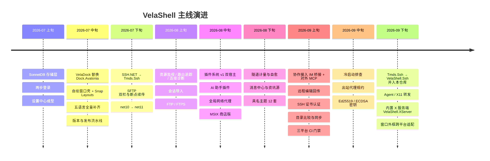
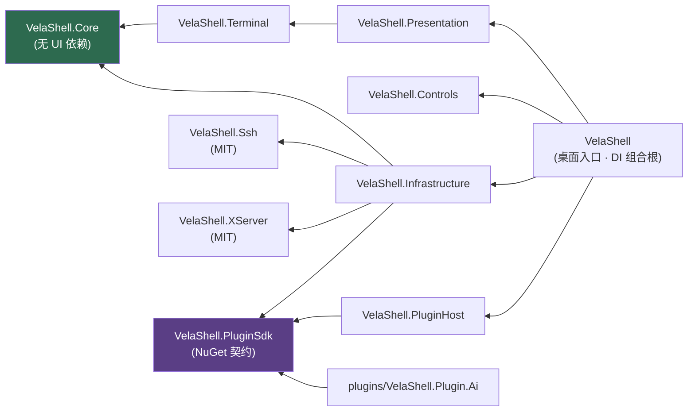

# VelaShell 项目进展与参考文档

> **这份文件记录「已经发生的事」** —— 当前架构、关键约定，以及每一次「为什么这么改」的来龙去脉。
> 它是开发跟进的事实来源。
>
> **还没发生的事在 [`feature-plan.md`](feature-plan.md)** —— 待办、候选特性、已决策不做的清单。
> 两份文件的分工是硬的：一件事做完了，就从 `feature-plan.md` 划掉、在这里补一节；
> 一件事还没做，就不要在这里留 TODO。
>
> **2026-09-26 精简**：原文 7,200 行，每节压成「做了什么 + 关键决定 + 值得记住的坑」，
> 删掉了代码对照、测试清单与逐步排查过程。完整原文在 git 历史里（本次精简之前的版本即是）。
> **节号一律保持不变** —— 代码注释、CI 配置与 `feature-plan.md` 都按「plan.md §NN」引用它们；
> 两个 §82、两个 §92 是历史上撞号留下的，也照原样保留。

## 🏷️ 状态标识

| 标识 | 含义 |
| :---: | --- |
| ✅ | **已完成** —— 已落地、有测试、可验收 |
| 🚧 | **部分完成** —— 主线可用，剩下的缺口在 `feature-plan.md` |
| 📖 | **参考资料** —— 描述当前状态或约定，不是「一件要做的事」 |
| ⚠️ | **坑** —— 会绊到人的地方 |

## 🗺️ 全文索引

**一、当前状态与约定**（长期有效，随代码更新）：
[§1 技术栈](#-1-技术栈现状) ·
[§2 解决方案分层](#-2-解决方案分层) ·
[§3 终端引擎](#-3-终端引擎) ·
[§4 SSH / PTY](#-4-ssh--pty) ·
[§5 VelaDock](#-5-停靠--分屏veladock) ·
[§6 UI 与设置](#-6-ui--视图与设置) ·
[§7 测试](#-7-测试) ·
[§8 关键约定与已知坑](#-8-关键约定--已知坑)

**二、进展记录**（按时间顺序，最新在最下）：

| 时段 | 节 | 主线 |
| --- | :---: | --- |
| 07-08 | §9 | SonnetDB 存储层、两步登录、设置窗口 |
| 07-09 ~ 07-10 | §10 – §12 | 设置接线复盘、设计稿与竞品缺口（未完成项已迁往 `feature-plan.md`）；OSC 8 / OSC 133（§10-D / §10-E，09-08 补记） |
| 07-11 ~ 07-14 | §13 – §16 | 设置审计整改、Gist 云同步、会话录制、五语言、发布流水线、VelaDock、自绘窗口壳 |
| 07 下旬 ~ 08-14 | §17 – §18 | SSH.NET → Tmds.Ssh、SFTP 双栏、插件系统 v1 + AI 插件、资源监视、路由追踪、FTP、全局代理 |
| 08-30 ~ 08-31 | §19 – §28 | 隧道计量与自愈、消息中心与资讯源、具名主题 12 套 |
| 09-01 ~ 09-07 | §29 – §49 | 插件收据、AI 模型清单、协作接入（IM 桥接 + 对外 MCP）、插件开会话、连接体验一批修复、CI 偶发失败 |
| 09-08 ~ 09-10 | §50 – §68 | 远程编辑回传（#396 四轮）、插件发布者连续性、SSH config 导入、选区对比度、SSH 证书认证、VelaDock 窗格、防空闲、协议图标 |
| 09-11 ~ 09-15 | §69 – §77 | 插件图标与更新、符号链接、目录比较与同步、中文预编辑、Linux 走 XWayland |
| 09-17 ~ 09-21 | §78 – §90 | 冷启动与 Defender、出站代理规约、SIMD 调研、资源管理器置顶、指纹变更弹窗、Xshell 外部拉起、Ed25519 / ECDSA、AI 面板卡顿 |
| 09-22 ~ 09-23 | §91 – §103 | 换成 VelaShell.Ssh 并并入本仓库、Agent / X11 / 压缩、自动加钥、agent 转发限定、VelaShell.XServer M1 – M2 |
| 09-23 ~ 09-24 | §104 – §113 | XServer 功能完备与 M3（接入宿主）、AltGr、M4（GLX 等）、键盘布局、SSH 库三批全库审查与主机证书 |
| 09-25 ~ 09-26 | §114 – §124 | XServer 审查与渲染路径、SSH 库 API 规范、窗口外框跨平台适配、状态栏对齐、CI 行尾、软换行长行复制、XServer 审查 31 项修完 |

## 📈 阶段脉络


```mermaid
timeline
    title VelaShell 主线演进
    2026-07 上旬 : SonnetDB 存储层 : 两步登录 : 设置中心成型
    2026-07 中旬 : VelaDock 替换 Dock.Avalonia : 自绘窗口壳 + Snap Layouts : 五语言全量补齐 : 版本与发布流水线
    2026-07 下旬 : SSH.NET → Tmds.Ssh : SFTP 双栏与断点续传 : net10 → net11
    2026-08 上旬 : 资源监视 / 路由追踪 / 连接诊断 : 会话导入 : FTP / FTPS
    2026-08 中旬 : 插件系统 v1 双宿主 : AI 助手插件 : 全局网络代理 : MSIX 商店版
    2026-08 下旬 : 隧道计量与自愈 : 消息中心与资讯源 : 具名主题 12 套
    2026-09 上旬 : 协作接入 IM 桥接 + 对外 MCP : 远程编辑回传 : SSH 证书认证 : 目录比较与同步 : 三平台 CI 门禁
    2026-09 中旬 : 冷启动排查 : 出站代理规约 : Ed25519 / ECDSA 密钥
    2026-09 下旬 : Tmds.Ssh → VelaShell.Ssh 并入本仓库 : Agent / X11 转发 : 内置 X 服务端 VelaShell.XServer : 窗口外框跨平台适配
```

## 🧭 当前基线（2026-09-26）

| 项 | 值 |
| --- | --- |
| 发布 | 以 [GitHub Releases](https://github.com/joesdu/VelaShell/releases) 为准。仓库里 `Directory.Build.props` 的 `0.0.1-dev` 是开发期占位，发版由 Release 标签经 `-p:Version` 覆盖 |
| 测试 | 最近一次全量记录：4800 条，**4761 通过 / 1 失败 / 38 跳过**（2026-09-26，§124；失败的是 Core.Tests 的 X11 靶机用例，本机靶机镜像旧，`main` 上同样失败，同 §116）；`-warnaserror` 下构建零警告 |
| 测试项目 | 11 个 MSTest 项目 + 1 个 BenchmarkDotNet 项目（见 §7） |
| CI | `ci.yml` 三平台矩阵（windows / ubuntu / macos），push `main` 与全部 PR 触发 |
| 待办 | 见 [`feature-plan.md`](feature-plan.md) |

## 📖 1. 技术栈现状

> 版本以 `global.json`、`Directory.Build.props`、`src/Directory.Packages.props`、`tests/Directory.Packages.props` 为准；
> 下表是 2026-09-26 的快照。

| 项 | 版本 / 说明 |
| --- | --- |
| .NET | **net11.0**（2026-07 由 net10 切入）。`global.json` 钉 `11.0.100-rc.1.26425.128` + `rollForward: latestFeature` + `allowPrerelease`；`Directory.Build.props` 开 `EnablePreviewFeatures`、`runtime-async=on`、`LangVersion=preview` |
| UI | **Avalonia 12.1.3** · ReactiveUI 24.3.0 / ReactiveUI.Avalonia 12.1.2 |
| 停靠 | **VelaDock**（`src/VelaShell/Docking/`，零第三方停靠依赖，已替换 Dock.Avalonia） |
| SSH / SFTP | **VelaShell.Ssh**（`src/VelaShell.Ssh`，MIT，全托管 async-first；2026-09-22 替换 Tmds.Ssh，§91；09-23 并入本仓库，§92）。只有 `Infrastructure/Ssh/` 直接用它，异常经 `SshInterop` 翻译。密码学原语走 BCL 与 BouncyCastle 2.7.0 |
| X11 | **VelaShell.XServer**（`src/VelaShell.XServer`，MIT，可嵌入的 X 服务端，§101 起）；Windows 上可选改拉起 VcXsrv |
| FTP | **FluentFTP 55.0.0**。⚠️ **不要**引 FluentFTP.GnuTLS —— LGPL-2.1-only，与商业授权冲突 |
| 持久化 | **SonnetDB.Core 3.1.0**，嵌入式多模型（文档 + 时序），`~/.velashell/sonnetdb`；LiteDB 已移除 |
| IP 归属地 | MaxMind.Db 5.2.0（只是 mmdb 读取库，数据是 DB-IP Lite City，CC BY 4.0） |
| 插件契约 | **VelaShell.PluginSdk 2.0.5**（nuget.org 包，**不做工程引用**，版本 pin 在 `src/` 与 `tests/` 两份 `Directory.Packages.props`） |
| 打包 | 便携 zip / tar.gz（6 RID）+ `.AppImage` / `.deb` / `.rpm` / `.dmg` / MSIX；应用内自更新走 GitHub Releases 的 `latest.json`（Velopack、WiX MSI 均已移除） |
| 依赖管理 | 集中式包管理（`ManagePackageVersionsCentrally`）+ SourceLink。⚠️ `plugins/` 下的插件**不走**中央包管理，版本写在各自 csproj |
| 测试 | **MSTest 4.4.1**（已从 xUnit 全量迁移，FluentAssertions 已移除）· Avalonia.Headless 12.1.3 · BenchmarkDotNet 0.16.0-preview.2 |
| AI 栈 | Microsoft.Extensions.AI 10.10.0 · ModelContextProtocol.Core 2.2.0 · LiveMarkdown.Avalonia 2.4.3（含 Mermaid / Math / Svg）—— 只在 AI 插件里 |

## 📖 2. 解决方案分层

```text
src/
├── VelaShell/                桌面入口、DI 组合根、视图、App 层 ViewModel、VelaDock 停靠、X 服务端的 Avalonia 宿主
├── VelaShell.Presentation/   跨层 ViewModel、连接 / 隧道工作流服务
├── VelaShell.Controls/       自定义控件（LucideIcon 等）、设计令牌、内置 Cascadia Mono 字体
├── VelaShell.Terminal/       VT 终端引擎 + 自绘渲染控件
├── VelaShell.Core/           领域模型、抽象契约、数据存储接口、协议引擎、本地化（无 UI 依赖）
├── VelaShell.Infrastructure/ SSH / SFTP / FTP / 隧道实现、SonnetDB 持久化、插件管理与能力实现
├── VelaShell.Ssh/            SSH 库（MIT，净室规程见其 AGENTS.md）
├── VelaShell.XServer/        X11 服务端库（MIT，净室规程见其 AGENTS.md）
└── VelaShell.PluginHost/     隔离插件的宿主进程（命名管道 RPC，只依赖 SDK 契约）
plugins/VelaShell.Plugin.Ai/  第一方 AI 助手插件（同仓构建、同版发布；例外理由见 plugins/README.md）
tests/                        11 个 MSTest 项目 + 1 个 BenchmarkDotNet 项目 + cert-lab 证书靶机（见 §7）
```

**依赖方向**（Core 不依赖任何 UI 框架；两个 MIT 库不依赖宿主任何程序集）：


```mermaid
graph RL
    App["VelaShell<br/>(桌面入口 · DI 组合根)"]
    Pres["VelaShell.Presentation"]
    Ctrls["VelaShell.Controls"]
    Term["VelaShell.Terminal"]
    Infra["VelaShell.Infrastructure"]
    Core["VelaShell.Core<br/>(无 UI 依赖)"]
    Ssh["VelaShell.Ssh<br/>(MIT)"]
    X["VelaShell.XServer<br/>(MIT)"]
    Host["VelaShell.PluginHost"]
    Sdk["VelaShell.PluginSdk<br/>(NuGet 契约)"]
    Ai["plugins/VelaShell.Plugin.Ai"]

    App --> Pres
    App --> Ctrls
    App --> Infra
    App --> Host
    Pres --> Term
    Term --> Core
    Infra --> Core
    Infra --> Ssh
    Infra --> X
    Infra --> Sdk
    Host --> Sdk
    Ai --> Sdk

    style Core fill:#2d6a4f,color:#fff
    style Sdk fill:#5a3e85,color:#fff
```

> 箭头指向被依赖方。`PluginHost` 与 `Plugin.Ai` **只**认 SDK 契约，不依赖宿主任何内部程序集 ——
> 这正是插件能跨进程、跨 ALC 而类型仍然同一的前提。

## ✅ 3. 终端引擎

替换掉已停维护的 `AvaloniaTerminal 1.0.0-alpha.7`，VT 引擎在 `src/VelaShell.Terminal/Emulation/` 与 `Rendering/`：

- `VtParser` —— Paul Williams 的 DEC ANSI 状态机 + 独立 VT52 语法路径，消费 Unicode 标量，派发到 `IVtActions`。
- `TerminalScreen` / `TerminalRow` / `TerminalCell` —— 网格、主 / 备屏、DECSTBM、scrollback、tab stops。
- `TerminalEmulator` —— SGR（16 / 256 / 真彩）、光标与擦除、各种模式（DECAWM、括号粘贴、鼠标跟踪…）、DEC 线绘、DA / DSR 应答。
- `TerminalType` —— vt52 → xterm-256color 十种 profile，各带 TERM 名与 DA 应答，默认 xterm-256color。
- `Utf8Sink`（可配任意编码，GBK / Big5 靠 `CodePagesEncodingProvider`）、`CharWidth`（CJK 双宽）、`InputEncoder`（按键 → 字节）。
- `Rendering/VelaTerminalControl` —— 纯自绘 Avalonia `Control`，同时实现 `ITerminalEmulator` 接回 `SshTerminalBridge`。
  `ApplyLayoutSize` 拒绝 < 2 列 / 行的早期布局（修过「横幅每字一行」）。

## ✅ 4. SSH / PTY

- `SshTerminalBridge` 只读循环，**不向 shell 预写 `\n`**（修过「末行提示符重复」）。它的 `DataReceived` 旁路是记录专用的。
- **PTY 实时改窗**：控件布局时抛 `ITerminalEmulator.PtySizeChanged(cols, rows)` → `TerminalTabViewModel` 后台转发 →
  `IShellStreamWrapper.Resize` → `Infrastructure/Ssh/ShellStreamWrapper` 发 `window-change`。像素字段目前恒为 0（见 `feature-plan.md`）。
- **连接失败不崩**：`MainWindowViewModel.TryConnectProfileAsync` 捕获认证 / 网络 / 超时，映射成本地化提示；
  `Program.cs` 挂了 `UnobservedTaskException` 与 `UnhandledException` 兜底。
- **连接持久化**：`SonnetDbSessionRepository`（`session_profiles` 集合，密码 AES-256-GCM）；最近连接取 `conn_history` 时序。
- 新建连接的密码框仅限 ASCII（`Behaviors/AsciiOnlyInput`）。

## ✅ 5. 停靠 / 分屏（VelaDock）

- **模型层** `Docking/Model/`（纯 INPC，可单测）：`DockWorkspace` / `DockGroup` / `DockSplit` / `DockDocument`。
  空组自动折叠（**只有根留着**，主组先把兜底身份交给邻居再退场，§64）；单子分栏自动提升；`MaximizedGroup` 只影响渲染、不动树。
- **控件层** `Docking/Controls/`：`DockWorkspaceControl` 按树渲染 Grid + GridSplitter，**按文档缓存视图**（切标签复用同一个 `TerminalTabView`）；
  `DockGroupControl`（标签条 + 溢出三连钮）、`DockTabItem`、`DockDragController` + `DockDropOverlay`（重排、跨组并入、五区拖放分屏）。
  **浮动窗口按产品决策不做。**
- `Controls/ReparentingHost` 保证共享的终端控件任一时刻只有一个父级。方案见 velashell-docs `zh/host/dock-replacement-plan.md`。

## ✅ 6. UI / 视图与设置

- **窗口壳**：主窗与全部对话框在 Windows 上是自绘无边框（`WindowDecorations="None"`）+ 原生行为补齐 ——
  空白区 `BeginMoveDrag`、双击最大化、**Snap Layouts 经 `MainWindow` 的 WndProc 钩子处理 `HTMAXBUTTON`**（`ce71b32`）、四周自绘缩放抓取区。
  ⚠️ **为什么 Windows 不走 `ExtendClientArea`**：Avalonia 12.0.5 的托管装饰会重复画标题与按钮、`WindowDecorationsElementRole` 的输入重定向没落地（按钮点不动），
  `BorderOnly` 还丢 `WS_CAPTION`（issue #21160 / #21212）。另一个坑：`VisualRoot as Window` 恒为 null，取窗口要走 `FindLogicalAncestorOfType<Window>()`。
  **以上只管 Win32**：2026-09-26 起 macOS 与 Linux 按平台走原生机制，统一入口 `Views/WindowChrome.cs`，见 §118。
- 文字菜单栏已整体移除（与命令面板重复，用户决策）；标题栏右侧是功能图标组，全部走命令注册表。
- **命令面板**（`Ctrl+P`；`Ctrl+K` 不绑，见 §154）：模糊子序列搜索、分类分组，条目 = 最近会话 + 全局命令。
- **状态栏跟随激活标签**：连接串 / 状态 / 终端类型 / 编码 / 尺寸 / 延迟。
- **设置窗口 14 页**：常规 / 外观 / 终端 / 密钥管理 / 共享凭据（§157）/ 快捷键（全局与标签类可改键、解绑，§155）/ 文件传输 / 安全审计 / 网络代理 / X Server / 代码片段 / 云同步 / 关于 / 支持与捐赠。
  逐项审计见 velashell-docs `zh/host/settings-audit.md`。
- **终端配色跟随主题**：未自定义时随具名主题配对的终端方案实时切换（§25、§26）。

## 📖 7. 测试

| 测试项目 | 覆盖 |
| --- | --- |
| `VelaShell.Core.Tests` | 领域模型、SFTP 与传输队列、隧道、目录同步、云同步加密 |
| `VelaShell.Terminal.Tests` | VT 解析、仿真、编码、字符宽度、侧栏折叠、OSC 8 / 133 |
| `VelaShell.Terminal.RenderTests` | 字形绘制的**像素级**回归（Skia 软件后端真实光栅化） |
| `VelaShell.Presentation.Tests` | ViewModel 工作流与命令 |
| `VelaShell.Infrastructure.Tests` | SonnetDB 持久化、凭据加密、ConPTY、SSH 接线、密钥管理、插件管理与跨进程 RPC |
| `VelaShell.Controls.Tests` | 自定义控件、主题令牌与样式守门 |
| `VelaShell.Plugin.Ai.Tests` | AI 插件：审批闸门、能力桥接、机密存取、会话历史、协作接入、面板 headless 交互 |
| `VelaShell.Tests` | 窗口级视图模型、身份验证流程、插件面板、窗口外框、headless 视图与像素回归 |
| `VelaShell.ShellIntegration.Tests` | 「文件浏览器跟随终端目录」的端到端验证：真 sshd、真登录 shell、真 PTY |
| `VelaShell.Ssh.Tests` | SSH 库单测 + 对真实 OpenSSH 的互操作（`Interop` 分类）。**一律用 Debug 跑**（Release 签名会省掉 `InternalsVisibleTo`） |
| `VelaShell.XServer.Tests` | X 服务端库单测 + 真实 X 客户端用例（需 `velashell-xclients` 镜像与 `VELASHELL_XSERVER_INTEROP=1`） |
| `VelaShell.Benchmarks` | BenchmarkDotNet 基准。**不进 CI 门禁** —— 结果受机器负载影响太大，用于同一台机器上比较改动前后 |

- **CI**（`.github/workflows/ci.yml`）：Debug 构建（强名签名只在 Release 打开，fork 与 Dependabot 的 PR 拿不到 secret）+ 全量测试 + `-warnaserror`；
  排除 `DockerIntegration` / `CrossPlatform`；本仓检出到 `VelaShell/` 子目录并把 `velashell-docs` 并排检出（快捷键比对用例要找得到对方）。
- ⚠️ **早退跳过在 MSTest 里记为「通过」**。Docker、发布、X 客户端这几类前提不满足时会安静地全绿，要看 `TestContext` 里有没有 `[SKIP]` 行。
- ⚠️ **headless UI 测试要用带返回值的重载** `Dispatch(async () => { …; return true; })`；无返回值的写法拿到一个没人 await 的 `Task<Task>`，断言失败全部丢失（§70）。
- ⚠️ **别拿固定 sleep / 固定泵赌调度**，一律改成等条件（§49、§50、§71-六）。
- 写法约定：`[TestMethod]` / `[DataTestMethod]` + `[DataRow]` / `[TestCategory]`；`Assert.AreEqual(期望, 实际)`；异常用 `Assert.ThrowsExactly(Async)`；
  `long` / `uint` 期望值带后缀（`AreEqual(object, object)` 类型严格）。
- `Terminal.Tests` 与 `VelaShell.Tests` 引了 `Avalonia.Headless`（宿主 `VelaHeadlessApp`）；`VelaShell.Tests/ModuleInit.cs` 初始化 ReactiveUI 调度器，保留。

## 📖 8. 关键约定 / 已知坑

- 构建与测试都用根目录 `VelaShell.slnx`。应用运行时构建会因 DLL 被占用失败 —— 先关应用。
- 工作区一律签出成 LF（`.gitattributes` 的 `* text=auto eol=lf`），否则 Windows CI 会在注释处报 IDE0055（§121）。
- 不要用 `Read` / `Grep` 直接读 `.pen` 设计文件（加密，只能走 pencil MCP）。
- **SonnetDB**：`Tsdb.Open(new TsdbOptions { RootDirectory })`；文档 `db.Documents.Open(name)` 的 Upsert / Get / Scan / Delete；
  时序 `db.Write(Point.Create(...))` + `SqlExecutor.Execute`。`FieldType` 是 `Int64` 不是 `Long`；**时序 tag 值不许空串**；
  **`ORDER BY time` 要求 SELECT 列表含 time**；`DELETE FROM measurement` 可能不支持（录制以 drop + 回写压缩兜底，§13-F）；
  仓储加密必须写副本，不能原地改传入的 profile（内存明文还在给活动连接用，§9）。
- **Avalonia 12**：`Run.Text` 绑定会在卸载时回写（转换器 `ConvertBack` 返回 `BindingOperations.DoNothing`，绑定标 `OneWay`）；
  ComboBox 的 `SelectedItem` 在 ItemsSource 为空时会把 null 写回（先填列表再回填选中）；XML 属性值里的换行被规范化成空格；
  **`ControlTemplate` 里直接写的属性值是 `LocalValue`，压过外部样式的 `Setter`**（§90）；元素上直接写 `Background` 同理盖掉 `:pointerover`（§20-H）；
  `Button` 默认 `HorizontalAlignment` 是 `Left` 不是 `Stretch`（§23）。
- **`SessionProfile` 是逐字段手写拷贝**，新增字段要把几处拷贝都补上（名单见 §37）；`AuthMethod` 等按序号落盘的枚举只能在末尾追加。
- **跨层识别异常一律 `is` 类型匹配，绝不按类型名或消息字符串**（§17-A、§82）。

## ✅ 9. 2026-07-08 完成情况(6 次提交,514 测试全绿)

- `2a270e5` 持久化全面切到嵌入式 SonnetDB(`SonnetDbEngine`,文档集合 + 时序 `conn_history` / `audit_log`);`AesSecretProtector` = AES-256-GCM + 本地 `secret.key`(密文前缀 `enc1:`);旧 JSON 导入后改名 `.migrated.bak`,LiteDB 移除。
- `10e9e70` 最近连接改取连接历史;`1e1fa6b` 新建连接弹窗。**坑**:仓储原地加密会把内存明文密码改成密文、重连认证失败 —— 改为写副本。
- `f5405f5` 两步登录验证 + 主机密钥 **TOFU**(指纹变化拒连);`3ef6bed` 文档;`2812048` 设置窗口九页。

## 🚧 10. 历史待办清单(已迁出)

> 2026-09-07 重整:待办整体迁往 [`feature-plan.md`](feature-plan.md),这里只留做完的与确认不做的结论。

### ✅ A. 设置项接线(2026-07-09)

终端 / 外观 / 常规 / 传输 / 安全 / 密钥六组设置从「存了但不生效」变成真生效(接线点 `ApplyLiveTerminalSettings`、`InfrastructureServiceCollectionExtensions`、`SftpService`);另有上传冲突策略(编辑器回传属有意覆盖)、断点续传(尾部 64KB 核实起点)。未闭合项见 feature-plan.md 的 P0 表。

### ❌ B. 确认不做(2026-07-10)

连字、自适应标题栏色、系统 Toast、输入脱敏、自定义键位、热切终端类型;理由见 feature-plan.md「确认不做」。其中自定义键位 2026-10-03 因 #551 推翻并实现,见 §155。

### ✅ C. 顺手清掉的技术债

SonnetDB **保留全局信号量**(文档与时序共用一个 Tsdb 实例,分锁有损坏风险;设置读热点靠缓存 JSON 文本解决);**OSC 52**(只写不读,1MB)与 DECRQSS 落地,顺带修掉 ST 结尾的 OSC/DCS 被整段丢弃的解析器 bug;CJK 回退由字体链 + 逐格回退覆盖。

### ✅ D. OSC 8 显式超链接(2026-09-08)

- `HyperlinkTable` 把 `(id, URI)` 驻留成 `ushort` 句柄,4096 条上限,仅 RIS 整表回收。
- ⚠️ 句柄放在 `TerminalRow` 的平行 `ushort[]?` 而非 `TerminalCell`(单元格恰好 16 B,加字段涨 25%);代价是每条行编辑路径都要搬,**`ReflowResize` 漏搬则一拖宽度链接全没**(`Osc8HyperlinkTests`)。
- 打印路径每格都盖句柄防幽灵链接;URI 要把 `p[2..]` 拼回(`;` 在查询串合法);`SGR 0` 不关链接。
- **安全**:scheme 白名单 `http/https/ftp/ftps/mailto`;**`file:` 刻意不放行**(远端路径在本机打开既无语义又最危险)。命中走 `LinkAtCell`,OSC 8 优先、正则兜底。

### ✅ E. OSC 133 命令块 / 语义提示符(2026-09-08)

- 做了引擎 + UI,**不做自动注入**。`TerminalRow.Mark` + `ExitCode` 挂在行上随 `Timestamp` 搬运,命令块由 `CommandBlocks` 按需推导不存状态。
- ⚠️ 标记只落重排后首行;⚠️ `Resize` / 备用屏切换必须丢掉 `_promptRow`(行对象会被复用,退出码会盖到无关行)。`B` 暂不落行。
- UI:侧栏命令标记列(非 0 标红)、点标记选输出、`Ctrl+Shift+↑/↓` 跳提示符(无标记时原样下发)、折叠按命令块对齐。
- 设置页摆可复制片段。⚠️ bash **不用 `DEBUG` trap**(与 bash-preexec 抢、`C` 会被别的 `PROMPT_COMMAND` 钩子抢走),改用 `PS0`;真 bash 验证,zsh / fish 未验。

## 🚧 11. 设计稿分析已记录的问题

终端类型 / 编码选择器、bright/256 色、CJK 回退字体、终端交互四项、亮色终端底色均已解决(后两者并入 §25 具名主题);剩余两个小项已迁往 feature-plan.md。

## 🚧 12. 与主流终端工具的功能缺口(已迁出)

> 2026-07-09 对照 Xshell / MobaXterm / Tabby / WindTerm 的 20 条;未完成项已迁往 feature-plan.md。

- ✅ **1** 本地终端(ConPTY,仅 Windows,不自动重连)· **2** ProxyJump(≤5 跳,**指纹按各跳逻辑主机校验**)· **3** 会话进命令面板 · **4** 导出缓冲区 · **5** 配色预设 · **6** 克隆会话 · **7** 同步输入(只挂用户输入,不回环)· **9** SSH config 导入(§58)· **12** known_hosts 管理 · **14** SFTP 双栏 · **16** 命令补全(程序提问时闭嘴)· **17** OSC 52。❌ **19** 多窗口、**20** Mosh(同一条里的 SSH 证书认证已于 §63 落地)。
- **8** ZMODEM 协议引擎在本仓库实现(**2026-09-14 已整体移除**,理由见 feature-plan.md「确认不做」)。⚠️ 教训仍然有效:互操作期望值必须按 lrzsz 源码手工构造 —— 用被测编码器自己生成期望值,编解码同错也全绿。
- **10** 连接代理 → 2026-08-14 落地为**应用级全局代理**,唯一出口 `IProxyResolver`;**配置不完整时拒连,绝不静默直连**;ICMP 与诊断裸 TCP 有意不走代理。
- **13** 标签自定义颜色(`b9ae31f`,`TerminalOverrides.TabColor`)。⚠️ **复核订正**:09-05 复核写「用户不可选」,次日即被推翻 —— 复核结论也会过期,写现状要给证据(文件行号)。
- 清单外:Telnet / 串口 / Redis / S3 以插件落地(宿主新增 `IProtocolTerminal`);FTP / FTPS 内置(§18-N)。

## ✅ 13. 2026-07-11 ~ 07-12 批次(设置审计整改 + 四个新特性)

**A. 设置审计整改**:BellMode 合并、`ObservableOptions` 统一。**B. 主机指纹三选项**:永久 / 仅本次 / 取消 = fail-closed,补上 SFTP 通道信任任意指纹的 MITM 缺口。
**C. GitHub Gist 云同步**:设置 + 连接配置(upsert 不删本地)+ 代码片段进单个 secret Gist,版本复用 revision;可选 PBKDF2 + AES-GCM 端到端加密,未启用时凭据绝不上传;PAT 经 `ISecretProtector` 加密、永不进载荷。
**D. 会话录制与回放**(只录输出流,导出 asciicast v2)。**E. 支持与捐赠页**。
**F. 后续增量**:录制保留天数随会话日志清理,**DELETE 不可用时 drop + 回写压缩兜底**(防孤儿数据块磁盘只增不减);MIT → AGPL-3.0 + 商业双许可。遗留项已登记在 feature-plan.md。

## ✅ 14. 多语言(2026-07-12 全量补齐,C-09 一并完成)

五语言(英文默认 + `zh-Hans/zh-Hant/ja/ko` 脚本中性文化),键集平价有测试守护。实时切换两处根因:`LocalizationService` 自持目标文化(线程文化随 ExecutionContext 回卷);Avalonia 12 不响应 `Item[]` 索引器通知,改绑普通属性。

## ✅ 15. 版本与发布(2026-07-12)

版本号单一来源 `Directory.Build.props`,发版由 Release 标签 `-p:Version` 覆盖;`publish-all.ps1` / `release.yml` 产 6 个含运行时的包 + `latest.json`;08-12 起**摊开发布**(`PluginHost` 需真实可执行体)。Velopack 已移除(卸载会清空数据根),分发 = 便携 zip + 应用内自更新。

## ✅ 16. 2026-07-13 ~ 07-14 批次(VelaDock、原生窗口壳、终端侧栏、工程化)

**A.** VelaDock 替换 `Dock.Avalonia`,零第三方停靠依赖(§5)。**B.** 无边框标题栏 + WndProc `HTMAXBUTTON` 实现 Snap Layouts;坑:Avalonia 12 的 `VisualRoot` 不是 `Window`,走 `FindLogicalAncestorOfType<Window>`。**C.** 行号 / 时间侧栏。**D.** Job Object 杀本地进程树。**E.** 密码提示行不弹补全。**F.** 集中式包管理、Avalonia 12.1。

## ✅ 17. 2026-07 批次(SSH 传输层迁移、ZMODEM、SFTP 双栏)

**A. SSH.NET → Tmds.Ssh**:改动全在 `Infrastructure/Ssh/`,Core 一行没改。07-22 修:异常按旧类型名字符串匹配,认证重试静默失效 —— 测试没抓到是因为测试里定义了迎合实现的假异常。约定:**跨层识别异常一律 `is` 类型匹配,绝不用 `GetType().Name`**。
**B.** ZMODEM 见 §12-8(已于 2026-09-14 移除)。**C.** SFTP 双栏见 §12-14。**D.** 远程编辑器语法高亮。**E.** net10 → net11(依赖预览版 SDK)。
**F. 拖入文件夹异常风暴**:`AutoConnect` 默认 true 导致每次 SFTP 操作静默重连,现显式 false;续传探测改走预列举名单。**G.** 两份调研文档。

## ✅ 18. 2026-07-24 ~ 08-14 批次盘点(2026-08-14 补记)

**A. 插件系统 v1 + AI 助手插件**:进程内 / 隔离进程(`PluginHost`,命名管道 RPC)双宿主,插件源码零改动;进度以 velashell-docs `STATUS.md` 为准。
**B. 资源监控窗口**:⚠️ 只对 POSIX 远端发探针,`RemoteShellProbe` 判否即「无数据」—— Windows 远端的 cmd.exe 会回显整行命令,被解析成全 0 假指标。
**C.** 连接诊断(直连,不走代理)。**D.** 路由追踪 + 离线 IP 归属地。
**E. 远端任务管理器**:同样先判 POSIX,否则报「不可用」—— 教训同 B,否则是一张 0 进程的假空表。
**F. 文件浏览器跟随终端目录**(09-15 重构):SSH 只能往已运行的 PTY 里打字,借 VS Code 的 OSC 633 协议、投递另解决:分 shell 注入且还原 `$?`、带 nonce 哨兵扣住回显(不按回显匹配,超宽折行各 shell 不同)、对端静默后注入且超时放行。真 sshd + 五种 shell 验证。
**G.** 传输面板 · **H.** Xshell / WinSCP 导入 · **I.** UI 字体令牌 · **J.** 终端交互 · **K.** 外观 · **L.** MSIX 打包 · **M.** 小项。
**N. FTP / FTPS**:连接池上限遇 `421` / `450` 自适应下调(`AdjustableConcurrencyGate`)。**O.** 全局代理见 §12-10。

## ✅ 19. 2026-08-30 隧道功能完善(计量转发 / 流量统计 / 断线自动恢复 / 端口冲突预检)

**A.** Tmds.Ssh 不暴露字节计数,转发数据面改由宿主接管(`MeteredPortForwardHandle`,含 SOCKS5 服务端);保留**半关闭语义**;用例拿客户端侧编码当地面真值。**B.** 停止时先取最后读数再释放句柄。**C.** 自动重连退避,**用户按停的不拉起**。**D.** 端口预检的探测委托可注入(否则测试看机器)。**E.** 9 个新键。**F.** 面板字号上调一档。

## ✅ 20. 2026-08-30 消息中心(侧边栏铃铛)

**A.** 只收可回看的消息,**不收运行时告警**。**B.** 资讯源契约字段只加不改,外链只放 https,坏条目单独跳过(08-31 改默认订阅,§22)。**C.** 跳转走 `ICommandRegistry`,分区用 `SettingsSectionKey` 枚举而非下标。**D.** 修好死开关 `CheckUpdatesOnStartup`。**E.** 同 id 重投保住已读状态。**F.** 浮层锚在铃铛旁。**G.** 24 个新键。
**H.** ⚠️ 元素上直接写 `Background` 是 local value,压过样式,`:pointerover` 盖不过去。遗留项已登记在 feature-plan.md。

## ✅ 21. 2026-08-31 补全弹层关不掉(#315)

**A. Ctrl+C**:空行清空空行不算「内容变化」,事件被吞;改为 `0x03` / `0x15` 一律记为变化。**B. 点击终端**:点已聚焦终端没有 `LostFocus`,补 `PointerPressed`。已登记 `ShortcutCatalog`。

## ✅ 22. 2026-08-31 资讯源默认订阅官方源

`FeedUrl` 默认改为官方源 —— 安全资讯要「没去找也能到」。默认行为变更同步了 `PRIVACY.md` 中英、velashell-docs 中英与 §20-B;存量空串配置原样保留。

## ✅ 23. 2026-08-31 消息中心:可拖动、加大字号、动作靠右

**A.** 拖拽抽成 `PanelDragHandler`。**B.** 外层 Panel 须铺满(拖拽参考系是父容器)。**C.** 字号加大一档。**D.** 去处行两端对齐。**D-1.** ⚠️ `Button` 默认 `HorizontalAlignment` 是 `Left` 而非 `Stretch`。**E.** 右留白 16 让滚动条。**F.** ⚠️ 圆角不裁内容,内层加 `CornerRadius=5` + `ClipToBounds`(不能裁卡片自身,会裁掉阴影)。**G.** 唯一投影令牌调软,同步 `DESIGN.md` §4.5。
测试教训:headless 帧是 **RGBA**,按 BGRA 读断言永远为真。

## ✅ 24. 2026-08-31 会话树状态卡在「连接中」(#321)

根因:一个节点多个标签、状态按最后一次写入,失败 / 取消路径还绕过 `OnDocumentClosed`。改为 `RefreshSessionStatus` 按配置取优先级最高者,订阅挂在 `OnTabsCollectionChanged` 让所有移除路径共用收口。SFTP 等文档型连接当时仍是后写的赢(与既有行为等价,不是新洞),后来在 §39 收掉。

## ✅ 25. 2026-08-31 具名主题:九套配色 + 终端配色配对

三值主题改为具名主题目录(六暗三亮),Id `dark` / `light` 不变。
**一、** 只写 25 个种子色(`UiThemePalette`),其余由 `ThemeTokenApplier` 派生 —— 手抄会错且看不出(#246)。
**二、** 终端配色三层叠加;硬约束:**方案背景必须等于主题 `VelaBgTerminal`**。
**三、** `UiThemeCatalogTests` 逐主题查对比度,真拦下了几处原版配色。**四、** `IsEmpty` 恒 false 的静默 bug。
**五、** 插件侧仍只见 `dark` / `light` / `system`,具名主题不外泄;启动先验 Id(降级不崩)。

## ✅ 26. 2026-08-31 主题命名收敛 + 「跟随主题」不再是隐式状态(用户反馈)

**一、** 只有 VelaDark / VelaLight 保留品牌名,其余用调色板原名。
**二、** 「跟随主题」曾隐式编码为「颜色 == 出厂 Dracula」,明选 Dracula 无从区分。改为显式 `TerminalColorsFollowTheme`(`bool?`,**不给初值**,null 按老口径推断);⚠️ 手改单色时直接置标志,不能反问 `FollowsTheme`。

## ✅ 27. 2026-08-31 再补三套主题:One Dark / One Light / Sakura(用户反馈)

主题 9 → 12、终端方案 14 → 16;One Light 绿黄与 Sakura 错误色按对比度尺子调过。新增主题 = 填种子色 → 跑 `UiThemeCatalogTests`。出厂强调色 `#E91E63` 会盖掉各主题强调色,遗留项已登记在 feature-plan.md。

## ✅ 28. 2026-08-31 切主题发卡(用户反馈)

**一、** 逐个写 64 个令牌 → 游离字典整格换入 `ThemeDictionaries`,40~57 ms → 1.65 ms;先贴令牌再换变体。**二、** 终端字体 setter 加相等判断(否则丢字形缓存)。**三、** 跨明暗不再刷两遍。**四、** 回归用例数**通知次数**而非耗时(耗时断言在 CI 必抖)。

## ✅ 29. 2026-09-01 命令行装的插件被判「收据缺失」(用户反馈)

- **一、错在宿主**:收据存在宿主信任库,CLI 够不着;宿主却把「没收据」当成拒装载,旁装(CLI、直接放目录)的插件全被标 Invalid。
- **二、收养随用随做**(`VerifyOrAdoptInstallReceiptAsync`):管理页装的收据内容变了一律拒;旁装的记 TOFU 基线,变了重记 + 日志;基线写不进不放行。
- **三、** 启动时 `PruneReceiptsWithoutDirectory` 清掉孤儿收据,免得同 id 重装被判「被改过」。
- **四、代价**:安全没让步;但同一插件别混用管理页与命令行。文档已同步 velashell-docs。

## ✅ 30. 2026-09-02 AI 插件:自定义供应商也能自动拉模型清单(用户反馈)

- **一、** 原来只认 models.dev,没收录的(Ollama、`custom-*`)不显示按钮;按钮还藏在只有订阅登录才可见的面板里。
- **二、端点优先**(`ModelPull.RunAsync`):先问端点 `/models`(`EndpointModelCatalog`)拿实际型号,再按 id 从 models.dev 补窗口/单价;端点失败退回 models.dev。
- **三、刻意降级**:非对话模型按名字滤,宁漏勿误;中转站单价留空 —— 照抄原厂价会让花费估算静默偏低。

## ✅ 31. 2026-09-02 AI 插件:左栏模型列表可折叠(用户反馈)

- **一、** `AiProvider.ModelsExpanded` 是 `bool?`:只有没表过态才按数量自动折(`AutoCollapseFrom = 12`),用户折/展过就尊重;拉取模型后复位。
- **二、** 选中项在里面时强制展开;折起时选中上移到供应商行。
- **三、** 整行都是折叠热区;→ 展开、← 折起;左右键须挂隧道阶段(`ListBox` 冒泡前就吃掉了)。

## ✅ 32. 2026-09-02 资源管理器:会话树改成摊平的平列表(用户反馈)

- **一、** 子行前的空白是 `TreeView` 的层级缩进区,压 `PART_*` 模板部件压不干净,换版本还会复发。
- **二、** 改成绑 `SessionTreeViewModel.Rows`(由 `Nodes` 派生)的 `ListBox`;`Rows` 就地对齐而非清空重建,否则双向绑的 `SelectedNode` 被清空。
- **三、** 滚到选中项改用 `ListBox.ScrollIntoView`(虚拟化后视口外没有控件可找)。
- 教训:`ShortcutCatalogTests.Doc_ListsEveryCatalogEntry` 因文档搬家红了几个月没人管(09-03 已修)。常年红着的用例等于没有。

## ✅ 33. 2026-09-02 协作接入:IM 桥接(飞书/钉钉/Telegram/企微)+ 对外 MCP 服务端

往外:群里 @ 机器人,agent 在已连上的会话上干活;往内:外部 agent 把 VelaShell 当 MCP 服务端。代码在 AI 插件 `Bridge/`、`Interop/`,插件因此改为 `onStartup` 激活。
- **一、** 四渠道四种传输(`IMessageChannel` + `ChannelHub`):飞书长连接(pbbp2 帧手写编解码)、钉钉 Stream、Telegram 长轮询、企微回调(只绑 127.0.0.1)。
- **二、安全默认**:白名单空 = 谁都不理;默认只读;`/mode` 只能往低调;审批走文本 `y`/`n`/`a`;绑定存 `user@host:port` 而非会变的 SessionId。
- **三、** 无头回合另写 `BridgeAgentRunner`,不拆 2500 行的 `ChatPanelView.SendAsync`。
- **四、对外 MCP**(`Interop/McpEndpoint`):Streamable HTTP,只绑回环,每请求带令牌。这条路没有审批界面,「询问」模式等于一律拒绝写操作 —— 这是刻意的,要放开得由用户显式选只读放行或绕过审批。
- **五、** 当时开不了新会话,已由 SDK 2.0.2 解决(§35、§36)。
- **六、坑**:`Wrap` 的多行 TextBox + 竖滚动条 Auto = 布局死循环,窗口卡死且无异常。文档已同步(`协作接入.md` 中英)。

## ✅ 34. 2026-09-02 协作接入配置流程返工(用户反馈:"要填一堆文本框")

改后流程:填两个框 → 测试 → 扫码拉机器人进群 → 群里发 `/pair`,全程不抄 id。
- **一、** 飞书/钉钉/企微的 `app_secret` 只能从后台拿,扫码变不出来。
- **二、配对码**(`PairingService`):六位、一次性、十分钟、错五次作废;只能加白名单。
- **三、** 被挡的聊天记为 `PendingChat`,设置页一键放行。**四、** [测试] 按钮(`ChannelProbe`)只读探测,飞书多查接入点。
- **五、** 拉群链接渲染成二维码;1.4.8 起在插件内实现编码器、替换 QRCoder(`Ui/QrCode.cs`)—— 它传递依赖 `System.Drawing.Common`,还炸了 macOS `codesign`。教训:引包先看传递依赖。**六、** 待放行清单加载完即刷。
- **七、** `PostAsJsonAsync` 按 Web 默认把 `AppID` 转成 `appID`,飞书回 9499;在类型上钉 `[JsonPropertyName]`。
- **八~十一、** 这页没照 `DESIGN.md` 走(引用不存在的 `VelaBorderSubtle`、按钮不居中、代码 `new` 的按钮进树前取不到主题),改用 `Button.host` / `Button.primary` / `CheckBox.host` class;headless 证明不了主题挂上,最后用 Skia 渲染 PNG 确认。
- **十二、十三、** 渲染抓出 `Loc.Table` 重复键静默覆盖;加 `NoKeyIsDefinedTwice`、`ThemeTokenUsageTests` 等守门。
- **十四、** 整轮在落后 18 个提交的基线上做,本节与 §33 因此顺延编号。教训:先 `git fetch`。
- **十五、** 飞书 401 而面板正常:桥接用的是启动时的设置快照,改为每轮现读。

## ✅ 35. 2026-09-03 插件能按已保存配置自己连一台机器(SDK 2.0.2 宿主侧落地)

宿主实现 SDK 2.0.2 的 `ISessionsApi.ListSavedAsync` / `OpenAsync` / `CloseAsync`。
- **一、闸门在宿主侧**:只开已保存的 SSH 配置;凭据不经插件;拒绝与失败分型(`PluginPermissionDeniedException` / `PluginSessionOpenException`);`Reason` 原样进确认框;只关得掉自己开的。
- **二、** 走 `TryConnectProfileAsync`,会话有标签、凭据框与指纹确认都不漏;headless 宿主一律拒 —— 没人可问不等于可以放行。
- **三、** `PluginPermissionGate` 里开会话与终端回写分两本账。**四、** `RpcSessions.OpenAsync` 超时给 5 分钟,等人看完确认框。
- **五、** 拒绝须以原异常类型跨进程到达插件。

## ✅ 36. 2026-09-03 AgentToolbox 接上开会话

新增 `list_saved_sessions` / `open_session` / `close_session`,§33-五 真正闭合。
- **一、** `open_session` 过两道人:审批闸问这轮对话,宿主确认框问这个插件(「始终允许」让无人值守走得通)。
- **二、** `close_session` 免审批:只能关自己开的,再要点头 agent 就不收拾了。
- **三、** 默认目标:显式 id > 选中项 > 本轮自己开的,免得用户看着 A、调用打到 B。
- **四、** 三处「你先去连一台」提示改掉。**五、** `AgentToolboxTests` 新增 15 条。

## ✅ 37. 2026-09-04 每条连接各配一条「认证后执行命令」(用户反馈)

每条 SSH 配置可各配一条命令 + 延迟(0~60 秒),与全局那条并存。
- **一、字段落在 `SessionProfile`,手写拷贝一处都不能漏**:`SessionProfile` 逐字段手写拷贝,新增字段须同步 `ConnectionProfileViewModel.BuildProfile`、`SonnetDbSessionRepository.Protect`、`ConnectionWorkflowService`(不记密码时的副本)、`SessionTreeViewModel`(复制会话);漏抄 = 重开后字段悄悄没了,`SonnetDbPersistenceTests` 钉住。
- **二、** 只对 SSH 出现,切走协议时清成 null(否则切回会诈尸执行)。
- **三、** 延迟防 motd / 横幅吞命令;用 `DispatcherTimer.RunOnce`,回调复核会话身份。
- **四、** 先全局后本条,重连同样执行。**五、** 文档已同步 §13.1 中英。

## ✅ 38. 2026-09-04 FTP / FTPS 可配「默认打开路径」(用户反馈)

- **一、** 落在 `FtpSettings`(只改 `Clone()`),FTP 专属,不进 `SessionProfile`。
- **二、** 只是候选表首位,打不开就退回登录目录再退回根 —— 配错不该把人堵在报错页。
- **三、** `FtpSettings.NormalizeRemotePath` 在 setter 上归一。
- **四、** 文档已同步 §13.1 中英。

## ✅ 39. 2026-09-04 文档型连接的树状态:关掉一个,别把另一个也熄了(用户反馈)

- **一、** 与 #321 同形:节点状态应合并名下全部会话,#321 只修了终端,文档型连接关闭时仍无条件写「未连接」。
- **二、** 新账本 `_documentSessions`,`RefreshSessionStatus` 合并「终端标签 ∪ 在册文档会话」;删掉三本旧册子,迟到事件不复活圆点。
- **三、** 第一版回归用例是假绿(断言跑在异步更新之前);改为等关闭任务 + 调度器栅栏,反向验证过会红。
- **四、** 新增一条环回 FTP 端到端用例。

## ✅ 40. 2026-09-04 数字输入框删空后别再甩一句转换异常(用户反馈)

- **一、** `NumericUpDown` 删空后 null 绑不到数值属性,界面原样显示 `InvalidCastException` 并撑坏布局;全项目 20 处皆然。
- **二、** `NumericInputGuard`:错误换成「请输入 A 到 B 之间的数字」;失焦仍空则 `SetCurrentValue` 恢复(直接赋值会掐断绑定);错误改用图标 + 悬停提示。挂在全局样式上。
- **三、** 隧道面板两个 `TextBox` 端口改 `NumericUpDown`。
- **四、** 设置窗口整卷扫描,带数量下限防假绿。**五、** `NumericInputGuardUiTests` 10 条。

## ✅ 41. 2026-09-05 对外 MCP 的「允许操作的服务器」改成勾选(用户反馈)

- **一、** 名字会改会重名,复用 §34 的勾选,存 `SavedSessionId`;`AllowedTargets` → `Scope`,范围外会话当作不存在。
- **二、** 默认值刻意与 IM 相反:MCP 默认不限范围(回环 + 令牌 + 只读已是边界)。
- **三、** `NormalizeScope` 迁移:旧清单空 → 不限;对得上的勾出;一行都对不上 → 失败关闭。
- **四、** 9 条新用例;文档已同步(协作接入 2.4 节中英)。

## ✅ 42. 2026-09-06 开一下 SFTP 面板,别把设置里的开关也给拨了(#377)

- **一、** 记标签状态时顺手写回了全局 `AutoOpenFileBrowser`,把临时状态与全局默认混成一层。
- **二、** 删掉写回;设置 = 新标签初值,标签 = 此后开关,面板 = 当下这一屏。
- **三、** 用例改钉「不写回」(`SaveCount == 0`)。

## ✅ 43. 2026-09-06 滚动条:悬停别等半秒,新建连接别一进来就是粗条(#378)

- **一、** `ShowDelay` 默认 0.5s;`AllowAutoHide="False"` 在 Avalonia 里是常驻展开而非「可见」。
- **二、** 全局 `ShowDelay` 150ms(置 0 会被擦碰误触);去掉连接对话框的 `AllowAutoHide="False"`。
- **三、** 两条用例;`DESIGN.md` 5.8 已补。

## ✅ 44. 2026-09-06 exit 之后不该被自动连回来;SFTP 通道跟着 SSH 一起收(#383)

- **一、** 重连判定只认工具栏「断开」;远端 `exit` 的干净 EOF 与掉线被 `ShellStreamWrapper.ReadAsync` 一律归成「返回 0」。
- **二、** 新增 `ShellCloseReason` 传到 `TerminalTabViewModel.RemoteShellExited`;`ShouldReconnect` 加 `remoteShellExited` 且不给默认值。
- **三、** `SftpService` 订阅 `SessionDisconnected` 在服务层收口,不靠各断开入口记得调用。
- **四、** 用例反向验证过;文档已同步「断开连接状态」中英。

## ✅ 45. 2026-09-07 新开标签页时,上一个会话的 SFTP 面板要立刻收起(#385)

- **一、** `RebindFileBrowser` 遇到 `SessionId == Guid.Empty`(握手中的新标签)直接 return,继续显示旧面板。
- **二、** 三种无 SFTP 会话的标签一律换隐藏占位;旧面板留在缓存,切回照旧恢复。
- **三、** 回归用例:加回 return 即红。

## ✅ 46. 2026-09-07 连接慢的时候,屏幕上必须有东西在动(#385 反馈)

- **一、** 标签先建再握手:`ConnectingDocument` 占位,连上后 `ReplaceDocument` 原位替换;文档型四条路径共用 `DocumentConnectUi`,关标签即取消,失败落在标签内而非模态框。
- **二、** 终端补 `ShowConnectingOverlay`。
- **三、** 各连接路径登记后台活动圆环;等用户输入时不转圈。
- **四、** 含渲染用例(只在慢时才看得到的界面最容易带坏资源发版);`DESIGN.md` 补 §5.2b「等待态」。

## ✅ 47. 2026-09-07 后台任务浮层是块黑砖,跟哪套主题都不搭(用户反馈)

- **一、** 裸内容浮层吃 Fluent 写死的近黑底色,不在 `Vela*` 令牌里。
- **二、** `FlyoutPresenter` 基础样式改走令牌,`.bare` 必须排在它之后。
- **三、** 每条活动带进度环(`BackgroundActivityItem.Fraction`)。
- **四、** `FlyoutPresenterStyleTests` 两条。**五、** `VerticalOffset="-8"` 让浮层不压状态栏,纯观感数值不写用例。

## ✅ 48. 2026-09-07 关掉「连接中」的标签,连接就该停下(用户反馈)

- **一、** 终端握手只带调用方令牌:关标签后圆环照转、超时后还弹错,握手在关后成功会留下孤儿连接。
- **二、** `BeginTabConnect` / `CancelTabConnect`(只取消不释放,否则撞 `ObjectDisposedException`)/ `EndTabConnect`,在 `OnDocumentClosed` 触发;失败按令牌判而非按异常类型。
- **三、** `ConnectingTabCancellationTests` 两条,反向验证会红。

## ✅ 49. 2026-09-07 CI ubuntu 偶发失败:隔离插件"连不上"被报成"激活超时"

- **一、** 报错是错的:连管道阶段超时逸出裸 `OperationCanceledException`,被一律写成「激活超时 30s」。
- **二、** 根因:`PluginHost` 先建 Avalonia 再连管道,Linux CI 上并行抢核时撞破 10s。
- **三、** 管道先连;新增 `IsolatedStartupTimeout` 与激活时限拆开;各段超时自报家门;软件渲染补齐 X11 / macOS。
- **四、** 回归用例把预算压到 1ms,断言报 `did not connect`。

## ✅ 50. 2026-09-08 CI macOS 偶发失败:背压用例拿固定 sleep 赌线程池已经起来了

[run 34159705858](https://github.com/joesdu/VelaShell/actions/runs/34159705858) 上 `DisposeReleasesAReadLoopWaitingOnBackpressure` 报「没攒出积压」。
- **一、** 不是产品 bug,是用例前提没成立:`Start()` 后固定睡 150ms,读线程还没跑起来。
- **二、根因**:读循环 `Task.Run` 排在线程池,饱和后约 500ms 才注入一条线程;macOS 3 核却并行跑 8 个测试程序集。本机 `DOTNET_PROCESSOR_COUNT=2` 必挂、加 min worker thread 即绿。
- **三、** 断言只要求积压 > 0,读线程不在闸上也会白绿 —— 又脆又弱。
- **四、改法**:`WaitUntil` 等到越过高水位(`HighWaterBytesForTest`),超时 20 秒;`Flood()` 见到首字节才开始计空闲。
- **五、验收**:负控制要同时堵住 `ReleaseDrainGate()` 与令牌两条路才红(双保险)。
- **六、教训**:同 §49,`Thread.Sleep(常数)` 后紧跟断言时问「这个数凭什么够」,答不上就改成等条件。


## ✅ 51. 2026-09-08 双击打开的远端文件也要自动回传;编辑会话不再赌编辑器进程(#396)

用户报「第一次保存有效,后面再存就没效果」。
- **一、** 三个「打开」入口外观一样:双击那条从来没有 watcher,右键两条才回传;用户分不出来。
- **二、** 另一条路径:3 秒启发式把单实例编辑器慢退的引导进程当成「已关」,拆掉会话,此后保存无声丢失。
- **三、改法**:升为 `RemoteEditSessionManager`,入口只决定谁来打开,回传归会话;按 `(SessionId, RemotePath)` 去重;删 3 秒启发式,会话只随手动结束 / 远程会话关闭(赶在 SFTP 断开前)/ 应用退出结束。另加浮窗「正在编辑」分组(§55 撤掉)、诊断日志 `remote-edit.log` 与两个设置项(默认打开方式不变)。
- **四、两颗雷**:`CheckAccess()` 快路在测试宿主里对 watcher 线程点头 → 一律 Post;界面异常冒回 `OpenAsync` 跳过了打开 → 逐订阅者 try/catch。
- **五、回归用例**:补上连存多次、原子保存、复用不覆盖未回传草稿。
- **六、判据**:同一动词出现在多处时先问能力集合是否一致;「外观一致、行为分叉」时用户报的现象不指向真凶。


## ✅ 52. 2026-09-08 编辑器都关掉了,「正在编辑」那一行还挂着(#396 反馈)

§51 让进程退出不再拆会话,于是没了「编辑器关了」这个出口。
- **一、** 收早了 = 保存丢失,收晚了 = 多一行;旧实现错在一个阈值同时管两边。
- **二、改法**:活不到 8 秒视为引导进程,收养最早启动的同名实例,找不到也继续守;慢退出才收会话。
- **三、** 双击走的 `Launcher` 只回 `bool`;新增视图侧 `OpenLocalFileTrackedAsync` 取句柄。
- **四、回归用例**:快退仍回传、慢退收会话、收会话前先落防抖中的那次保存。
- **五、判据**:代价不对称时,阈值只管便宜的方向,昂贵的一边要硬证据。(进程跟踪已在 §54 删除。)


## ✅ 53. 2026-09-08 VS Code 关掉了那一行还挂着:别拿单个进程代表"应用还开着"(#396 反馈二)

- **一、** VS Code 是一堆同名进程,收养到谁都不代表应用还开着。
- **二、改法**:每 5 秒 `GetProcessesByName` 看名下还有没有活的,「见过又消失」才收会话。⚠️ 每轮句柄要逐个 Dispose。
- **三、** DDE / COM 复用时拿不到句柄,状态直说「用完请手动结束」。
- **四、** 用例不拿真实进程当判据(CI 上同名进程会随机干扰),改为可注入的存活探针。
- **五、判据**:桌面应用与进程早就不是一一对应,别拿某个进程当应用的代理。


## ✅ 54. 2026-09-08 「正在编辑」改成只在出问题时出现,整段进程跟踪删掉(#396 反馈三)

用户问「为什么不直接 watch 文件」—— 对,§52/§53 是弯路。
- **一、** 回传只靠 `FileSystemWatcher` + 600ms 防抖;进程跟踪只为回答「那一行何时消失」,单实例编辑器下答不出来。
- **二、改法**:改成只在失败或有未传改动时露面,标题改「待回传」,进程跟踪整段删。
- **三、回归用例**:健康会话不出现、失败必须露面。
- **四、判据**:加常驻状态前先问它靠什么信号消失;拿不到就做成「例外才出现」。


## ✅ 55. 2026-09-08 传输浮窗里那一组整块撤掉,远程编辑不再出现在界面上(#396 反馈四)

用户嫌「闪一闪」:§54 的条件 `HasPendingChange` 在每次保存的防抖窗口里都为真。
- **一、撤掉**:浮窗分组、相关 VM 与服务侧只为显示存在的读模型;失败仍靠传输行标红与草稿提示。
- **二、** 「自动上传」关掉后收尾还会偷偷补传 —— 现在关掉即不启用 watcher。
- **三、回归用例**:关掉后不上传,收尾也不补传。
- **四、判据**:显示条件要用稳态不用过程量;用户要的是自动上传,不是看见它在上传。


## ✅ 56. 2026-09-08 按下 Ctrl 那一刻手型就该出来,不该等鼠标抖一下(#397)

- **一、根因**:判定只挂在 `OnPointerMoved`;松开侧有 KeyUp 钩子,按下侧没有。
- **二、修法**:`UpdateLinkHover` 与指针事件解耦,记最后指针位置,`OnKeyDown` 认 Ctrl 就地重判;`_ctrlHeld` 在 KeyUp 与 LostFocus 都要清。
- **三、回归用例**:`LinkHoverTests` 新增三条。
- **四、边界(没修)**:焦点不在终端时按 Ctrl 仍无手型,留作已知限制。判据:成对的状态转换两侧都做。


## ✅ 57. 2026-09-08 插件的发布者,得一直是同一个人(用户反馈)

验签只证明包没被改过,不证明签的还是上次那个人 —— 复用 id 就能换掉已装插件。
- **一、** 收据里早有 `PublisherPublicKey` 却零消费者;现由 `CheckPublisherContinuityAsync` 比对。
- **二、** 闸卡在卸载旧版之前,否则拦下时旧插件已没了。
- **三、** 换钥不判死也不静默放行:抛 `PluginPublisherChangedException`,用户看过两个指纹再确认;去签名同样拦。不并进 `allowUntrustedPackage`。
- **四、** 旁装的插件钉不住发布者,这一闸闭嘴(同 §29),保证命令行装的仍能更新。
- **五、** 顺序改为先装、装成再入信任库,不在告知换人前就签下信任。
- **六、** 管理页显示完整发布者指纹,只在显示层截断。
- **七、** 仍无信任根:这是 TOFU + 连续性,不是市场认证。
- **八、验收**:新增 4 条用例;文档同步已登记在 feature-plan.md。


## ✅ 58. 2026-09-09 SSH config 导入:难的是把 OpenSSH 的取值规则照抄对

`ssh_config` 不是 INI,照 INI 写在带 `Host *` 的真实配置上全错。
- **一、** 首次取得的值获胜:`SshConfigParser` 保留块结构,按块序 `TryAdd`。
- **二、** `Include` 就地展开(位置决定优先级),相对 `~/.ssh`,防环 + 深度上限。
- **三、** 只导字面量别名;`Match` 整块跳过;无 `HostName` 时别名即主机名。
- **四、** `IdentityFile` → 私钥认证;`ProxyJump` 第二趟解析、取最后一跳、成环即断。
- **五、** 配置不存密码,预览多一态「使用密钥文件」。
- **六、验收**:17 条用例;文档 [velashell-docs#26](https://github.com/VelaShellLabs/velashell-docs/pull/26) 新开「会话导入」一篇。


## ✅ 59. 2026-09-09 选区对比度再抬一档:暗底 20 / 亮底 16,两个数不该相同(用户反馈)

顺带补记 #405(选区不透明绘制、与底差 L\* ≥ 14)。
- **一、** 14 让各配色都卡在及格线上,实测仍弱;对齐 VS Code:暗 20、亮 16。
- **二、** 亮底要压深、逼近深色文字,吃不起同一档;拆成两个阈值,由 `MinLightnessDeltaFor(background)` 按背景选档,与推的方向同一判据。
- **三、** 16 套配色仅 Tokyo Night 原生达标,其余都被推上去。
- **四、代价**:被守卫改色的 ANSI 前景 30 → 41,属必然;「保色相」守卫没做,已登记在 feature-plan.md。
- **五、验收**:像素测试地板须低于较低一档(18 → 14),否则会因 8bit 舍入变红。


## ✅ 60. 2026-09-09 下拉列表的字在亮色主题下发糊:两条假设被像素实测推翻(用户反馈)

- **一、被推翻**:弹层半透明(实测不透明)、弹层落在半像素(读错了边框)。
- **二、真因**:11px Inter Regular 笔画没有一个像素被完全覆盖,亮底上读作灰。
- **三、** 下拉是唯一没接令牌的弹层,在 `ThemeTokenApplier` 里把十个 Fluent 键别名到令牌 —— 资源键是公开契约,模板部件名会随 Avalonia 版本变。
- **四、** 落地的是字号 11 → 12;压字重的尝试已由用户撤下。
- **五、验收**:新增逐主题用例;两个 `Height=22` 的下拉未做像素复核。


## ✅ 61. 2026-09-09 回滚行数设置项早就存下来了,只是有两处不生效(用户反馈)

feature-plan.md 说「只差设置项」是错的,整条线早通了。
- **一、** 调小不当场裁,闲着的标签页内存不还;setter 里当场裁。
- **二、** 在 vim 里保存,值写到了备用屏;上提为 `TerminalEmulator.ScrollbackLines`,恒读写主屏。
- **三、** 真裁到时连带收滚动位置、折叠与选区(同 §12-13 的纪律)。
- **四、验收**:6 条用例;当时本机 SDK 与 CI 不同,结论打折。


## ✅ 62. 2026-09-09 #414 的 CI 两处红:用不到的 apt 源,与预热超时后撒了手

[run 34384262772](https://github.com/joesdu/VelaShell/actions/runs/34384262772) 两处红都与 §61 无关。
- **一、ubuntu**:Chrome 源 Hash 不符让 `apt-get update` 整体失败;改为包齐就不碰 apt,缺包时 update 失败只警告。
- **二、windows**:`StartupWarmup.Discard` 等开库超时就撒手,WAL 一直被占(排队根因同 §50);改为挂 `ContinueWith` 续延(不用 `ExecuteSynchronously`),开库完成即关;用例改为等条件。
- **三、验收**:用上了钉定的 SDK;ubuntu 那步留给 CI 验。


## ✅ 63. 2026-09-10 SSH 证书认证:上游早就备好了,缺的只是这一路接线

Tmds.Ssh 0.23 起就有 `CertificateCredential`,包版本没动;缺的只是 `AddCredential` 那一路。
- **一、** 签名始终由私钥出、证书只是 CA 背书,所以整路复用私钥那一路;选完证书按 `-cert.pub` 自动补私钥,免得错配后只得到笼统的 `publickey` 被拒。
- **二、** 证书认证下私钥与证书路径留空都是硬错。
- **三、** 修掉切到 FTP 后证书页切不回来。
- **四、** `AuthMethod` 按序号落盘,`Certificate` 只能加在末尾,有用例钉住。
- **五、** 真机验证必须有阴性对照:`tests/cert-lab/` 靶机 `authorizedkeysfile none`、关密码,否则「连上了」证明不了证书生效。
- **六、范围之外**:导入与主机证书没做,已登记在 feature-plan.md。
- **七、验收**:新增 16 条用例,靶机阳性 + 阴性两条全过。


## ✅ 64. 2026-09-10 VelaDock:关掉左半屏,右半屏该铺满(用户反馈)

- **一、** `CollapseIfEmpty` 里多余的 `IsPrimary ||` 把「永不折叠」钉到了主组实例上,该保护的是根;`TryHandOverPrimary` 把兜底身份交给接管这块地方的邻居后退场。
- **二、** `TargetGroupForNewDocument`:空窗格 > 活动窗格 > 主组。
- **三、** 空窗格加「关闭窗格」(`ClosePane`),关闭闸第七个入口,有用例守着。
- **四、** 窗格最大化 `Ctrl+Shift+X`:`MaximizedGroup` 只动渲染不动树,焦点切走即解除。
- **五、** 中键关标签、标签条滚轮、分割条双击平分;补上无样式认领的 `.dragging`。
- **六、** `:activepane` 弱化非活动窗格强调线,刻意不加过渡。
- **七、返工**:根窗格上的「关闭窗格」点了没反应;判据是有无父分栏,两种「空」分两套文案。
- **八、验收**:净增 17 条用例;快捷键文档与 `dock-replacement-plan.md` 的过期规范已同步。


## ✅ 65. 2026-09-10 防空闲断开:保活防的是链路,踢你的是 shell(用户需求)

- **一、** 保活只到 sshd;`TMOUT` 等按 tty 输入计时,两者互补。
- **二、** 发 `NUL`:被行规范丢弃却刷新 tty 活动;空格会留在命令行或被 vim 吃掉。
- **三、** 只按会话,不设全局:会踢人的只是特定几台;`AntiIdleSeconds` 的 `null` = 没开。
- **四、** `AntiIdleKeeper` 记最后一次出站写(挂在 `EnqueueOutbound`),打字时不插话;ZMODEM 期间让路。
- **五、** 接线在 `AttachTransport`,重连也覆盖。
- **六、验收**:15 条用例;文档同步已登记在 feature-plan.md。


## ✅ 66. 2026-09-10 静默注入不该留在命令历史里(用户反馈)

- **一、** 前导空格依赖默认为空的 `HISTCONTROL`,从没生效。
- **二、** 前置(保住 `$?`)`history -d`;删前先认 `__vela_hist_scrub` 记号 —— 配了 `ignorespace` 时这行没进历史,删错用户历史更糟。
- **三、** 挂在 `SendSilentCommand`,四条静默注入一视同仁;zsh 仍留痕,已登记在 feature-plan.md。
- **四、验收**:须用交互式 `bash -i` 跑(脚本模式 history 是关的),`HISTFILE` 指临时文件。


## ✅ 67. 2026-09-10 MaxMind.Db 5.2 的 4 条 MMDBSG001:private 嵌套类型,源生成器看不见

`d3422b79` 升级后多出 4 条警告,CI `-warnaserror` 下即 4 条错误。
- **一、** 5.2 新增源生成器(注册激活器以免反射),生成代码看不见 `private` 嵌套类型。
- **二、** 生成不出时静默退回反射,开裁剪 / AOT 那天才炸 —— 这才是真代价。
- **三、** 改 `internal` 仍嵌在原类里,留注释防人改回 `private`。
- **四、验收**:`EmitCompilerGeneratedFiles` 核过 `RegisterType<…>` 齐全,激活器确实接上。

## ✅ 68. 2026-09-10 标签页协议图标:颜色答「哪一台」,图标答「哪一种」(用户需求)

SSH 终端标签原本没有图标;SFTP / 工作台标签写死的 `folder-open` / `hard-drive` 也不对。
- **一、** `ConnectionAccent` 色带答「哪一台」,新 `Services/ConnectionIcon` 答「哪一种」,两者不混用。SSH `square-terminal`、SFTP/FTP `hard-drive`、插件协议 `plug`,本地终端连位置收掉。
- **二、** 插件图标不进宿主对照表(第三方进不去),契约放 SDK、传路径数据(隔离进程没有 `Icon.*` 字典)。
- **三、** `LucideIcon` 加 `Fill` / `ViewBoxSize`,只为插件的填充式品牌 logo。
- **四、** `Icon.*` 键写错不报错、静默不画,用例在真实资源字典里解析并做过反证。

## ✅ 69. 2026-09-11 插件自己的标签页图标:一个入口,以及一次当天推翻的设计

- **一、** 宿主不放「插件 id → 图标」表,口子开在 SDK。
- **二、** 第一版给三种描述符各挂三个平行属性(SDK 2.0.3),用户一句「为什么搞成 2 套了」点破,收成一个 `PluginIcon`(`Stroked` / `Filled`)发 2.0.4。敢破坏性变更是因为核过零消费者;2.0.3 如实标废弃。
- **三、** 宿主 `TabIcon` 几何、视框、填充三样一起到渲染层,少一样不是看不见就是糊。
- **四、** `FromPlugin` 刻意 `catch (Exception)`:`PathMarkupParser` 抛什么取决于错在哪,猜漏一个就连主窗口一起炸。
- **五、** AI 插件用 `PluginIcon.Filled(AiIcon.PathData, 1024)`。
- **六、七、** 遗留项已登记在 feature-plan.md;验收全绿。

## ✅ 70. 2026-09-11 插件窗口的标题栏图标,以及一组「怎么改都绿」的用例(用户反馈)

进程内 `PluginPanelWindow` 与隔离进程 `PluginHostShellWindow` 的标题栏都改读 `PanelOptions.Icon`,契约未动。
- **一、** `VelaShell.PluginHost` 刻意不依赖 `VelaShell.Controls`,自己搭 `Path`,笔画按 `2 * 视框 / 24`。
- **二、** 无返回值 async lambda 绑到不 await 的 `Dispatch` 重载,断言异常被吞;全仓 11 条假绿,机械补 `return true` 后 7 条变超时,本次未改,已登记 feature-plan.md。
- **三、** 验收全绿。

## ✅ 71. 2026-09-11 插件更新:先把「升级会毁数据」堵上,再谈检查更新

- **一、** `InstallFromVpxAsync` 覆盖安装走完整卸载,KV、机密、时序数据全删。改法照抄 CLI 的 `PluginInstaller.Swap`:`DetachForUpgradeAsync` + 旧目录原子挪进 `<插件根>/.upgrade/` + 失败回滚。必须原子换名,否则崩溃后数据会被 `PurgeUninstalledDataAsync` 当残留删掉。
- **二、** 商店新端点 `GET /api/plugins/latest?ids=…`,按 id 问、不做全量索引;`SelectLatest` 与 CLI 的 `SelectVersion` 逐条对齐;响应带 `publisherFingerprint`,下载前就知道换没换发布者。
- **三、** `HttpPluginMarketClient` 只在打开管理页时外呼一次(`PRIVACY.md` 已补)。版本比较用 `UpdateVersion` 而非丢预发布后缀的 `IsOlder`;宿主太旧给提示不给按钮;换发布者走与手动装包共用的 `InstallWithPromptsAsync`。
- **四、** velashell-docs 中英同步;遗留项已登记在 feature-plan.md。
- **五、** 验收全绿。
- **六、** CI 竞态:`ChatPanelViewUiTests` 芯片跨 await 才出现,用例却固定 `PumpAsync(10)`。**固定泵几十毫秒等于赌调度,本机赌得赢、CI 上一忙就赌输。** 同形三条改 `WaitForAsync`;压满 CPU 验证旧 3/3 挂、新 3/3 过。

## ✅ 72. 2026-09-12 远端符号链接:认得出、进得去、建得了,以及删链接会删光目标目录的洞(用户需求)

- **一、** `SftpService.DeleteAsync` 用跟随链接的 stat 判目录,删指向目录的链接会删光目标。改先 lstat,链接一律当叶子删。
- **二、** 加 `IsSymbolicLink` / `LinkTarget`;`IsDirectory` 描述指向的对象,浏览零改动。⚠️ OpenSSH 的 `SSH_FXP_SYMLINK` 参数顺序是反的,Tmds.Ssh 已处理,包装层不能再对调。
- **三、** 复制链接得到链接(`cp -P`);文件夹下载不跟进嵌套目录链接。
- **四、** 链接图标、「→ 目标」悬停、右键「新建符号链接」。
- **五、** 真实 OpenSSH 验证通过。⚠️ `localhost` 先解析到 `::1` 而 Docker Desktop 只听 IPv4,本机 Docker 用例一直在跳过。

## ✅ 73. 2026-09-12 内置编辑器:链接看得清、配色跟具名主题走、语言补一轮、窗口加大(用户反馈)

- **一、** 链接纯蓝来自 AvaloniaEdit 缺省值,改绑 `VelaInfo`,十二套主题对比度均 ≥ 3:1。
- **二、** `SyntaxPalette.From(UiTheme)` 从种子色派生、实时重着色;重着色须先置空再赋值 `SyntaxHighlighting`。
- **三、** 内置 xshd 命名颜色全部归类。
- **四、** 新增 nginx、TOML、Go、Rust 等十种 xshd,nginx 按远端目录认。
- **五、** 坑:XML 注释里不能有 `--`;AvaloniaEdit 12 内置 TeX 定义是坏的。
- **六、七、** 窗口 928×648 → 1160×820 并按工作区收缩;全绿,velashell-docs#34。

## ✅ 74. 2026-09-12 目录比较与同步:对标 WinSCP 的三件套,难的不是比较,是时间(用户需求)

比较目录、同步(预览后执行)、保持远端最新三件都做了,SFTP / FTP / FTPS 共用。
- **一、** 双栏工具条「比较目录」与 `DirectorySyncWindow`,比较 → 预览 → 同步 → 自动复查。
- **二、** 纯逻辑在 `Core/DirectorySync`;`DirectorySyncRunner` 复用传输管道,跳过冲突询问与续传探测。
- **三、** 时间是难点:传完一律回写(新增 `SetLastWriteTimeAsync`);FTP `MFMT` 按 UTC 自己拼,不用会挪时区的 FluentFTP `SetModifiedTime`;按两边较粗精度比、容差 1 秒。
- **四、** 删除最后做、取消不删;冲突不动;不跟随目录链接;远端名过 `LocalPathSafety`。
- **五、** 迟到的 `Progress<T>` 回调覆盖结论,加 `_statusEpoch` 代次作废。
- **六、** 全绿,velashell-docs#35。

## ✅ 75. 2026-09-13 同步比较:先比 SHA-256,不支持或出错再回退到大小与修改时间(用户需求)

- **一、** 只算两边都有且大小相同的文件;摘要相同不传;远端整体不支持则全部回退,单文件失败只回退它。
- **二、** SFTP 经 exec 通道 `sh -c` 跑 `sha256sum` / `shasum`;FTP 用 `HASH` / `XSHA256`;插件协议不支持。纯函数 `Core/Sftp/RemoteSha256`。
- **三、** `SyncChecksumCache` 按路径、大小、时间缓存,复查顺带成了传输后校验。
- **四、** 全绿。⚠️ NSubstitute 对接口返回值给替身而非 null,「没有客户端」须显式返回 null。

## ✅ 76. 2026-09-14 终端里打中文看不见拼音:合成串没人画(用户反馈)

- **一、** Avalonia 不画合成串,唯一出口 `SetPreeditText` 被 `SupportsPreedit` 挡住,而 `TerminalImeClient` 报 `false`。合成串属于叠画,不属于文档。
- **二、** 改报 `true`,合成串画在 `CursorOverlay`,不进缓冲不下发 PTY;列宽用 `CharWidth`,光标长相照用户配置,幽灵文本让位,报给平台的光标矩形横跨整串(否则候选窗压住拼音)。
- **三、** 失焦、关输入法、回滚态三处收尾。
- **四、** 像素级验证;macOS / Linux 未验证。

## ✅ 77. 2026-09-15 Linux 显示:改用 XWayland,修复 GNOME 下应用图标未知与鼠标指针模糊

Avalonia 12.1.2 原生 Wayland 后端不发 `set_app_id`、`SetIcon` 也没实现,图标显示未知。
经用户确认移除强制 `UseWayland()`,由 `UsePlatformDetect()` 走 X11(XWayland 承载),`WmClass` 设 `VelaShell.App`,与桌面入口的 `StartupWMClass` 一致。
本地打 deb 后用户实测图标正常、指针不再模糊;KDE、arm64 未验证。

## ✅ 78. 2026-09-17 冷启动 7 秒:瓶颈不在 JIT,在 Defender 扫未签名程序集(用户反馈)

冷 6–7.6 s、热约 1 s,各段同比例放大。实测未签名 113 MB 首次扫描 3,153 ms(27.9 ms/MB),微软签名 109 MB 仅 712 ms(6.5 ms/MB)。R2R 省的 JIT ≈ 它把未签名体积翻倍多出的扫描,净收益近零。根治是 Authenticode 签名,暂无证书。
- **一、** AI 插件 48 个未签名文件与首帧挤同一条 Defender 队列,插件激活挪到首帧之后(`FirstFrameSignal`,10 s 保险丝)。
- **二、** R2R 改 `VelaShellReadyToRun` 开关。Defender 在装载时扫,不列凭直觉的排除清单;判决实验是热态对比 `DOTNET_ReadyToRun=0`,省不到约 560 ms 即净亏。
- **三、** 补上 `AvaloniaUI.DiagnosticsSupport` 从未生效的 Release Condition(发行包里 DevTools 一直开着)。

## ✅ 79. 2026-09-18 四种出站代理按规约对齐:system 是解析器,none 必须真直连(用户反馈 #464)

实测 CONNECT 确实到了 Clash、之后无字节,而直连正常 —— 是节点出口问题,不是 VelaShell 的 bug。随后按用户给的规约对齐四种模式:
- none 真直连,不读 `HTTP_PROXY` 等环境变量;system 是解析器不是协议,作用于全部出站 TCP,按 scheme 落成 http 或 socks5,PAC 回 DIRECT 照直连;socks5 默认远程 DNS。
- 系统代理变更无需重启(每次重读 `HttpClient.DefaultProxy`)。自动重连失败标签的第一版是死代码,见 09-20 复查 §82。
- 每会话代理、「测试代理」按钮、WinHTTP 机器级代理明确没做。
- **追加(09-18 晚)**:该节点唯独 :22 被静默黑洞,在 VelaShell 之外;给报错补的说明被维护者要求回退。

## ✅ 80. 2026-09-19 网络代理页:说明文字被裁 + 补一块「四种模式的区别」(用户截图反馈)

根因是 `TextBlock.page-subtitle` 漏了 `TextWrapping`(`row-desc` 早就设了),按类修,所有设置页受益。
四种模式说明第一版做成只读文本框被嫌「太乱」,改成表格,模式名复用下拉框文案 `SetProxy_Type*`,不另造译名。
`ProxySettingsPageUiTests` 断言副标题真的折成多行,去掉 `TextWrapping` 即红。

## ✅ 81. 2026-09-19 终端核心回路:一次 SIMD 调研,五个候选三项被实测否决(性能调研)

直觉热点多已被 BCL 或缓存覆盖;收益来自换 BCL 向量化重载与少数结构体特化,两个方向都得先量。
- **A1 ✅** `TrimToContent` 按 `Vector<byte>` 判零,2.6x / 1.6x;`LastIndexOfAnyExcept<T>` 反而慢约 4 倍。
- **A2 ✅** `Fill` / `FillRange` → `Span<T>.Fill`,−26%;手写 `Vector128` 与循环持平。
- **A3 ❌** 真 Skia 满屏一帧只 54 个绘制操作,无全量重算可救,分带代价不成比例(feature-plan「确认不做」);渲染结论只在 `RenderTests` 取。
- **B5 ✅** `EchoSuppressor.IndexOf` → `Span.IndexOf`,25.6 µs → 1.5 µs,16.9x。
- **B6 ❌** `Decoder.GetChars` 纯 ASCII 已达约 26 GB/s,手写只快 24% 且被校验吃掉。

## ✅ 82. 2026-09-20 资源管理器的折叠与置顶、rm -rf 删目录、路径栏复制(用户需求 #474)

五条落地四条;3 SFTP 拖拽移动按既有决策不做(易误触,见 feature-plan.md「确认不做」)。
- **1 与 2 是一件事**:组内上浮的置顶在全折叠后看不见,所以提到整棵树最前,只改 `SyncRows` 摊平层、同一节点只出现一次;折叠设置配进程内 `_groupExpansion` 记忆,否则每次重建树都把刚展开的组折回去。
- **4** `rm -rf` 是快路径不是替换:四道闸,失败回退 SFTP 递归并带出真实原因。⚠️ NSubstitute 递归替身让 `GetClient` 非 null,「依赖不存在」须显式写 null。
- **5** 路径栏复制按钮复用既有 `CopyCurrentPathCommand`,零新增字符串。

## ✅ 82. 2026-09-20 复查 #464 的修复:自动重连那一条是死代码,另修三处(代码复查)

- **P0**:终端标签失败态是 `Disconnected` + `ConnectionError`,没有 `Error`,筛选恒跳过。判据抽进 `ReconnectPolicy.ShouldReconnectAfterProxyChange`,用真实标签测。
- **另外几处**:`IsLoopback` 注释改正;`FormatHost` 不再给 IPv6 套两层方括号;新增 `ProxyMisconfiguredException` 代替按本地化文本比对;FTP 的 `via` 记实际路由;`LoopbackProxyRelay.Error` 改 volatile。
- **一处只补文档**:探针 scheme `https` → `http` 是行为变更,注释写明。

## ✅ 83. 2026-09-20 换了台服务器、IP 没变:指纹变更从"报错"改成"弹窗裁决"(用户需求 #476)

§13 的三选项弹窗本来就有,被一个默认值挡住了。
- **一、** `BlockOnFingerprintChange` 默认改 `false`,加一次性迁移。
- **二、** 弹窗摆出旧指纹与两种可能的建议。
- **三、** 原因牌 `HostKeyPromptOutcome` 区分策略阻断与用户取消。
- **四、** 跳板一跳与终点共用 `AddHostAuthentication`。
- **五、** 弹窗期间 `ConnectTimeout` 仍在跑,认了指纹且库内超时时补连一次。

## ✅ 84. 2026-09-20 `-newtab` 的标签名被当成了 URL:先到先得改成按可信度取用(用户反馈 #475)

JumpServer Client 发 `-newtab <标签名> -url ssh://…`,`XshellLaunchParser` 的 `url ??=` 让先出现的标签名占坑,窗口开了却不连接也不报错。
「先到先得」在顺序不由我们决定的输入上必然栽。改为 `-url` > 裸参数 > `-newtab` 按可信度取,`-newtab` 须解析出主机才收。
标签名目前只被忽略,未用作标签页标题(已登记在 feature-plan.md)。velashell-docs 中英已同步。

## ✅ 85. 2026-09-20 复查 #475:同一个家族里另有三处静默失败(代码复查)

23 条探针命令行又翻出三处静默失败。
- **一、** `-url` 不挑长相。
- **二、** 三个来源逐条试,高优先级解析失败就退让。
- **三、** `-newtab` 必须带 scheme。
- **四、** `PeekValue` 按选项名判,不按破折号(口令可能以 `-` 开头)。
- **五、** IPv6 zone id 放宽,`%25` 还原。

## ✅ 86. 2026-09-20 密钥生成默认给 Ed25519(`feature-plan.md` 🔒 P2 项)

「生成密钥」原先只产 RSA 4096;改为默认 Ed25519(`ssh-keygen` 9.5 起的默认,且有些堡垒机已拒收 `ssh-rsa`),RSA 保留可选。
- **一、为什么引 BouncyCastle**:它本就是 Tmds.Ssh 的依赖,体积增量为零;BCL 没有独立 Ed25519,「种子导出公钥」的曲线运算不手写。当时中央包里它的版本必须跟着 Tmds.Ssh 走(§91 换库后不再有这层约束)。
- **二、接口**:`GenerateRsaKeyAsync` → `GenerateKeyAsync(name, algorithm, rsaBits)` + `SshKeyAlgorithm`;默认名 `velashell_ed25519`,老的 `velashell_rsa` 不动。
- **三、坑**:ed25519 私钥字段是 seed‖pub 共 64 字节;只写种子也能加载,连服务器才签名失败 —— 所以测试单独拆字节验,并用系统 `ssh-keygen -y` 逐字节对过。

## ✅ 87. 2026-09-20 密钥生成做完整:ECDSA 三条曲线 + 界面算法下拉(接 §86)

- **一、ECDSA:曲线表只留一份**:`DescribeCurve` 供生成与导入共用,拆出 `BuildEcdsaPublicBlob`;⚠️ P-521 坐标 66 字节不是 65。`bits` 为 0 按算法取默认,ECDSA 只收三条 NIST 曲线。
- **二、下拉的唯一来源在视图模型**:`SshKeyManagerViewModel.AlgorithmChoices`;axaml 靠 `SelectedIndex` 按顺序对齐 —— 错位不报错、选 Ed25519 拿到 RSA,所以 `SshKeyChoiceCatalogTests` 直接读 axaml 比对。RSA 只给 4096。
- 五种钥均经 `ssh-keygen -y` / `-lf` 交叉验证。

## ✅ 88. 2026-09-20 SFTP 路径栏:编辑 / 复制钮改用工具栏图标钮规格(用户反馈)

两颗钮原挂面包屑的 `crumb`(命中区不到 15×13、零间距),改为 `toolbar-btn` 24×24 / 13px、间距 2px,补读屏名。`crumb` 不动 —— 面包屑是文字链,不是图标钮。
- **补:跟随终端目录 map-pin → terminal**:`LucideIcon` 不做外接框归一化,map-pin 重心偏上对不齐;pin 的语义也恰是反义。
- **补:清孤儿图标键**:本仓库零引用 ≠ 可删 —— 进程内第一方插件按键名取字形,取不到静默不画。只删 `map-pin` / `folder-up`;`gauge` 与 `arrow-*-half` 留下,删除前提写进 `Icons.axaml` 头部。

## ✅ 89. 2026-09-21 打开 AI 面板把主窗口冻住:三处压在 UI 线程上(用户反馈)

- **一、异步签名、同步实现**:`SonnetDbEngine` 闸不争用时 `action` 原地跑在调用方(UI 线程)。加 `InLockAsync`,闸内活进 `Task.Run`。
- **二、初始化跑在构造函数里**:`ChatPanelView.InitAsync` 先 `Task.Yield()` 并记 `_initTask`;读整份设置的入口先等它,否则设置窗口回写默认值会冲掉全部接入与登录态。
- **三、首开在 UI 线程上读三十多兆程序集**:冷缓存约 17 秒,全是磁盘 IO。后台 `PrewarmPanelAssemblies` 预装 —— 只装程序集不碰类型、走本插件的 ALC、不在插件 ALC 里就跳过。
- **顺带说明**:`plugin_data` 不回收、输入历史全表扫,都不是本次原因。

## ✅ 90. 2026-09-21 隧道面板:下拉混进 FTP/SFTP,自动重连那行被模板撑远(用户反馈)

- **一、只列 SSH**:端口转发只有 SSH 给得出通道;过滤补在 `TunnelPanelViewModel` —— 前提由持有它的那层保证。
- **二、⚠️ Fluent CheckBox 模板 12px 死高**:模板 XAML 里的直接赋值是 `LocalValue`,优先级高于外部样式 Setter,`MinHeight` / `Padding` 压不动。用 `Margin="0,-6"` 吃掉,间距回到设计的 8px,UI 测试钉住。

## ✅ 91. 2026-09-22 Tmds.Ssh → VelaShell.Ssh:换底层 SSH 库,释放全面异步化(用户需求)

分支 `feat/velashell-ssh`,当时走跨仓库工程引用。删掉的近 1200 行都是为绕开旧库,换回一层薄适配。
- **一、先补库的缺口**:**A.** 加密私钥的 `bcrypt_pbkdf` —— 「不手写密码学原语」唯一破例,Blowfish 常数现算 π 不抄表。**B.** OpenSSH 用户证书,签名委托私钥,CA 签名不在客户端验。⚠️ AEAD tag 在私钥 string 外面,放错时 checkint 照对、测试全绿。
- **二、删掉的 ~1200 行**:计量转发句柄、算法探测、本机代理接力、按消息字符串分派异常、PEM 转换 —— 新库都原生给了。
- **三、⚠️ 两条纪律**(用户定):不许用 `Task.Run` 假异步,库不支持就改库;释放也走异步。四个契约改 `IAsyncDisposable`,`Disconnect()` / `Stop()` 删掉,等待预算用 `Task.WaitAsync`。
- **四、⚠️ 证书靶机撞端口**:占了 `ssh-shells` 的 2223,harness 连错靶机、32 条用例全红;挪到 2224,Dockerfile 加 `sshd -T` 硬自检。
- **五、验证**:3604 通过 / 0 失败,证书端到端真跑。
- **六、文档漂移**:「当前用 Tmds.Ssh」全部改掉,历史陈述保留。
- **七、合并前审查**:改回六处行为漂移,最要紧的是指纹带 `SHA256:` 前缀让已存主机全判「已变更」(`SameFingerprint`)、rename 回退到原子 `posix-rename` 会静默覆盖。

## ✅ 92. 2026-09-23 SSH Agent 认证与转发、X11 转发、压缩开关(用户需求)

§91 之后的宿主接线,存 `SessionProfile.Ssh`(全关存 `null`,老配置零迁移)。
- **一、四样东西**:`AuthMethod.Agent`(枚举按序号落盘,只能加在末尾)、压缩 `zlib@openssh.com`、agent 转发(-A)、X11 转发(-Y)。
- **二、取舍**:压缩在 KEXINIT 就定了,不做「按延迟自动开」;转发被拒不连累会话,写进 `IShellStreamWrapper.Notices`;X11 默认受信任(Windows 的 X 服务器没有 SECURITY 扩展);连 agent 3 秒上限。
- **三、验证**:端到端 6/6(压缩真协商、假 X 服务器、假 agent)。遗留项已登记在 feature-plan.md。

## ✅ 92. 2026-09-23 把 VelaShell.Ssh 并进本仓库,不单独发 NuGet(用户需求)

库只有宿主一个使用者,单独维护发版流水线得不偿失;直接拷进来,不保留 git 历史。
- **一、搬到哪**:`src/VelaShell.Ssh/`(仍按 MIT,`LICENSE` / `NOTICE.md` 随目录)、`tests/VelaShell.Ssh.Tests/`、`eng/` → `scripts/ssh/`、文档 → velashell-docs `zh|en/ssh/`。
- **二、构建对齐**:严格规则只收进本工程 csproj;随 Release 签名,`InternalsVisibleTo` 只给非签名构建(所以测试用 Debug);测试运行器改 VSTest;BouncyCastle 只剩一条版本。
- **三、CI**:加 `ssh-checks` / `ssh-interop`;主作业过滤 `TestCategory!=Interop`;相似度门禁按用户决定整体移除。
- **四、引用**:链接与注释改指本仓库与 `velashell-docs/zh/ssh/`;§91 记的库侧三条已随代码修好进来。

## ✅ 93. 2026-09-23 CI 去掉 `ssh-interop` 作业,解决方案补齐 `.github` 文件(用户需求)

`ssh-interop` 在 PR 上永远显示 Skipped、像没跑的门禁,删掉;互操作用例改为本地用 `scripts/ssh/interop/Start-TestServer.ps1` 起靶机按需跑。`VelaShell.slnx` 补上 `.github/ISSUE_TEMPLATE/` 三个文件。

## ✅ 94. 2026-09-23 关通道时 stdin 泵撞上「reader 完成后不许再读」(用户反馈)

`SshChannel.FinishClose` 从外面完成了归 `PumpStandardInputAsync` 所有的 reader。改为 reader 只由泵自己完成,泵没起来时才由 `FinishClose` 代劳。断开时的取消异常是正常的首次机会异常,不改。

## ✅ 95. 2026-09-23 宿主接上 SSH 库的 X11 尽力而为(`BestEffort`)(用户需求)

X11 选项一律 `BestEffort = true`,失败原因取自 `SshShell.X11SetupFailure`、写一行黄字;`OpenShellWithFallbackAsync` 的多轮重试删掉,只剩 agent 被拒时重开一次。靶机给 `vela-dash` 关掉 X11 做端到端用例。

## ✅ 96. 2026-09-23 标签页协议图标的绑定错误(用户反馈)

本地终端的 `TabIcon` 为 null,绑 `Terminal.TabIcon.Xxx` 每开一个刷三条绑定错误,会淹掉真错误。四个标签模板把图标 `DataContext` 收窄到 `TabIcon`,null 时静默;回归 `SessionTabIconUiTests`。

## ✅ 97. 2026-09-23 CI 在 Linux / macOS 上随机红:请求账本「入队后才登记」的竞态(#492)

`SshConnectionSend.EnqueueAsync` 先入队后登记:发送泵可能先把帧发出、应答先到,接收循环 FIFO 失步判死连接,挂着的请求全被结算成「拒绝」。改为**先登记、再入队**(仍在同一把锁里)。教训:`FifoRequestLedger` 的注释早写着「登记必须在发送之前」,实现没兑现;竞态靠在回调里睡 300ms 撑大窗口才稳定复现。

## ✅ 98. 2026-09-23 自动加载密钥到 Agent(设置审计 R-06,`feature-plan.md` 🔴 P0 项)

- **一、SSH 库**:先写规格 spec/07 §7.3 再实现 `SshAgentClient.AddIdentityAsync`(无约束 `17`、有约束 `25`),明文私钥缓冲用完清零。私钥字段错位 agent 照回 SUCCESS,只有验签抓得出。
- **二、宿主**:认证成功后才在后台 `SshAgentKeyLoader.AddAsync` —— 配错的钥不进 agent,3 秒上限不落在连接路径上;已有同钥不再加,失败只记 Trace。
- **三、改字段名、默认关**:旧 `AutoLoadToAgent` 默认 true 且被整份序列化,不是用户选的;Windows 的 agent 会把钥存进注册表跨重启保留。新字段 `AddKeysToAgent` 默认关,旧键被忽略。
- **四、界面**:设置 → 密钥管理新增「SSH Agent」一节。
- **五、验证**:单测 + 对真实 OpenSSH agent 的互操作通过(⚠️ `ssh-test` 2222 禁了 TCP 转发,要用 ssh-shells)。

## ✅ 99. 2026-09-23 CI 随机红三处:重协商测试桩、X11 单连接放行两条、AI 插话用例赌调度(CI 反馈)

- **一、重协商测试桩**:与 §97 同类,KEXINIT 发出之后才赋值;改为在发送回调里、上线前记下。库无改动。
- **二、X11 单连接放行两条(库缺陷)**:「先看计数再加」不原子;改 `Interlocked.Exchange` 认领名额,没转发出去就退回。
- **三、AI 插话用例**:回车赶在第一次请求前被并进去;先等 `stub.Requests.Count >= 1` 再按。产品代码无改动。

## ✅ 100. 2026-09-23 本机 X Server:设置页 + 标题栏开关 + 拉起 VcXsrv(用户需求)

仍不捆绑 X 服务端,而是拉起用户装好的 VcXsrv;只在 Windows 上启用。
- **一、分层**:Core 放 `XServerOptions` / `ILocalXServer` / `XServerCommandLine`,Infrastructure 放 `VcXsrvLocator` / `VcXsrvLocalXServer`,App 放设置页、帮助对话框、标题栏按钮。
- **二、取舍**:「运行中」以 `6000+N` 端口能连为准;显示解析「配置 → 本机 X Server → `DISPLAY` → `localhost:0.0`」;已有别的 X 服务端或没装 VcXsrv 时静默不插手;开关显式写两态;只管自己拉起的进程。
- **三、验证**:单测覆盖;没在装了 VcXsrv 的机器上真跑过。

## ✅ 101. 2026-09-23 X11 服务端库 VelaShell.XServer:M1 核心协议(用户需求)

.NET 生态没有可用的 X 服务端库,照 VelaShell.Ssh 的做法新建 MIT 库 `src/VelaShell.XServer/`;本节只有库,宿主未接。
- **一、定位与纪律**:可嵌入、rootless、零原生依赖,宿主即窗口管理器。净室规程同 VelaShell.Ssh,依据只能是 X.Org 规范 / ICCCM / EWMH / BDF。
- **二、M1 做了什么**:全部 119 个核心请求 + BIG-REQUESTS + XC-MISC,单线程串行执行,软件光栅化,内置 misc-misc 字体。
- **三、验证**:单测 40 条;xterm / xeyes / xclock 等 5 个真实客户端零协议错误。

## ✅ 102. 2026-09-23 agent 转发:只转发选中的密钥、每次签名前询问(`feature-plan.md` D 组)

- **一、配置与界面**:`AgentForwardKeys`(存公钥行)+ `AgentForwardConfirm`;存过的钥即使别处没了也保持勾选,否则保存一次就悄悄少一把。
- **二、fail-closed**:限定的钥全解析失败就不转发(库把空列表当「全可见」);确认 60 秒无人应答按拒绝。
- **三、确认框**:`AgentSignPromptView`,「拒绝」是默认键与取消键并获焦点 —— 弹窗时用户可能正在打字。
- **四、验证**:单测 + 真实 OpenSSH 端到端(确认无 `[SKIP]`)。

## ✅ 103. 2026-09-23 VelaShell.XServer M2:现代工具包要的扩展(用户需求)

- **一、做了什么**:SHAPE、XFIXES、RANDR(只读)、RENDER、剪贴板互通、XSETTINGS 管理器,协议错误附上最近 8 条请求。
- **二、取舍**:XKB / XInput2 不能只做一半(一出现在 `QueryExtension` 里客户端就改走它),推迟;RENDER 浮点逐像素,正确性优先。
- **三、验证**:单测 73 条;gedit / zenity / Qt5 零协议错误,xclip 双向互通。

## ✅ 104. 2026-09-23 VelaShell.XServer:功能完备一轮与全库性能复查(用户需求)

按「以后可能作为开源库给别人用」的标准,对照 X.Org 规范与 GTK3 / Qt5 / 常用工具实际会碰的扩展补缺口,再按热路径全库复查。宿主此时未接入(M3)。

**一、补了什么**:GE、XTEST、XINERAMA、SCREEN-SAVER / DPMS、X-Resource、SYNC、DAMAGE、Composite、DBE、Present、XI 2.2、XKB;窗口管理器角色(EWMH / ICCCM,根窗口请求翻成 `XWindowManagerRequest` 交宿主,`IXServerHost` 用默认实现方法扩展、不破坏已有宿主);Unix 套接字,运行中换布局 / DPI / 键盘。

**二、全库复查:性能与异步**:损伤合并封顶 8 块矩形、可见区域缓存、RENDER 整数内核;宿主回调曾在 `PixelLock` 内同步调、与 UI 线程死锁,改由 `DeferredHost` 放锁后按序调;输出积压 64 MB 断开、未执行请求每客户端 1024 条;执行线程按 4 ms 预算放锁;大请求先校验再分配。⚠️ 基准(`scripts/xserver/bench/bench.cs`)复查后是预热值、复查前是冷启动,冷热本身约差 1.4 倍。

**三、顺手修掉的协议细节**:SYNC、PointerMotionHint、Enter/Leave 等边界;初始焦点须为 PointerRoot,否则 xdotool 打不进字。

**四、验证**:单测 121 条,`VELASHELL_XSERVER_INTEROP=1` 零协议错误,gedit / qt5ct 手测。遗留项已登记在 feature-plan.md(M3 见 §105,设备拓扑与 XKB 改表见 §108)。

## ✅ 105. 2026-09-24 VelaShell.XServer M3:接入宿主(用户需求)

「X Server」默认启动内置的 `VelaShell.XServer`,每个 X 顶层窗口一个 Avalonia 原生窗口,SSH 的 X11 转发直接接进它;VcXsrv 退成 Windows 上的可选引擎(`XServerOptions.Engine`)。

**一、结构**:`BuiltInLocalXServer`(连接器 = 内存双工流)、`LocalXServerSelector`、`IEmbeddedXServerHost`、`AvaloniaXServerHost`(回调全 Post 到 UI 线程)、`XNativeWindow`;SSH 库加 `X11ForwardOptions.LocalConnector`(只支持受信模式,spec 07 §7.5.9)。

**二、几处取舍**:SSH 不绕本机 TCP,但环回 TCP 与 Unix 套接字照样开;本机已有 X 就不自动启动;输入法(XIM)不做,中日韩走远端输入法。

**三、真实窗口验证中修掉的**:FreePixmap 不再连带销毁 Damage;Unix 监听先试连,有人应答就不删套接字(否则会删掉桌面 Xorg 的);显示后改尺寸要设 `Width` / `Height` 而非 `ClientSize`。

**四、验证**:单测 +21,interop 8/8;`scripts/xserver/host-demo` 实测 xterm / gedit / qt5ct 几何一致。遗留项已登记在 feature-plan.md。

## ✅ 106. 2026-09-24 内置 X 服务端:AltGr 层(§105 的后续)

§105 后 Windows 上只推两层,德语 `@` / `€` 这类 AltGr 字符打不出来。

**一、做了什么**:XKB 加四级键类型(按 XKB 规范 §17 列序,三、四级由 Mod5 选)、`X11Server.SetModifierMapping`;有 AltGr 的布局把右 Alt 设成 `ISO_Level3_Shift`。坑:Windows 按 AltGr 会先补一个假左 Ctrl,`XNativeWindow` 在 50 ms 内认出并撤掉,否则 X 程序看到的是 Ctrl+AltGr 快捷键。

**二、顺手修掉的**:窄的 ChangeKeyboardMapping(xmodmap 每键码 1 列)曾把整张表收成 1 列;现在列数只放宽不收窄。

**三、验证**:单测 +2,容器里打出 `@`;Windows 德语布局没实测(会改用户的输入语言列表)。

## ✅ 107. 2026-09-23 VelaShell.Ssh:压缩只保留 zlib@openssh.com(用户需求)

去掉裸 `zlib`:它从首次 NEWKEYS 起就压,认证报文也进压缩流,未认证方可做 CRIME 类旁路。

**一、做了什么**:`SshCompressorFactory.EnsureSupported` 只认 `none` / `zlib@openssh.com`,协商完当场校验 —— 谈成未实现的算法就在协商处失败,不悄悄按不压缩处理。

**二、验证**:Ssh.Tests 574 通过;文档 spec 00 §6.5、01 §六。

## ✅ 108. 2026-09-24 VelaShell.XServer M4:同步抓取、设备拓扑、XKB 改表、MIT-SHM、GLX

架构文档 §8 里 M4 剩下的五项一轮做完。

**一、做了什么**:同步抓取(冻结设备、AllowEvents / XIAllowEvents 放行重放);XIChangeHierarchy 动态设备表;XKB SetMap(`setxkbmap | xkbcomp` 可用);MIT-SHM 1.1(只在 Linux、只对 Unix 套接字客户端可见,SO_PEERCRED 校验属主);GLX 1.4:直接上下文只登记,Mesa 在客户端用 llvmpipe 渲染后 PutImage,间接上下文由新目录 `Gl/` 的软件 GL 执行固定功能子集。

**二、几处取舍**:GL 如实报 1.1(没 3D 纹理);间接渲染不做求值器、累积缓冲、选择 / 反馈、mipmap LOD;GLX 表面封顶 4096²,显示列表展开上限 400 万条(嵌套可到 2^64);MIT-SHM 只给本机;多指针只到拓扑,不是完整 MPX。

**三、真实客户端验证中修掉的**:`xinput remove-master` 的返回设备 0 表示挂回核心设备;`xwd -root` 按堆叠次序拼顶层。

**四、验证**:单测 +17、真实客户端用例 +3,glxgears 两条路径一致、零协议错误。遗留项已登记在 feature-plan.md。

## ✅ 109. 2026-09-24 内置 X 服务端:键盘布局可选,「自动」三平台跟随系统(§105、§106 的后续)

此前只有 Windows 跟随系统布局,macOS / Linux 一律 US。

**一、做了什么**:「键盘布局」两种引擎共用;`BundledKeymaps.cs` 由 `scripts/xserver/keymaps/generate.cs` 生成 27 个布局;抽出共用 `HostKeymap`;`MacKeymap` 用 TIS + `UCKeyTranslate`;`LinuxKeymap` 经 libxkbcommon-x11 读桌面 `$DISPLAY`,只认右 Alt 为 Level3(表里总有虚拟 `<LVL3>`,扫全表会把美式误判成有 AltGr)。

**二、验证**:单测 +6,Linux 在容器实测。坑:TIS 只能在主线程调;**macOS「自动」没在真 Mac 上跑过**;CI 补装 libxkbcommon(PR #503)。遗留项已登记在 feature-plan.md。

## ✅ 110. 2026-09-24 内置 X 服务端:SSH 转发两处缺陷与 GTK4 经 SSH 慢 / 卡排查(用户反馈)

**一、宿主的两处缺陷(ccd6c90f)**:连接器捕获了旧 `X11Server`,重启 X Server 后接进已释放实例 —— 改为每条通道取当前在运行的;连接器路径没传远端 EOF,窗口不关 —— 改 `CompleteWrites()`。

**二、慢与卡:远端环境,不是 X 服务端**:慢是 portal 两次 25 s 超时(只经 SSH 登录时用户会话无 `DISPLAY`,`import-environment` 后约 3 s);卡是 GTK4 默认 GL 退到 llvmpipe、整窗 PutImage,`GSK_RENDERER=cairo` 可解。写进 velashell-docs `xserver/troubleshooting.md`。

**三、验证**:单测 +3;宿主替用户改远端环境属越界,没做。

## ✅ 111. 2026-09-24 VelaShell.Ssh：全库审查，修掉第一批（用户需求）

按八个子系统通读 `src/VelaShell.Ssh`(守净室规程)。规则:每项配用例,先撤修复确认失败再确认通过。

**一、直接伤到使用者的**:agent 身份解析接错异常;认证只把凭据回调与签名器的异常算「跳过」;释放时挂住的调用方、取消开通道泄漏的通道;CLOSE 时序;严格 KEX 改为首次交换时定下(测试桩错在同处,所以一直绿);SFTP 顺序读预读。

**二、DoS 上限与窗口预算**:256 MiB 会话窗口预算真正生效;`MaxQueuedReplyBytes` 等队列上限;重协商 2 分钟超时;交换进行中不再发第二个 KEXINIT。

**三、验证**:626 条,新增 30 条;没对真实 OpenSSH 跑(§113 补上)。

## ✅ 112. 2026-09-24 VelaShell.Ssh：全库审查，修掉第二批（用户需求）

修完审查报告第二节(安全)剩下的七项,做法同 §111。

**一、做了什么**:重协商钉住首次的主机密钥、不再问策略;`AgentForwarder` 释放即停签;`DISPLAY=localhost:N` 只走 TCP(抽象套接字可被同机用户抢绑);KDF 参数设上限;命名管道 agent 校验属主;对端文本经 `PeerText.Sanitize` 清洗;`KnownHostsPolicy` 加 `OtherKeyTypesKnown`,`ProxyCommand` 拒 shell 元字符。

**二、顺带发现并修掉的**:测试服务端收 CLOSE 不给处理器结尾,新用例「通过」接的其实是超时 —— 断言要收紧。

**三、验证**:655 条,满跑 25 轮全绿;别的用户抢注管道没法在本机测。

## ✅ 113. 2026-09-25 VelaShell.Ssh：全库审查，修掉第三批，并补上主机证书（用户需求）

修完审查报告第三到第五节。用户说「太旧的不安全的算法先不考虑」:旧式加密 PEM 改回明确报错,gssapi-with-mic 只做评估。

**一、正确性**:报文中途断开归为 `ClosedByPeer`;连接前 `SshAlgorithmSet.Validate()`;异常断开时通道流以失败结束而非 EOF,relay 另一侧中止;拨号改 Happy Eyeballs(RFC 8305)。

**二、性能**:AES-CTR + HMAC 零分配(~800 → ~1100+ MB/s);WINDOW_ADJUST 走优先通道;自适应窗口按「读者是否饿着」扩窗。

**三、设计**:开通道决定移出接收循环;`NormalizeFault` 统一异常体系;`ssh_config` 的 `Include` / `Match` 修正;`DelayedStream` 改流水线。两套 `ssh_config` 解析器并存没动。

**四、主机证书与算法清单**:实现 `*-cert-v01` 与 `@cert-authority`(spec 03 §5.5),CA 担保的不合格即拒、不退回 TOFU;宿主侧与 gssapi 记入 feature-plan.md E 组。清单外的算法用户确认保留,不必再提议删。

**五、同步文档时顺带核出来的**:规格一批早与代码不符,已改正;对端 CLOSE 前不发 EOF 仍按正常结束(互操作风险大于收益)。

**六、验证**:761 条全过,22 条互操作对真实 OpenSSH 跑过。遗留项已登记在 feature-plan.md。

## ✅ 114. 2026-09-25 VelaShell.XServer:全库审查,并优化渲染路径(用户需求)

按五个子系统通读全库(守 `src/VelaShell.XServer/AGENTS.md` 净室规程),这一轮**只改渲染路径**。

**一、渲染路径**:宿主取像素改走新增的 `XTopLevelWindow.ReadPixels`(锁内回调、宽高取自此刻的缓冲,顺带修掉客户端改大窗口时 UI 线程越界的崩溃),只取损伤矩形、按帧取(`RequestAnimationFrame`)、切 256×256 小块只重传被改的块;新增 `PixelGate`,防 `lock` 不公平时宿主读像素被饿住、整个界面跟着卡;PutImage 32 位直贴(`Rasterizer.Blit`),其余格式只解码画得到的部分(`X11Server.PutImageRegion`)。

**二、基准**:`scripts/xserver/bench/bench.cs` 新增三个场景;整窗 PutImage 的 CPU 时间降约一成,宿主那一半没有量化数字。

**三、其余发现**:去重后 32 项,本节未修,分 A–E 五组整体登记在 `feature-plan.md`「内置 X 服务端（VelaShell.XServer）全库审查的待修项」。其中 `XTopLevelWindow` 跨线程读到撕裂几何那一项随 §116 的 `XTopLevelSnapshot` 修掉(09-26 复核),其余 31 项在 §124 逐项修掉。

**四、验证**:XServer.Tests 在 Windows 与 Linux 容器全绿(新增 `ImageTests`,此前 PutImage 没有像素用例),真实客户端零协议错误;分数缩放下小块有无接缝没实机看过。文档:`xserver/design/architecture.md` §5、§6、§10。

## ✅ 115. 2026-09-25 VelaShell.Ssh：对照 Tmds.Ssh 维护者对 X11 转发的改动，加固四处（用户需求）

**一、怎么做的**：净室规程不许看别的 SSH 实现源码，于是两阶段隔离 —— 不带本库上下文的独立代理读对方 PR、只交回行为描述（零代码、零对方标识符），实现侧对照 RFC 4254 §6.3、SECURITY 扩展规格与 `xauth(1)` 先改规格（`spec/07`、`spec/09`）再实现；过程记在 `architecture.md` §11.2.23。

**二、对照结论**：多数行为本库已有或更稳妥，不跟（如 `localhost:N` 按 TCP 原样交给 `xauth`；对方改写成 `unix:N`，嵌套 `ssh -X` 会连不上）。

**三、做了的四处**：授权字段上限降到 256 字节、读到头就判（`X11SetupMessage.MaxFieldLength`）；`xauth` 的 timeout 比有效期多 60 秒、有效期 0 时传 0（`X11Forwarder.XAuthTimeoutSeconds`）；临时目录失败报 `SshForwardException`，不再让尽力而为的会话起不来；支持 `ForwardX11Timeout`。有意与 OpenSSH 不同：有效期对受信模式也生效。

**四、验证**：`VelaShell.Ssh.Tests` 全绿（含真实 OpenSSH 互操作），两项修复先撤掉确认用例会红。

## ✅ 116. 2026-09-25 VelaShell.XServer:宿主 API 与代码组织整理(用户需求)

评审出九条 API 问题全部修掉,协议行为不变;顺带修了两处真缺陷:键盘布局名从没传到服务端、位图 / ARGB 光标一律显示成箭头。

**一、公开 API**:公开类型并进根命名空间 `VelaShell.XServer`、公开成员集中到 `X11Server.cs`;命名分 `Inject*` / `*TopLevel` / `Set*`,回调「主语 + 过去分词」,窗口一律用 `XTopLevelWindow` 句柄;属性移进不可变的 `XTopLevelSnapshot` 整份替换(原先跨线程逐个读写会撕裂);新增 `CursorChanged(window, XCursor)`、`SetKeymap(XKeymap)`(一次提交、只发一轮通知);`XServerOptions` → `X11ServerOptions`(构造时校验,消掉与宿主同名)。

**二、内部组织**:扩展操作码收进 `X11Server.Extensions.cs` 一张表并挂清理钩子;GLX 拆成独立的 `GlxExtension`;文件名与内容对上;处理器与协议请求同名、内部操作换动词。

**三、小项**:指向同一宿主的两个字段合一;响铃按协议公式换算成 0–100。

**四、验证**:XServer.Tests 全绿、真实客户端零协议错误;Core.Tests 那条 X11 靶机用例失败是本机靶机镜像早于 `ccc72015`。文档 `xserver/design/architecture.md` 与本仓库 `src/VelaShell.XServer/README.md`、`AGENTS.md` 同步。

## ✅ 117. 2026-09-25 VelaShell.Ssh：API 设计审查，定下规范并整改（用户需求）

SSH 库此前没有成文的 API 规范，这次写进 `src/VelaShell.Ssh/AGENTS.md` 第四节（4.1–4.8），再按它整改。

**一、审查结论**：191 个公开类型约 125 个宿主从未引用、协议管道全 public；同一功能多个入口；5 个类型与宿主撞名；异常 `Reason` 写死，宿主只能透传中文 `Message`；安全默认值不安全（`SshHostKeyDecision.Accept` 是枚举零值等）。

**二、改了什么**：
- 公开面 191 → 130，协议管道与拨号器具体类型降 internal（入口是 `DialerChain`）；建连只剩 `SshConnection.ConnectAsync`，跑命令只剩 `RunAsync` → `SshCommandResult`。
- 命名统一；枚举零值一律取安全值（`Reject` / `Failure` / `Unknown`）；`SessionId` 改 `ReadOnlyMemory<byte>`。
- `SshFailureReason` 新增私钥、agent、通道请求、转发等原因码并按实情报 —— 宿主这才能按码本地化。
- 一个类型一个文件；直接完成 `StandardInput` 也发 `CHANNEL_EOF`（原先远端 `cat` 会一直等）。

**三、宿主这一侧**：删掉库里已有的重复实现（`SshChannelStream`、`SshJumpDialer`、`SshConfigParser`、代理握手），只留适配层；`SshInterop.Localize` 按原因码本地化。

**四、有意没做的**：两个上帝类（`SshConnection`、`SshChannel`）没拆等遗留项已登记在 `feature-plan.md`。

**五、验证**：`VelaShell.Ssh.Tests` 全绿、互操作无跳过。文档在 velashell-docs `fix/ssh-api-cleanup` 分支，与本仓库 PR 互引后一起合。

## 🚧 118. 2026-09-26 窗口外框跨平台适配：全部窗口按平台走原生机制（用户需求）

**一、问题**：弹窗原是无装饰透明窗 + 卡片 16px 边距里画阴影；Linux 合成器沿整个窗口矩形描边、模糊，边距成了一圈磨砂空白；macOS 上成了没阴影的直角矩形。Windows 的 DWM 什么都不加，所以正常。

**二、做法**：新增 `Views/WindowChrome.cs`（构造时 `WindowChrome.Apply(window, Main / Dialog / Tool)`，按平台设装饰并挂样式类）与 `Themes/WindowChrome.axaml`（卡片外观）。Windows 不变；macOS 用 `Full` / `BorderOnly` + 扩展客户区拿原生红绿灯、圆角与阴影；原生 Wayland 用 `BorderOnly` + 装饰主题 `VelaWaylandWindowDecorations`，经 `set_window_geometry` 告诉合成器真实范围；X11 一律不透明直角。XAML 里写死的外框属性全删（本地值压过样式）；全部窗口标题栏统一 28（设置窗口与消息框例外）。

**三、依据**：逐条对过 Avalonia 12.1.3 源码。当年 `75800523` 在 Windows 上试 `ExtendClientArea` 失败（托管装饰重复画标题与按钮、按钮点不动、`BorderOnly` 丢 `WS_CAPTION`）；这次 Windows 照旧不启用，只在 macOS（原生外框、没有托管装饰层）与 Wayland（本就是客户端装饰）上用。

**四、经过**：试点在 WSLg（实为 X11、无透明）看似无效而撤回；朋友在 macOS 实机测可以，于是推广到全部窗口，定为新窗口的默认做法。

**五、验证**：Windows 普通态 21 扇窗无头截图改前改后逐字节相同；新增 `WindowChromeTests`、`WindowChromeCoverageTests`。macOS 主窗口等已实机验收，其余待验收项登记在 `feature-plan.md`。

## ✅ 119. 2026-09-26 状态栏：一排条目对齐到同一条中线（用户反馈）

**一、问题**：`TextBlock` 居中的是行框，行框留白取整行字体的最大值，混进中文（回退到 CJK 字体）整行基线就沉下去；内容区高 23 而控件是偶数高，居中落在半像素上。

**二、做法**：新增 `Controls/CapCenteredTextBlock`：按主字体「H」的高度把基线对到中线并对齐物理像素（走 `RenderTransform`，不影响布局），与字体回退无关；尺寸一律取奇数。

**三、验证**：真实 Windows 截图逐列量墨迹落在中线；新增 `StatusBarAlignmentTests`（按几何量断言，与测试机字体无关）。

## ✅ 120. 2026-09-26 标题栏：X Server 按钮挪到功能按钮组最后（用户需求）

按用户要求把 X Server 按钮挪到标题栏功能按钮组最后（紧挨最小化）；只改 `TitleBarView.axaml` 的顺序，velashell-docs `host/交互与界面规格.md` §4A.2 同步。

## ✅ 121. 2026-09-26 CI：Windows 上反复出现的 IDE0055 —— 工作区一律签出成 LF（用户反馈）

**一、现象**：PR #516 的 windows-latest 报 4 条 IDE0055，ubuntu 通过，本地不报。

**二、原因**：`.gitattributes` 只有 `* text=auto`，Git for Windows 默认 `core.autocrlf=true` 签出 CRLF，而 `.editorconfig` 是 `end_of_line = lf`；Roslyn 在要重建空白的位置（`=>` 与表达式体之间夹注释）按 `end_of_line` 写换行，CRLF 就报。本地不报是 IDE 早把那几行「修」成了 LF。

**三、做法**：`.gitattributes` 改 `* text=auto eol=lf`；`*.ps1` 等写 `!eol`（带 shebang 的脚本在 Linux 上 CRLF 跑不了），`*.cmd` / `*.bat` 定 CRLF；`CONTRIBUTING*.md` 补一句旧工作区要重新签出。

**四、验证**：LF 工作树上跑 CI 同款构建 0 警告、测试无失败。

## ✅ 122. 2026-09-26 CI：修掉 PR #516 上剩下的两条红用例（用户反馈）

§121 之后 CI 剩两条红用例，都与行尾无关，只改测试：
- macOS：`TunnelPanelUiTests` 的帮助对话框用例写死了 §118 之前的 `WindowDecorations.None`，改为按 `WindowChrome.PlatformOf(dialog)` 取期望值。
- Windows：`StatusBarViewModelTests.StartUptimeTimer_UpdatesUptimeProperty` 靠真实时钟，runner 忙就红；改注入 `ISequencer`、用 `VirtualClock` 手动推进并断言精确值。

## ✅ 123. 2026-09-26 复制被自动换行折开的长行，粘出来成了好几行（#517）

**一、现象**：`cat` 出一行 RSA 公钥，在终端里选中复制，粘到文件里变成多行；别的终端复制同一段再粘进 VelaShell 没问题，所以坏在复制。

**二、原因**：引擎在自动换行时本就给行打了 `TerminalRow.Wrapped`（改列宽重排靠它），但 `VelaTerminalControl.AppendSpanText` 不看这个标志，每个物理行后面都补一个 `\n`。双击选词、「保存输出到文件」（`GetBufferText`）同样只按物理行走：前者选不全跨行的长词，后者导出的文件同样断行。

**三、做法**：三处都按逻辑行走。线性选区遇到 `Wrapped` 行就接着拼、不断行；折行处显式写入的空格是行中间的内容，不受「去除尾部空格」影响；宽字符在末列放不下、挪到下一行后留在末列的空位不当成空格。块选照旧逐行断开。双击选词在行首 / 行尾沿软换行继续向上 / 向下找；导出缓冲区逐逻辑行去尾空格。

**四、验证**：新增 `SoftWrapCopyTests` 7 条（headless 真事件），其中 5 条在改前的代码上失败；另 2 条（恰好写满一行再显式换行、块选）锁住不该变的行为。`VelaShell.Terminal.Tests` 512 条全过，整个解决方案构建 0 警告。

## ✅ 124. 2026-09-26 VelaShell.XServer:全库审查的 31 项逐项修掉(用户需求)

§114 审查登记的 31 项(A–E 五组)全部修掉,一项一提交(共 38 个,第 26 项的零碎项分开提),每项配用例、先撤修复确认用例会红;守 `src/VelaShell.XServer/AGENTS.md` 的净室规程。

**一、卡死与打垮进程(A 组)**:窗口嵌套限 256 层、每客户端 32768 个,销毁与重画改显式栈;映射 / 取消映射只从那棵子树走起重画(原先从顶层走遍整棵树、每个窗口的可见区域再沿祖先算一遍,映射一个 d 层深的窗口是 O(d²),256 层的链逐个映射要 8 秒,开 PR 之后才发现);`DestroyPointerBarrier` 只认指针屏障(原先对任意 ID 调删除,一个请求就能删掉根窗口),补上 BadBarrier;XIChangeHierarchy 设备 ID 到 255 为止;客户端上限 255;`Region` 改按 y 分带、并 / 交 / 差线性归并,块数上限 16384 加归并预算,客户端要的区域超限回 BadAlloc;GLX 的 CallList 计入执行预算,GenLists / DrawArrays / 线宽 / DrawPixels / CopyPixels / Bitmap 封顶或裁剪。

**二、内存(B 组)**:未执行请求按字节计(每客户端 32 MB);像素缓冲 2²⁶ 像素;属性值 32 MB、客户端建的原子 2¹⁸ 个;XTEST 的 FakeInput 延迟期间挂起该客户端(协议语义,原先每条一个 `Task.Delay`、按下与松开还会乱序)、Present NotifyMSC 每客户端 256 条,断开即取消;GLX 顶点 / 显示列表 / 纹理记账封顶,表面随资源与客户端释放;XC-MISC / X-Resource 的代价封顶。

**三、访问控制(C 组)**:内置服务端每次启动生成 MIT-MAGIC-COOKIE-1,写进 `.Xauthority`(新增 `XAuthorityFile`,按 xauth 的锁文件约定读改写,停止时只撤自己那一条);SSH 连接器改走新增的 `ServeAuthenticatedAsync`;Unix 套接字在 listen 前设 0600,按 SO_PEERCRED 的 uid 认本用户;MIT-SHM 段被别的客户端按 XID 引用时重核权限;SendEvent 只放行核心与已登记扩展的事件;诊断日志放锁之后交出、每秒 50 条,宿主的日志文件每天 64 MB 封顶。⚠️ 本机 X 程序经环回 TCP 连进来现在要带 cookie(Xlib 从 `.Xauthority` 自动带,读不到的连不进来),设置页的说明五语言已同步。

**四、正确性(D 组)**:抓取窗口或 confine-to 不可见时自动解除;焦点事件按协议给 detail、发虚拟事件与 KeymapNotify,抓取激活 / 解除发 Grab / Ungrab 模式的焦点与 crossing,抓取期间 Enter / Leave 只报给抓取方;宿主按按钮逐个记按下状态,失去捕获 / 失活时替 X 松开;`FocusTopLevel` 按 ICCCM 输入模型、实现 WM_TAKE_FOCUS;冻结期间的设备事件并进一个有上限的队列、按到达先后分批回放;CirculateNotify 的 place 写到第 16 字节;MakeCurrent 先备表面再改状态;XKB 锁存、SetMap 键码校验、XI2 的 buttons;零碎 8 项(键盘抓取时的源窗口、CloseDownMode 的 Retain、CopyArea 深度、RENDER 同一缓冲上下重叠、GL_EXT_abgr、RenderLarge 长度、TexSubImage 溢出、RenderMode —— 最后一项对照 GLX 协议规范确认原行为正确,只补注释与用例)。⚠️ XFIXES 多了一个错误码,之后各扩展的错误码顺延一位;客户端经 QueryExtension 取号不受影响,测试里写死的号跟着改了。

**五、性能(E 组)**:RENDER 在 8888 目标上整数合成(线性渐变 Over 4.2k → 7.2k 次 / 秒、ARGB + a8 遮罩 3.8k → 19.3k);GLX 单缓冲每个 Render 请求只拷画过的外接矩形(小三角形 4.2k → 约 46k,也不再盖掉窗口里别处 X 画的内容);请求缓冲池化(`XRequestReader` 自带长度),回复与事件在按线程复用的写入器里拼,指针事件与 GetInputFocus 不分配闭包(整窗 PutImage 1.1k → 1.6k,CPU 少四成);连接建立 30 秒时限。基准脚本加了四个场景与每次请求的分配字节一列。⚠️ 这台机器上进程内基准是双峰的(同一份代码能差 1.5 倍,像是线程落在大小核上),前后比较各跑两遍以上再下结论。

**六、验证**:XServer.Tests 213 条通过,Linux 容器里 Unix 套接字权限与真实 MIT-SHM 的用例也跑过;新增 `XAuthorityFileTests` 与宿主松开按钮的无头用例。全量 4800 条:4761 通过 / 1 失败 / 38 跳过,失败的是 Core.Tests 的 X11 靶机用例 `X11_RefusedByServer_KeepsAgentForwardingAndWarnsOnce`,`main` 上同样失败(本机靶机镜像旧,同 §116)。整个解决方案一起跑时 `MiscExtensionTests` 那条 XTEST 延迟用例红过一次:延迟挂着时没法用往返确认 FakeInput 已执行,改为轮询。⚠️ 本地一开始没按 CI 的 `dotnet build VelaShell.slnx -c Debug -warnaserror` 构建,测试工程里四处警告(CS8620 ×3、CA1416)到 PR 的 CI 上才报成错误;改测试之前先用这条命令构建。文档:velashell-docs `xserver/design/architecture.md` §4、§5、§7、§10,补上 §114 欠的「所有 SSH 会话共享一个受信的显示」提醒([velashell-docs#71](https://github.com/VelaShellLabs/velashell-docs/pull/71),两个 PR 互引、一起合)。

## ✅ 125. 2026-09-27 SSH PTY 像素尺寸贯通到 `window-change`（`feature-plan.md` 🟢 P3 项）

**一、问题**：`window-change` 的像素字段恒为 0。库这一侧早就不卡（`SshTerminalSize` 四个字段，`pty-req` 与 `window-change` 都照发），卡在宿主：`ITerminalEmulator.PtySizeChanged` 与 `IShellStreamWrapper.Resize` 都只带行列，`ShellStreamWrapper` 只好 `new SshTerminalSize(columns, rows)`。sixel / kitty 图形与按像素排版的 TUI 靠 `ws_xpixel / ws_ypixel` 换算单元格尺寸，拿到 0 就等于「不知道」。

**二、做法**：
- `VelaShell.Core.Ssh` 新增 `PtySize`（行列 + 物理像素，0 = 不知道）。`PtySizeChanged` 改为 `Action<PtySize>`，`ITerminalEmulator` 加 `CurrentPtySize`；`Resize` 改收 `PtySize`：SSH 实现带上像素（负数按 0 发，库在构造时会拒绝负数，而这条路即发即忘），ConPTY 与插件流只取行列。
- 像素 = 单元格尺寸（DIP）× 行列 × 显示缩放，只算网格本身，不含内边距、侧栏与滚动条留白（远端拿它除以行列，多算的边就成了误差）。缩放在 UI 线程上缓存一份，`CurrentPtySize` 只读字段，挂流时从哪个线程读都行。
- 网格没变、只有像素变了也补报一次：改了字号而行列恰好不变（布局走「网格没变」那条路时比对上次报出的尺寸），或拖到缩放不同的显示器（订阅 `TopLevel.ScalingChanged`，挂树 / 离树时随控件换窗口重订）。尺寸没变不重复报。
- `TerminalTabViewModel` 的尺寸队列改排 `PtySize`；挂流时的补推改读 `CurrentPtySize`，通道打开时 `pty-req` 的像素维持 0（那时还没布局），由这一次覆盖。
- **不动插件 SDK**：插件视图的 `Resized` 对外仍是 `Action<int, int>`，经一个具名方法转一道，首个订阅者到来时挂、最后一个走时摘 —— 每次现包 lambda 的话 `-=` 永远摘不掉。

**三、验证**：新增 `PtySizeReportingUiTests` 3 条（headless 真控件：当前尺寸带像素、拖大窗口后报出的尺寸像素非零且与新网格一致、只改缩放时正好补报一次且不重复报），把像素宽度改回 0 后三条全红；`TerminalTabViewModelTests` 2 条（挂流补推、控件报出的尺寸原样交给传输）；`ShellStreamWrapperResizeTests` 2 条（像素进 `SshTerminalSize`、负数按 0）；`PluginTerminalViewResizedTests` 1 条（插件收到行列、退订后不再回调）。线上载荷那一段由 `VelaShell.Ssh.Tests` 的「终端尺寸变化发出window_change」覆盖。全量 4809 条：4770 通过 / 1 失败 / 38 跳过，失败的仍是 §124 记过的 X11 靶机用例（本机靶机镜像旧，与本改动无关）；`dotnet build VelaShell.slnx -c Debug -warnaserror --no-incremental` 0 警告。文档：velashell-docs `{zh,en}/host/architecture.md` §9 时序图那一行（[velashell-docs#72](https://github.com/VelaShellLabs/velashell-docs/pull/72)，两个 PR 互引、一起合）。

## ✅ 126. 2026-09-27 CI：修掉 PR #522 上两条随调度红的用例（CI 反馈）

两条都与 §125 的改动无关，只改测试：
- Linux：`FtpSessionStatusTests.ServerGoesAway_TreeDotGoesBackToOffline` 在圆点变绿后立刻拆服务器、再刷新。加一行诊断实测：本机 6 次拆服务器时首次列目录都还没做完，刷新与它撞车（刷新先取消上一次导航，被取消的那次不报错），圆点变不变红就看调度。改为先等 `InitialLoadTask`（同文件第三条用例本来就这么等）；本机连跑 10 次全过，把 `Fault` 里的 `Faulted` 事件去掉时它会红。
- macOS：`MiscExtensionTests` 的 XTEST 延迟用例按下延迟 150 毫秒、50 毫秒后断言「还没处理」，只留 100 毫秒余量，runner 忙起来 `Task.Delay(50)` 就睡过头。延迟改为 1 秒。

## ✅ 127. 2026-09-27 标签条：自动宽度、固定标签页、多行显示（#521）

**一、问题**：开的标签一多，标签条只能靠右端的 `◀ ▶` 与「所有标签页」下拉翻找；每个标签的宽度钉死在标题原宽上，几个长主机名就能把一排占满（#521 附图：十几个标签，最左边那个已经被挤出去一半）。用户要求参考 Visual Studio：标签自动宽度、可以固定（Pin）标签、右键菜单里能切多行显示，并补齐「关闭所有 / 关闭左侧 / 关闭右侧 / 关闭其他」。

**二、做法**：
- **自动宽度**：标签条的排版面板由 `StackPanel` 换成新增的 `DockTabPanel`。放得下按标题原宽；放不下先把**最宽的那几个**削到同一宽度（VS Code 的 `tabSizing: shrink`，短标签原样不动），下限 120px，削到下限仍放不下才溢出滚动。单排时外层 ScrollViewer 量内容给的是无穷宽，面板改为盯着它的视口宽度重新量；两种结局（收窄后放得下 / 到下限仍溢出、溢出按钮出现后视口更窄）都是稳态，不会振荡。封顶宽度取整到整像素，免得小数累加超出视口半像素把溢出按钮闪出来。五种标签的模板从一排 `StackPanel` 改成三栏 `Grid`（状态与标识 | 标题 | 右端按钮），只有标题那一栏伸缩、出省略号。
- **多行显示**：`DockWorkspace.MultiRowTabs`，整个工作区一个开关、所有窗格一起变，只对顶置的标签条生效。开了之后面板换行，每行 35px，标签条随行数长高；激活标签的强调线原先 Y 写死 0，改为取标签所在那一行的顶。入口两个、同一个值：五种标签右键菜单里的勾选项（打开菜单时由 `DockTabItemBase` 按名字找到这一项填状态 —— 菜单开在弹出层里、数据上下文又是文档，绑不到工作区；侧边标签条上置灰），与 设置 → 外观 → 窗口 的开关（新增 `AppearanceOptions.MultiRowTabs`，默认关）。`MainWindowViewModel` 两头对齐：设置 → `ApplyShellPreferences` 铺到布局；布局变了而设置不是这个值才写回，回灌时不会再存一遍。拖放的插入位与插入线改为按行算：先找指针所在那一行、行内比中线，线只画一行高。
- **固定标签页**：`DockDocument.IsPinned`（setter 只在程序集内，改顺序的事归 `DockWorkspace.SetPinned`）。固定的永远排在组的最前面：固定 = 挪到固定区末尾，取消固定 = 挪到普通区开头；`MoveDocument` / 跨组 `DockTo` 用 `ClampInsertIndex` 把落点收进合法区间，拖拽插入线也画在收过之后的位置；`ReplaceDocument` 把固定状态交给接手的文档（「连接中」占位 → 真标签）。「关闭其他 / 所有 / 左侧 / 右侧」绕开固定标签，中键关不掉它；冲着它本人的「关闭」与 `Ctrl+W` 照常生效。固定标签右端的 × 换成图钉，点一下取消固定；两枚按钮的外观抽成 `DockStyles.axaml` 的 `Button.tab-end`。与原 Dock 的 Pin（钉到侧边自动隐藏，产品红线）不是一回事，那一条仍不做；固定状态与分屏布局一样不落盘（记进 `feature-plan.md` 布局持久化那一项）。
- **右键菜单**：「关闭其他 / 所有 / 左侧 / 右侧」原本就在终端、SFTP、工作台三种标签上；插件面板标签与「连接中」占位标签缺左侧 / 右侧，这次补齐。五种标签都加了「固定标签页 / 取消固定标签页」（按状态二选一）与「多行显示标签页」。
- **激活标签滚进可视区**：`DESIGN.md` 早就写着「`ScrollIntoView` on activation」，实际没有实现 —— 从「所有标签页」下拉里挑一个溢出区里的标签，它被激活了却还在视口外。现在激活标签变化（以及标签条换了摆法）后，在下一次布局回调里 `BringIntoView`。
- 快捷键目录里「标签页 + 中键 = 关闭」加了条件「固定的标签页除外」（`Sc_NoteNotPinned`）。新增本地化键 `Dock_PinTab` / `Dock_UnpinTab` / `Dock_MultiRowTabs` / `SetAppear_MultiRowTabsDesc` / `Sc_NoteNotPinned`，五份 resx 齐。

**三、验证**：新增 `DockPinnedTabsTests` 10 条（固定 / 取消固定的落位、四种批量关闭绕开固定标签、显式关闭照常、组内重排与跨组移动守顺序、`ClampInsertIndex` 同组跨组同一口径、占位换真标签接手固定、`MultiRowTabs` 通知）；`DockTabStripUiTests` 7 条 headless 真控件（收窄只削长标签且不再溢出、标题出省略号而 × 还在；多行换行、标签条按行长高、强调线跟到第三行、切回单行；侧边标签条不受多行影响；固定标签显示图钉、中键不关、点图钉取消固定；右键真点开菜单读到并切换工作区开关、侧边时置灰；激活溢出区的标签滚进视口）；`MainWindowViewModelTests` 1 条（设置铺到布局、菜单切换写回一次、设置页保存回灌不多存）；`ModelSerializationTests` 1 条。原有 `TabStripWheel_ScrollsTabs_OnlyWhenTheyOverflow` 假定标签条从开头起步，而最后加进来的标签是激活的、现在会被滚进视口，改为先激活第一个。像素对照：同一场景（终端 + 两个插件标签，不拥挤）在改前改后各截一帧，等 120ms 的配色过渡走完后两帧 SHA-1 相同 —— 三栏 `Grid` 与原来的 `StackPanel` 在不收窄时逐像素一致（不等过渡走完两帧会差在激活标签标题的前景色上：旧代码在 `Initialize` 里换 `ItemsPanel` 会把标签多建一遍，截帧时过渡进度不同）。`VelaShell.Tests` 1526 通过 / 8 跳过；`VelaShell.Core.Tests` 531 通过 / 1 失败 / 2 跳过，失败的仍是 §124 记过的 X11 靶机用例（本机靶机镜像旧，与本改动无关）。文档：velashell-docs `{zh,en}/host/` 的 交互与界面规格 §4B（§4B.2、§4B.3 与新增 §4B.5）、dock-replacement-plan（产品红线里的 Pin 注明是哪一种）、settings-audit（§9.2 与第八批）、快捷键参考（中键关闭的条件）（[velashell-docs#73](https://github.com/VelaShellLabs/velashell-docs/pull/73)，两个 PR 互引、一起合）。

## ✅ 128. 2026-09-28 SFTP 双栏支持两侧都是远程(#524)

**一、问题**:独立 SFTP 标签固定是「本地 + 远程」。两台服务器之间搬文件只能先下到本机再传上去,中间还落一次盘;同会话的「复制到」也一样经临时文件(`ISftpService.CopyAsync` 的注释写的是「先下载到内存」,与实现不符,顺手改了)。

**二、做法**:
- **入口**:资源管理器 Ctrl(macOS 上 ⌘ 也认)单击组成「双选」,恰好两条、先选的在左;选满两条再点第三条,最早那条出局、其余顺延;Ctrl 点双选里的一条把它移出,剩一条退回普通单选。列表控件仍是单选 —— 双选由 `SessionTreeViewModel` 自己记(`DualSelection`,不变式:0 或 2 条),Ctrl 单击在行的 `PointerPressed` 里处理并置 `Handled`,不让列表按它的单选规则再改一遍。普通单击、选中挪到双选之外、折叠把其中一条收进去,双选都结束。右键双选里的行,在右键**按下**时把行的 `ContextMenu` 换成资源里那份只有一项的双选菜单,右键别的行再换回原菜单(`ConditionalWeakTable` 记着每行原来那份)——原菜单一项没改。混进插件协议时菜单项置灰,下面一行说明原因。同一条配置不可能被选两次(一条配置在树上只有一个节点)。
- **连接**:`MainWindowViewModel` 把 SSH 与 FTP 两条「连上一条会话」的循环(缺凭据弹框、认证重试三次、FTPS 证书信任)抽成 `ConnectSshDocumentSessionAsync` / `ConnectFtpDocumentSessionAsync`,单栏的两条打开流程改为调它们,行为不变。`OpenDualSftpDocumentAsync` 依次连两条,**任一条没连上就整体回滚**:已连上的那条断开,失败进占位标签的失败卡片、取消则撤掉占位。占位标签(`ConnectingDocument` 新增可选显示名)写「左 ⇄ 右」。
- **文档**:新增 `SftpDocumentBase`(标签页外观、关闭收口、退出排空都按它处理)与视图模型的公共面 `ISftpDocumentContent`(标题、状态、全部会话 id、`CloseAsync`);`SftpDocument` 改为派生自它,`SftpDockTabItem` 与 `DockGroupControl` 的模板改绑基类(`ViewModel.Status` → `Content.Status`),关标签时把 `SessionIds` 里的每一条都从树的状态册子上摘掉。新增 `DualSftpDocument` / `DualSftpDocumentViewModel` / `DualSftpDocumentView`:两栏各是一个 `FileBrowserViewModel`,各包一层 `SerializedSftpService`,两条连接都归文档所有、关闭时一起断开(一条断开抛错也不耽误另一条);状态灯取两条中较差的一条;工具条是「比较目录」「复制到右栏 ›」「‹ 复制到左栏」。启动时恢复会话只记单栏文档,双栏不恢复。
- **中转**:`ISftpService` 新增 `UploadStreamAsync`(从流上传,流归调用方,长度单独给;续传时源必须可 Seek)。SFTP 走与 `UploadFileAsync` 同一条写入路径(限速按上传方向、保留时间戳);FTP 包一层报出已知长度、不可 Seek 的外壳交给 FluentFTP,「服务器忙」重试时源流已被读过又倒不回去就如实报错;插件协议如实抛不支持;路由与串行化各加一行透传。`Core/Sftp/RemoteRelay` 先 stat 源(进度分母、修改时间)再打开读流喂给目标。`TransferType` 新增 `Relay`:`FileBrowserViewModel.DualPeer` 指向另一栏,`ReceiveFromPeerAsync` 递归规划(目录链接口径同下载)后走原有的传输管线,冲突检查与上传同一套(`WritesRemote`),失败可重试。**源在开始写之前就读不到时不清理目标**(`RemoteRelay` 的 `writing` 回调)—— 否则「清理半截文件」会把用户原有的同名文件删掉。拖放:远程行拖拽的载荷里没有会话,`FileBrowserView` 在进程内记下这次拖拽来自哪一栏,只接受恰好是本栏 `DualPeer` 的来源。传输浮窗方向记 `⇄`,传输日志记 `RELAY`(同会话复制原先被记成 `DOWNLOAD`,改为 `COPY`)。
- **取消不再被报成「中断,可续传」**(实测反馈):`VelaSftpClientWrapper.UploadAsync` 原先用 `await using` 包远端流。取消时在途的 WRITE 带着同一个令牌被记成写入失败,关流随即抛「写入 … 时中断。已连续确认 N 字节,从这里续传即可」,把真正的取消顶掉了(上层看令牌已取消又改判回取消,但异常链与日志里只剩那条)。改为取消时照发 CLOSE、吞掉关流的异常、如实抛 `OperationCanceledException`;真失败仍照原样由关流报出带精确字节数的中断。库本身未改。⚠️ 这条路径没有自动化用例:内存 SFTP 服务端在 `VelaShell.Ssh.Tests` 里,够不着宿主的 Infrastructure,Docker 靶机本机没起。
- **中转支持断点续传**(用户要求,起因是取消后目标上的半截被清掉,而库的消息却说可以续传):口径与上传相同。`UploadStreamAsync` 加 `resumeOffset`(续传时源必须可 Seek,否则抛 `ArgumentException`);SFTP 把原先只认本地路径的 `ResolveUploadResumeAsync` 拆出一个认流的重载 —— 此刻的远端长度、回退 `ResumeSafetyMargin`、比对尾部,对不上抛 `VelaSftpResumeMismatchException`,没有可续的就把源倒回开头整份重传;FTP 交给 FluentFTP 的 Resume 模式。`RemoteRelay` 只在源流可 Seek(源是 SFTP)时把续传点传下去,FTP 源整份重传。`FileBrowserViewModel` 的续传探测对 Relay 生效(源长度从另一栏那台机器 stat),「目标变了」改名重传时带上源端;清理半截文件回到与上传一致(开着续传就保留),先前「中转一律清理」的特例撤掉。
- **比较目录**:两栏当前层按大小与修改时间比较,任一栏是 FTP 时按推断出的时间精度;不做 SHA-256,也不提供同步窗口(那套按「本地 ↔ 远端」设计,记进 `feature-plan.md`)。
- **不做在 A 上 `scp` / `rsync` 直连 B**:要在 A 上持有 B 的凭据或转发 agent、要 A 能直连 B、B 的指纹要在 A 上被信任,失败原因多在第三台机器上,用户无从排查。
- **插件 SDK**:velashell-plugin-sdk 新增可选接口 `IProtocolStreamUpload`(与 `IProtocolChoiceSource` 同一种兼实现方式,只增不改,`apiLevel` 不变,[velashell-plugin-sdk#28](https://github.com/VelaShellLabs/velashell-plugin-sdk/pull/28)),**未发版**;宿主在发版后接入,记进 `feature-plan.md`。

**三、验证**:新增 `SessionTreeDualSelectionTests` 10 条(配对、第三条顶掉最早的、移出退回单选、分组不参与、选中挪出 / 折叠结束双选、事件按左右顺序、插件协议置灰);`SessionTreeDualSelectionUiTests` 2 条 headless 真指针输入(Ctrl 单击组成双选、右键弹双选菜单且绑到 `OpenDualSftpCommand`、右键别的行换回原菜单、普通单击结束双选),去掉 Ctrl 分支里的 `e.Handled = true` 后两条全红;`DualSftpDocumentViewModelTests` 12 条(文件与目录经 `UploadStreamAsync` 中转、不经本地文件、没有另一栏不动作、跳过策略、源读不到时不删目标、写到一半失败时开着续传就保留 / 关着就清理、目标有半截时从那里续而不弹冲突框、目标已是全长时按冲突处理、关闭时两条都断、同配置被拒、状态取较差、比较目录选中结果);`DualSftpOpenFlowTests` 4 条(两条都连上建出文档且关闭时两条都断、第二条失败 / 取消时第一条被断开且不建文档、同配置被拒);`RemoteRelayTests` 10 条(内容原样搬过去、源不在时不碰目标、源流被释放、SFTP 从流上传不关调用方的流并对齐修改时间、源可 Seek 时传下续传点 / 不可时整份重传、SFTP 从流续传按回退后的安全点接着写、尾部对不上抛不一致、目标不在时倒回源开头整份重传、续传要求源可 Seek)。全量:`VelaShell.Tests` 1519 通过 / 43 跳过,`Core.Tests` 532 / 12,`Infrastructure.Tests` 534 / 4,`Plugin.Ai.Tests` 587,其余工程全过;`dotnet build VelaShell.slnx -c Debug -warnaserror --no-incremental` 0 警告。没在真实的两台服务器上手动跑过中转。文档:velashell-docs `{zh,en}/host/` 的 交互与界面规格(§3、新增 §6.2、§12)、SFTP 双栏与 WinSCP 差距分析(新增第八节)、`{zh,en}/sdk/sdk-reference.md` 版本表([velashell-docs#74](https://github.com/VelaShellLabs/velashell-docs/pull/74),两个 PR 互引、一起合)。

## ✅ 129. 2026-09-28 插件的文件协议进双栏远程、插件流式上传接线(#524 后续,用户需求)

**一、问题**:§128 把插件协议挡在双栏远程之外,因为插件契约没有从流上传。SDK 2.0.6 发布了可选接口 `IProtocolStreamUpload`,宿主却还一律报不支持;S3 这类对象存储与 SFTP 服务器之间互相倒文件是正经场景。

**二、做法**:
- **插件流式上传**:`PluginProtocolFileService.UploadStreamAsync` 在协议实现兼实现了 `IProtocolStreamUpload` 时转调它(进度经 `ProgressBridge`),否则照旧抛不支持。流式下载本来就有(`IProtocolFileSystem.OpenReadAsync`)。
- **资源管理器**:`SessionTreeNodeViewModel.CanOpenInDualSftp` 放开 `ConnectionType.Plugin`;树只认得连接类型,所以宿主经新增的 `SessionTreeViewModel.DualSftpFilter` 补一道判断(`MainWindowViewModel.CanOpenInDualSftp`:插件协议里排掉工作台,同步、不装载插件)。终端协议(Telnet…)要激活后才认得出,打开时报「不是文件协议」并回滚另一条。双选说明文案改为「只有 SSH、SFTP、FTP 与插件的文件协议可以并排打开」。
- **连接**:把插件协议的连接循环(匿名访问判定、认证重试、证书信任)抽成 `ConnectPluginDocumentSessionAsync`,单栏插件流程改用它,行为不变;双栏经 `ConnectPluginForDualAsync` 先解析协议、只接文件协议,并记下这一栏能否接收流式上传与协议描述。
- **双栏**:`DualSftpEndpoint` 多了 `Protocol` / `AcceptsStreamedUploads` / `InvokeProtocolAction`。插件栏带协议的右键动作;左栏是插件时标签图标用插件自报的那个。接收不了流式上传的一栏(插件没实现那一面)只能作为源:`FileBrowserViewModel.AcceptsStreamedUploads` 为 false,往它那边的复制按钮置灰、拖放不接,代码调用 `ReceiveFromPeerAsync` 报「不能接收」而不是静默。
- **修一个 §128 留下的静默覆盖**:续传探测看到「目标比源短」就跳过同名冲突询问;源回不了头(FTP 的数据连接)时 `RemoteRelay` 原先悄悄退回整份重传 —— 若那个短文件其实是用户自己的另一个同名文件,就被不经询问地覆盖了。改为源不可 Seek 时抛 `VelaSftpResumeMismatchException`(新文案 `SftpSvc_ResumeUnverifiable`),交回同名冲突策略,与「核实了但对不上」同一条路;插件目标被要求续传时(SDK 的流式上传不续传)同样处理。目标在抛出之前没被碰过,不会被当成半截文件清掉。

**三、验证**:新增 `PluginProtocolTests` 3 条(转调兼实现了该接口的插件并桥接进度、没实现时报不支持、被要求续传时报核实不了且一个字节不写);`DualSftpOpenFlowTests` 4 条(真注册表 + 真会话服务:能接收的插件栏、只能作源的插件栏及两个方向按钮的可用性、终端协议被拒且 SSH 那条被断开、判断函数放行 SSH 与插件文件协议);`DualSftpDocumentViewModelTests` 2 条(不能接收的一栏按钮置灰且拒绝搬入、插件栏带右键动作);`SessionTreeDualSelectionTests` 改 1 加 1(插件文件协议能进双选、宿主判断能排掉);`RemoteRelayTests` 改 1 加 1(源不可 Seek 被要求续传时报核实不了且不碰目标、不续传时照常流式)。文档:velashell-docs `{zh,en}/host/` 交互与界面规格 §3 / §6.2、SFTP 双栏与 WinSCP 差距分析 8.2,`{zh,en}/sdk/sdk-reference.md` 把 TBD 换成 2.0.6([velashell-docs#75](https://github.com/VelaShellLabs/velashell-docs/pull/75),两个 PR 互引、一起合)。

## ✅ 130. 2026-09-29 启动时窗口状态「记住上次」也记住窗口位置(#529)

**一、问题**:Windows 上每次打开,主窗口都在屏幕正中。「记住上次」只记宽高与是否最大化,位置一直交给 XAML 里的 `WindowStartupLocation="CenterScreen"`;`AppState.WindowPosition` 是没人读写的旧模型,没有接上。

**二、做法**:
- `AppearanceOptions` 新增 `LastWindowX` / `LastWindowY`(`int?`,屏幕物理像素;`null` = 还没记过,0 是合法坐标)。与宽高一样是设备本地字段:Gist 同步推送前清空、拉取时保留本机值。
- 新增 `Services/MainWindowPlacement`,宽高与最大化的回写也从 `MainWindow.PersistWindowBounds` 挪进来。启动时 `TryRestorePosition` 先核实记下的位置还在某块屏幕的工作区里:标题栏顶边在工作区内、下面留得出 32、横向与工作区至少重叠 120(逻辑像素,按那块屏的缩放换算)。核实不了就照旧居中 —— 拔掉副屏、换了分辨率之后,窗口不会开在屏幕外拖不回来。位置先于最大化摆好,于是最大化到上次那块屏幕,还原时回到上次的普通态位置。
- 关闭那一刻常常不在普通态:最大化时 `Position` 是最大化后的左上角,最小化时 Win32 报 (-32000, -32000)。Windows 上平时记普通态的位置与尺寸:`PositionChanged`、`ClientSize`、`WindowState` 一变就投递一次快照,回调里仍是普通态才记 —— 最大化那次的移动事件到达时状态可能还没改过来,同步读会把最大化后的左上角当成普通态。于是「挪到副屏 → 最大化 → 关闭」下次最大化到副屏。X11 的窗口状态经属性变更事件另行通知、macOS 进出全屏带过渡,保证不了这个顺序,那两处只在普通态下关闭时读当下的值,最大化 / 最小化时关闭沿用上次记下的(与原先对尺寸的处理一致)。
- 顺手修:从最小化关闭(任务栏右键「关闭窗口」)原先把「最大化」记成 false,下次以普通态打开;现在按最小化之前的状态记。
- 设置项说明 `SetAppear_WindowStateDesc` 五语言改为「应用启动时的窗口大小与位置」。

**三、验证**:新增 `MainWindowPlacementTests` 14 条:可达性判定 7 条(屏幕内、副屏拔掉、顶边出界、贴着底边、侧边只露一截、负坐标的副屏、门槛随缩放)、摆放 2 条(headless 屏幕内改为手动摆放、屏幕外保持居中)、回写 5 条(普通态关闭、挪过之后最大化、最小化关闭、整次都没处于普通态、不跟踪的平台)。把快照改成同步读、去掉「最小化之前的状态」,各有一条变红。本机双屏(2560×1440 两块并排)用 `--data-root` 指向临时目录实跑五轮,全部符合预期:挪到副屏关闭 → 下次开在副屏原处;副屏上挪过再最大化关闭 → 下次在副屏最大化,还原回挪过去的位置;最大化后最小化再关闭 → 下次仍最大化;挪到屏幕外关闭 → 下次居中(另用文件监视确认实跑没碰默认数据根)。macOS / Linux 没有实机跑过。全量:`VelaShell.Tests` 1567 通过 / 16 跳过,`Infrastructure.Tests` 542 / 4,`Core.Tests` 533 / 12;`dotnet build VelaShell.slnx -c Debug -warnaserror` 0 警告。文档:velashell-docs 里只有设置审计提到这一项的名字,没有与行为对不上的描述,不改。

## ✅ 131. 2026-09-29 出厂强调色改为跟随主题(`feature-plan.md` 🟡 P2 项)

**一、问题**:`AppSettings.AccentColor` 出厂是 `#E91E63`,而强调色覆盖的优先级高于主题令牌(`App.ApplyAccent` 遮蔽 `VelaAccent` 三件套)。全新安装下十二套主题各自的强调色(One Dark 的蓝、Nord 的冰青、Gruvbox 的琥珀)都被同一个粉色盖住(§27 记过)。设置页也没有回到主题强调色的入口,只能靠把输入框清空。

**二、做法**:
- 出厂值改成空串(空 = 不覆盖)。`ThemeService.NormalizeHex` 与 `App.ApplyAccent` 本来就把空值当成「回到当前主题自己的强调色」,运行时一行不用动。
- **存量配置不迁移**:已经落盘的 `#E91E63` 分不清是用户选的还是旧出厂值,照旧生效。
- 设置 → 外观 → 主题色:色板前加「跟随主题」按钮(`SetAccentCommand` 传空串);输入框的占位文字也改成「跟随主题」,清空后一眼看得出现在是什么状态。新增本地化键 `SetAppear_AccentFollowTheme`,五份 resx 齐。

**三、验证**:新增 `AccentDefaultsTests` 2 条(新配置跟随主题且落成「无覆盖」、存量色值原样保留)。`VelaShell.Core.Tests` 535 通过 / 12 跳过;`VelaShell.Tests` 里本地化、设置、主题相关的 161 条全过。

## ✅ 132. 2026-09-29 快捷命令支持变量占位(用户需求)

**一、问题**:快捷命令只有一段固定的 `CommandText`。`kubectl logs -f <pod>`、`journalctl -u <服务> -n 200` 这类每次只差一两个参数的命令,要么存成缺参数的半截、发出去再在终端里补,要么每个参数各存一条。

**二、做法**:
- **写法**:`{{名字}}` 或 `{{名字=默认值}}`,写在命令正文里 —— `QuickCommand` 的结构不动,Gist 同步与导入导出照旧。解析与替换在 `Core/Models/QuickCommandTemplate`。
- **别误伤现有的双花括号**:运维命令里本来就有大量 `{{…}}`(`docker inspect -f '{{.State.Status}}'`、kubectl 的 go-template、Ansible 的 `{{ inventory_hostname }}`),所以占位收得很窄:名字只能是字母 / 下划线开头的字母数字下划线连字符,**花括号里不许有空白**;Go 模板的无参动作 `end` / `else` / `break` / `continue` 不算;默认值里不许有花括号与换行。不是占位的一律原样发出。
- 同名写多处只问一次、用第一个非空的默认值;没填的变量取默认值(没默认值就是空串)。**值里的换行换成空格** —— 快捷命令只发正文不带回车,值里夹一个换行就等于替用户按了回车。
- **流程**:`QuickCommandExecutionRequest` 多带命令名;`MainWindowViewModel` 收到请求时先解析,没有占位就照旧同步发送;有占位就经窗口注入的 `QuickCommandVariablePrompt` 询问(与 `MultilinePasteConfirmer` 同一种手法,未挂时原样发送),取消则一个字节都不发。弹框期间目标可能断开,发送时再按当下的标签挑一遍。
- **询问框** `Views/QuickCommandVariablesPrompt`:外壳复用 `MessageDialog.ShowCustomAsync`,每个变量一行(名字 + 预填默认值的输入框,读屏器按变量名念),下方「将发送:」实时预览替换后的整条命令;打开即聚焦第一个输入框,Enter 发送、Esc 取消。
- 设置 → 快捷命令的新建 / 编辑区,命令输入框下加一行写法说明。新增本地化键 `QuickCmd_VariablesTitle` / `QuickCmd_VariablesPreview` / `QuickCmd_VariablesSend` / `SetSnippets_VariablesHint`,五份 resx 齐。
- **没覆盖到的**:终端里的命令补全(`CommandSuggestionProvider`)把快捷命令当候选时插入的仍是含占位的原文 —— 补全是按前缀续写正文的,换成替换后的文本会与已键入的前缀对不上。

**三、验证**:新增 `QuickCommandTemplateTests` 13 条(按首次出现排序、同名只问一次且取第一个非空默认值、七种模板语言写法原样不动、非 ASCII 与连字符名字、给值 / 缺值取默认 / Go 动作留在原处、值里的换行压成空格、无占位原样返回);`QuickCommandVariablesFlowTests` 4 条(询问后发替换结果、取消不发也不抢焦点、Go 模板不弹框直接发、弹框期间目标断开就不发);`QuickCommandVariablesPromptUiTests` 2 条 headless 真控件(默认值预填、第一个输入框拿到焦点、预览随输入变、确认返回所填的值;取消返回 null)。把「聚焦第一个输入框」去掉、把发送改回原文,各有一条变红。

## ✅ 133. 2026-09-29 keyboard-interactive 动态码弹框(`feature-plan.md` 🟠 P1 项)

**一、问题**:库早就支持 keyboard-interactive,密码那一路也默认兼答它,但宿主没有「弹框输动态码」的流程。只放行 keyboard-interactive 的 2FA 服务器(PAM + Google Authenticator、Duo、堡垒机 MFA)上完全登不上,失败文案还附着一句已经不成立的「底层 SSH 库未实现该认证方式」,把用户引去反复改密码。库自带的兼答只看形状(一条不回显提示)不看内容,PAM 的 `Verification code:` 也是这个形状 —— 于是密码会被填进验证码那一轮。

**二、做法**:
- **契约**:Core 新增 `IKeyboardInteractivePrompt`(`KeyboardInteractiveRequest`:连接目标、服务端标题与说明、若干 `KeyboardInteractiveField`(提示 + 是否回显)),与 `IHostKeyPrompt` 同一模式:基础设施在后台线程等,界面层弹框。
- **应答**:`Infrastructure/Ssh/KeyboardInteractiveResponder`,每次连接尝试一个。单条不回显、看起来是口令的提示(英中日韩的「密码」字样,且不带验证码 / OTP / token 之类字样 —— 那要的往往是「口令 + 动态码」拼起来的串)用已有的密码**代答一次**,再问一遍口令(改密码流程、或刚才那个不对)就交给用户;其余一律弹框。**私钥 / 证书 / agent 那几路不回退到口令**:单纯的口令提示答空串让服务端拒掉,只有验证码之类才弹框 —— 这是 `AuthenticationMethods publickey,keyboard-interactive`(钥 + 动态码)的第二步;钥被拒之后冒出一个密码框,与「只用用户选的那一种认证方式」相悖。纯展示的一轮(没有提示)不弹框(规格 04 §6.4),说明攒进下一个框里。对端文字先去掉控制字符与双向文本控制符、统一换行、限长(标题 128 / 说明 2048 / 提示 256)再上界面。
- **装配**:`SshConnectionAssembler.Create` 多一个可选的 `keyboardPrompt`(DI 里取界面层注册的实现)。有界面时每种认证方式的凭据后面都跟一条 keyboard-interactive,密码凭据的 `AlsoAnswerKeyboardInteractive` 关掉;没有界面(headless、测试)时与原先完全一样。`SshAgentKeyLoader.TryGetKeyToAdd` 原先按「凭据恰好一条」匹配,多了这一条之后「自动加钥到 agent」会静默失效,改为只看第一条。
- **取消**:用户在框上点取消 = 「不连了」。库的契约是应答回调抛的异常记成「凭据取不到材料」、接着以「方法试完了」收场,而调用方没取消的取消会被它当成计时器到点报「认证超时」—— 两条路都说不出「用户不连了」,所以不改库:应答器记下 `Cancelled`,`SshConnectionAssembler.ConnectAsync` 在库报任何失败之后据此改抛新增的 `VelaSshAuthenticationCancelledException`(刻意不派生自 `OperationCanceledException`,否则 `SshConnectionService` 同样会把它改判成超时)。宿主三条路径各认一次:首连撤掉标签、不报错、不再弹凭据框;重连按用户主动断开处理(不然自动重连过几秒又来弹同一个框,新增 `TerminalTabViewModel.MarkDisconnectedByUser`);SFTP 文档连接撤占位。令牌触发(关了正在连的标签、认证两分钟超时)时框当场收起,仍按原来的取消 / 超时口径走。
- **界面**:`Views/KeyboardInteractivePromptDialog`(外壳复用 `MessageDialog.ShowCustomAsync`):标题取服务端给的名字,没有就是「两步验证」;第一行是连接目标(几条会话同时要码时分得清哪台),下面是说明与每条提示一个输入框,`echo = false` 的遮住,打开即聚焦第一个。`Services/KeyboardInteractivePromptDialogService` 一次只弹一个(与 agent 签名确认同一口径),没有主窗口或弹窗出错按取消处理。
- 撤掉失败文案里的 `Msg_AuthFailedTwoFactorHint` 及其两处注释;新增 `KbdAuth_Title` / `KbdAuth_Submit` / `KbdAuth_Response` / `SshErr_KbdAuthCancelled`,五份 resx 齐。README 两份的「认证与密钥」一栏补上两步验证。
- **测试靶机**:`docker-compose.test.yml` 新增 `ssh-2fa`(端口 2224,`tests/fixtures/ssh-2fa`):只开 keyboard-interactive 的 sshd,PAM 先问口令再问 TOTP(种子写死);`vela-otp` 口令 + 动态码、`vela-strict` 同上但 `MaxAuthTries 1`、`vela-keyotp` 钥 + 动态码(钥是同目录**仅供测试**的 `id_ed25519`)。

**三、验证**:新增 `KeyboardInteractiveIntegrationTests` 5 条(真实 OpenSSH + PAM:口令代答、只问动态码且一次尝试就过;错码是认证失败;取消报成取消;钥 + 动态码;没有界面时密码过不了第二因素)—— 把密码凭据的兼答重新打开,`vela-strict` 那条当场变红(宽松的服务器上它会先失败一次再由应答器连上,看不出来;这一条是写完之后按变异结果补的)。`KeyboardInteractiveResponderTests` 13 个方法 25 例(PAM 两轮、第二次问口令交给用户、空密码弹框、三种「口令 + 验证码」提示不代答、非密码认证拒答口令但问验证码、回显与多提示、纯展示轮不弹且说明带到下一框、用户取消 / 令牌触发的区分、条数不符、对端文字清洗、11 种提示文字的判定、包成凭据);`KeyboardInteractiveCancelFlowTests` 3 条(首连取消撤标签且不再弹凭据框、重连取消记为用户断开、重连失败照旧报错);`KeyboardInteractivePromptDialogUiTests` 3 条 headless 真控件(目标与说明可见、按 echo 遮罩、第一个输入框聚焦、按提示顺序交回;取消返回 null;令牌触发时窗口当场收起);`SshCredentialSetupTests` / `SshAgentKeyLoaderTests` 各加一条;两条断言旧文案的用例改掉那句提示。全量:`Core.Tests` 554 通过 / 12 跳过,`Infrastructure.Tests` 567 / 4,`VelaShell.Tests` 1579 / 16,`Presentation.Tests` 69。没在真实的 Duo / RSA SecurID 服务器上试过。

## ✅ 134. 2026-09-29 算法协商可配:老算法开关 + 自定义算法清单(`feature-plan.md` 🟡 P2 项)

**一、问题**:连老网络设备、老系统(只剩 `diffie-hellman-group14-sha1`、SHA-1 的 `ssh-rsa`、`hmac-sha1`)时谈不成,而宿主没有任何地方能放开 —— 库早就有 `SshAlgorithmSet.WithLegacyInterop()`,协商失败的诊断也能说出「两边各有什么」,只是说完之后用户无处可改。反过来要精确控制的(关掉 chacha20-poly1305 / EtM 缓解 Terrapin、把某个加密提到最前)也没有入口。

**二、做法**:
- **模型**:`SshSessionOptions` 新增 `LegacyAlgorithms` 与四个自定义清单 `KexAlgorithms` / `HostKeyAlgorithms` / `Ciphers` / `Macs`(字符串,空 = 默认),`IsEmpty` / `Clone` 跟上。配置经 `Clone()` 流到 `ConnectionInfo.Ssh`,跳板链上每一跳各带各的。
- **清单的写法沿用 OpenSSH `ssh_config`**:`+a,b` 追加到默认之后、`-a,b` 从默认里删掉(可带 `*` / `?` 通配)、`^a,b` 提到最前,不带前缀则整个替换;「默认」指放开老算法之后的那一份。照 `~/.ssh/config` 里那一行抄过来就能用。
- **`Infrastructure/Ssh/SshAlgorithmPreferences`**:「能写哪些名字」以库实际实现了的为准 —— `SshAlgorithmSet.Default.WithLegacyInterop()` 的四类清单,不在宿主里另抄一份。不认识的名字报「不认识」;OpenSSH 认得、本版没实现的常见名字(CBC、3des、group1、group-exchange、ssh-dss、hmac-md5、umac…)报「本版没有实现」—— 抄过来的配置里最常见的就是 CBC,用户要知道的是「放开也没用」而不是「拼错了」。不带通配的删除项也要是认得的名字(拼错了的删除项什么都删不掉,用户却以为已经关了);删完不剩、只写了前缀都当场报。`SshConnectionAssembler.Algorithms` 改由它出清单;手改过配置文件的坏写法在连接时报成一句 `VelaSshConnectionException`(带类别与原因),而不是库在拨号前抛的 `ArgumentException`。
- **协商失败的诊断多一行下一步**:对端提供的算法里有本版实现了、只是没放开的,点名并指到连接配置(「允许老算法」或自定义清单);一个都没有时如实说放开也没用(典型是只剩 CBC 的老设备)。
- **连接对话框**「SSH 连接选项」(SSH 与 SFTP 都有,与压缩同一个显示条件):「允许老算法(连老设备用)」开关 + 说明放开的是哪三个、追加在后;「自定义算法清单」展开四个输入框(等宽字体、占位「默认」、悬停提示此刻的默认清单与另可加的算法,随老算法开关刷新),下方一行写法说明;写错时字段下方报错、保存 / 连接 / 测试三个按钮灰掉(`canExecute` 加一路,连接类型切换时一并重算)。清单收起时不存,与 X11 关着时不存显示地址同一个理由。新增本地化键 14 个(`Profile_SshLegacyAlgorithms*`、`Profile_SshCustomAlgorithms*`、`Profile_SshAlgo*`、`Ssh_AlgoSpec*`、`Ssh_AlgoMismatchEnable` / `Unsupported`),五份 resx 齐;类别名复用协商诊断里的 `Ssh_AlgoKind*`。README 两份的「连接」一栏补上。
- **测试靶机**:`docker-compose.test.yml` 新增 `ssh-legacy`(端口 2225,`tests/fixtures/ssh-legacy`):把 OpenSSH 收窄成只剩 group14-sha1 / ssh-rsa / hmac-sha1 的「老设备」。
- **没做的**:`~/.ssh/config` 导入(§58)不映射 `KexAlgorithms` / `Ciphers` 等(它现在连 `Compression`、`ForwardAgent` 都不映射,要一起做);CBC 本库没实现,只剩 CBC 的设备仍连不上。

**三、验证**:新增 `LegacyAlgorithmsIntegrationTests` 3 条(真实「老设备」:默认清单谈不成且诊断点名 group14-sha1 并指到设置;放开老算法后连上且谈成的正是 group14-sha1 / ssh-rsa / hmac-sha1;照 OpenSSH 写法的 `+` 清单连上);`SshAlgorithmPreferencesTests` 16 个方法 18 例(无配置即库默认、老算法追加在后且不含 CBC、`+` 只追加没有的、`-` 删名字与通配、`^` 提前、替换并去重、前缀作用在放开后的默认上、没实现的报没实现、拼错的报不认识(含删除项)、不匹配的通配无妨、删光 / 只写前缀报错、四类清单与压缩一起落进算法集且两个方向一致、坏写法报成可读的连接错误、装配器用它、只设算法的选项不算空且能克隆);`SshInteropTests` 2 条(可放开的点名且不含没实现的、全是没实现的说放开也没用);`ConnectionProfileAlgorithmsTests` 6 条(读回与保存、只开老算法也存、写错时按钮灰掉并说清是哪一类哪个名字、收起时不存也不挡保存、切到 FTP 按钮放开、悬停提示随老算法开关变)。把「连接类型切换时重算错误」那一行去掉,切到 FTP 那条变红。全量:`Core.Tests` 577 通过 / 12 跳过,`Infrastructure.Tests` 567 / 4,`VelaShell.Tests` 1585 / 16。没在真实的 Cisco / 华为设备上试过。

## ✅ 135. 2026-09-29 审计日志查看界面与保留策略(`feature-plan.md` 🟠 P1 两项)

**一、问题**:`audit_log` 一直在写(连接成败、主机指纹的裁决、外部拉起),但 `IAuditLogService.QueryAsync` 在界面层零调用 —— 写了没人看得见;它和 `conn_history` 两张时序表又没有任何保留策略,只增不减。

**二、做法**:
- **查看**:设置 → 安全审计新增「审计日志」一节,「查看」打开 `Views/AuditLogView`(非模态,外框、标题栏与缩放手柄照录制回放中心)。`ViewModels/AuditLogViewModel` 一次取最近 2000 条(`MaxRows`),筛选在本地做 —— 类别(全部 / 连接 / 安全)、「只看异常」、关键字(事件、类别、会话名、详情,不区分大小写)三者叠加。记录里只有配置 Id,会话名在载入时从会话库对一次,没有 Id 或配置已删的显示 —(详情里的 `用户@主机:端口` 照样看得出是哪台)。动作翻成人话(连接成功 / 连接失败 / 拒绝了主机指纹 / 仅本次信任 / 接受了变更的指纹 / 外部拉起登录),认不出的原样显示;连接失败、拒绝与接受了变更的指纹算「异常」,事件名标红。摘要写共几条、筛出几条,载满 2000 条时注明只载入了最近的;读库失败把原因写在摘要里,不抛。Esc 先清关键字、再关窗口。
- **保留**:`SecurityOptions.AuditLogRetentionDays`(默认 180 天,1–3650,`Normalize` 钳位,设置页 `NumericUpDown` 同一区间),审计日志与连接历史共用 —— 连接历史就是「最近连接」的底账,比审计留得久没有意义,留得短又会让审计里的会话在侧栏对不上。启动时 `AuditRetention.PruneAsync` 按它删掉更早的记录,与会话日志、录制的过期清理同一时机。两个接口各加 `DeleteOlderThanAsync`。
- **没有照搬录制那套「暂存 → drop 重建 → 回灌」**:先实测了 SonnetDB 的 `DELETE … WHERE time < @cutoff` —— 按时间删成立,同一条序列里新旧混着的也分得开。审计是逐条的短文本,墓碑占的地方不值得搬一遍数据;而重建那一套在进程死在中途时会丢掉还在保留期内的记录,审计最不该冒这个险。方言不支持时记一笔、原样保留。
- 新增本地化键 28 个(`SetSecurity_SectionAuditLog` / `AuditLogViewer*` / `OpenAuditLog` / `AuditLogRetention*`、`AuditLog_*`),五份 resx 齐;最大化与缩放手柄的提示复用录制回放中心的 `Recorder_MaximizeTip` / `Recorder_ResizeTip`。README 两份的「数据」一栏补上。
- **没做的**:导出(CSV)与按时间段筛;审计只记这三类事件,配置增删改、设置变更还没有写进来。

**三、验证**:`SonnetDbPersistenceTests` 加 2 条(真引擎:审计日志按截止时刻删、同一序列里新旧混着的只删旧的;连接历史同理且「最近连接」照常取得到新的);新增 `AuditRetentionTests` 5 例(两张表同一截止时刻、天数小于 1 按 1 天、缺一边跳过一边、默认 180 且钳位到 1–3650);`AuditLogViewModelTests` 5 条(翻译与会话名对照、三种筛选叠加与摘要、载满时注明只载入了最近的、读库失败写进摘要、刷新重读);`AuditLogViewUiTests` 1 条 headless 真控件(行渲染、只有异常那一行挂上 `problem`、筛到没有时列表隐去空状态出现)—— 去掉 `Classes.problem` 绑定它变红。全量:`Core.Tests` 582 通过 / 12 跳过,`Infrastructure.Tests` 569 / 4,`VelaShell.Tests` 1591 / 16,`Plugin.Ai.Tests` 587,`Ssh.Tests` 763 / 22,`Terminal.Tests` 515,`XServer.Tests` 214 / 2,`Presentation.Tests` 69,`Controls.Tests` 13,`RenderTests` 5;`ShellIntegration.Tests` 32 条因 ssh-shells 靶机没起全部跳过(与本改动无关)。

## ✅ 136. 2026-09-29 回放中心与资源监视的动作收进标题栏(用户需求)

**一、问题**:主窗口的全局功能图标排在标题栏里、窗口按钮左边;回放中心(导出 / 刷新 / 清理 / 自动录制)与资源监视(主机标识、暂停)却各在标题栏下面另起一行放文字按钮 —— 标题栏图标按钮的主题 `VelaTitleActionButton` 定义在 `TitleBarView` 内部,别的窗口取不到(任务管理器的注释里写着「跨窗口取不到,这里本地重定义」),§4.2 的规范于是也写成了「放不下的操作按钮放到下一行」。用户要求两扇窗口改成和主窗口一样。

**二、做法**:
- 主题挪进 `Themes/ButtonThemes.axaml`,改名 `VelaTitleActionButtonTheme`(与另两个共享按钮主题同一命名),主窗口标题栏改用它,外观不变。
- **回放中心**:标题栏右侧是动作图标组 + 最大化 / 关闭。四个动作改成纯图标(`Icon.download` / `refresh-cw` / `trash-2` / 新增的 Lucide `circle-dot`),悬停提示两行(动作名 + 原来的说明),读屏名称同动作名;自动录制是开关,开着时图标转强调色(与主窗口资源管理器、X Server 同一套写法),提示第一行是当前状态。窗口按钮从「▢ ✕」文字换成与资源监视、任务管理器同规格的 27×27 图标方块,贴住右上角。副标题行只剩说明。
- **资源监视**:主机标识(连通绿点 / 断开灰点 + 主机名,限宽 260、截断后悬停看全名)与暂停 / 继续(纯图标,暂停中换成强调色的「继续」)收进标题栏,排在最小化前面;副标题行只剩采样说明。原先只给暂停按钮用的 `Button.tool` 样式随之删掉。
- **双击标题栏最大化不再误伤按钮**:回放中心整条标题栏挂着 `DoubleTapped`,双击手势不管按钮有没有处理按下事件都会冒泡上来 —— 标题栏里多了四个按钮之后,连点两下刷新就会把窗口最大化。处理函数改为落在按钮上的双击不算。今天新加的审计日志窗口同一种写法,一并改了,窗口按钮也换成 27×27 图标方块。
- `DESIGN.md` §4.2 标题栏一行改为「窗口级动作放标题栏的动作图标组,状态标识可以排在它前面,只有副标题放下一行」,§5.1 补上标题栏图标按钮这个第三种角色。

**三、验证**:新增 `RecordingPlayerTitleBarUiTests` 3 条 headless 真控件(四个动作都在标题栏的动作组里、顺序不变、用共享主题、有悬停提示与读屏名称;自动录制开着时图标是强调色;真指针双击刷新键不最大化、双击标题栏空白处照常最大化 —— 去掉判断那条变红)与 `ResourceMonitorUiTests.TitleBar_CarriesTheHostBadgeAndThePauseToggle`(主机标识与暂停键在标题栏里、用共享主题、主机标识不撑高标题栏、点一下换成强调色的继续);`RecordingPlayerCleanupUiTests` 原先断言清理按钮的文字,改为断言读屏名称与它在标题栏里。用 `VELASHELL_VISUAL_QA_DIR` 各截一帧人眼看过。`VelaShell.Tests` 1595 通过 / 16 跳过,`Controls.Tests` 13。没在 macOS 上看过红绿灯旁的样子。

## ✅ 137. 2026-09-29 远程编辑与连接诊断的动作也收进标题栏(用户需求,§136 后续)

**一、做法**:
- **远程编辑**:保存从路径行右边挪进标题栏的动作图标组(`Icon.save`,悬停提示「保存 / Ctrl+S」,读屏名称「保存」),路径行只剩远端路径。原先它是一颗常亮的强调色实心按钮,变成标题栏里的灰色图标之后「该存了」没人提醒 —— 所以**有未保存的改动时图标转强调色**:代码后置在修订号每次变动(键入、装载完成、上传确认)后按 `IsDirty` 挂 / 摘 `dirty` 类,两种颜色都由样式给。⚠️ 图标上不能写本地 `Foreground`:本地值压过样式,`dirty` 那条就再也亮不起来(用例专门钉了这一点,把本地值加回去它变红)。窗口键从 24×24 圆角换成 27×27 方块贴住右上角;双击标题栏里的按钮不再最大化(同 §136)。原先只给保存用的 `Button.dlg-primary`、给窗口键用的 `Button.chrome` 样式删掉。
- **连接诊断**:导出报告(没报告时禁用)与重新检测(检测中命令不可用,按钮变淡)收进标题栏,目标行只剩诊断目标。关闭键从 24×24 圆角换成 27×27 方块 —— 这是对话框,不挂 `window-caption`,macOS 上照常显示 ×。原先的 `dlg-outline` / `dlg-primary` 样式没人用了,删掉。
- `DESIGN.md` §4.2 标题栏一行补上这两处,并写明「原先是实心强调色按钮的号召性动作,变成图标后在该做的时候转强调色」。

**二、验证**:`RemoteFileEditorDirtyStateTests` 加一条(保存在标题栏、用共享主题;刚打开是灰色,改一个字转强调色,存上之后变回来);新增 `ConnectionDiagnosticsViewUiTests` 1 条(两个动作在标题栏、顺序与读屏名称、用共享主题、没报告时导出禁用、关闭键 27×27、目标行里只剩那一行字)。两扇窗口各截一帧人眼看过(编辑器干净 / 有改动两帧)。

## ✅ 138. 2026-09-29 导入会话、新建连接两个对话框的标题栏按 28 高重排;X11「受信任」对齐(用户需求)

**一、问题**:标题栏统一成 28 高(§118)之后,这两个对话框还是 48 高头部那一套 —— 16px 的 Material 实心图标、14px 标题、24×24 圆角 ×,硬塞进 28 显得又挤又大,× 也不贴角,与别的窗口不是一套。新建连接的高级选项里勾上 X11 转发后,「受信任(-Y)」勾选框靠「贴底 + 底边距 8」去凑本机 X 显示输入框的中线,凑出来高了一截。导入会话的自定义模式下,没找到来源(路径为空)的卡片底部多出一截空行。

**二、做法**:
- **标题栏**:两个对话框改成与连接诊断(§137)同一规格 —— 15px Lucide 线条图标(导入 `Icon.folder-input`、新建连接 `Icon.plug`,强调色)、13px 标题(放不下时截断)、27×27 关闭键贴住右上角(对话框不挂 `window-caption`,macOS 上照常显示 ×)。内容区、页签、页脚一律没动。
- **X11 行**:改成两行网格 —— 标签单占一行,输入框与「受信任」同在第二行、各自垂直居中,不再靠边距凑。
- **导入会话的空行**:来源路径那一行只在「自定义模式 **且** 路径非空」时显示(`MultiBinding` + `BoolConverters.And`)。空文字的 `TextBlock` 照样占一行高,再加上外层 StackPanel 的 6px 间距,就是那截空行。
- 改之前改之后各截了四帧(导入的自动 / 自定义模式、新建连接的默认 / 高级展开并勾上 X11)人眼对照过。

**三、验证**:新增 `DialogTitleBarAssert`(标题栏 28 高、没有实心 `PathIcon`、标题 13px、关闭键 27×27 且贴住右上角),导入会话与新建连接各一条用它;`ConnectionProfileViewUiTests.X11Trusted_SharesTheDisplayBoxCentreLine`(勾选框与输入框中线差不超过 0.5px);`SessionImportViewUiTests.ASourceWithoutAPath_TakesNoExtraLine`。三处各做了一次变异(勾选框改回贴底 + 边距、标题改回 14px、路径行改回只看模式),对应用例都变红。⚠️ **踩了一次 `AGENTS.md` 写着的坑**:路径那条第一版写成 `Dispatch(async () => …)`,会话没有 `Func<Task>` 重载,拿到的是没人等的 `Task<Task>`,第一个 await 之后的断言全被吞掉 —— 变异跑下去它照样绿,才发现是假绿。改成同步 body(窗口打开即扫描,假服务同步完成)后,变异下它按预期变红。整套跑下来卡死,由此引出 §139。

## ✅ 139. 2026-09-29 headless UI 测试:await 写法把整套卡死;13 处假绿转真(§138 收尾时发现)

**一、问题**:§138 收尾跑整套 `VelaShell.Tests`,卡在 `AuditLogViewUiTests` 上不动。二分下来与那个类测什么无关:**只要「`async Task` 用例里 `await _session.Dispatch(…)`」排在「`Dispatch(…).GetAwaiter().GetResult()` 写法」的前面就必卡**(XServer 宿主那组后面接 `DialogButtonStyleTests` 一样卡)。挂起转储里 MSTest 执行器的整条栈跑在 headless UI 线程上 —— 会话在 UI 线程上 `TrySetResult`,await 的续体就地跑在那条线程,MSTest 顺势在 UI 线程上开跑下一条;下一条在 UI 线程上阻塞等 UI 线程,死锁。此前整套跑得完(§136 时 1595 通过),应是执行顺序恰好没让两种写法相邻,这几轮加了用例、顺序一变就撞上了。
顺藤摸瓜又查出同一处的老坑 —— `AGENTS.md` 写过,但没拦住:无返回值的 async lambda 绑到 `Dispatch<Task>`,第一个 await 之后的断言全丢。7 个文件里有 13 处这样写(`PluginPanelUiTests` 5、`PluginThemeTokensTests` 1、`StandaloneSftpDocumentBehaviorTests` 4、`LocalFilePaneViewUiTests` 2、`GlobalTransferConcurrencyTests` 的 `OnUi`)。临时探针(await 之后 `Assert.Fail`)实测照样「通过」。

**二、做法**:
- 新增 `tests/VelaShell.Tests/TestSupport/HeadlessUi.cs` 的 `RunOnUiAsync`(`Func<Task>` / `Action` 两个重载):内部走带返回值的重载,真正等完用例体,再经 `ContinueWith(…, TaskScheduler.Default)` 在线程池上转一手,await 它的续体就不会落在 UI 线程上。⚠️ `ConfigureAwait(ConfigureAwaitOptions.ForceYielding)` 治不了这个:它只管「任务已经完成」的情形。第一版就是这么写的,探针照样卡死。
- 7 个文件 21 处 `await _session.Dispatch(…)` 改用它;阻塞写法里 6 处无返回值的 async lambda 补上 `return true;`。`AGENTS.md` 那条 headless 约束补上第二个坑。
- **转真之后暴露出两条从 7 月 20 日起就没真跑过的用例**:b9d73914 把 `CloseSftpDocumentAsync` 改名为 `CloseSftpDocumentCoreAsync`,而 `StandaloneSftpDocumentBehaviorTests` 里两条「关闭在工作线程上完成」的用例还靠反射取旧名字。拿到 null 之后,它们卡在 `closeStarted` 上,假绿把这件事盖住了。改法:
  - 方法名改对;取不到时当场抛 `MissingMethodException`,`closeStarted` 加 10 秒上限。
  - 「会话树回到 UI 线程更新」那条原本是按 §39 之前的设计写的(直接往树上写 Connected)。现在树上的状态由会话账本合并而来,所以改为先像打开文档时那样 `TrackDocumentSession` 登记。
  - 同一条用例里,把 `RxSchedulers.MainThreadScheduler` 临时换成 `AvaloniaScheduler(Dispatcher.UIThread)`,用完还原。本程序集的 ModuleInit 设的是就地执行,那样验不出「回到 UI 线程」。

**三、验证**:
- 探针确认了三点:`RunOnUiAsync` 下 await 之后的 `Assert.Fail` 会变红;续体落在线程池上;紧接着的阻塞写法不再卡住。
- 原先卡住的组合复跑通过:XServer 宿主之后接对话框按钮 / 审计日志。
- 变异:把产品里 `ScheduleSessionStatusRefresh` 改成就地调用,改写后的那条用例变红;还原后全过。
- 整套 `VelaShell.Tests` **1601 通过 / 16 跳过**(Docker、发布、zsh / fish、符号链接等按环境早退的),1 分 12 秒跑完。因为用户的 VelaShell 开着、锁住了 `bin/Debug`,编译与测试都输出到 `artifacts/qa-testout`。

## ✅ 140. 2026-09-29 新建连接、导入会话标题栏与回放中心同一个样子;关闭键悬停的红底不再伸出圆角(用户反馈)

**一、问题**:§137 / §138 把连接诊断、新建连接、导入会话的关闭键换成 27×27 贴角的方块之后,悬停的红底是方的,而卡片是圆角 8 —— 方块的右上角伸出圆角外一截,悬在透明的窗口上。原先的 × 是 24×24 圆角、离角有边距,碰不到圆角,这三张卡片也就一直没写 `ClipToBounds`;其余带窗口键的窗口(回放中心、远程编辑、审计日志……)都写了。用户同时要求这两个对话框改成与回放中心一样的窗口,而不是另起一套「对话框标题栏」。

**二、做法**:
- 三个对话框的卡片补上 `ClipToBounds="True"`,悬停的红底跟着圆角裁掉。
- 新建连接、导入会话的标题栏照回放中心:标题靠左,**保留标题前 15px 的线条图标**(§138 加的,与连接诊断一致)。仍是模态、固定尺寸 —— 问过用户,只要外观一致:不加最大化、不能拉伸,外框仍是 `Dialog`(macOS 上不换红绿灯,照常显示 ×)。⚠️ 第一版照着回放中心把图标也去掉了(选项说明里写了,但没单独跟用户确认),用户随即指出图标不该没,加了回来,`FollowsSpec` 改为钉住「标题前有且只有一个 15px 线条图标」。
- `DESIGN.md` §4.2 标题栏一行改写对话框那半句,并写明「窗口键贴角的窗口,卡片要 `ClipToBounds`」。

**三、验证**:`DialogTitleBarAssert` 新增 `CloseHoverStaysInsideTheRoundedCorner`:按 Windows 的浮起卡片装外框、悬停关闭键、截一帧 —— 方块里离图标远的一点是红的(悬停确实生效),卡片描边内侧右上角的第一个像素(落在方块里、却在圆角外)不能是红的。三个对话框各一条,改之前三条都红。`FollowsSpec` 改为「标题前有且只有一个 15px 线条图标(关闭键的 × 不算)」,图标去掉的那一版上两条都红。`WindowChromeCoverageTests` 的扫描加一条:XAML 里有 `caption-close` 的窗口,卡片必须写 `ClipToBounds="True"`,改之前点出的正是这三个。把右上角放大 8 倍截图人眼看过。整套 `VelaShell.Tests` 1604 通过 / 16 跳过。

## ✅ 141. 2026-09-29 界面语言出厂跟随系统,对不上用英文(AppImage 目录收录要求)

**一、问题**:`AppSettings.Language` 出厂是 `zh-CN`,非中文环境下全新安装也是一屏中文。AppImage 目录的收录 PR([AppImage/appimage.github.io#8573](https://github.com/AppImage/appimage.github.io/pull/8573))因此卡住:目录面向全球用户,要求非中文环境(`LANG` / `LC_*`)默认显示英文界面,中文环境照旧中文。

**二、做法**:
- 出厂值改成空串(空 = 跟随系统)。`LocalizationService.SetLanguage("")` 按系统界面文化折算:沿父文化链在五种界面语言里找,中文按书写体系归到简 / 繁(zh-SG → 简体,zh-HK / zh-MO → 繁体),一个都对不上(德语、法语、`LANG=C` 的不变文化……)就用英文。系统语言由 .NET 取:Windows 是显示语言,Linux 依次看 `LC_ALL` / `LC_MESSAGES` / `LANG`。
- 系统界面文化在服务构造时快照 —— `SetLanguage` 会改写环境文化,现读 `CurrentUICulture` 的话,从「日本語」切回「跟随系统」就停在日语。
- **用户选过的语言优先**,运行时照旧直接用它。**存量配置不迁移**:已经落盘的 `zh-CN` 分不清是用户选的还是旧出厂值(窗口状态等好几处会整份回写设置,旧出厂值基本都落了盘),照旧生效,同 §131 的强调色。
- 设置 → 常规 → 语言:下拉首项加「跟随系统」(`AvailableLanguages` 首项空串),新增本地化键 `SetGeneral_LanguageSystem`,五份 resx 齐。README 两份的「本地化」一行补上默认跟随系统。

**三、验证**:新增 `LanguageDefaultsTests` 2 条(新配置跟随系统、存量 `zh-CN` 原样保留);`LocalizationTests` 加系统文化折算 16 组数据行,以及「跟随系统取构造时的系统文化、不取上一次选的语言」2 条;`SettingsViewModelTests` 加下拉首项 ↔ 空串 1 条。整个解决方案 0 失败:`VelaShell.Core.Tests` 594 通过 / 20 跳过,`VelaShell.Tests` 1605 通过 / 16 跳过(跳过的都是按环境早退的 Docker / 集成用例)。

## ✅ 142. 2026-09-29 切换界面语言后仍是中文的几处跟着换(用户反馈,§141 后续)

**一、问题**:设置里切到英文,界面上仍有不少文案停在中文:标题栏 X Server 按钮的悬停提示、资源管理器「+」的提示与会话右键的「连接」「删除」、侧栏左下角通知 / 插件 / 设置的提示、Ctrl+P 命令面板里的大部分命令、SFTP 的「上传」与传输记录的提示。两类原因:
- **XAML 用 `{x:Static res:Strings.X}` 取词**:视图加载时取一次值就定住了。主窗口只加载一次,切了语言它还停在启动时的语言。9 个视图里共 40 处。
- **C# 侧拼好存着的文案**:命令的标题与分类在 `RegisterCommands()` 注册时就取好了,命令面板照着显示;X Server 按钮的提示只在服务状态变化时重算;会话树的置顶菜单项与状态标签是计算属性,没人发变更通知;「移动到分组」里的「未分组」在建树时取好了名字;状态栏的连接状态只在切标签时重写。

**二、做法**:
- 40 处 `x:Static` 一律改成 `{loc:Localize 键名}`,不再用的 `xmlns:res` 一并删掉(`MainWindow.axaml` 换成 `xmlns:loc`)。
- `MainWindowViewModel` 注入 `ILocalizationService`,换语言时 `RefreshLocalizedText()`:重新注册命令(按 id 替换,顺序不变)、`XServerToggleViewModel.RefreshLocalizedText()`、`SessionTreeViewModel.RefreshLocalizedText()`(会话行重发置顶菜单项与状态标签的变更通知、「未分组」改名)、重写状态栏。
- 按需打开的对话框与窗口(插件管理、回放中心、审计日志……)每次打开都现取文案,不在此列;命令面板的会话条目在每次打开时现建,也不受影响。AI 插件的命令本就在 `LocaleChanged` 时重新注册。

**三、验证**:`LocalizedKeyUsageTests` 新增 `Xaml_TakesStringsThroughLocalize_NotXStatic`,扫 `src` 下全部 XAML,出现 `x:Static …:Strings.` 即失败(改之前列出的正是这 40 处)。`MainWindowViewModelTests` 新增 `LanguageChange_RefreshesTextComposedInCode`:中文下建主窗口视图模型,切英文后命令标题 / 分类、X Server 提示、「未分组」都换成英文,会话行发出置顶菜单项与状态标签的变更通知。

## ✅ 143. 2026-09-29 排查其余不随语言变的文案(用户要求,§142 后续)

**一、问题**:§142 修完用户点名的几处后全库排查,又找出两类:
- **写死的中文,换语言、重启都不变**:连接诊断窗口的步骤名、副标题、「检测中」、出错标题与整份导出报告(连文件名都是「诊断报告-…」);捐赠页复制后的「已复制」;云同步版本历史的 `TargetNullValue=未知设备`;路由追踪的 TTL 失效提示;本地终端启动失败时内层异常的「无法启动本地 shell」。
- **C# 侧拼好存着、换语言不重算**:托盘菜单(建托盘图标时拼好的原生菜单);终端行号栏右键菜单(设置保存时下发,而保存先于换语言,永远慢一拍);侧栏最近连接的相对时间与悬停提示;状态栏空闲时的后台任务提示、资源提示与选区字数;消息中心的空列表提示与每条的徽标 / 链接 / 相对时间;隧道面板的服务器状态、表单标题与按钮、各隧道行;终端标签的连接 / 断开覆盖层;设置页主题下拉末项「跟随系统」、X Server 检测状态、云同步「上次同步」。

**二、做法**:
- 新增 19 个本地化键(`Diag_Report*`、`Diag_RunFailed`、`Diag_StatusChecking`、`Diag_TargetSummary`、`SetDonate_Copied`、`SetSync_UnknownDevice`、`Trace_TtlIgnored`),五份 resx 齐;连接诊断的初始步骤名复用服务里已有的 `DiagSvc_Step*`。云同步的设备名改走新的 `DeviceNameConverter`(绑定属性里套不了 {loc:Localize})。捐赠页「已复制」改用 `SetCurrentValue`,不再把按钮上 {loc:Localize} 的绑定顶掉。本地终端的内层异常改成英文技术细节,外层 `Msg_LocalShellStartFailed` 本来就按界面语言包一句。
- `SettingsViewModel.SaveAsync` 先换语言再落盘;托盘由 `App` 在换语言时重建菜单;`MainWindowViewModel.RefreshLocalizedText()` 追加最近连接、状态栏、消息中心、隧道面板、终端覆盖层;设置页换语言时重建主题名表、重写「上次同步」。
- 主题与 X Server 显示号的下拉索引忽略 -1:换语言重建条目时 ComboBox 会把选中项清成 -1 推回来,原先主题会被当成「回到默认」换掉,显示号会被改回「自动」。
- 不在此列:调试日志(`Trace.WriteLine`)、匹配远端输出的中文关键词(提示词识别、FTP 回复、诊断原因)、调用方会捕获的内部异常;SSH / X 服务端库的中文诊断文本另有 `feature-plan.md` 条目。

**三、验证**:`LocalizedKeyUsageTests` 新增两条守卫 —— `Xaml_HasNoHardcodedChineseText`(XAML 属性值与元素文本不许写死中文,语言下拉的本名除外)与 `Code_HasNoHardcodedChineseText`(C# 字符串字面量不许写死中文;跳过注释、调试日志、分析器豁免理由与正则特性,匹配远端输出的几个文件列了白名单并附理由)。`ConnectionDiagnosticsViewModelTests` 钉住英文界面下的步骤名、副标题与报告不含中文;`SettingsViewModelTests` 钉住「先换语言再落盘」与「主题索引忽略 -1」;`LanguageChange_RefreshesTextComposedInCode` 补状态栏空闲提示。整个解决方案 0 失败:`VelaShell.Core.Tests` 594 通过 / 20 跳过,`VelaShell.Tests` 1612 通过 / 16 跳过。⚠️ 中间踩了一脚:往 resx 里按字母序插键时,zh-Hans / zh-Hant 文件头的样例注释里有 `<data name="Name1">`,16 个键被插进了注释 —— 编译不报错,是 `AllCultures_HaveIdenticalKeySets` 报「zh-Hans 缺失 16 键」才发现的。

## ✅ 144. 2026-09-30 远端文件改属主 / 属组(chown)(`feature-plan.md` 🟢 P3 项)

**一、问题**:属性弹窗里属主、属组只读,`ISftpService` 只有 chmod 没有 chown(velashell-docs 的 WinSCP 差距分析里记为 ❌)。

**二、做法**:
- **契约**:`ISftpService` 加 `SetOwnerAsync(sessionId, path, owner, group)`(填名称或十进制数字 id,null 表示这一项不改)与 `GetOwnerChoicesAsync`(可选的用户名 / 组名;返回 null 表示后端改不了属主);`ISftpClientWrapper` 加 `ChangeOwnerAsync(path, uid?, gid?)`。
- **SFTP**:名称翻数字 id 复用列目录显示名称的那张查表(`RemoteIdentityResolver`,每会话一次 `getent passwd` / `group`),查表多记一份名称 → id,同 id 的别名(BSD 的 `toor`)也认。顺序与 `chown` 命令一致:先当名称查,查不到再当数字。两样都不是就抛本地化的 `ArgumentException`(`SftpSvc_UnknownUser` / `SftpSvc_UnknownGroup`),不发请求。纯 SFTP 账号查不到表时候选为空,仍可填数字。
- **`VelaSftpClientWrapper`**:SFTP v3 的 uid 与 gid 共用一个标志位,只改一项时先 stat 取回另一项再一并 setstat;服务端 stat 时没报 uid/gid 就不写 —— 拿不到的一项会被当成 0,等于把文件交给 root。只用库的公开 `SetAttributesAsync`,`src/VelaShell.Ssh` 没动。
- **FTP 与插件协议**:FTP 没有改属主的标准命令,SDK 的 `IProtocolFileSystem` 没有这一面;`GetOwnerChoicesAsync` 返回 null,`SetOwnerAsync` 抛 `NotSupportedException`。路由与串行化装饰器透传。
- **界面**:候选不为 null 时,属性弹窗的属主 / 属组换成可编辑下拉(`MessageDialog` 的 BodyHost 补一条 ComboBox 样式,与输入框同一套令牌),占位文字 `Sftp_OwnerPlaceholder` / `Sftp_GroupPlaceholder`,清空当作不改;否则两行照旧只读。`ShowFileProperties` 改为带回 `FilePropertiesChange`(只带改了的项)。确定后**先 chown 再 chmod**:属主最容易被拒(非 root 只能把属组改成自己所在的组),放前面,被拒时什么都还没改;chown 成了、chmod 被拒时照样刷新列表,错误在刷新之后再写,不被刷新清掉。
- 不递归、不批量(与 chmod 一致);符号链接改的是它指向的对象。

**三、验证**:`SftpServiceTests` 新增 9 条(名称翻译、只改属组、无查表时的数字 id、名字像数字时名字优先、别名、未知名称不发请求、空操作、候选排序、无查表时给空名单而非 null);`FileBrowserViewModelTests` 新增 5 条(候选透传、候选取不到退回只读、先 chown 再 chmod、chown 被拒不动权限、chmod 被拒仍刷新且保留错误),原有 3 条改用新委托;`SerializedSftpServiceTests` 的透传清单补两项。新增 `SftpOwnerIntegrationTests`(DockerIntegration)对真实 OpenSSH:只改属组时属主原样写回,把属主交给 root 冒出 `VelaSftpPermissionDeniedException` 且文件不动。把「沿用当前值」临时改成写 0 后,该用例报服务端 Permission denied 失败,确认它真跑过、不是早退记为通过。另用 headless 截图核对了弹窗(深 / 浅主题,可编辑 / 只读 / 下拉展开)。整个解决方案:`VelaShell.Core.Tests` 616 通过 / 10 跳过 / 1 失败,`VelaShell.Tests` 1626 通过 / 8 跳过,`VelaShell.Infrastructure.Tests` 569 通过 / 4 跳过,其余全过。唯一的失败 `X11_RefusedByServer_KeepsAgentForwardingAndWarnsOnce` 与本改动无关:本机的 `velashell-test-shells` 镜像建于 09-22,早于 Dockerfile 里给 `vela-dash` 关 X11 的 `Match` 段(09-23),靶机没按预期拒绝 X11;重建该镜像即可。

## ✅ 145. 2026-09-30 新建连接对话框改为「左侧协议栏 + 右侧分页表单」(用户需求,设计稿 `VelaShell-zh.pen`「新建连接 v2」)

**一、问题**:对话框是 508 宽的一列到底表单,页脚一个「高级选项」开关管着其余一切。SSH 展开后有三十来行(标签、跳板、认证后命令、六项终端覆盖、压缩、两项算法、agent 转发及其两道收紧、X11),窗口被钳在 768 高里只能一路滚;跳板主机这种决定连不连得上的项也藏在折叠区里。协议是横排页签,插件协议一多就挤出窗口。「连接」按钮是实心强调色,与 DESIGN.md §5.1(主操作用半透明强调药丸)不符。

**二、做法**:
- **布局**:卡片 760×664 定高(XAML 按 Windows 口径 792×696),标题栏 / 主体 / 反馈条 / 页脚四行;主体左边 188 宽的协议栏,右边是分页页签 + 表单,只有表单区滚动。矮屏上照旧按 `min(768, 工作区 − 48)` 钳高。
- **协议栏**:「内置」SSH / SFTP / FTP(右侧小字标终端 / 文件)+「插件」一组(数量 + 各插件清单声明的协议,不装载程序集;清单不写形态,所以插件项不标小字、一律插头图标)。底部「获取更多协议…」调主窗口注入的 `ConnectionProfileViewModel.OpenPluginManager` 打开插件管理器(非模态,在那边启用的协议经注册表 `Changed` 当场补进协议栏);没注入时不出现。
- **分页**:新增 `ConnectionProfileSection`(常规 / 终端 / SSH 选项 / 转发 / 高级)与 `SelectedSection`、`SelectSectionCommand`、`Show*Section`。终端与转发只对 SSH,SSH 选项对 SSH 与 SFTP,高级对 FTP(默认打开路径)与声明了 `IsAdvanced` 字段的插件协议。换协议后当前页不存在就落回常规(`RefreshSectionAvailability`,在 `ConnectionType` 变化与插件字段增减两处调用 —— 切到插件协议那条路不清字段,只靠前者)。选中下划线沿用原先协议页签的滑动实现,改为跟分页页签走。
- **「高级选项」开关删除**:`IsAdvancedVisible` / `ToggleAdvancedCommand` 去掉。插件字段的行可见性改为「属于当前页且显示条件成立」,「常规」与「高级」两页各用同一个 `PluginFieldRow` 模板画一份。`AdvancedBadge` 改为页签上的字段数(只数眼下适用的,不再是「折叠了几项」的 `+N`)。原先「编辑时有非默认值就自动展开」改为页签旁的圆点:`Is{Terminal,SshOptions,Forwarding,Advanced}SectionModified`,派生通知集中在 `OnOwnPropertyChanged` 按属性名转发。
- **常规页**分连接目标(Host/Port、跳板 —— 说明收进 ⓘ 悬停)、身份验证(认证方式由下拉改为分段按钮,新增 `SelectAuthMethodCommand`;FTP 在那一格放加密方式)、插件常用字段(节标题「<协议名> 设置」)、整理(显示名称 / 分组 / 标签三栏)。标签颜色输入框左侧加色块预览(`StringToBrushConverter`)。允许老算法、agent 转发标题旁加警示标签。说明文字从 `TextMuted` 换成 `TextTertiary`(前者在 `VelaBgSurface` 上对比度不够读整段)。
- **页脚**:左边新增连接目标预览 `EndpointPreview`(`user@host:port`,SFTP / FTP 带 scheme,IPv6 加方括号,匿名 FTP 不带用户名);右边测试 / 保存改用 `VelaOutlineButtonTheme`,连接改用 `VelaAccentPillButtonTheme`,同高 28。
- **样式**:协议项、分页页签、认证分段各用一个窗口内的 `ControlTheme`(自带模板,焦点只在 `:focus-visible` 时画),原先给协议页签手工挂焦点装饰器的那段代码后置删掉。
- **文案**:新增 16 个键(五份 resx 齐);`Profile_AdvancedOptions`、`Profile_SshFeatures` 改短作页签名(高级 / SSH 选项);四个认证方式键改短作分段按钮(密码 / 密钥 / 证书 / Agent,只有这里用)。
- DESIGN.md §6.1 那条「SSH/SFTP protocol tabs」改为协议栏与分页页签的动效与焦点口径。

**三、验证**:新增 `ConnectionProfileSectionsTests`(18 例:各协议有哪几页、换协议落回常规 / 页还在就不动、切到插件协议离开 SSH 专属页、选不进不存在的页、圆点在已存配置 / 新建 / 编辑时的亮灭与通知、预览的六种写法与通知、分段按钮、插件管理器入口);`ConnectionProfileViewModelTests` 里依赖折叠开关的 5 条改写成分页口径,新增最后一个高级字段消失时落回常规;UI 测试新增 `SectionTabIndicator_SlidesToSelectedSection`(取代协议页签那条)与 `OnlyTheSelectedSectionIsShown`,其余按新控件名改;`Todo2PixelRegressionTests` 改为按协议栏 SFTP 项的实际边界采样(原先写死的坐标落到了标题栏上)。两处变异:去掉 `ConnectionType` 变化时的落回 → 切插件协议那条变红(内建协议那条因为清字段也会落回,故另加了插件那条);下划线把「转发」错映射到「常规」→ 指示条用例变红。headless 截了七帧(SSH 四页、证书认证测试失败、明文 FTP、亮色)与设计稿对照。整个解决方案:`VelaShell.Tests` 1646 通过 / 8 跳过,`VelaShell.Core.Tests` 616 通过 / 10 跳过 / 1 失败(即 §144 记下的 `X11_RefusedByServer_KeepsAgentForwardingAndWarnsOnce`,本机测试镜像过旧,与本改动无关),其余全过。

**四、与设计稿的出入**:FTP 的加密方式放在用户名旁(与 SSH 的认证方式同一格,沿用原实现),而不是设计稿里跳板主机旁;插件字段仍是一行一个、说明写在字段下方(字段是插件声明的,宿主不知道哪两项适合并排),没有照设计稿压成双栏 + ⓘ。

## ✅ 146. 2026-10-01 取色器:设置页与连接对话框里挑颜色不再手敲色值(用户需求)

**一、问题**:要人挑颜色的六个地方 —— 设置 → 外观的强调色、终端前景 / 背景 / 光标 / 选区,新建 / 编辑连接「终端」页的标签颜色 —— 都是「色块 + 手敲 `#RRGGBB` 的输入框」。想要一个颜色得先去别处查色号;敲错了,终端四色整套落回出厂色(`TerminalAppearanceMapper` 只认六位),强调色直接不生效。

**二、做法**:
- **控件库**(`VelaShell.Controls`,无文案、可单测):`ColorSpectrumPad`(饱和度 / 明度面板)与 `HueStrip`(色相条)两个绘制控件,拖动只改值、松手才发 `Committed`,方向键可调(Shift 十倍);`ColorHex` 负责解析(`#RGB` / `#RRGGBB` / `#AARRGGBB`,不认颜色名)与格式化(一律大写 `#RRGGBB`)。HSV 换算用 Avalonia 自带的 `HsvColor` / `Color.ToHsv()`。面板里的白与黑是 HSV 色彩空间本身,不是界面配色,所以不走令牌。
- **宿主**:`Controls/ColorPickerField`(`Value` 双向绑定的十六进制字符串,外加 `EmptyText` / `ClearText` / `Swatches` / `SwatchesTitle`)。字段长得像输入框:色块 + 色值 + 箭头,没有颜色时空框加一行说明;点开是浮层 —— 面板、色相条、新旧对比色块 + 十六进制框、色板、可选的清除。
  - **松手才写回**(拖动中只刷浮层预览):强调色一改就要重派生全套主题令牌,终端颜色一改就要重刷所有终端。十六进制框认不出的值不写进设置,框里退回当前颜色。
  - 色板:终端四色给当前配色方案的 ANSI 16 色(`SettingsViewModel.TerminalSchemeSwatches`,换方案、改调色板时跟着发通知);其余默认用当前主题色板(新增 `ConnectionAccent.PaletteColors()`,即 `VelaAccentPalette0..7`)。与当前颜色相同的一格加粗描边。
  - 清除只在值允许为空时给:标签颜色的「自动配色」。强调色清回跟随仍走行首的「跟随主题」按钮;终端四色必填,不给。
  - 状态按 H / S / V 三个数保存,而不是 `HsvColor`:后者把色相 360 折回 0,色相条拖到最右一松手就会跳回最左;灰色色板也保留原来的色相。
- **替换**:外观页五个输入框(连同旁边的色块)换成 `ColorPickerField`;连接对话框的标签颜色换成它,`Profile_OverrideTabColorPlaceholder` 随之删掉。新增 4 个文案键(`ColorPicker_Tip`、`ColorPicker_ThemePalette`、`ColorPicker_SchemeColors`、`Profile_TabColorAuto`),五份 resx 齐。ANSI 16 色在外观页上仍是只读色块(既有设计),不在此列。
- DESIGN.md §5.2 补 `ColorPickerField` 一条;两个工程的 README 补上新文件。

**三、验证**:`VelaShell.Controls.Tests` 新增 `ColorPickerPartsTests`(18 例:各种色值写法、拒绝颜色名与残缺值、格式化丢 alpha、面板四角与越界换算、色相条两端的半径余量、属性钳制)。`VelaShell.Tests` 新增 `ColorPickerFieldUiTests`(11 例:字段回显与空态、浮层从当前值起步、点色板写回并标出当前格、没给色板时用主题色板、十六进制框写回 / 回退、键盘调面板写回、拖动只在松手时提交一次(真实鼠标事件)、清除按钮的显隐与清空、连接对话框与外观页确实用上并双向绑定、方案色板随调色板发通知)。变异:拖动过程中也发 `Committed` → 拖动那条变红。headless 截图在深 / 浅两套主题下核对了外观页、连接对话框与浮层。`VelaShell.Controls.Tests` 31 通过,`VelaShell.Tests` 1657 通过 / 8 跳过(含无障碍名字、设置页输入框扫描、颜色字面量、文案键几道门)。

## ✅ 147. 2026-10-01 审计日志窗口的筛选条高度与别的工具窗口对齐(用户反馈)

**一、问题**:审计日志窗口筛选条上的类别下拉与关键字框没写尺寸,吃的是 Fluent 默认值(最小高 32、14 号字),比同一排 30 高的刷新按钮还高一截,也比任务管理器、路由追踪工具条上 28 高的筛选框高 —— 看起来「更高一点」。

**二、做法**:`AuditLogView` 的筛选条挂 `filter-bar` 类,下拉与关键字框按任务管理器 / 路由追踪的口径定为 28 高(输入框 11 号字、`Padding 8,0`;下拉 12 号字,11 号比例字体在亮色主题下发糊,同设置页那处说明);刷新按钮从窗口内自定义的 30 高 `dlg-outline` 换成 `VelaOutlineButtonTheme`(DESIGN.md §5.1,28 高),本地那条样式删掉。

**三、验证**:新增 `AuditLogViewUiTests.FilterBar_ControlsShareTheToolbarHeight`(下拉、关键字框、刷新按钮都是 28;改之前实测下拉 32,用例红)。headless 截图核对了深 / 浅主题。

## ✅ 148. 2026-10-01 「怎么改都绿」的 UI 用例:复核已修,加守门测试(`feature-plan.md` 🔴 P0 项)

**一、问题**:`feature-plan.md` 还挂着「11 条『怎么改都绿』的 UI 用例」(🔴 P0,出处 §70):无返回值的 async lambda 绑到 `Dispatch<Task>(Func<Task>)`,外层任务在第一个 `await` 就完成,断言异常没人接。实际上 §139 已经把这些全部改完(补 `return true;`,或改用 `TestSupport/HeadlessUi.cs` 的 `RunOnUiAsync`),只是那一条没从 `feature-plan.md` 删掉,复核结论也停在 09-26 的「还是无返回值写法」。另一个问题是:AGENTS.md 早就写着这条约束,却没拦住它长出 11 处 —— 没有东西在机器上守着。

**二、做法**:
- **复核**:全部测试工程里的 `Dispatch(async` 逐处看 lambda 有没有顶层 `return` 与外层怎么等 —— 32 处全部带返回值并 `GetAwaiter().GetResult()`(另有一处只是 `FtpConnectionFlowTests` 注释里的字样,实际代码走 `Task.Run`);没有「在 async 用例里 `await …Dispatch(…)`」的写法;也没有「非 async lambda 直接返回 `Task`」或传 `…Async` 方法组的变体。
- **探针**:在点名的四个文件(`PluginPanelUiTests` 5、`PluginThemeTokensTests` 1、`StandaloneSftpDocumentBehaviorTests` 4、`LocalFilePaneViewUiTests` 2)每个异步用例体的最末尾、所有 `await` 之后插 `Assert.Fail("PROBE")`:12 条全红,失败原因都是 PROBE —— 用例体确实跑到底了。探针随后还原。
- **守门**:新增 `Design/HeadlessDispatchUsageTests`,扫 `tests/` 下全部 `.cs`:`Dispatch(async …)` 的用例体必须有顶层的带值 `return`;不许出现 `await …Dispatch(…)`。扫描前先把注释与字符串字面量抹成空白(行号不变),说明文字里引用这两种写法不算违规,字符串里的大括号也不进配对。扫描器本身带 9 条正反样例(只有内层 lambda 有 `return`、字符串里的 `}`、插值串、注释等),免得守门测试自己也「怎么改都绿」。AGENTS.md 那条 headless 约束补一句由它守门。
- `feature-plan.md` 删掉这一条(连同只剩它一行的「测试与工程」小节),「建议的下一步」与待办分布的计数随之更新。

**三、验证**:守门测试 10 例通过;变异:把 `PluginThemeTokensTests` 里那句 `return true;` 删掉,守门报 `VelaShell.Tests/Views/PluginThemeTokensTests.cs:20  Dispatch(async …) 的用例体没有返回值`,还原后通过。

## ✅ 149. 2026-10-01 zsh 上的注入行不再写进历史文件(`feature-plan.md` 🟡 P2 项)

**一、问题**:`feature-plan.md` 挂着「非 bash 的 shell 别注入目录上报钩子」:钩子由 `BASH_VERSION` 守卫,在 zsh / dash 上是空操作,却照样占一个提示符周期、在历史里留一整行(§66 的摘历史只对 bash 有效)。复核:这条写于 09-10,前提已被 `0c5ef1aa`(09-16,按 shell 分派重构「跟随终端目录」)推翻 —— 探针早已带回种类(`RemoteShellKind`,就是条目建议的 `${BASH_VERSION:+…}` / `${ZSH_VERSION:+…}` 那一手),zsh 走 `precmd_functions`、dash / ash 走 `PS1`,钩子在它们上面是真的在工作;多出来的提示符也已由 #448 收回。条目建议的「认出 zsh 就跳过注入」如今等于把 zsh 的目录跟随关掉,不做。还成立的只剩历史:zsh 上注入行接的仍是 bash 那段 `history -d` 前缀 —— 两百多字符的空操作,连同钩子整行留在历史里,并随退出写进 `~/.zsh_history`,每连一次攒一行。

**二、做法**:
- **zsh 能做到哪一步,先在测试容器的 zsh 5.9 上实测**:本会话历史表里的那一条摘不掉 —— zsh 没有 `history -d`,`HIST_IGNORE_SPACE` 与 `zshaddhistory` 在读完一行、执行之前就判完了,同一行里 `setopt` / 装钩子都来不及,`fc` 也不会换掉自己那一行。但 `HISTORY_IGNORE` 是**写盘时**才逐行比对的:默认的退出时写盘(macOS 出厂 `/etc/zshrc` 就是这种)、`APPEND_HISTORY`、`INC_APPEND_HISTORY_TIME` 下注入行都不会写进文件;`INC_APPEND_HISTORY` / `SHARE_HISTORY` 读完一行就写,只漏第一条注入行。配了 `HIST_IGNORE_SPACE`(oh-my-zsh 默认开)的,靠注入行的前导空格,内存与文件都不留。
- `ShellHistoryScrub` 新增 `ZshCommand`:`ZSH_VERSION` 守卫、`eval '…'` 包裹,把 `*__vela_hist_scrub*` 追加进 `HISTORY_IGNORE` —— 用户原有的模式作为一个分支包进括号照常生效,已含记号就不再追加(一个 shell 里会连着注入好几行)。模式本身写着记号,所以每一条接了这段的注入行都被它自己拦住。
- 按种类挑前缀收进 `ShellHistoryScrub.For`:zsh → `ZshCommand`;bash / dash / ash / 探不出 → 原 bash 那段(登录 shell 是 sh、`.profile` 里 `exec bash` 的机器上,探针只看得到 sh,这时 bash 那段是唯一真能摘历史的东西 —— 条目里那条「只在正面认出非 bash 时才跳」);fish / 非 POSIX 不接。`Prepend` 改为带种类的 `Prepend(kind, command)`,`SupportedBy` 改由 `For` 推出,`SilentCommand` 直接走它。

**三、验证**:Docker 端到端新增 `OnZsh_TheInjectedLines_DoNotReachTheHistoryFile`(真 sshd + 真 zsh:注入前先设用户自己的 `HISTORY_IGNORE`,注入钩子与一条用户命令后登出,读回历史文件 —— 两条注入行与记号都不在,用户的 `echo kept-1` 在,用户自己忽略的 `echo secret-1` 仍被忽略);变异:zsh 改回接 bash 那段 → 该例红(「钩子那条注入行写进历史文件了」)。`ShellIntegration.Tests` 33 例全部真跑通过。Core 单测补按种类挑前缀(6 例)、zsh 那段的守卫与追加写法、`SilentCommand` 给 zsh 接的是 zsh 那段。`-warnaserror` 全解决方案零警告;`VelaShell.Tests` 1641 通过 / 35 跳过(真 bash 那几条在本机 PATH 上找不到 bash,按环境早退);`VelaShell.Core.Tests` 625 通过 / 1 失败 / 10 跳过,失败的是 X11 靶机用例(本机 `ssh-shells` 镜像旧、缺 `vela-dash` 的 `Match` 段,未改动的代码上同样失败,同基线里记的那条)。velashell-docs 没有写到注入行与命令历史的地方,不涉及文档同步。

## ✅ 150. 2026-10-01 侧栏底部的身份名称不再压到右侧按钮(#545)

**一、问题**:侧栏底部栏左侧的「用户@主机」名称一长,就画到右侧的铃铛和插件按钮上(#545 附图:`root@PVE-SyncClipboard`)。那一行是横向 `StackPanel`:它沿排列方向给子元素无限宽,`TextTrimming` 等不到触发,只靠文字上的 `MaxWidth="150"` 兜底;而侧栏默认 260px 时按钮左侧只剩约 114px 给文字,超过十七八个字符就压上去,拖到最窄的 180px 时几乎什么名字都压。

**二、做法**:列了四种处理(尾部省略、中间省略、主机 / 用户双行、身份独占一行)给用户挑,定为尾部省略。那一行改成 `Grid`(`Auto,*`),文字放进 `*` 列、去掉 `MaxWidth`,只拿按钮左边剩下的宽度,放不下就截成尾部省略号;外层网格加 `ColumnSpacing="8"`,名称与按钮之间始终留 8px。完整名称照旧在悬停提示里。

**三、验证**:`SidebarQuickCommandsUiTests` 新增 `LongActiveIdentity_TrimsBeforeFooterButtons`(260 / 180 两种宽度:名称右沿 + 8 不越过按钮左沿、确实截成了省略号、悬停提示是完整名称;改之前实测 260px 下名称画到 191、按钮从 164 开始,180px 下按钮从 84 开始,两例都红)与 `ShortActiveIdentity_IsNotTrimmed`(放得下的名称不截)。velashell-docs `交互与界面规格.md` / `interaction-and-ui-specs.md` §4 底部用户栏原先还写着「头像 + `root`」,一并改成当前身份的实际行为与截断规则。

## ✅ 151. 2026-10-03 连接对话框只让有焦点的文本框滚动表单(插件连接表单那次改动撤回后保留的两处修复)

**一、问题**:编辑一条存了口令的连接,口令框落在首屏以下时(矮屏,或插件字段多的协议),对话框一打开表单就被拽下去一百来像素,连接名一栏看不见。根因:文本框被程序赋值时光标跟着挪,`TextPresenter` 随后发一次 BringIntoView —— 不管它有没有焦点 —— 外层的表单区照单全收。

**二、做法**:
- `ConnectionProfileView` 在表单内容(而不是 `ScrollViewer` 本身 —— 请求冒泡时先到 `ScrollContentPresenter`,挂在外面就拦晚了)上处理 `RequestBringIntoViewEvent`:来自没有键盘焦点的文本框的请求一律吞掉。Tab / 点击进去的那一个照常带进视野。
- `ConnectionProfileViewModel.CopyToClipboard` 是视图注入的回调,对 ReactiveUI 分析器 RXUISG0016(建议改 `[Reactive]`)按本文件 CA1822 那几处的写法加 `SuppressMessage` 并写明理由。
- 来历:这两处原是 `7769181d`(插件工作台的连接表单照版式声明排、右侧栏给连接串预览与逐步测试,PR #548)的一部分。MongoDB 插件随后改为像 Docker 面板一样从命令面板打开、自己管理连接,那次改动连同 SDK 2.0.7 的连接对话框契约一并撤回(`f4e6b470`;SDK 侧 velashell-plugin-sdk `06f5800`),`VelaShell.PluginSdk*` 回到 2.0.6;与契约无关的这两处单独留下。

**三、验证**:UI 测试新增 `OpeningWithASavedPassword_LeavesTheFormAtTheTop`(压一块 320 高的矮屏,口令框在首屏以下时表单停在顶上;焦点放进口令框后照常滚过去),修之前红。

## ✅ 152. 2026-10-03 连接配置加备注,资源管理器悬停显示(#549)

**一、问题**:#549 要在连接配置里加备注,最好是能换行的文本域,记用途、负责人、注意事项之类。配置上原本只有名称与标签(单行、逗号分隔),一段说明无处可放。用户另要求在资源管理器里悬停一条连接时把备注弹出来。

**二、做法**:
- `SessionProfile.Notes`(`string?`,null = 没有备注)。仓储与 Gist 同步都是整对象序列化,不用改;`Clone` 补一行(`SessionProfileCloneTests` 的反射比对守着,`FullyPopulated` 一并补上)。明文、不经 `ISecretProtector`:它不是凭据,而且要在悬停提示里直接显示。导入器只新建配置、插件的 `sessions` 能力只读,两边都不会把已有的备注冲掉。
- 连接对话框「常规」页「整理」一节,三栏下面加一整行备注:`AcceptsReturn` 多行框,`MinHeight` 64 / `MaxHeight` 96(最多约五行,再长在框里滚,不把整页撑高)。对话框没有默认按钮,回车只换行。不分协议。保存时去首尾空白,只剩空白的存 null。框下一行提示:悬停时显示;明文保存、也随云同步上传,口令放在身份验证里。
- 资源管理器:`SessionTreeNodeViewModel.Notes` / `NotesTip`,建树(`CreateSessionNode`)与 `AddSession` 时从配置带上;会话行整行挂 `ToolTip.Tip="{Binding NotesTip}"`。没写备注是 null,不弹空浮层;超过 12 行或 500 个字符的截断补 `…`,不在代理对中间切 —— 提示框只限宽不限高,一大段粘贴进来的备注会弹出比侧栏还高的浮层。
- 文案:新增 `Profile_Notes` / `Profile_NotesPlaceholder` / `Profile_NotesHint`,五份 resx 齐。

**三、验证**:`SonnetDbPersistenceTests` 补备注带换行原样落盘、旧文档读回 null;`ConnectionProfileViewModelTests` 补 SSH / SFTP / FTP 三种协议的回显与保存(去首尾空白、保留行内换行)、只剩空白存 null;新增 `SessionTreeNotesTests`(11 例:建树与 `AddSession` 带上备注、分组行与无备注不弹、去首尾空行、按行数 / 字符数截断并补省略号、正好 12 行不截、不切开 emoji、改备注刷新提示);UI 测试 `NotesBox_EnterStartsANewLine_AndDoesNotSubmitTheDialog`(回车在框里换行、不保存不连接;变异:去掉 `AcceptsReturn` → 红)与 `SessionTreeNotesUiTests`(真把指针移上去,有备注的行弹、移开收起、无备注的行不弹)。headless 截图核过对话框里的备注框与截断后的悬停提示。全解决方案零警告零错误;`VelaShell.Tests` 1664 通过 / 35 跳过,`VelaShell.Infrastructure.Tests` 570 通过 / 4 跳过,`VelaShell.Presentation.Tests` 69 通过,`VelaShell.Core.Tests` 625 通过 / 10 跳过 / 1 失败(X11 靶机用例,§144 / §149 记过的那条,本机 `ssh-shells` 镜像旧)。

## ✅ 153. 2026-10-03 编辑连接不再把置顶与最近连接时间清掉

**一、问题**:做 §152 时读 `ConnectionProfileViewModel.BuildProfile` 发现的。保存是按界面字段**新建**一条配置、再由 `SaveProfileAsync` 整条覆盖落盘,而对话框里没有的三项状态没被带回:`IsPinned`(资源管理器右键置顶,#474)、`LastConnectedAt`(「最近连接」按它倒序排)、`AutoStartTunnelIds`。于是编辑一条置顶的连接,哪怕只改个端口,保存后置顶就没了;这条连接在最近连接里也掉到最后。不报任何错。

**二、做法**:视图模型在编辑模式下记下这三项(只读字段),`BuildProfile` 原样带回;隧道 id 列表存副本,不与传进来的配置共享。新建连接三项都是默认值(不置顶、没连过、null)。至此 `SessionProfile` 的每个属性在 `BuildProfile` 里都有着落。

**三、验证**:`ConnectionProfileViewModelTests` 新增 `EditingAProfile_KeepsStateTheDialogDoesNotShow`(置顶 + 最近连接时间 + 两条隧道 id 的配置改端口后保存,三项原样带回、列表是副本),修之前在 `IsPinned` 上红;`NewProfile_IsNotPinnedAndHasNeverConnected`。连接对话框与资源管理器相关用例 217 例通过。velashell-docs 的 §4 本来就写着置顶「只改显示位置、不改数据」,这是缺陷修复,不涉及文档同步。

## ✅ 154. 2026-10-03 命令面板不再占 `Ctrl+K`(#551)

**一、问题**:#551:在 nano 里按 `Ctrl+K` 剪切当前行,弹出来的却是命令面板。`Ctrl+K` 是命令面板的别名(另一个是 `Ctrl+P`),登记在 `Window.KeyBindings`。Avalonia 的 `KeyboardDevice` 在分发路由事件**之前**就从焦点元素往上匹配 KeyBindings,命中即 Handled —— 隧道阶段的处理器与终端控件的 `OnKeyDown` 都收不到(headless 实测:按 `Ctrl+K` 只有 KeyBinding 触发;按 `Ctrl+J` 依次走窗口隧道 → 控件 `OnKeyDown`)。于是 `^K` 永远到不了远端:nano 剪切行、bash / zsh 删到行尾、emacs kill-line 一并失灵。
⚠️ 同样被窗口级键位占掉的还有 `Ctrl+T` / `Ctrl+N` / `Ctrl+W` / `Ctrl+P` / `Ctrl+B` / `Ctrl+-`,`TerminalTabView` 隧道阶段另占 `Ctrl+F`。它们是正经功能的键位,改默认值要动用户的肌肉记忆,这次不动,交给可配置键位。

**二、做法**:
- 删掉 `MainWindow.axaml` 的 `Ctrl+K` 绑定;`ShortcutCatalog` 全局组只留「命令面板 `Ctrl+P`」一行,`Sc_PaletteAlt` 五份 resx 一起删;命令面板搜索框右侧的键帽徽章改成 `Ctrl+P`;注释、`DESIGN.md` §6.3 与仓库首页、Presentation、AI 插件几份 README 里的「Ctrl+P / Ctrl+K」一并改掉。
- 守门:`ShortcutCatalogTests.MainWindowKeyBindings_DoNotTakeNewControlCharacters` 扫 `MainWindow.axaml` 的每条 `KeyBinding`:只按 Ctrl、经 `InputEncoder` 编码成单个 C0 控制字节、且这个字节不是键本身就会发的(`Ctrl+Tab` 的 `^I` 单按 Tab 也发),一律报红。判定直接问编码器,与真正发往远端的字节同源。带 Shift 的不算 —— 编码器对 `Ctrl+Shift+字母` 发同一个字节,但不带 Shift 的那一按还在。上面那六条历史遗留列在名单里,**名单只减不增**。

**三、验证**:新用例把 `Ctrl+K` 加回去时红、删掉后绿;`ShortcutCatalogTests`(含与改过的文档逐条比对)与本地化键的几条守卫通过;`VelaShell.Tests` 1694 通过 / 8 跳过。文档同步见 `feature-plan.md`「文档待同步」。

## ✅ 155. 2026-10-03 快捷键可自定义:改键、解绑、恢复默认(#551,推翻「确认不做」)

**一、问题**:§154 只删了 `Ctrl+K` 这个多余的别名。窗口级键位先于终端控件吃键,出厂的 `Ctrl+N` / `Ctrl+T` / `Ctrl+W` / `Ctrl+P` / `Ctrl+B` / `Ctrl+-` 与终端标签里的 `Ctrl+F` 同样各抢走一个控制字符(bash 删词、tmux 前缀、vim / less 翻页……),而 07-10 定下的「不做自定义键位」(§12-B)让用户撞上了也无计可施 —— #551 的报告者在设置里看到「只读」就停了。任何一套出厂键位都会撞上某个远端程序,说得通的只有让用户自己改、自己解绑。

**二、做法**:
- **出厂表** `Services/ShortcutKeymap.cs` 的 `ShortcutBindings`:30 条 —— 全局、标签与面板两组里除窗格移焦外的全部,终端组的搜索、清屏与三个字号缩放。每条 = 稳定 id + 命令 id + 出厂手势 + 文案键 + 生效范围(窗口 / 终端标签)。跳标签从「一行区间」拆成 8 条,每条能单独解绑(欧洲键盘布局上 AltGr 就是 Ctrl+Alt)。
- **键位表** `ShortcutKeymap`(不可变)= 出厂表 + `AppSettings.Shortcuts.Overrides`(id → Avalonia 手势,**空串 = 解绑**,只存改过的,出厂键位日后调整时没改过的人自动跟上)。认不出、不合规则的改动按出厂处理;同一手势只归一条:改过的压过出厂的,两条改动撞车按表序先到先得。`ShortcutKeymapService`(DI 单例)持有生效的那一份,设置保存后换新;主窗口载入设置后补一次。
- **生效**:`MainWindow.axaml` 里 29 条写死的 `KeyBinding` 全删,改由 `ApplyKeymap` 按键位表整表登记(都指向 `MainWindowViewModel.ShortcutCommand`,参数是命令 id;`tab.next` / `tab.prev` 不进命令面板,在 `ExecuteShortcut` 里单独接),键位表换新就重建。终端内搜索(`TerminalTabView` 隧道阶段)改成按键位表匹配。命令面板右侧的键位提示取键位表里当前生效的那个(同一命令两个键位取先绑着的,全解绑则不显示),命令注册里那批写死的提示随之删掉;不归键位表管的复制、粘贴、重连、窗格移焦照旧用注册时的提示。`KeyboardShortcutService` 不再映射 Ctrl 版本的全局键位 —— 留着的话,解绑 `Ctrl+W` 之后焦点落在标签视图上它照样关标签;只留 macOS 的 Command 别名。
- **改键的规则**(`ShortcutGestures.Check`):要带 Ctrl / Alt / Meta,不带修饰键的只能 F1–F24;不能占固定键位(复制粘贴、`^C`、跳提示符、删词、断线重连、补全、`Alt+方向`、SFTP 的 `Ctrl+L`,macOS 另有 `Cmd+C` / `Cmd+V`)。撞上别的绑定先问,确认替换后那一条写成解绑;恢复默认时出厂键位被别人占着同样先问;录回出厂键位不留记录。
- **终端冲突提示**(`ShortcutGestures.TerminalBytesLost` / `ShortcutKeymap.TerminalWarning`):直接问 `InputEncoder` —— 这一按本来会发字节,且去掉 Shift 或 Ctrl 后的那一按发的不一样,就算「抢键」。单个控制字符还会指出没人占用的 `Ctrl+Shift+同一个键`(编码器对它发同一个字节),例如出厂 `Ctrl+P` 提示「要把 ^P 发给远端,请按 Ctrl+Shift+P」。原来写死的「缩小字号会占用 ^_」备注随之撤掉。§154 的守门用例改为扫出厂表、用同一个判定,名单补上 `Ctrl+F`。
- **设置页**:页名「快捷键参考」→「快捷键」,副标题不再写「只读」。可改的行右侧三个图标按钮(改键 / 解绑 / 恢复默认),改过的键帽用强调色,解绑的显示「未绑定」,会抢键的行下方警示色提示;搜索框旁「全部恢复默认」。录键框 `Controls/ShortcutRecorder`:显示即抢焦点;只按修饰键时只显示已按住的修饰键;每个按键都标 Handled(设置窗口的 Esc 关窗、Tab 移焦都不会在录键时动作);不带修饰键的 Esc 或失焦即取消。改动暂存,保存设置才落盘。
  ⚠️ 提示行的颜色必须走样式类:`TextBlock.row-desc` 这种带类名的样式按「样式触发」优先级生效,会压过数据模板里直接写在 `TextBlock` 上的 `Foreground`(headless 截图里第一版的警示与报错都是灰的)。
- 文案 14 个新键,五份 resx 齐;`Cmd_GotoTabN`、`Sc_NoteZoomOutTakesUnitSeparator` 删掉;`Sc_MacNote` 改成「另有一组固定的 Command 键位」;新图标 `Icon.rotate-ccw`。
- `feature-plan.md`「确认不做」删掉自定义键位那一条;vi 复制模式那条里引用它的理由一并标为失效。

**三、验证**:`ShortcutKeymapTests` 21 例(出厂表 id 与手势不重复、出厂手势过得了改键检查、每条命令真实存在、键帽写法、存储写法往返含 `Key` 的同值别名、改键 / 解绑 / 坏值回落 / 撞车规则、固定键位、编码器判定抢键、冲突提示指出替代按法、命令面板显示生效的键位);`ShortcutKeyBindingsUiTests` 3 例走真实的 Avalonia 按键分发(改过的 `Ctrl+Shift+P` 与出厂的 `Ctrl+B` 触发命令,改走的 `Ctrl+P` 与解绑的 `Ctrl+W` 原样到达焦点控件;整表替换;录键框);`SettingsShortcutEditingTests` 13 例(载入、被拒留在录键状态、撞车先问再替换、取消、解绑与恢复默认、恢复默认撞车先问、全部恢复、保存落盘、改键后搜得到新键位);`ShortcutCatalogTests` 改写(`MainWindow.axaml` 不许写死 KeyBinding、出厂表每条在目录里恰好一次、出厂键位不许新占终端按键、固定键位都在页上);`ShortcutOptionsNormalizeTests` 4 例;`KeyboardShortcutServiceTests` 改为 Ctrl 全局键位归键位表。headless 截图核过暗 / 亮两套主题下的录键、报错、替换确认与冲突提示。`VelaShell.Tests` 1729 通过 / 8 跳过,`VelaShell.Infrastructure.Tests` 570 通过 / 4 跳过,`VelaShell.Presentation.Tests` 69 通过,`VelaShell.Core.Tests` 629 通过 / 10 跳过 / 1 失败(X11 靶机用例,本机 `ssh-shells` 镜像旧,§152 记过的那条)。文档同步见 `feature-plan.md`「文档待同步」。

## ✅ 156. 2026-10-03 CI:文档仓库检出 PR 正文里引用的那个文档 PR(#554 的 CI 红)

**一、问题**:#554 三个平台都只红在 `Doc_ListsEveryCatalogEntry` —— CI 检出的是 velashell-docs 的默认分支,而对应的文档改动(velashell-docs#83)那时还没合。这不是 #554 独有的:改快捷键的代码 PR 按 AGENTS.md 要与文档 PR 一起合,合并之前文档仓库的默认分支必然是旧的,比对用例必然红。(这一次 #83 在 CI 跑完约一分钟后合了,重跑就绿;改流水线是为了下一次。)

**二、做法**:`ci.yml` 在「检出文档仓库」前加一步「定位文档分支」:只在 `pull_request` 事件上跑,从 PR 正文里找 `velashell-docs#NN` 或 `velashell-docs/pull/NN`,逐个用 `gh api` 查,第一个**开着的、来自文档仓库本身**(不检出 fork)的 PR,检出它的 head 分支;都没有就照旧用默认分支。正文是 PR 作者写的任意文本:经环境变量传入、只从里面抽数字,不拼进脚本;查询失败时 gh 打到 stdout 的错误响应不当结果读。这一步 `continue-on-error`,失败就退回默认分支。推送到 `main` 的检查没有 PR 正文、用默认分支,所以两个 PR 先合文档、再合代码 —— 写进了 `CONTRIBUTING.md` / `CONTRIBUTING.en.md`(英文版顺带补上一直漏掉的「比对用例要读到文档仓库」那段,两份都补上 §155 出厂表的说明)。

**三、验证**:把那段脚本原样抽出来在本地跑:#554 的真实正文(引用的 #83 已合并)→ 默认分支;用替身 `gh` 模拟一个开着的文档 PR → 输出它的分支;fork 来的 PR 跳过;不存在的号码静默跳过;正文里塞 `$(...)` 与反引号不会执行。`ci.yml` 用 YamlDotNet 解析过,步骤顺序与 `ref` 都对。

## ✅ 157. 2026-10-03 共享凭据:多条连接共用一套账号与密码 / 密钥(#550)

**一、问题**:#550:一百台设备用同一套账号,改一次密码就要把一百条连接配置各改一遍(对标 WindTerm 的 OneKey)。凭据是逐条内联在 `SessionProfile` 上的(用户名 / 认证方式 / 密码 / 私钥 / 口令 / 证书),没有「这几条共用一份」的概念。velashell-docs《凭据管理器集成设计》(09-15 定稿、未实施)里的「配置存引用、连接那一刻才解析」正是这件事要的骨架,这次按那套契约把**本机共享凭据**做成第一个凭据来源(方案 D)。

**二、做法**:
- **模型**:`Core/Credentials/` —— `CredentialReference`(来源 id + 条目 id;本机共享凭据的来源 id 是 `shared`)、`SharedCredential`(名称 / 用户名 / 认证方式 / 密码 / 私钥 / 口令 / 证书 / 备注)、`ICredentialProvider` / `ICredentialResolver` / `ResolvedCredential` / `CredentialProviderException`(消息面向用户)、`CredentialMaterial`。`SessionProfile.CredentialSource`(null = 在本配置中填写;老数据零迁移)。仓储 `ISharedCredentialRepository` → `SonnetDbSharedCredentialRepository`,新集合 `shared_credentials`,密码与口令经 `ISecretProtector` 加密(与连接密码同一强度),有 `Changed` 事件。
- **用户名规则**:连接自己填了用户名就以连接为准(同一套密钥配不同登录名),留空跟着凭据走。设计里那个 `OverrideUsername` 开关因此不要了。
- **仓储不变量**:带引用的配置,`SonnetDbSessionRepository.Protect` 一律清掉密码 / 私钥 / 口令 / 证书再落盘(插件机密照常加密)。七八条保存路径(拖动分组、复制配置、证书信任、同步拉取、导入…)一处管住。它还撑着另一条规矩:**内存里带引用的配置若有材料,只可能是本次在登录框里手输的** —— 解析时以手输为准(否则用户刚输的新密码会被凭据里那份旧的盖掉),但用户名仍可向凭据去取。
- **解析**:`CredentialResolver` 按来源 id 找 provider,交回一份填好凭据的副本、不回写原配置 —— 明文不进会话树缓存、`tab.Profile`,重连自然用上凭据的新值。完整性按连接类型判:FTP / 插件协议只认密码类凭据;缺用户名、缺材料各报一条;匿名 FTP 不解析。五个构建点:SSH 工作流 `BuildChainAsync` **每一跳**各自解析(跳板取不到凭据时改抛普通连接错误「跳板 X:…」—— 退回登录框的话问的是目标机的凭据);FTP、插件文件协议、插件终端、插件工作台(含「测试」探针)在 `MainWindowViewModel` 里解析(这几个服务的调用方全在那里)。
- **连接流程**:带引用的配置一律不先弹登录框(`RequiresCredentials` 等三处);解析失败的 `CredentialProviderException` 与认证被拒同等对待 —— 退回登录框。连接历史 / 审计记实际登录的用户名。
- **登录框**:引用共享凭据时顶部一条说明(被服务器拒绝 / 本机不完整 / 凭据已不存在),「记住密码」收起,换成「同时更新共享凭据「X」(N 条连接在用)」—— 改完服务器密码,在这里输一次、勾一下,所有引用它的连接一起换上。被拒时默认不勾(可能只是这一台密码不同),不完整时默认勾。输入落到哪由 `SharedCredentialPrompt`(可单测的纯函数)决定。
- **顺带修掉设计 §3 的 D1 / D3**:登录框原先就地改传入的实例(会话树缓存里那一份),手输、没让记住的密码会跟着拖动分组之类的保存落盘;带引用之后还会让那份手输的旧密码一直压过凭据。改为返回副本;FTP / 插件证书信任后的 `PersistProfileIfSavedAsync` 改走工作流保存(按「记住密码」剥密码);四个文档路径(及双栏)失败卡片的「重新连接」改为捕获最近一次尝试的配置,维持「重试不用重输」。D2(私钥口令不受记住密码控制)、D4(`SshSession.ConnectionInfo` 持有跳板密码)未动。
- **设置 → 共享凭据**(新页,排在「密钥管理」之后,`SettingsSectionKey.Credentials`):表格列名称 / 用户名 / 认证方式 / 使用中 N 条,本机缺材料的行打警示记号;新建、编辑、删除当场生效,不等设置窗口的「保存」。**删除时把凭据拷回每条引用它的连接**,删完照样能连(确认框里说清这一句)。`FileBrowserView` 里写死的设置页下标 5 改为 `SelectSection(Transfer)` —— 中间插一页,写死的下标就静默错位。
- **编辑框** `SharedCredentialEditorView`:从连接复制(把已有连接身上那一份搬过来)、名称 / 用户名 / 四种认证方式 / 备注;下半是「使用这条凭据的连接」勾选清单(筛选框;认证方式用不上的连接置灰)和「勾选凭据相同的连接」—— 一键勾出认证材料完全相同、还各存各的连接,迁移已有连接用。挂上时与凭据相同的用户名清掉(跟着凭据走),摘下时把凭据拷回连接。批量操作在 `SharedCredentialService`(Presentation)。
- **连接配置页**:身份验证一节顶上加「凭据来源」(在本配置中填写 / 各条共享凭据)+「新建…」(用表单里现有的凭据预填编辑框,建好即选中)。选了共享凭据,认证方式、密码、私钥、记住密码收起,用户名框提示「留空则使用凭据中的 X」,下方一行摘要;引用已失效、FTP / 插件配了非密码凭据时报错并禁止保存;切回「在本配置中填写」把凭据拷进表单。顺带修掉一个旧缺陷:切认证方式时没发 `ShowPasswordField` 通知,切到私钥页时口令框会留在原地。
- **云同步**:载荷加 `sharedCredentials`(随连接配置同步,先于连接落库;没设端到端口令时剥掉密码与口令,拉取时保留本机那一份)。载荷版本:**用到共享凭据时写 3,否则仍写 2** —— 不认识引用的旧客户端会把它当未知字段丢掉、再推回来就从云端抹了,写 3 让旧客户端照章拒收,而没用这个功能的人照旧与旧版本互通。
- 文案 53 个新键,五份 resx 齐;新图标 `Icon.key-round`(lucide)。外部密码管理器(1Password / Bitwarden / KeePassXC)仍按原设计排在后面,接进同一个解析器。

**三、验证**:Core `CredentialModelTests`(引用往返、老数据为 null、派生状态不落盘、`HasInline` / `NeedsResolution` 判定)与 `SessionProfileCloneTests` 补字段;Infrastructure `SharedCredentialStorageTests`(真实 SonnetDB:密码与口令加密落盘、排序与删除、带引用的配置不落盘任何材料、插件机密照常加密)、`CredentialResolverTests`(13 个用例:不取 / 填副本 / 用户名覆盖 / 手输优先只补用户名 / 不存在 / 来源不可用 / 缺用户名 / 插件可无用户名 / 缺材料 / Agent / FTP 与插件拒私钥 / 匿名 FTP)、`GistSyncServiceTests` 补 4 例(未加密推送剥密码且标版本 3、无共享凭据仍为 2、拉取保留本机密码且凭据先于连接落库、拒收更新的版本);Presentation `ConnectionWorkflowCredentialTests`(明文只进 ConnectionInfo、每一跳各自解析、跳板失败是普通错误且点名那一跳、目标失败原样抛)、`SharedCredentialServiceTests`(挂上 / 不兼容跳过 / 摘下拷回 / 保存时增减与认证方式变更后解除 / 删除拷回 / 计数 / 迁移匹配);App `SharedCredentialUiTests`(登录框四种原因与默认勾选、输入落到副本、勾选更新交回凭据、配置页选中 / 保存引用不带材料 / 清掉相同用户名 / 切回拷回 / FTP 配私钥凭据不可保存 / 引用失效、编辑框校验与字段、迁移匹配、兼容性置灰、设置页计数、带引用不先弹框、解析失败退回登录框)。新增与改动的用例共 69 个;headless 截图核过设置页、编辑框、登录框的说明条与勾选框、连接配置页的凭据来源与 FTP 配私钥凭据时的报错。顺带:`EveryVisibleButtonInTheSettingsWindowHasAName` 抓到新页「新建凭据」按钮(图标 + 文字的内容读屏器读不到)没名字,已补。全解决方案零警告零错误;`VelaShell.Tests` 1752 通过 / 8 跳过,`VelaShell.Infrastructure.Tests` 592 通过 / 4 跳过,`VelaShell.Presentation.Tests` 84 通过,`VelaShell.Core.Tests` 650 通过 / 10 跳过 / 1 失败(X11 靶机用例,§152 记过的那条,干净的 HEAD 上同样失败),其余各测试工程全部通过。文档同步见 `feature-plan.md`「文档待同步」。

## ✅ 158. 2026-10-03 快捷命令:内置命令可改可删、多行命令、拖动排序(#555)

**一、问题**:#555 提了四条。① 28 条内置命令写死在 `QuickCommandCatalog`、不落盘,视图模型对它们的写入一律忽略,设置页上也没有编辑 / 删除按钮;内置分组每次装载都被 `Normalize` 按目录重写,同样动不了。② 命令输入框是单行的,长命令只能横着滚。更要紧的是发送:`TrySendCommandText` 把正文原样写进终端,只去掉末尾的换行 —— **中间每个换行都等于按一次回车**,多行命令的前几行当场执行,与「只发不回车」的约定相反(经云同步来的数据本来就可能带换行,这是个已有的隐患)。③ 点击后自动执行:维护者决定**不做**,见 `feature-plan.md`「确认不做」。④ 分组与组内命令没法排序:两边都有 `SortOrder` 字段,但没有任何界面能改,内置的那部分还被目录钉死。

**二、做法**:
- **覆盖层,不改目录**:删掉的内置命令记进 `QuickCommandData.HiddenBuiltInIds`;改过的存成一条**同标识**的自定义命令,显示时顶替目录里那条(`QuickCommandCatalog.VisibleBuiltIns`,视图模型与命令补全共用)。没动过的内置命令仍跟着界面语言换描述,新版本新增的内置命令也照常出现。删一条改过的内置命令同样记进隐藏清单(用户要的是删掉,不是恢复默认)。原样打开编辑框又原样保存,不留一模一样的副本。隐藏清单里不认识的标识(更新的版本才有的内置命令)原样留着,否则同步回去会把新版本删掉的命令放出来。
- **恢复**:改过的行多一个「恢复默认」(`Icon.rotate-ccw`);列表上方「恢复内置命令」只在删过或改过时出现,先确认再执行(删掉的回来、改过的还原,自己建的命令不动)。
- **排序的存法**:内置命令不落盘、没有可存的 `SortOrder`,组内顺序记在分组上 —— `QuickCommandGroup.CommandOrder`(命令标识表,可含内置命令),空表 = 从没排过、按原来的默认顺序;表里没有的(之后新建的、新版本新增的)按默认顺序接在后面。内置分组之间的先后改为沿用存档里的 `SortOrder`,不再被目录盖回去;「未分组」固定垫底。拖完顺手把自定义命令的 `SortOrder` 按位置重写,给不认识顺序表的旧版本看。原地改过的内置命令所在分组会记下顺序 —— 否则重启后它会掉到组里那些内置命令后面;恢复默认时原样那条与它同一个标识,于是回到同一个位置。内置命令拖进别的分组时换成同标识的自定义命令(内置命令的分组由目录定死),恢复默认即回到原分组。
- `Normalize` 的分组比较改为按标识比、不看列表先后,并把顺序表算进去 —— 「有变化」会把装载结果标成已迁移、进而触发一次云同步,多报一次就是每次启动都同步一次。
- **云同步**:`QuickCommandSyncData` 加 `HiddenBuiltInIds`,分组的顺序表随分组走,两样都**只加字段、不抬版本**。旧客户端读到时忽略;它再推一次会把隐藏清单与顺序表抹掉 —— 删掉的内置命令重新出现、顺序回到默认,用户写的命令一条不丢(改过的内置命令在旧客户端里与原样那条并排显示)。§157 的共享凭据丢了引用就连不上,所以抬了版本;这里丢的只是偏好,抬版本反而会让没升级的设备整次同步失败,不划算。
- **多行**:设置页命令输入框改为多行(可回车、自动折行、等宽,最高 220 再框内滚),保存时 `QuickCommandText.Normalize` 把换行统一成 `\n` 并去首尾空白;输入框下多一行说明。侧栏只显示第一行,后面跟「+N 行」,整条在悬停提示里。发送:含换行的走 `WritePasteInput`(括号粘贴),远端开着 ?2004 时 shell 把整段放进命令行等用户回车;`ITerminalEmulator` 新增 `IsBracketedPasteEnabled`,目标里有没开的(那边仍会逐行执行),先弹「发送多行命令」确认框(预览前五行);确认开关沿用「设置 → 终端 → 粘贴时确认多行内容」。只有末尾带换行的不算多行,照旧按键入发送。多行命令不进终端补全(接受一条多行候选等于替用户敲回车)。变量占位与多行可同时出现:先问变量,替换后的整段再走括号粘贴。
- **拖动排序**(设置 → 代码片段):分组头与每一行最左侧加六点手柄(新图标 `Icon.grip-vertical`),按住拖动;超过 5px 才算拖,拖动中那一行 / 那一组变淡,落点处画一条强调色插入线(命令的插入线从手柄后开始,分组的贯穿整行)。落点按「离指针最近的插入位置」算:命令可以插到任意两行之间、组头下方(= 组首),收起的分组拖到组头上就是放进这一组最前面;分组插在分组之间,「未分组」没有手柄、后面也没有位置。落回原处、拖出列表 40px 以外再松手都等于取消;拖到设置页滚动区上下边缘时自动滚动,越贴边越快。用页内的指针捕获实现,不走系统拖放 —— 落点只在这张列表里,用不着跨窗口的载荷,也就不会把内部标识拖进终端或别的程序。侧栏面板不加手柄(那里点一下就是发送),它与设置页共用同一个视图模型,排好的顺序直接跟过去。**没有键盘替代**:目前只能用鼠标排序。
- 设置页顺带:点任何一行的铅笔,编辑区自动滚到可见处并聚焦名称框(以前表单在整张列表下面,点了上面的行得自己往下找);删除图标与加载错误提示用的 `VelaStatusError` 是个**不存在的令牌**(v2 分组改版时写下的),删除按钮一直是透明的、只能摸着点 —— 改成 `VelaError`。
- 文案 8 个新键,五份 resx 齐。

**三、验证**:Core `QuickCommandOverlayTests`(换行统一与去空白、末尾换行不算多行、首行与行数、覆盖层跳过隐藏与改过的、目录标识判定、复制分组时顺序表另起一份);Infrastructure `SonnetDbPersistenceTests` 补 2 例(隐藏清单含不认识的标识、内置分组对调、组内顺序表经落盘与同步导出 / 应用都不丢且不被当成要修复;#555 之前的 v2 文档原样装回、不标迁移);App `QuickCommandsViewModelTests` 改 1 例、补 12 例(删除内置命令重启后仍不出现、恢复全部;原地编辑位置不变且重启后仍在原处、恢复默认回到同一位置;原样保存不留副本;删除改过的不回退原样;恢复全部不动自定义命令;组内拖动内置命令且重启后顺序还在;落回原处不记顺序;拖进别的分组成为覆盖、恢复默认回原分组;自定义命令跨组拖动;分组拖动且「未分组」垫底拖不动;多行换行统一与首行 / +N 行);`QuickCommandMultilineFlowTests` 6 例(开着括号粘贴整段粘贴不问、没开先问取消不发、确认后粘贴、设置里关了确认就不问、只带末尾换行仍按键入发送、变量占位 + 多行);`CommandSuggestionProviderTests` 补 2 例(删掉的不补全、改过的补改后的;多行不进补全);`SnippetsPageDragTests` 6 例走真实指针事件(行拖到别的行后、拖进别的分组成为覆盖、分组拖动、拖出列表取消、没过阈值只是点击、「未分组」手柄不接指针);`SnippetsPageRowActionsTests` 补 1 例(内置命令的行有编辑与删除、改过才出现恢复默认、点它换回原样)。headless 截图核过设置页(手柄、插入线、拖动中变淡、恢复按钮、多行输入框与编辑区自动滚动)与侧栏的「+N 行」,截图里发现了上面那个透明的删除按钮。全解决方案零警告零错误,改动的 C# 文件过了 `dotnet format --verify-no-changes`;`VelaShell.Tests` 1751 通过 / 35 跳过(跳过的全是要真 shell、发布与符号链接环境的用例,新用例无一跳过),`VelaShell.Infrastructure.Tests` 594 通过 / 4 跳过,`VelaShell.Presentation.Tests` 84 通过,`VelaShell.Core.Tests` 676 通过 / 10 跳过 / 1 失败(X11 靶机用例,§152 记过的那条),其余各测试工程全部通过。文档同步见 `feature-plan.md`「文档待同步」。

## ✅ 159. 2026-10-03 SSH 库:agent 转发的几处修补(会话声明、连不上不挂死、没开成就不开)

**一、问题**:把 SSH 库的 agent 转发、压缩、端口转发搬运、X11、终端尺寸按规范与实测重新过了一遍。压缩、搬运、X11、终端尺寸没有要改的,问题集中在 agent 转发:
- **Windows 上本机 agent 没在跑时,远端一碰转发的 agent 就挂死**:转发器连本机 agent 只带取消令牌,命名管道不存在时不带时限的连接会一直重试(scratchpad 实测 10 秒仍挂着),远端的 `ssh` / `git` 挂到 shell 关掉、还占着 8 个名额里的一个。宿主只给认证那一路套了 3 秒。
- **不做会话声明(`session-bind@openssh.com`)**:`ssh-add -h` 的目的地约束在本库手里不成立。认证时真实的 OpenSSH agent 拒绝替没声明的连接用受约束的钥签名(互操作用例实测,9.9p2)—— 这种钥本库根本用不了;转发时 agent 把远端当成源头机器。spec/04 里 `publickey-hostbound` 那一行从 M5 起一直写着「再看」。
- **agent 转发没有「没开成就不开」**:宿主在 agent 被拒时去掉它把整个 shell 重开一遍(X11 的 `x11-req` 与 `xauth` 也跟着再跑);`ssh_config` 的 `ForwardAgent yes` 遇到 `AllowAgentForwarding no` 让 shell 起不来。本机 agent 不在时也照样宣告转发,通道先确认再在后台连。
- 小的两处:`ForwardAgent` 只认 `yes`,写了套接字路径的配置被当成 `no`;`.Xauthority` 里 cookie 为空的条目会挡住后面有效的那条。

**二、做法**:
- **时限进库**:`SshAgentClient` 连命名管道带 3 秒时限(`PipeConnectTimeout`,认证、加钥、转发共用),到点报新的 `SshFailureReason.AgentNotRunning`;`SSH_AUTH_SOCK` 没设、Unix 套接字不在或没人监听(ENOENT / ECONNREFUSED,Windows AF_UNIX 实测也是后者)同样归它。连不上的套接字顺手释放(以前留给终结器)。宿主 `SshConnectionAssembler` 删掉自己那层 3 秒,`SshInterop.Localize` 把 `AgentNotRunning` 翻成已有的 `SshErr_AgentNotRunning`(`AgentUnavailable` 照旧用原文:它含管道属主不可信等带具体信息的情形)。
- **转发的建立次序**:请求前先试连本机 agent,连不上不发 `auth-agent-req`;服务端开回 agent 通道时,在 `GetOptionsAsync`(确认之前、后台)连好本机 agent 并声明会话,连不上回 `CHANNEL_OPEN_FAILURE`(描述只写「本机 ssh-agent 不可用」,不外送本机路径)。连好的连接放进一个队列,由随后的 `HandleAsync` 取走、`OnOpenAborted` 关掉 —— 它们连的是同一个 agent、做了同样的声明,可以互换,不必与某条通道对号。
- **会话声明**:`SshKeyExchangeResult` 记下首次交换的签名,`CreateSessionProof()` 给出 `SshSessionProof`(主机公钥、会话标识、签名;只有首次交换给得出)。`SshAgentClient.DeclareSessionAsync`(internal)发 `SSH_AGENTC_EXTENSION` + `session-bind@openssh.com`;`is_forwarding` 用 `SshAgentConnectionPurpose` 表达而不是布尔,零值是认证(填错时落在「约束钥用不了」一侧)。认证:新的 internal 接口 `ISessionAwareSigner`,agent 签名器与 `SshCertificateSigner`(显式实现,转给内层)实现它,认证器在第一次让它签名之前调用,同一条 agent 连接只声明一次。转发:每条 agent 通道的本机连接先声明再转发;远端那一跳自己的声明照转(只放行这一个扩展,别的仍回 FAILURE)。agent 回 FAILURE 不算失败;个别 agent 收到不认识的报文就断开 —— 自己连上的客户端重开、不再声明,转发器用连接器重连一次。`publickey-hostbound` 决定不做:第一跳不需要,本库永远是第一跳。
- **失败策略换成枚举**:`X11ForwardOptions.BestEffort`(布尔)→ `ForwardFailureMode { Fail, Continue }`,X11 与 agent 共用(`AgentForwardOptions.FailureMode`,结果对象加 `AgentSetupFailure`);错误计数的原因 `X11SetupSkipped` → `SetupSkipped`。不加「关」这一档、也不做「可空即跟随连接默认」—— 本库不设连接级的转发开关,`null` 已经表示不请求,再加「关」就是两种矛盾的写法(理由写进 spec/07 §7.5.8)。宿主 `SshForwardingOptions` 两项都用 `Continue`,`VelaSshClientWrapper` 删掉 `OpenShellWithFallbackAsync`,shell 一次开成,两项各从结果对象上取原因写黄字。
- `SshHostConfig.ForwardAgent` 照 `ssh_config(5)` 认 `yes` / `no` / 套接字路径(展开 `~` 与 `%` 记号)/ `$环境变量`(没设则不转发),`ApplyToShell` 带上端点与 `Continue`。`XAuthority.FindCookie` 与 `xauth` 临时文件的兜底都跳过空 cookie。
- 文档:velashell-docs `zh/` 与 `en/` 的 spec/07(§7.1 重写、新 §7.4、§7.5.7、§7.5.8、§八)、spec/04、05、08、09,getting-started(顺带把早已 internal 的 `AgentForwarder.RequestAsync` 示例换成选项写法),architecture.md §5.10 与新 §11.2.25,以及 host《交互与界面规格》。

**三、验证**:SSH 库 `AgentForwardTests` 补 10 例(连不上不宣告且不留处理器、`Continue` 下连不上 / 被拒都照常开 shell 并交出原因、默认 `Fail` 不开 shell、通道到来时连不上回 OPEN_FAILURE 且名额还回去、转发连接先声明且 `is_forwarding` 为真、签名能用主机公钥验过、远端声明照转在同一条连接上、别的扩展不转、agent 拒绝声明照常转发、agent 因声明断开时重连一次不再声明);`AgentSessionDeclarationTests` 4 例(字段与只发一次、FAILURE 交回 false 后照常可用、经真实 Unix 套接字连上的客户端在断开后重开、扩展名判定);`AgentConnectTests` 3 例(空端点、套接字不存在、命名管道不存在时 3 秒内报 `AgentNotRunning`);`AuthenticationTests` 2 例(签名前声明且 `is_forwarding` 为假、探测没过的钥不声明;agent 拒绝声明照常认证);`SshConfigConnectTests` 1 例(`ForwardAgent` 四种写法)、`X11PrimitiveTests` 1 例(空 cookie 跳过);测试 agent 学会了收声明并用主机公钥验签名。互操作 `会话声明经得起真实OpenSSH_agent的校验且目的地约束生效`(对 `velashell-test-shells`,OpenSSH 9.9p2):真 agent 接受声明、拒绝篡改的签名、声明成别的主机时受 `ssh-add -h` 约束的钥拒签,并记下「不声明时它也拒签」;整组互操作对它跑了一遍,能跑的全部通过。宿主 `SshSessionFeaturesTests` 改 1 例、补 1 例。全解决方案零警告零错误,改动的 C# 文件过了 `dotnet format --verify-no-changes`;`VelaShell.Ssh.Tests` 784 通过 / 22 跳过,`VelaShell.Tests` 1778 通过 / 8 跳过,`VelaShell.Infrastructure.Tests` 594 通过 / 4 跳过,`VelaShell.Presentation.Tests` 84 通过,`VelaShell.Core.Tests` 677 通过 / 10 跳过 / 1 失败(X11 靶机用例:跑着的 `velashell-test-shells` 容器建于 09-23 04:25,早于 Dockerfile 里给 `vela-dash` 加 `X11Forwarding no` 的那次提交,`sshd_config` 里没有那段 `Match`,与本次改动无关;重建靶机即可),其中 Docker 靶机上真 OpenSSH 的 agent 转发用例通过。

## ✅ 160. 2026-10-05 SSH 库:连接计时器停表时预算已经用完,当场判超时,不再去问

**一、问题**:做了一次净室对照(做法同 velashell-docs architecture.md §11.2.23:独立的分析会话只交回行为描述),对照两件事:建连期间等人的那段时间怎么算进连接超时、重协商时主机密钥怎么验。大部分本库已经有,或者做得更稳妥:裁决期间停表、裁决与认证各有计时器、跳板上的裁决与认证都让外层停表、续表放在 `finally` 里、先验签再问策略、重协商钉住首次的主机密钥并把算法收窄到同一类型(会话中途不会弹窗)、本库没有隐式建连。有问题的只有一处:`SshConnectDeadline` 借 `CancelAfter` 计时,停表时只看令牌取消了没有。到点的回调还排在线程池里没执行时停表,计时器按剩 0 冻住,裁决照样把指纹拿去问用户;用户点完「信任」,一续表就到点,报密钥交换超时。线程池忙的时候,这个窗口不止几毫秒。这个计时器的状态机也没有直接的单元测试。

**二、做法**:
- `SshConnectDeadline` 改用自己的 `ITimer`(经 `TimeProvider`,默认系统时钟)。停表按实际用掉的时间结账,用完了(含刚好用完)当场取消令牌、判超时;停着表时才跑到的到点回调不作数(账在停表时已经结过);外层照样跟着停,续表时配对。「限不限时」用单独的标志,不看 `_timer` —— 预算很短时回调可能比赋值先跑。
- `SshKeyExchangeRunner.ApplyHostKeyPolicyAsync` 停表之后先看一眼连接的令牌,到点或调用方已取消就不再去问;`ConnectAsync` 照旧把它报成「密钥交换」这一步的 `Timeout`。
- `SshConnectionOptions` 加 internal 的 `TimeProvider`(只有测试会换),`ConnectAsync` 交给计时器。
- 文档:velashell-docs `zh/` 与 `en/` 的 spec/03 §5.3、spec/09 §2.4,architecture.md 新 §11.2.26(含核对过不动的与考虑过不做的:「能不能交互」标志、认证期间停表、重协商换另一把受信任的钥)。

**三、验证**:新 `ConnectDeadlineTests` 13 例,用 `TestKit/ManualTimeProvider`(手动拨的时钟,到点的回调先排队、可以晚些执行,摆得出「到点了、回调还没执行」那一刻):到点、不限时、停表续表、累计扣减不补满、嵌套停表、多余的续表、停表时已经用完 / 刚好用完、到点后停表续表、停着表时调用方取消不算到点、外层跟着停、外层用完时里面停表判外层超时、释放之后不抛。`ConnectionTests` 补 2 例端到端:拨通后把时钟拨过连接超时(回调不执行),策略一次也没被问、报 `Timeout` / `KeyExchange`;拨到还剩 1 秒,照常问一次、照常连上。变异检验:把「停表时用完就判超时」退回旧行为(剩 0 冻住),恰好是瞄准的 4 例变红。全解决方案零警告零错误,改动的 C# 文件过了 `dotnet format --verify-no-changes`;`VelaShell.Ssh.Tests` 799 通过 / 23 跳过(跳过的是要 Docker 靶机或环境变量的互操作用例)。

## ✅ 161. 2026-10-05 ~ 10-06 SSH 库:按全库审查的结论逐条修复与补齐(`ssh_plan.md`)

**一、来由**:2026-10-05 对 `src/VelaShell.Ssh` 做了一次分领域的全库审查(六个只读审查会话按传输与密码学、连接与通道、认证与密钥、转发 / 拨号 / ssh_config、SFTP、公开面与宿主分头读,主会话回到代码逐条复核;全程守净室规程,没有打开任何其它 SSH 实现的源码),结论写成仓库根的 `ssh_plan.md`(未入库的草案):164 条带编号的发现(错误 / 安全 / 规格漂移 / 设计 / 性能)、第七节宿主的 10 处绕路(W1–W10)与 7 条可观测性缺口、第八节 12 条待拍板的质疑决策(Q1–Q12)、第九节 14 条测试缺口(T1–T14)、第十节 42 项可以支持的功能(F1–F42)。照计划逐条修,一条一个本地提交:`dev` 上 253 个(库 216 个、宿主 64 个,有的两边都动),文档集中在 velashell-docs 的 `fix/ssh-review-fixes` 分支(约 180 个提交,`zh/` 与 `en/` 一起改)。每条提交信息里写着它对应哪一条、为什么、怎么验证的;这里只记全貌。

**二、做了什么**(按批次):
- **宿主正在踩、会打断整条连接的**:迟到的请求应答不再把整条连接判成协议错误(CH-E1);跳板上等人时外层计时器停表(FW-E1);取消与应答同时到达不再泄漏 SFTP 句柄(SF-E1);单文件传输管线深度能长、宿主续传回退盖住整个窗口(SF-E2 / SF-D7);远程转发建立途中取消撤销监听、释放时等应答有时限(FW-E3 / E4);断网时的 DNS 失败如实归类(FW-E5);宿主信任库交出已记下的钥类型、并按密钥类型分开记(API-H4);「允许老算法」放开 SHA-1 RSA 用户签名并补降级重试(API-H5);入站通道先设好对端号再发确认(CH-E2)。
- **安全加固**:报文序号回绕成关不掉的硬线;退出状态 / 信号 / EOF 只收第一份;私钥、口令、Ed25519 种子用完清零;`.ppk` 的 MAC 与一致性;known_hosts 的大小写、未知 `@` 标记、主机名字符集;`Include` 总量上限;配置里的 `ProxyCommand` 要调用方批准、`%h` 以 `-` 开头不代入;HTTP CONNECT 校验主机名;命令失败的消息只带清洗过的 stderr 末尾;严格 KEX 的首包;重协商失败不放出暂存数据;PKCS#8 的 KDF 迭代上限。
- **SFTP 健壮性**:握手与关闭有时限;按 `max-open-handles` 排队;READDIR 补 LSTAT、空批判错、名字不合法的项丢弃;文件名编码无损往返;应答类型核对、扩展属性越界、时间溢出、`NO_SUCH_PATH`;通道存活信号;宿主单开传输通道;sftp-server 没起来时报出退出码与它在 stderr 上说的话(SF-M3)。
- **异常类型与原因码说真话**:内部异常不再从公开 API 漏出;代理 / 跳板 / ProxyCommand 的失败归到对的那一跳;连不上代理本身有了自己的 `ProxyUnreachable`,宿主不再把它改写成「代理拒绝」(W6);取消与超时分清;宿主按原因码本地化,不解析句子。
- **规格漂移与协议细节**:失败与释放时发 DISCONNECT;认证期间对端发起的重协商就地做完;重协商时限;max packet 截断与越界;EXT_INFO 只在合法位置收;标识串按原始字节进交换哈希;ML-KEM 走 BCL;GCM / chacha 就地验解;背压与回补按需唤醒;spec/07 标着〔未实现〕的三处(开通道时限与 SOCKS 0x06、`-L` 被拒时重置本机连接、远程转发撞上限报事件)落地;建连路径上 `Match localuser` 照本机用户判。
- **公开面**(第七节 API-P*,纯重构单独成提交):一个功能一个入口、矛盾参数构造时就抛、集合抄成只读快照、枚举零值、结构化的 `LastRekey`、异常消息去 Markdown;`CipherSuiteShape` 与长度校验合一(TR-D4);SFTP 与这一批新增的文件按「一个类型一个文件」整理(SF-D6);没有理由公开的成员降为 internal(API-P14);布尔开关按 Is / Has / Can / Allow 命名、`Dangerous` 前缀、`Parse` / `TryParse`、「不限时」只写 `InfiniteTimeSpan`、`ownsXxx`、`Default` 命名(API-P15)。
- **宿主的绕路换成库的能力**(W1–W10):原因码本地化、agent 默认端点、`PeerText`、`IdentityFile` 与 `HostName %h` 的展开、密钥生成交给库、私钥导入由库认格式、横幅进终端、ssh_config 算法清单、连接的结束原因、通道与转发器交出自己的关闭 / 停止原因(W7 / F41)。
- **可观测性**:报文旁路(`IPacketTap`)、度量(`VelaShell.Ssh` 的 Meter)、往返时间(PING / 保活)、标着 always_display 的 `SSH_MSG_DEBUG` 交给调用方、对端版本 / 认证方法 / server-sig-algs / 各阶段耗时、重协商事件与耗时、开着的通道的快照。
- **第十节的功能**:GEX、agent 管理与 Pageant、FIDO 安全密钥经 agent、Windows CNG 签名器、主机密钥轮换(库与宿主两侧)、PING 与按键时序混淆、远程动态转发与放行名单、Unix 套接字转发、转发吞吐 / 连接快照 / 限速、SFTP 的 statvfs / expand-path / fsync / copy-data / users-groups-by-id / lsetstat / FSETSTAT / 厂商扩展、TLS 拨号器、BREAK、eow、xon-xoff、带伪终端跑命令、改密码、PKCS#8 Ed25519、私钥生成与写出、指纹图、算法目录、FIPS 清单,以及 ssh_config 的算法清单、转发项、记号、`CertificateFile`、`ConnectionAttempts`、`SetEnv` / `SendEnv` / `RemoteCommand`、`AddressFamily`、`BindAddress` / `BindInterface`、`HostKeyAlias`、`GlobalKnownHostsFile`、`IdentityAgent`。
- **测试缺口**(T1–T14):KEX / MAC 互操作矩阵、AEAD 独立参照、真 puttygen 样本、畸形输入、收尾竞态(CH-E2 的那一刻用测试钩子摆出来)、恶意对端、跳板计时、ECDH 无效点、SFTP 的链接 / 改名 / 落盘对真 sftp-server。

**三、没做的**(理由;要做的已记入 `feature-plan.md`):
- **拍板之后落地**:第八节 Q1、Q4、Q5、Q7、Q8、Q9、Q11、Q12 见 §162(主机密钥轮换「删掉服务端不再出示的旧钥」随 Q4 一起做了);Q2 维持不做(`feature-plan.md`「确认不做」);Q3、Q6、Q10 已随相关条目解决。
- **有意不做**:SF-P3 小文件并发 FSTAT 与按已知长度收尾(Seek(End) 与下载中变长的文件,提交里写了理由);SF-P4 DATA 应答的那一次复制(要让接收循环直接写进调用方的缓冲,取消之后迟到的应答会写进已经还回去的内存);F16 宿主处理 xon-xoff(真 OpenSSH 不发);ssh_config 的 `RequestTTY`(shell 总带伪终端,不带的跑命令是另一个入口)与记号 `%i`(没有取 uid 的托管接口)。
- **缺验证环境或硬件**:F7 gssapi-with-mic(要 KDC)、F12 后量子混合 KEX(没有服务端可对照)、F2 第二阶段(直接驱动 FIDO 硬件)、F3 的 PKCS#11 与 Secure Enclave、F4 的 `restrict-destination` 约束(velashell-docs 还没有规格)。
- **宿主侧还没接的库能力**:连接信息面板(O7)、CNG 签名器、按键时序混淆、报文旁路、转发吞吐与限速、TLS 拨号器、远程动态转发、Unix 套接字转发、ssh_config 转发项的导入;成功建连时经过的每一跳(拨号器只在失败时记跳信息)。
- **单独排期的纯重构**:拆 `SshConnection` / `SshChannel` 两个上帝类(`feature-plan.md` 已有,CH-D8 列了不能断的耦合点)。

**四、验证**:`VelaShell.Ssh.Tests` 从 822 例(799 通过 / 23 按环境跳过)到 1341 例:不开互操作 1296 通过 / 45 跳过,开互操作(Docker 靶机 OpenSSH 10.3)1333 通过 / 8 跳过(要 X11、压缩重协商之类环境的几条)。大多数修复做过变异检验(把修复退回去,瞄准的用例变红);协议行为对真工具做过黑盒核对:GEX 与重协商、agent 的证书 / 删钥 / 锁、`nc -X 5` 经远程动态转发、Unix 套接字转发到 ssh-agent、`limits@openssh.com`、hostkeys-prove 的签名、sk 钥指纹与 `ssh-keygen -lf` 一致、CNG 不可导出的钥登录、PING / PONG、按键混淆下的真 shell、`HostKeyAlias` 的记法(OpenSSH 10.5 客户端)。全解决方案零警告零错误,改动的 C# 文件过了 `dotnet format --verify-no-changes`;宿主相关的用例(`Core.Tests` / `Infrastructure.Tests` / `VelaShell.Tests` 的 SSH、SFTP、主机密钥、本地化守门)通过。已知:`Core.Tests` 的 `X11_RefusedByServer_KeepsAgentForwardingAndWarnsOnce` 因靶机镜像建于 Dockerfile 那次改动之前而失败(同 §159,重建靶机即可),与这一批无关。

## ✅ 162. 2026-10-06 SSH 库:第八节的质疑决策拍板落地(Q1 / Q4 / Q5 / Q7 / Q8 / Q9 / Q11 / Q12;Q2 维持不做)

**一、来由**:§161 留下 `ssh_plan.md` 第八节的九条质疑决策没动。维护者 2026-10-06 拍板:「除了 Q2 不支持旧的 legacy 外,其他按照推荐内容调整」。照第八节的推荐逐条改,规格先行,一条一个本地提交:`dev` 上 8 个,velashell-docs `fix/ssh-review-fixes` 上 8 个(`zh/` 与 `en/` 一起改)。提交信息里写着每条的理由与验证;这里只记全貌。

**二、做了什么**:
- **Q12 SYMLINK 建完回读自检**:建完对 linkPath 做一次 READLINK;那里没有链接、targetPath 上却冒出一条指回 linkPath 的,说明服务端按相反的参数顺序建了 —— 删掉建错的那条、报错。不设开关;服务端不支持 READLINK 时照旧信它。
- **Q9 服务端回的 SFTP 版本高于 3 时不连**:draft-02 §4 要求回双方较小的那个;回得更大的服务端会按自己的版本说话,按 v3 解析就把属性读错。报 `SftpUnavailableException`(`ProtocolError`),不再「降到 3 继续」。
- **Q8 SFTP 时间按无符号 32 位**:`SftpFileAttributes.AccessTime` / `ModifyTime` 改成 `uint`,读写都无符号,2038 年之后照常(到 2106 年)。对真 sftp-server 与 OpenSSH `sftp` 客户端黑盒核对过。
- **Q1 默认不按时长主动重协商**:`SshRekeyPolicy.Default` 只剩 1 GiB / 2³¹ 个报文。黑盒核对 OpenSSH 客户端与服务端的默认都不按时长(`ssh -G` 是 `rekeylimit 0 0`,`sshd_config` 默认 `RekeyLimit default none`),顺手更正了文档里「OpenSSH 默认 1 GiB 或 1 小时」的说法。
- **Q5 本地与动态转发默认同时听 `127.0.0.1` 与 `::1`**:`LocalPortForwardOptions.BindAddress` 可空,默认是两个环回、同一个端口(`BoundEndPoints`);没有 IPv6 时只听 IPv4;`[::1]` 那个端口被别的进程占着时不起这个转发,IPv4 的监听也不留。ssh_config 与宿主写 `localhost` 时同一口径,宿主的隧道端口预检两个环回都查。
- **Q4 known_hosts 的改写路径**:平时照旧只追加。「密钥变了」确认后一键删旧记录(`KnownHostsPolicy.RemoveHostKeysAsync`)与主机密钥轮换删旧钥(`IHostKeyRotationPolicy.ForgetHostKeysAsync`,接口默认实现不删)两处才改写,都落到 `KnownHostsFile.RemoveHostKeysAsync`:只动专属于这台主机的记录(散列行整行删,几个名字的行只拿掉这台主机的名字,`@revoked` / `@cert-authority` / 通配行不动),「临时文件 + 原子替换 + 冲突重试」。轮换只在宣告完整、证明全过时才删(`SshHostKeyUpdate.RemovedFingerprints`);宿主信任库按类型删并发安全告警(五份 resx)。对真 sshd 核对:记着一把它没有的钥,连上之后被删掉、别的行一字不动。
- **Q11 SFTP 顺序读遇到短读只补缺口**:缺口的请求插到队首,后面已发的预读照用、窗口不动;整块在已知长度之内还读不满时,学到服务端实际给的读长度(不低于 4 KiB)。曾经整队作废,对每块都短读的服务端吞吐塌到一块 / RTT。
- **Q7 终端走交互道**:先核对了「每条通道同一时刻至多一帧数据在发送队列里」(stdin 泵等上一帧刷出去才发下一帧)—— 积压来自很多条通道各排一帧,按通道轮询对单条 FIFO 没有改进。改成交互式通道(`SshChannelOptions.IsInteractive`,`OpenShellAsync` 开的自动是)的报文进交互道,发送泵在窗口回补之后让它与普通队列轮流出队:按键至多等一帧,粘贴大段也不饿死别的通道。一条通道的报文(含接收循环替它回的 CLOSE 与请求应答)全走开通道时定下的那条道,自身顺序不变。
- **Q2 维持不做**:CBC 不实现,理由记进 `feature-plan.md`「确认不做」。
- 顺带:CH-E2 的竞态用例偶发失败(断言早于钩子跑完),改成等钩子真的跑完再断言。

**三、验证**:`VelaShell.Ssh.Tests` 1354 例:不开互操作 1308 通过 / 46 跳过,开互操作(Docker 靶机 OpenSSH 10.3)的 46 例 38 通过 / 8 跳过(要另外环境的几条)。每条都做过变异检验:编得过的变异体(把修复退回去,或者绕开关键的那一步)让瞄准的用例变红 —— Q7 的按键在积压之后才上线、Q11 的读两遍与等不到更靠后的请求、Q4 的冲突时丢掉别人刚追加的那一条与宣告不完整时误删、Q5 的只听 IPv4。Q7 改了发送泵,全套连跑三遍没有新的偶发失败。宿主 `Infrastructure.Tests` 625 通过 / 4 跳过,本地化守门通过;全解决方案零警告零错误,改动的 C# 文件过了 `dotnet format --verify-no-changes`。

## ✅ 163. 2026-10-07 SSH 库:agent 加钥可以带目的地约束(restrict-destination,`ssh-add -h`)

**一、来由**:`ssh_plan.md` 第十节 F4 的最后一块。会话声明(`session-bind@openssh.com`)早就照发(§159),可本库自己往 agent 里加钥时给不出「这把钥只许登这几台」,使用者只能退回命令行。原来卡在 velashell-docs 没有规格 —— 净室规程要求实现依据先成文。这次按两阶段走:一个独立上下文的分析会话读 OpenSSH `PROTOCOL.agent`、RFC 9987(agent 草案的定稿)、设计说明与手册页,对真 `ssh-add` / `ssh-agent` 做黑盒核对,写出 07 §7.3.2;实现只照那一节写。

**二、做了什么**:
- `SshAgentKeyConstraints.AllowedHops`(`null` 为不限;空表不当「不限」,1–64 跳);新增 `SshAgentHop`(终点、用户名、经由)与 `SshAgentHopHost`(名字、主机钥、CA 公钥),属性只读、构造时校验、相等按内容。
- `SshAgentHopHost.FromKnownHosts`:照 `known_hosts` 拼一台主机,匹配与 `KnownHostsFile.Lookup` 同一套规则;`@cert-authority` 进 CA 表;对得上的 `@revoked` 剔掉(这一点故意与 `ssh-add` 不同)。
- 报文是 255 号扩展约束,四层各包一个 string;**有约束一定发 25** —— 接在 17 后面会被 agent 静默丢掉,钥就成了哪儿都能登。约束编码挪进新的 `SshAgentConstraintWriter`,不再往已经超长的 `SshAgentClient` 里加。
- 被拒(5 或 28)就是 `AgentRefused`,消息点出目的地约束;绝不去掉约束重试。签名被拒的提示也加上这一条。
- 一条 agent 连接只替一个会话做认证:由 `ConnectAsync` 连上的客户端在为另一个会话做认证声明之前重开连接 —— 按 ssh_config 的 `ProxyJump` 连时,跳板与目标用的是同一份 agent 凭据。
- 顺带:主机证书那条互操作用例的原因码对上 `HostKeyChanged`(2026-09-26 起「只记着 CA、出示的证书没人担保」按「变了」拒绝,这条用例只在配了主机证书时跑,一直没跑到)。

**三、验证**:单元测试钉住报文(规格里那个对过 `ssh-add` 的例子 12 / 74 / 98 / 102 / 147,外加带用户名、起点、两把钥、CA)、有约束必发 25、被拒不重试、校验与 `FromKnownHosts` 的规则、重开的条件。对真 OpenSSH 10.3 `ssh-agent` 的互操作用例:放行的主机连得上、用户名可带通配;主机钥或用户名对不上时 agent 拒签;经转发逐跳放行(A 上列得出、登 B 成功,少了 A → B 就都不行;B 是 `docker-compose.test.yml` 的多 shell 靶子);凭 CA 认主机(Start-TestServer.ps1 起的带主机证书的靶机);跳板时不重开确实在目标那一跳被拒,不带约束的钥不受影响。四处变异(不重开、CA 标志写反、只有目的地约束时发 17、不剔吊销的钥)都让瞄准的用例变红。反向用例给 agent 凭据之后配一个口令兜底:让认证整个失败的话,sshd 的 `PerSourcePenalties` 会把来源地址拒掉一阵,连累后面的用例(第一次全套跑时就这样红了两条)。`VelaShell.Ssh.Tests` 开互操作 1363 通过 / 9 跳过;带主机证书的靶机上互操作 46 通过 / 4 跳过;全解决方案零警告零错误。没核对的:Windows 的 OpenSSH agent 与 Pageant 收不收这个约束(要往使用者真在用的 agent 里加钥)。宿主还没接,记进 `feature-plan.md`「SSH 库已有、宿主还没接的能力」。

## ✅ 164. 2026-10-07 SSH 库:面向 FIPS 的后量子混合密钥交换 `mlkem768nistp256-sha256` / `mlkem1024nistp384-sha384`

**一、来由**:`ssh_plan.md` 第十节 F12。原来卡在验证 —— 交换哈希错一个字节,表现也只是「签名验不过」,手头没有能对照线上格式的服务端。调查找到了靶机:AlmaLinux 10.2(RHEL 10.2 的重建)的 OpenSSH 9.9p1 带着 RHEL 的下游补丁,两种都有;上游 OpenSSH 到 10.6p1 才有 768 那种、默认不开。草案也已定稿为 RFC 10042。按两阶段走:独立的分析会话照 RFC 10042、FIPS 203、SEC 1 写出 velashell-docs 03 §3.7(并对 Alma 的 OpenSSH 抓明文首次交换核对了长度),实现只照那一节。

**二、做了什么**:
- `HybridKeyExchange` 拆成「KEM + 经典」两半:经典那半是 X25519 或 NIST 曲线的 ECDH(点的编码与曲线校验复用 `EcdhKeyExchange`);`K_CL` 是定长的 X 坐标、前导零保留;`K = HASH(K_PQ ‖ K_CL)` 按 `string`;哈希三支各写各的(SHA-384 落进 SHA-512 不报任何错,只是每次都签名失败)。先查总长、再验点、最后解封装;每次交换都是新的临时密钥。
- ML-KEM 按参数泛化成 768 / 1024,平台支持时走 BCL、否则 BouncyCastle;两条路径互通的用例 1024 也有一条。
- 清单:默认清单里排在 `mlkem768x25519-sha256` 之后、sntrup761 与不带后量子的椭圆曲线之前 —— 开了 FIPS 策略的服务端不给 X25519,以前只能谈成不带后量子的 `ecdh-sha2-nistp256`;`FipsApprovedOnly` 里排最前。
- 密钥交换里对端的公开值不合格时以 `KEY_EXCHANGE_FAILED`(3)断开,所有交换方法一律这样(规格的决策;曾经发 2),描述文字另写一句,不借用协商失败的那句。
- 靶机:`docker-compose.test.yml` 新增 `ssh-pq`(`tests/fixtures/ssh-pq/Dockerfile`),同一个容器里三个 sshd —— FIPS 模式的清单(2226)、只给 1024 那种(2227)、RHEL 的 DEFAULT 策略(2228)。
- 顺带:`Rekeyed` 事件改在「可以再发起」之后才报。曾经在「在谈」的标记清掉之前就报,订阅者收到事件就再发起一次时被当成空操作吞掉 —— 连续重协商的互操作用例就卡在这里。

**三、验证**:对真服务端:两种各自握手、跑命令、重协商;每种连续交换 1200 次(碰到 X 坐标前导零的概率约 99%);默认清单与 FIPS 清单在三种服务端上谈成的方法与规格一致;经改字节的中继记下线上长度(`C_INIT` 1249 / 1665、`S_REPLY` 1153 / 1665),改 EC 点得 `ProtocolError`、改 KEM 密文得 `HostKeyRejected`。内存里另有反复交换直到碰上前导零的用例,以及各种不合格公开值、断开码 3 的用例。变异检验:去掉前导零(内存用例与 1200 次的互操作用例都红)、SHA-384 落进 SHA-512、断开码退回 2、事件时序退回去,都让瞄准的用例变红。`VelaShell.Ssh.Tests` 开互操作 1396 通过 / 9 跳过;宿主 `Infrastructure.Tests` 625、`VelaShell.Tests` 1792 通过,`Core.Tests` 只有那条靶机镜像过时的 X11 用例失败(同 §159);全解决方案零警告零错误。没做:上游 OpenSSH 10.6 与 Apache MINA SSHD 这两个实现的对照。留给拍板:`FipsApprovedOnly` 的注释说它「与 RHEL 的 FIPS 加密策略对 SSH 放行的一致」,可 RHEL 10.2 的 FIPS 策略还放行 `diffie-hellman-group-exchange-sha256` 与 group18,这份清单没收 —— 说法不完全准。

## ✅ 165. 2026-10-07 CI:去掉「VelaShell.Ssh · 压缩严格校验」作业

维护者决定这一项现在不需要在 CI 里跑。`ci.yml` 的 `ssh-checks` 作业删掉 —— 它只做一件事:单开一个进程跑 `scripts/ssh/compression/verify-strict-validation.cs`,验 `System.IO.Compression.UseStrictValidation` 打开时 `zlib@openssh.com` 照常往返(那个 AppContext 开关只能在进程启动时设一次,进不了常规用例)。脚本留着,改动压缩那段代码时手动跑;velashell-docs 架构文档里「CI 里单跑一条」的说法同步改掉([velashell-docs#92](https://github.com/VelaShellLabs/velashell-docs/pull/92))。

## ✅ 166. 2026-10-07 CI:一直红着的几条 SSH 用例

#563 合并前后,CI 的「构建与测试」在三个系统上都红(Windows 在最新一次已经过了)。本机全绿,三条都是 CI 环境才摆得出来的情形:

- **`ppk截断到任意位置只报私钥异常`(v3 加密那个,三个系统)**:每截断一次都先跑一遍 Argon2(v3、参数重)才在 MAC 上发现文件不完整,CI 上超过 30 秒被掐。修在库里:`.ppk` 的结构在派生口令之前就核完 —— `Private-MAC` 在且长度对、各段行数够、加密私钥区是 16 的倍数,不满足当场报 `KeyFormatInvalid`;截断的文件也不再被报成「口令多半不对」。这条用例本机 0.4 秒。
- **`只连限定的地址族_从指定的本机地址发起`(macOS)**:「整个 127/8 都是环回」只在 Linux 与 Windows 上成立,macOS 的 lo0 默认只有 127.0.0.1,绑 127.0.0.2 报 `AddressNotAvailable`。macOS 上改从 127.0.0.1 发起。
- **`主机密钥被拒时告诉服务端原因` 与 `服务端公开值不合格时告诉服务端KEY_EXCHANGE_FAILED`(Ubuntu,偶发)**:客户端发了 DISCONNECT 就关连接,机器忙时这发生在测试服务端发自己的 NEWKEYS 之前,服务端写失败直接退出、没读到那条 DISCONNECT。测试服务端写失败时先尽力再读一个报文、记下原因码。在 NEWKEYS 之前人为加 200 ms 延迟能稳定摆出这个次序:改之前失败,改之后全过。

- **`服务端拒绝隧道时单条连接失败而转发器继续跑`(Ubuntu,偶发,修上面几条之后的那一轮冒出来)**:内存里的服务端拒得快,转发器重置本机连接的 RST 可能在 `ConnectAsync` 交回之前就到,Linux 上那时 connect 本身报 `ConnectionReset`,用例却只在之后的读里等它。改成「连上并读到被重置为止」,两种都认;转发器要是给了 FIN 照样红(变异检验:关掉 RST 时这条红)。同样写法的「打开通道超时」那条一并改了。

「Code scanning AI findings」那一项是 GitHub 托管的 Copilot 任务,#562 之前就一直失败、日志里只有退出码,不在仓库的 CI 里,没有动。文档同步在 velashell-docs#92(规格 04 的 `.ppk` 决策)。

## ✅ 167. 2026-10-07 内置 X 服务端:按第二次全库审查的结论逐条修复(`xs_plan.md`)

**一、来由**:2026-10-07 对 `src/VelaShell.XServer` 与宿主的 X Server 做了第二次全库审查(第一次见 §124):分领域读代码、对照 X.Org 协议与扩展规范、ICCCM、EWMH(全程守净室规程,没有打开任何其它 X 服务端或 Mesa 的源码),结论写成仓库根的 `xs_plan.md`(未入库的草案):184 条问题(🔴 9 / 🟠 43 / 🟡 132,分 X、连接 CN、窗口 WN、绘图 DR、输入 IN、GLX GL、宿主 API、客户端兼容 CP 八组)、30 项可以支持的功能(F1–F30)、11 条待拍板的决策(Q1–Q11)、16 条测试缺口(T1–T16)。照计划逐条修,一条一个本地提交:`dev` 上 184 个(183 个带 `xs_plan:` 行,库 165 个、宿主 40 个,有的两边都动)。前 50 条在主会话里修;其余按子系统分给六个并行的会话,各在自己的 git worktree 里做完再 cherry-pick 回 `dev`、手工合冲突。产品层面的取舍按决策表里保守的建议走。文档在 velashell-docs 的 `fix/xserver-review-fixes`([velashell-docs#93](https://github.com/VelaShellLabs/velashell-docs/pull/93),`zh/` 与 `en/` 一起改)。每条提交信息里写着它对应哪一条、为什么、怎么验证的;这里只记全貌。

**二、做了什么**(按领域):
- **资源与拒绝服务**:每项工作的工作量预算(2²⁸ 单位,扣光回 BadAlloc / GL 的 OUT_OF_MEMORY),持锁超过 250 ms 记日志,宿主限时读像素;每客户端 1 GiB / 全局 2 GiB 的内存账(像素图、属性、字形、DBE、区域、GL 对象与表面);握手阶段至多 32 条、10 秒时限、授权字段 256 字节;宿主回调合并、响铃节流;Retain 客户端至多 16 个;客户端触发的日志转义并限额;GetImage 回复超 256 MB 回 BadAlloc。
- **安全**:剪贴板跟着键盘焦点所在的会话(`ClipboardFollowsFocus`),PRIMARY 同步默认关(Q3);可以限制经 SSH 转发来的程序用 XTEST、原始按键与设备层级(`RestrictForwardedClients`,默认关,Q5);`_NET_ACTIVE_WINDOW` 防焦点窃取,弹出层只在用户用 X 窗口时置顶;服务端占住根窗口的 SubstructureRedirect 与 `WM_S0`,自己的窗口受保护,save-set 生效;SetSelectionOwner、SetInputFocus 的时间戳规则;Unix 套接字(占用探测限时、名字被占整个显示号不用、目录属主核对、`/tmp/.X{N}-lock`、按对端 uid 授权)、MIT-SHM 只给同一 IPC 命名空间的对端、Windows 上 TCP 独占绑定;`ListenTcp` 默认只在配了 cookie 时开(Q4);cookie 长度;交给宿主的标题去掉控制符与双向控制符;内置引擎下勾掉「受信任」时直说转发开不起来(X-3)。
- **按协议改对的**:核心绘图在整数坐标采样,宽线与弧的虚线、接头、端帽;CopyArea / CopyPlane / GetImage 读窗口源;GC 参数校验与「出错不产生效果」;SYNC、Present、DAMAGE、DBE、Composite 的语义;XInput2 按 deviceid 存选择、原始事件报设备位置、自动抓取的 crossing、抓取的时间戳与冻结、被动抓取冲突;XKB 的字母类型、自动重复按 X 的语义(Q10)、ChangeKeyboardControl 与 SetPointerMapping 生效;RANDR / XINERAMA;ConfigureWindow 全集、CirculateWindow、VisibilityNotify、win-gravity;剪贴板双向 INCR、MULTIPLE、COMPOUND_TEXT;光标、字体别名;颜色名换成 X.Org 的 `rgb.txt`;GLX 的 create_context、纹理绑定悬空、像素图表面随 FreePixmap 释放、状态命令校验。
- **宿主当窗口管理器**:快照补齐 ICCCM / Motif / EWMH 提示,外框按重力摆、USPosition 照办;锁定键同步、日韩巴西键盘与 F13–F24;最大化 / 全屏时客户端自己改尺寸推回原生尺寸;InputOnly 与桌面类窗口不开原生窗口;形状以外的点击穿透、窗口透明度、urgency 闪任务栏;对 `_NET_WM_PING` 没有回应时可以强制结束(KillTopLevelClient);停 X Server 前说清会断开几个程序;客户端清单与连接标签(SSH 会话的 `user@host:port`);`BreakGrabs` 等卡住时的恢复手段。
- **Java**:实测 OpenJDK 17 的窗口管理器判定 —— 占住 `WM_S0` 之后名字不认得就当成会套外框、最大化与改尺寸后不重排 —— `WindowManagerName` 默认改为 `LG3D`(CP-9);互操作镜像加 `default-jdk`,RealClientTests 加 Swing 用例。
- **性能**:光栅化与 RENDER 的整数路径、平铺按行整段拷、重画时的可见区域不再 O(n²)、被动抓取按 detail 分桶、GL 的三角形光栅与显示列表、交换只拷变化的像素等(前后数字写在各提交里)。

**三、没做的 / 只做了一部分**(要做的已记入 `feature-plan.md`):
- **新功能**:F1–F30 整体不在这一批(`xs_plan.md` 第五节)。修法要靠新功能的条目只做了库层面的最小修复:卡住时恢复与客户端清单的宿主入口(F3)、宿主光标的 Warp(F8)、屏保 Suspend 转告宿主(F9)、更宽的边缘缩放区(F11)、其余字族(F21)、GL 的选择 / 反馈 / 求值器(F23);点本机窗口或桌面就收起 X 的弹出菜单要全局指针钩子(WN-M7)。
- **只做了一部分**:PolyArc 连续弧之间的接头(DR-M1);RENDER 的 alpha-map 接受不生效(DR-M4);a1 目标、Disjoint / Conjoint 与混合模式仍走浮点路径(DR-P3);cursor 字体的字形光标没有位图(WN-M5);别的会话仍能看到 SelectionClear 与属主跳变(WN-S11)。
- **缺验证环境**:分数缩放下最后一列像素可能被裁(API-H13 ❓,各平台待查);macOS 上 Command 组合键收不到 KeyUp 的处理(IN-E19)没有实机;macOS / FreeBSD 的 `getpeereid`(CN-S8)。
- **审查时新发现、没修**:间接 GLX 选不到单缓冲视觉(GetVisualConfigs 每个视觉只列双缓冲配置,要加单缓冲的 X 视觉)。

**四、验证**:`VelaShell.XServer.Tests` 的测试方法从 199 个到 413 个,426 例通过 / 9 例按平台跳过;开互操作(Docker 里的真实客户端:xterm、xeyes、xclock、xlogo、RENDER 版本、直接与间接 glxgears、Swing)12 例全过、没有 `[SKIP]`。宿主 `VelaShell.Tests` 1811 / 8、`Infrastructure.Tests` 633 / 4、`Ssh.Tests` 1349 / 57、`Core.Tests` 704 通过,只有 `X11_RefusedByServer_KeepsAgentForwardingAndWarnsOnce` 因靶机镜像建于 Dockerfile 那次改动之前而失败(同 §159、§161,在这一批之前的提交上一样失败)。全解决方案零警告零错误。每条修复的回归用例都在旧代码上确认过失败(引用新 API、旧代码上编不过的除外);只在 Linux 上才有的行为(backlog 满的 AF_UNIX 阻塞 connect、fd 用尽、IPC 命名空间)在 Linux 容器里核对过。合并六个分支时手工合了几处冲突(Map 里 NameWindowPixmap 与 InputOnly、XFIXES 的光标图像、平铺背景、SYNC / Present 的清理钩子拆成「连接断开」与「资源销毁」、Dispatch),并修了三条机器忙时偶发失败的用例。

## ✅ 168. 2026-10-07 CI:#565 上的两处红

- **`放套接字文件的目录是符号链接或属于别的用户时不开套接字文件`(macOS)**:§167 起配置了要监听、结果一种传输也没开起来时 `StartAsync` 抛 `IOException`。这条用例 `ListenTcp = false`、套接字文件又因目录不可信不开:Linux 上抽象名照样开着,macOS 没有抽象名,按约定就该抛 —— 用例原先当它照常返回。改为 Linux 上照常开起来、别的平台抛 `IOException`;没写成按平台的 `if` 分支,免得打断分析器对前面 Linux / macOS 守卫的推断(CA1416)。库不用改。
- **`输出读够了告诉OpenSSH_之后的输出丢弃且不会停住`(Ubuntu,偶发;平时 15–28 ms,这次 30 秒被掐)**:真的卡死,是 SSH 库的竞态。`WindowedPipeReader` 收尾时先清点管道里没读的字节、报成已消费(回补窗口),再完成内层读端;两步之间接收循环照样往管道里写,那几包随读端完成一起丢掉、没人回补。机器忙、用户线程恰好在那里被换下时,这段空隙里能进来半个窗口以上,攒着的回补就再也够不到阈值(窗口的一半),对端停在零窗口上,退出状态等不来。修法:读端收尾时先在通道的状态锁里标记 `IsAbandoned`,`TryDeliver` 在同一把锁里看它 —— 之后到的数据走「丢弃并立刻回补」那条路,清点到的就是全部。在清点与完成之间人为睡 20 ms 能稳定摆出来:改之前两例都 30 秒超时,改之后通过。回归用例 `WindowedPipeReaderTests` 在清点回调里(正是那段空隙)模拟接收循环送到一包,把标记挪回清点之后它就红。规格 05 §3.2 / §5.2 说的本来就是「丢弃的数据照常回补」,行为没变,文档不用改。

「GitHub Advanced Security」那一项失败是 Copilot 的月度额度用完(HTTP 402),不在仓库的 CI 里,没有动。

## ✅ 169. 2026-10-07 CI:输出队列记帐的飞行窗口把连接判死;ppk 截断用例撞上自己的超时

- **输出队列:单条大回复写出去的途中所到达的每条消息都被当成积压(`XClient.MaxQueuedOutputBytes` 64 MB)**。`PumpOutputAsync` 原先整批写完并 flush 之后才 `NoteWritten`,于是 71 MB 的 GetImage 回复(三块 4K 横排的 `xwd -root` 约 100 MB)在飞行期间一直把计数顶在上限之上 —— 客户端读完它之后紧接着发的那条请求,回它时被 `Send` 判成「客户端不读了」、`Abort()` 掉,回复永远发不出去。[run 37590196560](https://github.com/joesdu/VelaShell/actions/runs/37590196560/job/112689572329) 的 macOS 作业就是这么红的:5.63 秒里约 0.6 秒收完 71 MB,再 5 秒等 `SyncAsync` 超时(`XTestClient.NextAsync` 的默认预算)。3 核 runner 上线程池下限就是核数、注入慢,写出端那个续延排不上队,判死的一侧先跑完 —— 判据是「永久不回」而不是「慢」,机器闲时才赌得赢。**改法**:写出端**一取走就减**,`_queuedBytes` 从此表示「还在通道里、没交给套接字」,语义正是注释原本的意思;保护不变 —— 客户端真不读时写出端堵在写上,后续消息照样在通道里累积到 64 MB 才断。生产上同样受害(回复完 100 MB 之后客户端再发请求就可能被判死)。回归用例 `大回复还在写出去的途中小请求照常排队_不被当成积压判死` 不赌调度:客户端故意不把回复读完,把「还在写」从一瞬间撑成稳态,判据是连接还在不在(旧代码 0 个客户端、新代码 1 个,本机双向验过),所以也不必读完那 71 MB。
- **`ppk截断到任意位置只报私钥异常` 撞上 Ssh.Tests 自己那份 30 秒全局超时([run 37526852105](https://github.com/joesdu/VelaShell/actions/runs/37526852105))**:不是挂死。逐点量过:493 个字符的加密 .ppk 上只有**一个**截断点(492,整份只差结尾那个换行)会真的走到口令派生 —— Argon2id 8 MB × 55 passes,本机 1.2 秒、CI 上 4.34 秒,3 核 runner 上内存带宽被瓜分时涨到 30 秒以上;其余 492 个截断点都在 20 毫秒以内(结构不全,解析在派生之前就抛)。**改法**:最后一个点不扫 —— 那不算「截断」,是完整文件,由 `PuttyKeyTests` / `EncryptedOpenSshKeyTests` 覆盖(口令对与错各派生一次);截断扫描仍按 3 个字符密扫,本机 1.15 秒 → 14 毫秒。顺带把 `test.runsettings` 里「30 秒还没完就一定是挂了,不会是这台机器慢」那句改掉:CPU 密集的除外。
- **顺带查清、不用改的**:`只连限定的地址族_从指定的本机地址发起` 在 macOS 上的 `EADDRNOTAVAIL` 不是偶发。`20530d38`(10-06)让这条用例从 127.0.0.2 发起,而 macOS 的 lo0 只配了 127.0.0.1 —— 之后每个 macOS 作业都红(4/4);`b36eaa8d`(10-07)改成 macOS 上从 127.0.0.1 发起,之后全绿。按提交的祖先关系核对过:不含那个兜底的 macOS 运行 4/4 红,含的全绿。

## ✅ 170. 2026-10-07 CI:主机密钥轮换的用例等宣告靠轮询,机器忙时就红

- **现象**:[run 37638519269](https://github.com/joesdu/VelaShell/actions/runs/37638519269)(main,合并 #566 之后)的 ubuntu 作业连着两次红,**两次不是同一条**:`宣告不完整时不删旧钥`、`证实了的新钥补记进known_hosts`。同一份提交的 PR run(#566)三个平台全绿;main 与 dev 的树完全相同(`git diff origin/main origin/dev` 为空);三次的 `VelaShell.Ssh.Tests` 都是 55–57 秒 —— 没有整体变慢,是单点抖动。判定为偶发,不是合并引出的回归。
- **根因**:`HostKeyRotationTests.ConnectAsync` 用「100 × 10 毫秒」轮询 `connection.LastHostKeyUpdate`,是个**固定 1 秒预算**。宣告(`hostkeys-00@openssh.com`)在认证之后才由服务端发出,客户端还要再走一轮证明才给结果;抖动落在这一秒之外时,要么 `update` 直接是 null(`Assert.IsNotNull(first)` 红),要么前一步 TOFU 该补的那把还没落盘就被读了(文件里没有那把 RSA)。就是 §71 那句「固定泵几十毫秒等于赌调度」。
- **改法**:`TestChannelScript` 加 `HostKeysAnnouncementSent` —— 宣告发出之后打个点;用例等这个**确定事件**,再给客户端 20 秒把它走完(证明 + 写 known_hosts)。**「不会有更新」的那一条**(没打开 `AllowHostKeyUpdates`)没有信号可等,缺席只能等出来,单独给 2 秒并写明:这个方向赌输了是断言变弱(漏判),不是 CI 上红。
- **验证**:让服务端的宣告迟到 3 秒(临时加的延迟,已撤)撑大窗口 —— **旧写法 5/5 红、新写法 5/5 绿**。全量 `VelaShell.Ssh.Tests` 1351 通过 / 0 失败。

## ✅ 171. 2026-10-07 CI:把「3 核 + 线程池下限 = 核数」这个放大器压下去

- **为什么不再逐个修**。§169 / §170 修掉了四处依赖时序的地方(输出队列记帐是真 bug,另三条是用例在赌调度),可每次运行仍从长尾里冒出别的:[run 37638519269](https://github.com/joesdu/VelaShell/actions/runs/37638519269) 的 ubuntu 连着两次红(轮换用例的两条),[run 37644333884](https://github.com/joesdu/VelaShell/actions/runs/37644333884) 的 macOS 又红了另外两条(`sftp_server起不来时报出退出码与它的stderr`、`SendEofAsync被取消EOF照样发出去`)。逐个修是在打地鼠 —— 共同的放大器一直没动。
- **放大器**:macOS runner 是 3 核;线程池下限默认就是核数,多出来的线程靠「爬坡」注入(每秒一两条);而每条连接要占读端、写出端、执行循环好几个续延,另有约三套程序集同时跑。于是「谁的续延先排上队」全看运气,运气不好的那条用例就红,而且红法不固定。
- **改了两处**:
  - `VelaShell.Ssh.Tests` 与 `VelaShell.XServer.Tests` 各加 `TestSession`(`[AssemblyInitialize]`):`ThreadPool.SetMinThreads(max(16, 核数 × 4))`,工作线程与 I/O 完成端口都抬。它只管「线程到得快不快」,**不管并发度,也不改任何断言** —— 该等信号的照等(见 §170)。
  - `VelaShell.Ssh.Tests` 的 `Parallelize` `Workers` 从 0(= 核数)压到 **2**:不再把 3 核铺满,CPU / 内存带宽密集的用例不再互相挤。
- **代价(写在这里,免得以后忘了)**:`Workers=2` 让本机(核多)这套从 **10 秒变 60 秒**;CI 上 3 核,预计 55 秒 → 80 秒左右。`test.runsettings` 是 IDE 与 CI 共用的(仓库刻意如此),要本机不受影响得另做区分。
- **验证**:临时让 `Init` 抛一次,确认 `AssemblyInitialize` 真的会跑(`程序集初始化方法 …TestSession.Init 引发异常`),探针已撤;`VelaShell.Ssh.Tests` 1351 通过、`VelaShell.XServer.Tests` 429 通过、全解决方案 `-warnaserror` 0 警告 0 错误。

## ✅ 172. 2026-10-08 Linux:检查更新后打开发布页面供用户下载

- **根因**:Linux 的关于页沿用便携式原地更新流程,系统安装目录不可写时只显示「目录不可写」,没有打开下载页面。
- **行为**:发现新版本且有当前平台的更新包后,通过 Avalonia 的系统浏览器入口打开 GitHub Releases 发布列表,由用户选择 deb、rpm 或便携包下载并安装。Linux 的 `CanSelfUpdate` 固定为 false,关于页在目录可写判断之前转入手动下载,不下载更新包、不显示「重启并更新」。发布列表兼容预发布版本;提示保留版本号与下载地址,浏览器打不开时仍能手动访问。启动检查仍只投递消息;Windows、macOS 与 Microsoft Store 的更新分支不变。
- **验证**:更新、本地化键与设置懒加载相关测试 107 通过、0 失败、0 跳过,包括 Linux 可写/不可写分支、浏览器异常、无更新不打开浏览器和切页后浏览器入口仍绑定到设置窗口。五份 resx 同步;中英文规格同步到 velashell-docs。真实桌面浏览器的启动需在 Linux 桌面环境验收。
